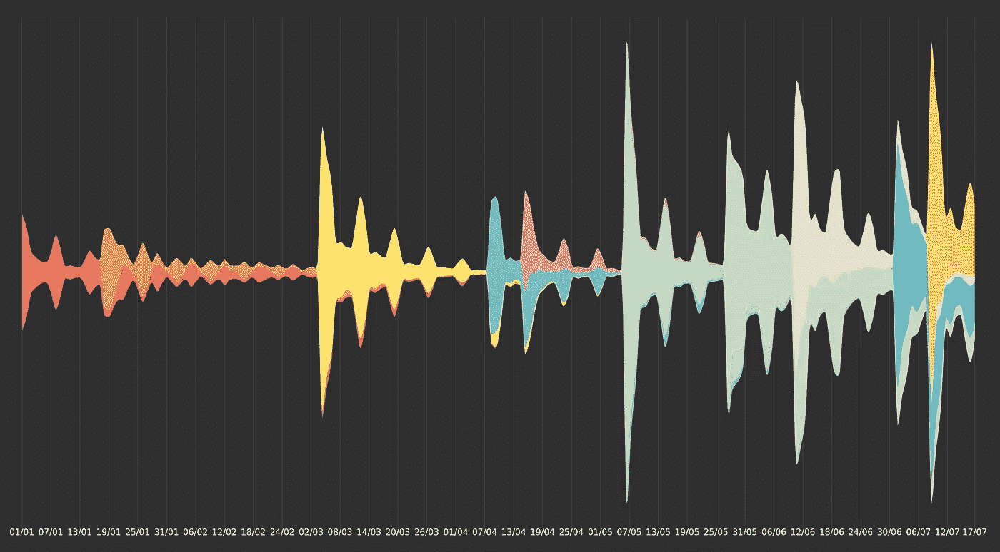
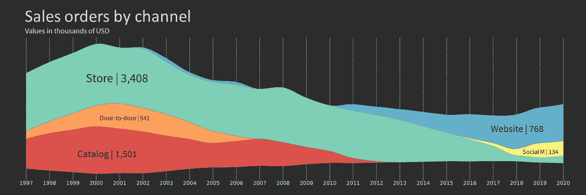
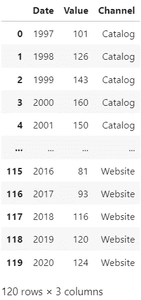
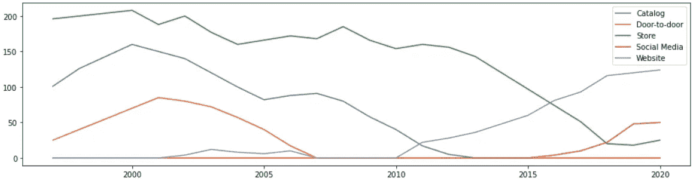
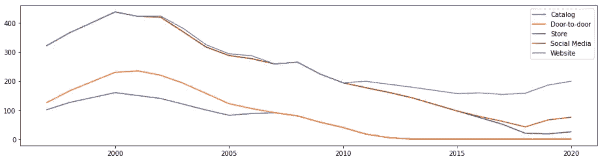
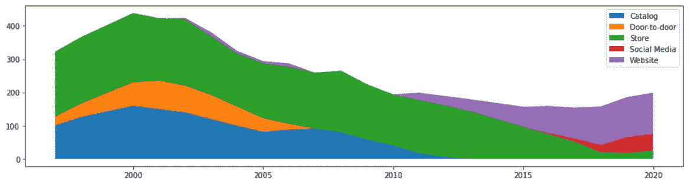
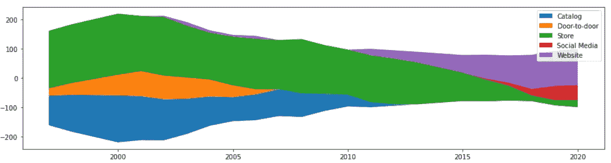

# Python Matplotlib 的流图基础

> 原文：<https://towardsdatascience.com/stream-graphs-basics-with-pythons-matplotlib-5165828359a5>

## 堆积面积图的漂亮表亲



流图—按作者分类的图像

尽管看起来有点吓人，但流图非常容易绘制。

它们几乎和堆积面积图一样，只是底部没有固定的轴。这个小小的改变可以减少陡峭的角度，让图表更加流畅，通常是以牺牲准确性为代价。



流图—按作者分类的图像

尽管如此，这种可视化效果非常好，显示了组成中的模式、趋势和变化。总的来说，流图的独特形式使它们更有吸引力，在我看来，也更具美感。

本文将介绍使用 Matplotlib 绘制流图的基础知识，从折线图和面积图到流。

## 安装

对于下面的例子，我们需要 Pandas、Matplotlib 和一个虚拟数据集。我们的数据框有一列是年份，一列是值，最后一列是类别。

```
import matplotlib.pyplot as plt
import pandas as pdurl = '[https://gist.githubusercontent.com/Thiagobc23/6cbe0f2ae9fe39032b6c3e623817a8ff/raw/4ad9f5eb8998f2d548b371b7c5e91f36098b87b0/dummy_stack.csv'](https://gist.githubusercontent.com/Thiagobc23/6cbe0f2ae9fe39032b6c3e623817a8ff/raw/4ad9f5eb8998f2d548b371b7c5e91f36098b87b0/dummy_stack.csv')
df = pd.read_csv(url)
channels = df.Channel.unique()df.groupby('Channel').describe()
```



数据框-按作者分类的图像

## 线

我们将从简单的折线图开始，遍历一个类别列表并分别绘制每条线。

```
fig, ax = plt.subplots(1, figsize=(16,4))for c in channels:
    temp = df[df['Channel'] == c]
    plt.plot(temp.Date, temp.Value)plt.legend(channels)
plt.show()
```



折线图—按作者分类的图像

折线图对于可视化这些数据来说还不错；这让我们对正在发生的事情有了一个很好的了解。但是我们不能在这里比较总值，这是折线图和堆积面积图或流图的关键区别。

## 区域

在我们转向流图之前，我们先画一个面积图。为了绘制它，我们将合计每条线的值，并将其用作下一条线的基线。

```
fig, ax = plt.subplots(1, figsize=(16,4))stack = 0
for c in channels:
    temp = df[df['Channel'] == c]
    stack = stack + temp['Value'].values
    plt.plot(temp.Date, stack)plt.legend(channels)
plt.show()
```



未填充区域图—作者提供的图像

现在我们可以用颜色填充每个类别的区域；为此，我们将使用`fill_between`函数。

该函数需要三个参数 x、y1 和 y2，其中 y1 定义区域的底部，y2 定义区域的顶部。

```
fig, ax = plt.subplots(1, figsize=(16,4))stack = 0
for c in channels:
    temp = df[df['Channel'] == c]
    stack = stack + temp['Value'].values
    plt.fill_between(temp.Date, stack - temp['Value'].values, stack)plt.legend(channels)
plt.show()
```



堆积面积图-按作者分类的图像

## 流

绘制流图有不同的方法。我们将保持简单，使我们的基线正好在中心。

为了找到中心，我们需要所有类别的总和，按天，除以 2。

```
adjust = df.groupby('Date').sum().Value.values / 2fig, ax = plt.subplots(1, figsize=(16,4))stack = 0
for c in channels:
    temp = df[df['Channel'] == c]
    stack = stack + temp['Value'].values
    plt.fill_between(temp.Date, stack - temp['Value'].values - adjust, stack-adjust)plt.legend(channels)
plt.show()
```



流图—按作者分类的图像

这就是我们的流图。

## 更进一步

尽管绘制流图非常简单，但是很难做出一个好的流图。许多因素会改变人们对数据的看法。

例如，[本文](http://www.yunhaiwang.net/infoVis2020/sinestream/index.html)探讨了定义基线和类别顺序的不同算法和方式。


资料来源:传布，张全杰，，，迈克尔·塞德梅尔，奥利弗·杜森，——**正弦:通过最小化正弦错觉效应提高流图的可读性**——**IEEE 可视化与计算机图形学汇刊(Proc。InfoVis 2020)，2021。[**http://www.yunhaiwang.net/infoVis2020/sinestream/index.html**](http://www.yunhaiwang.net/infoVis2020/sinestream/index.html)**

**以下也是最后一个示例探索了数据集的不同形状、一些插值和对基线的轻微调整。**

```
import matplotlib.pyplot as plt
import numpy as np
import pandas as pd
from scipy.interpolate import pchipurl = '[https://gist.githubusercontent.com/Thiagobc23/6cbe0f2ae9fe39032b6c3e623817a8ff/raw/4ad9f5eb8998f2d548b371b7c5e91f36098b87b0/dummy_stack.csv'](https://gist.githubusercontent.com/Thiagobc23/6cbe0f2ae9fe39032b6c3e623817a8ff/raw/4ad9f5eb8998f2d548b371b7c5e91f36098b87b0/dummy_stack.csv')
df = pd.read_csv(url)
channels = df.Channel.unique()
yrs = df.Date.unique()# reshape the df, one column for each category / "Channel"
df = pd.pivot_table(df, values='Value', index='Date',
                    columns='Channel', aggfunc=np.sum).reset_index()# create the df with the new x
df2 = pd.DataFrame(np.linspace(0, len(df)-1, num=len(df)*4))
df2.columns = ['x']# interpolate each line
for c in channels:
    x = np.arange(0,len(df))
    y = df[c]
    f2 = pchip(x, y) 

    xnew = np.linspace(0, len(df)-1, num=len(df)*4)
    df2[c] = f2(xnew)######### fig, ax = plt.subplots(1, figsize=(160,40), facecolor='#2C2C2C')
ax.set_facecolor('#2C2C2C')colors = ['#DB504A', '#FC9F5B', '#7DCFB6', '#FFF275', '#63B0CD']# get the center value for each date
adjust = df2[channels].sum(axis=1)/2
# adjust the adjust :)
adjust = adjust * 0.3stack = np.zeros(len(df2))
for i, c in enumerate(channels):
    # y1 is the bottom line of each category
    y1 = stack-adjust

    # plot
    plt.fill_between(df2.x, y1, y1+df2[c], edgecolor='w', lw=0, color=colors[i])

    # stack is the cummulative value of the bottom categories
    stack = stack + df2[c]# ticks
plt.xticks(np.arange(0, len(yrs)), yrs, color='lightgrey', fontsize=80)
plt.yticks([])# remove spines
ax.spines['right'].set_visible(False)
ax.spines['left'].set_visible(False)
ax.spines['top'].set_visible(False)
ax.spines['bottom'].set_visible(False)# grid
ax.set_axisbelow(True)
ax.xaxis.grid(color='lightgrey', linestyle='dashed', alpha=1, lw=5)#plt.legend(channels)
plt.savefig('stream.svg')
```

****

***导出图表后添加的标题和注释。**

## **结论**

**流图可以相当宽容，因为我们并不关注精确的数据表示，但这并不意味着我们应该粗心大意。**

**在设计和展示流图时，我们必须谨慎。良好的做法，如明确告知我们的观众视觉的重点和图表打算回答什么问题，可以走很长的路。**

**总的来说，我认为图表有两个决定性的优势:它足够独特，可以抓住人们的注意力；它足够准确，可以展示一个简单的模式或趋势，特别是如果我们注释了值，并且清楚地知道我们试图展示什么。**

**感谢阅读我的文章！点击查看更多我的 Python 数据可视化教程[。](https://linktr.ee/thiagobc23)**

****参考文献和更多资源** [正弦流:通过最小化正弦错觉效应来提高流图的可读性](http://www.yunhaiwang.net/infoVis2020/sinestream/index.html)；
[Matplotlib Fill _ between](https://matplotlib.org/stable/api/_as_gen/matplotlib.pyplot.fill_between.html)；
[流图—数据目录](https://datavizcatalogue.com/methods/stream_graph.html)；
[堆积图——几何与美学](https://ieeexplore.ieee.org/document/4658136)；**