# 使用 ksqlDB 进行流处理和数据分析

> 原文：<https://towardsdatascience.com/stream-processing-and-data-analysis-with-ksqldb-97f1ca4fcf6a>

## 使用流式 ETL 管道从数据中提取答案——使用真实数据集的完整教程


[T K](https://unsplash.com/@realaxer?utm_source=medium&utm_medium=referral) 在 [Unsplash](https://unsplash.com?utm_source=medium&utm_medium=referral) 上拍照

# 介绍

数据流是当今数据工程领域的热门话题。如果你正在 Medium 上阅读与数据相关的帖子，或者在 LinkedIn 上找工作，它可能已经不知何故地打动了你。它主要以工作必备的形式出现，如 Kafka、Flink、Spark 或其他面向大数据应用的复杂工具。

这些工具被大公司用来增强他们的数据处理能力。最近，我在巴西公共部门经历了 IT 的现实，所以我不仅在思考数据流如何帮助公司，还(直接)帮助社会。

一如既往，我认为没有比尝试一个真实的(或几乎真实的)项目更好的方法来学习这些工具和验证我的想法。在本帖中，我们将探索使用 ksqlDB(Kafka 相关工具)来简化道路事故的数据分析，使用来自巴西联邦高速公路警察( *Polícia Rodoviária Federal* ，直译)的真实数据。

我们将建立一个受 Medallion 架构启发的数据管道，以允许对事故数据进行增量(可能是实时)分析。

我们的目标是学习更多关于数据流、Kafka 和 ksqlDB 的知识。

我希望你喜欢它！

# 问题是

顾名思义，巴西联邦高速公路警察(简称 PRF)是我们负责保卫高速公路的警察。它每年从交通事故 (CC BY-ND 3.0 License)中收集并发布[数据，其中包含关于受害者的信息(年龄、性别、状况)、天气状况、时间和地点、原因和影响。](https://www.gov.br/prf/pt-br/acesso-a-informacao/dados-abertos/dados-abertos-acidentes)

我在本科课程中了解了这个数据集，我认为学习 ETL 真的很有用，因为它同时包含非常丰富的信息，并且在格式化方面也很有问题。它有很多缺失值、不一致的类型、不一致的列、非标准化的值、错别字等等。

现在，假设政府正试图制定更好的事故预防政策，但为此，他们需要回答以下**个问题**:

*   每个月有多少人卷入事故？
*   每月未受伤、轻伤、重伤和死亡的人数和百分比是多少？
*   每个月每个性别涉及事故的人的百分比是多少？
*   每种事故类型的死亡率

不幸的是，他们不能等到年度报告发布，所以我们需要建立一个增量报告，与他们的内部数据库通信，并在系统中添加新的事故时更新仪表板中显示的结果。

然而，系统中插入的数据不一定是完美的，可能与发布的数据集有相同的问题，因此我们还需要清理和转换记录，使它们在最终报告中有用。

这就是 ksqlDB 的用武之地。

> 声明:除了使用来自巴西政府的真实数据，所描述的情况是虚构的，用于在实践中了解 ksqlDB，并有一个冷静的目标。

# 阿帕奇卡夫卡和 ksqlDB

[“Apache Kafka 是一个开源的分布式事件流平台](https://kafka.apache.org/)”，简而言之，一个用来发送和接收消息的工具。在 Kafka 中，我们有一个主题结构，包含由生产者编写并由消费者阅读的信息(字面上只是一串字节)。

它是数据流最重要的工具之一，尤其是在大数据环境中，因为它可以轻松地以高吞吐量处理数百万条消息。它被像[优步](https://www.uber.com/en-TT/blog/presto-on-apache-kafka-at-uber-scale/)和[网飞](https://www.confluent.io/blog/how-kafka-is-used-by-netflix/)这样的公司用来提高他们的数据处理能力，例如，允许实时数据分析和机器学习。

[“ksqlDB 是一个专门为基于 Apache Kafka](https://docs.ksqldb.io/en/latest/) 的流处理应用程序而构建的数据库。是 Kafka 生态系统中的一个工具，它允许我们像处理关系数据库中的传统表一样处理 Kafka 主题，并对它们进行类似 SQL 的查询。


使用 SQL 过滤 Kafka 消息

ksqlDB 的存储基于两种主要结构——流和表。流就像普通的 Kafka 主题，不可变的仅追加集合，*即*一个不断增长的消息列表。流可以用来表示事件的历史序列，比如银行的交易。

另一方面，表是可变的集合，表示一个组的当前状态/快照。为此，他们使用了主键的概念。接收消息时，表将只存储给定键的最新值。

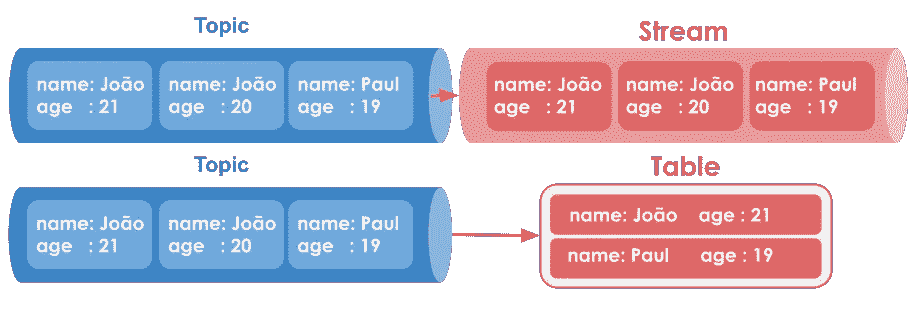

ksqlDB 中的流和表。图片作者。

除了它们的不同，《流》和《表》都是基于卡夫卡的基本主题结构。

如前所述，ksqlDB 完全基于 SQL，除非您正在做非常特殊的事情，否则不需要任何编程语言。因此，如果您已经有了使用 SQL 的经验，您可以轻松地从常见的关系环境迁移到流环境，而不会有太多的开销。

值得注意的是，类似的行为可以通过使用其他工具来实现，比如 Apache Spark，甚至是手动编码的消费者，但是我认为 ksqlDb 有一个简单的、对初学者友好的界面。

> ksqlDB 不是开源的，它属于 Confluent Inc .(了解更多关于它的许可[这里](https://docs.ksqldb.io/en/latest/faq/#is-ksqldb-owned-by-the-apache-software-foundation))，但是这个教程可以用免费的独立版本来完成。
> 
> 在撰写本文时，作者与 Confluent Inc. (ksqlDB 的所有者)没有任何隶属关系，此处表达的观点多为个人观点。

# 实施

这个项目的主要思想是使用 ksqlDB 创建一个流 ETL 管道。该管道将基于 Medallion 架构，该架构将数据分成逐渐更精细的状态，分类为青铜、白银和黄金。

简而言之，青铜层存储原始数据，白银层存储经过清理的数据，黄金层存储经过丰富和聚合的数据。我们将使用 MongoDB 进行长期存储。

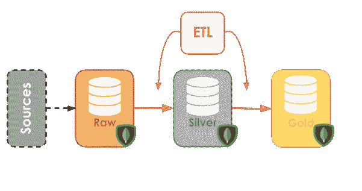

使用 ksqlDB 在层间转换数据。图片作者。

除了流和表，我们还将使用数据库连接器在层间移动数据。这些连接器负责将记录从数据库(本例中为 MongoDB)移动到 Kafka 主题(在一个称为变更数据捕获的过程中),反之亦然。

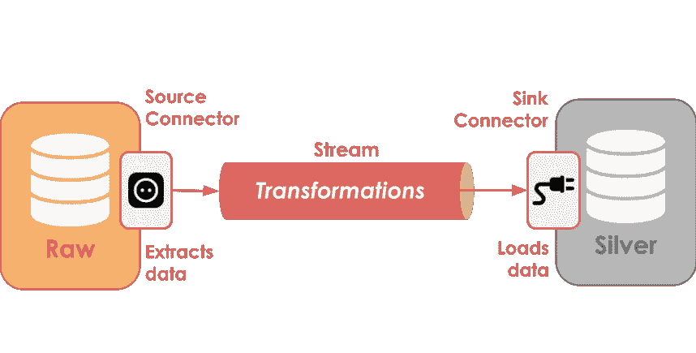

接收器和源连接器。图片作者。

本帖中使用的原始数据可以在[链接](https://www.gov.br/prf/pt-br/acesso-a-informacao/dados-abertos/dados-abertos-acidentes)中以 CSV 格式找到。事先，我已经将 2015 年至 2020 年的数据转换成了一个*拼花*文件，以减小其大小并缩短读取时间，该文件将在 GitHub 存储库中提供。

## 设置环境

这个项目环境基于 docker 文件，可以在这个[官方 ksqlDB 教程](https://docs.ksqldb.io/en/latest/tutorials/etl/#create-the-logistics-collections-in-mongodb)上找到。

您需要什么:

*   码头工人和码头工人组成
*   Kafka 的 MongoDB 接收器和源连接器— [Debezium MongoDB CDC 源连接器](https://www.confluent.io/hub/debezium/debezium-connector-mongodb)和 [MongoDB 连接器](https://www.confluent.io/hub/mongodb/kafka-connect-mongodb)(接收器)。
*   (可选)Python 3.8+和。用于在 MongoDB 中插入条目

下载的连接器必须放在文件夹/插件中，路径与 docker-compose 文件相同。

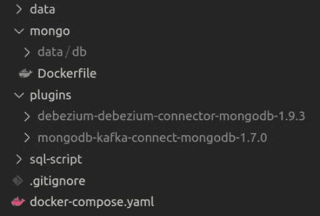

然后，集装箱可以通过 *docker-compose up 正常启动。*

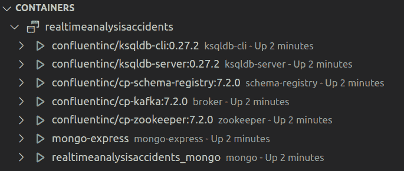

之后，在容器内用命令 *mongo -u mongo -p mongo* 连接到 MongoDB shell，用 *rs.initiate()* 启动数据库。

> 如果 MongoDB 连接器在执行过程中出现问题，可以在教程[链接](https://docs.ksqldb.io/en/latest/tutorials/etl/#create-the-logistics-collections-in-mongodb)和参考资料中找到深层定位。

## 青铜图层-提取原始数据

青铜层存储从事务环境中提取的原始数据，没有任何转换或清理，只是一个 *ctrl+c ctrl+v* 的过程。在我们的例子中，这一层应该从最初登记事故的数据库中提取信息。

为简单起见，我们将直接在青铜层上创建记录。

该层将由一个名为*事故 _ 青铜*的 MongoDB 集合表示，该集合位于*事故*数据库中

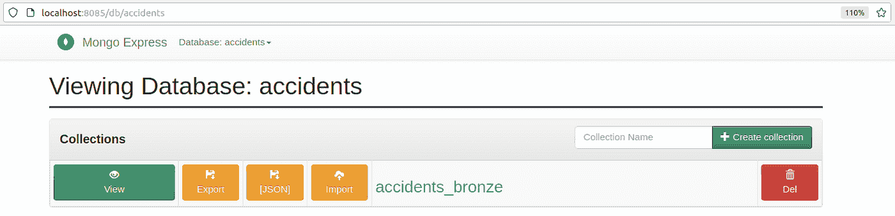

青铜层。图片作者。

为了将记录从 MongoDB 移动到 ksqlDB，我们需要配置一个**源连接器**。这个连接器负责监视集合，并将检测到的每个更改(插入、删除和更新)以结构化消息的形式(在 AVRO 或 JSON 中)传输到 Kafka 主题。

首先，使用 *docker exec* 通过 ksqlDB-client 连接到 ksqlDB 服务器实例。

```
docker exec -it ksqldb-cli ksql [http://ksqldb-server:8088](http://ksqldb-server:8088)
```

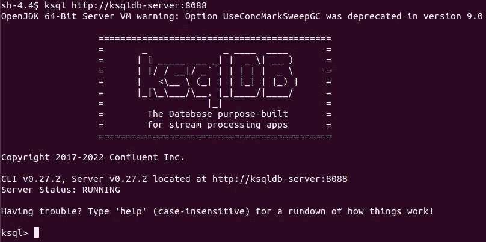

如果一切顺利，您应该会在屏幕上看到一个很大的 KSQLDB，并显示“正在运行”的消息。这是 ksqlDB 客户机接口，从这里我们与服务器交互，定义我们的流、表、连接器和查询。

在继续之前，我们需要运行以下命令

```
SET 'auto.offset.reset' = 'earliest';
```

这确保了所有已定义的查询都将从每个主题中最早的点开始。

然后，创建连接器只是描述一些配置的问题。

该命令以 CREATE SOURCE CONNECTOR 子句开始，后跟连接器名称和配置。WITH 子句指定所使用的配置。

首先，定义 *connector.class* 。这是连接器本身，实现其逻辑的 Java 类。我们将使用 Debezium MongoDB 连接器，它包含在 plugins 文件夹中。

其次，我们传递 MongoDB 地址(主机+名称)和凭证(登录名+密码)。

然后，我们定义数据库中的哪些集合将被监视。

最后， *transforms* 参数指定了 Debezium 连接器产生的消息的简化，而 *errors.tolerance* 定义了产生错误的消息的连接器行为(默认行为是暂停执行)。

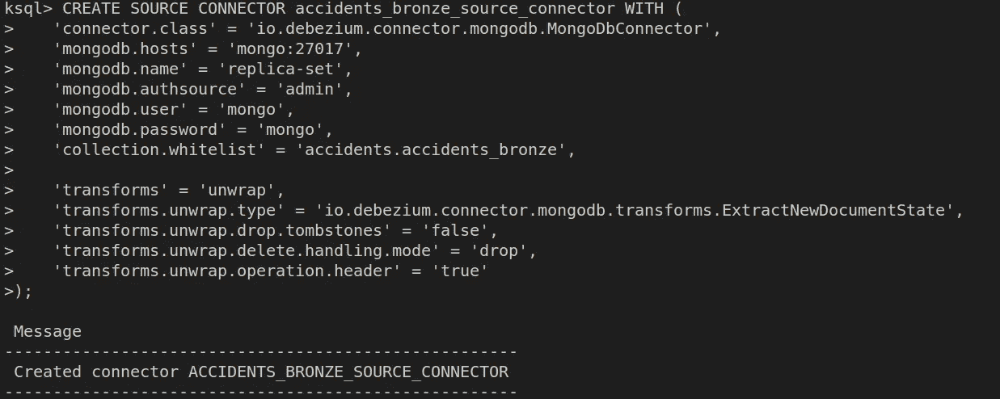

创建连接器后，让我们执行一个描述连接器查询来查看它的当前状态。执行过程中出现的任何错误都应在此处提示。

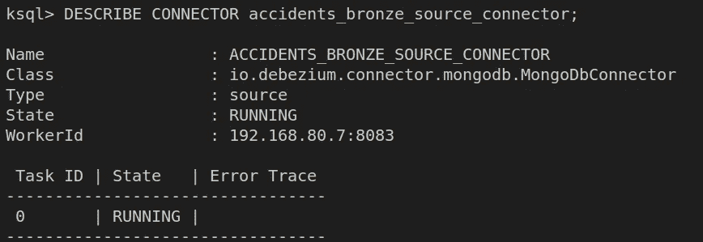

现在我们的连接器正在运行，它将开始将*事故 _ 青铜*集合中的所有更改流式传输到主题
**副本集。**

ksqlDB 不能直接处理 Kafka 主题，所以我们需要使用它定义一个流。

在 ksqlDB 中定义一个流几乎等同于在 SQL 中创建一个表。您需要在 with 子句中传递一个名称、一列及其各自的类型，以及一些配置。

在我们的例子中，我们需要配置哪个主题将提供给我们的流。因此，列的名称和类型应该与原始主题消息中的字段相匹配。

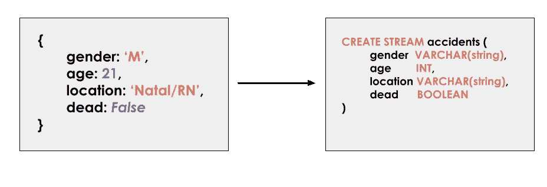

流定义必须与消息中的字段匹配。图片作者。

请参见下面的命令。

> 你不需要像我上面那样包含所有的原始字段。

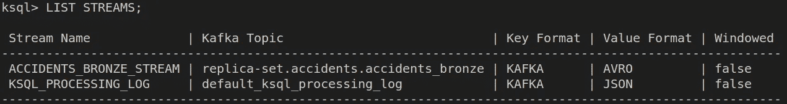

简单回顾一下我们到目前为止所做的工作。我们配置了一个 MongoDB 源连接器，以结构化消息
2 的形式传输集合 *accidents_bronze* 中的更改。使用自动创建的**副本集.事故.事故 _ 青铜**主题，我们在 ksqlDB 中定义了一个名为事故 _ 青铜 _ 流的流，以允许处理其消息

现在，设置好流之后，就可以在其上运行选择查询了，这就是真正神奇的地方。

> 我冒昧地在 mongoDB 实例中插入了一些记录，这样我们就有数据可以使用了。

例如，让我们选择每个消息的*数据*和 *id* 。

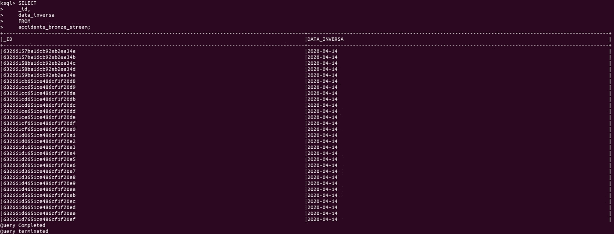

在 ksqlDB 中，这些普通的 SQL 语句被称为[拉查询](https://docs.ksqldb.io/en/latest/developer-guide/ksqldb-reference/select-pull-query/)，因为它们根据流的当前状态返回响应并结束。

通过在拉查询的末尾添加发出更改，它变成了一个[推查询](https://docs.ksqldb.io/en/latest/developer-guide/ksqldb-reference/select-push-query/)。与它的对应物不同，它永远不会结束，并且总是根据到达的消息计算新的行。让我们看看这个工作。

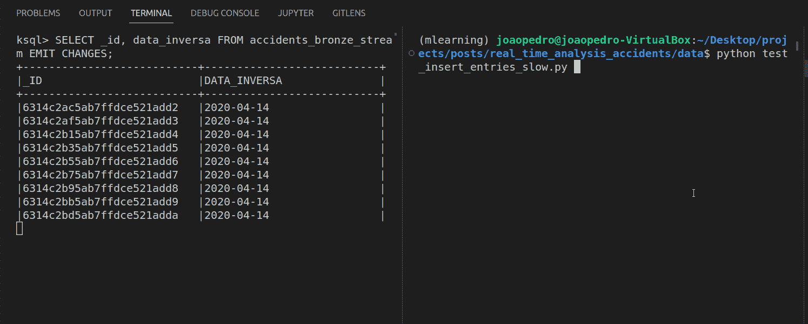

左边是推送查询，右边是在 MongoDB 中插入记录的简单 python 脚本。随着新记录的插入，它们会自动出现在查询的答案中。

Push 和 Pull 查询将是我们创建以下部分所需的所有转换的基础。

## 银层—清理数据

银层的目标是存储清理后的数据，这些数据可以很容易地被其他应用程序使用，如机器学习项目和金层。

这一层将由在*事故*数据库中名为*事故 _ 银*的 MongoDB 集合来表示。

我们主要关心的是保证数据格式正确，这样下游任务就可以专注于解决它们特定的业务规则。

为此，我们需要处理**青铜流**中到达的消息，并将它们存储在*事故 _ 白银*集合中。这个过程可以分为两个步骤:“创建一个流来清理消息”和“创建一个接收器连接器来将消息保存在 *accidents_silver* 中”

现在探索 ksqlDB 的真正威力——流处理。

可以使用对其他流的查询来定义一个流。新的流将由查询结果填充。

让我们看看这个工作。

例如，如果我们想要一个只包含不为空的 *_id* 和*日期*的新流，我们可以这样做:

使用这个功能，可以创建一个转换( *bronze_to_silver* )流，负责从 bronze 流中选择和清理消息。

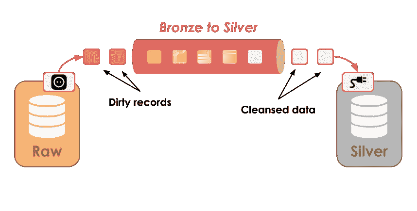

将原始记录转换成干净的数据。图片作者。

我们的例子需要清理字段: **sexo** (性别) **tipo_acidente** (事故类型) **ilesos** (未受伤) **feridos_leves** (轻伤) **feridos_graves** (重伤) **mortos** (死亡) **data_inversa** (日期)。

查看数据库后(我在屏幕外做了这个)，可能会注意到以下问题:

1.  性别列包含多个代表相同性别的值:男性可以是'*男性*或' *m* '，女性可以是'*女性*或' *f* '。
2.  事故类型还包含“同一类型”的多个值。
3.  日期可以采用以下格式之一:2019–12–20、20/12/2019 或 20/12/19
4.  缺少的值被编码为 null、字符串“NULL”或字符串“(NULL)”

*除了这些转换，我还会(试着)翻译字段和值以便于理解。*

这些问题的修复在下面定义的**事故 _ 青铜 _ 白银**流中实现:

我不会深入解释上面的 SQL 命令，重要的是用 ksqlDB 可以做什么。

我们能够在(几乎)只有 SQL 知识的情况下，在信息流上构建一个强大的转换过程！

让我们看看下面的工作。

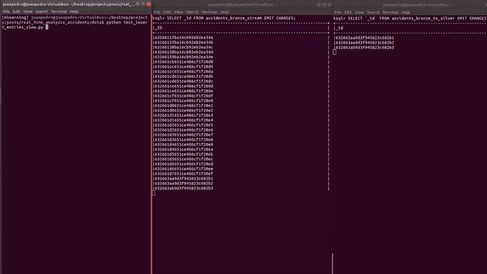

最后一步是使用**接收器连接器**将数据保存在 MongoDB 中。

对于上面的连接器，使用 Kafka MongoDB 连接器，其余的配置不言自明。

*事故 _ 白银*自动创建，结果如下图所示。

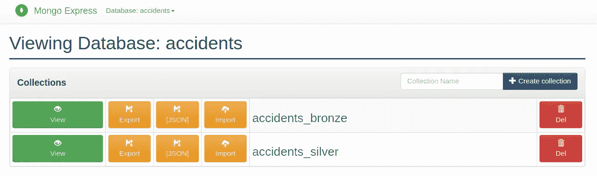

银层。图片作者。

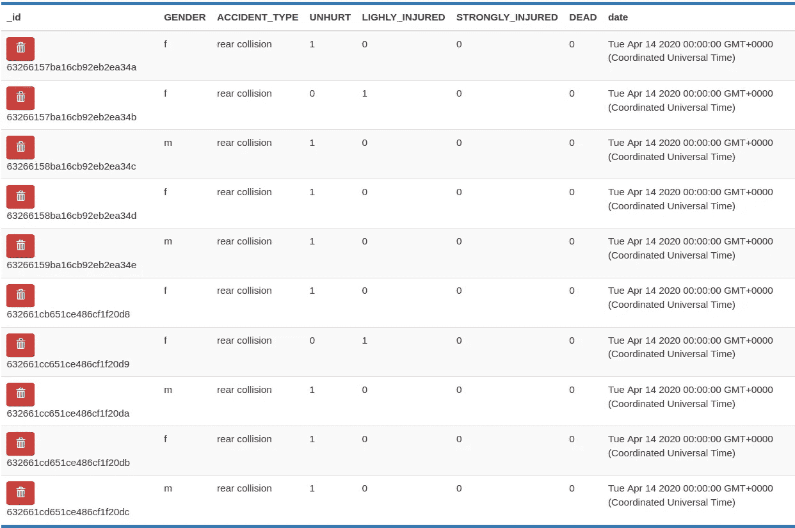

银层中的记录。图片作者。

现在我们有了干净的事故数据，是时候最终回答我们的问题了。

## **黄金层—业务规则和聚合**

黄金层包含特定于业务的规则，专注于解决特定项目的问题。

在我们的项目中，将定义两个“黄金层”，一个侧重于回答每月汇总的问题，另一个回答每次事故的死亡率，每个都存储在单独的集合中。

从架构的角度来看，这一步并没有带来什么新奇感。就像上一步一样，我们从一个流中消费数据，将其转换为我们需要的数据，并将结果保存在数据库中。

这一步的不同之处在于所需的**聚合**。

为了回答我们的问题，我们不需要存储每个事故，只需要存储每个月死亡和受伤事故的当前计数(*示例*)。因此，我们将使用表，而不是使用流。

幸运的是，在语法方面，表和流定义之间没有太大的区别。

> 如前所述，表有一个主键。对于这些示例，我们不需要显式定义键，因为 ksqlDB 会使用 GROUP BY 中使用的列自动创建它们。

在 ksqlDB 中，只能在推送查询中进行聚合，因此在查询端需要“发出更改”。

先说月度汇总表。

并查看该表的运行情况…

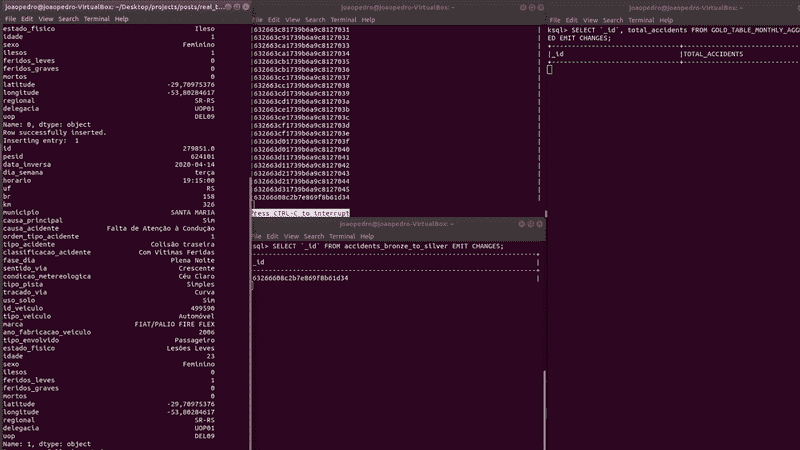

随着新记录的插入，表格(在右边)自动更新每个月的计数。让我们仔细看看结果。

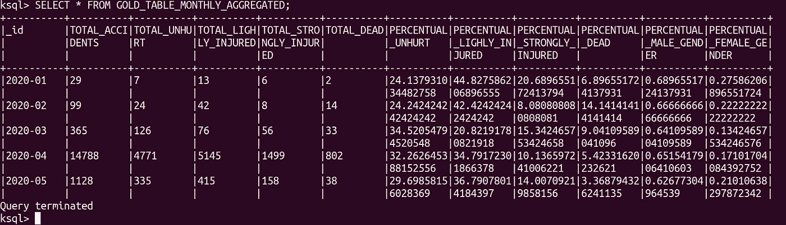

同样的逻辑也适用于死亡率表，在这里我们计算每种事故的死亡概率。

再一次，看看表格的作用…

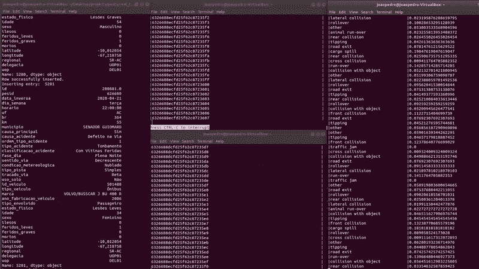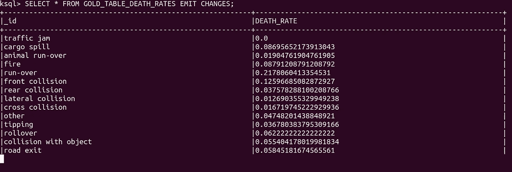

最后，剩下的就是将每个表保存在各自的 MongoDB 集合中。

这个接收器连接器有一些不同的配置(*转换*和 *document.id.strategy* )，用于在 MongoDB 中创建一个 *_id* 字段来匹配表的主键。

结果应该会在集合中显示出来。

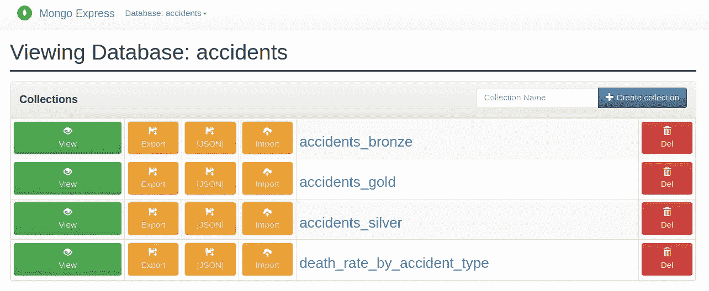

黄金收藏-意外事故 _ 黄金和死亡率 _ 意外事故 _ 类型。图片作者。

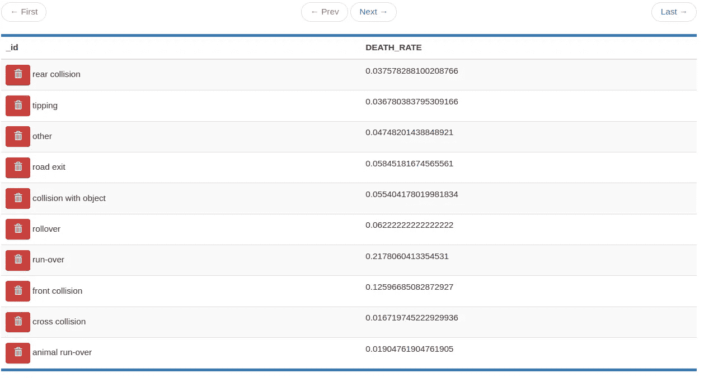

每种事故类型的死亡率。图片作者。

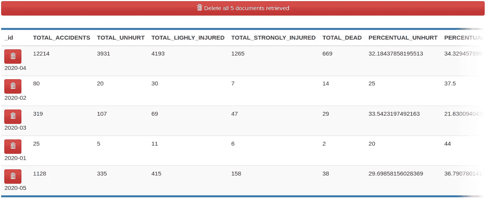

每月汇总统计数据。图片作者。

# 结论

在许多公司，尤其是大公司中，流处理已经成为现实。在所使用的技术中，Apache Kafka 是在应用程序和数据库之间传输消息的领先解决方案，它有一个庞大的辅助工具生态系统来处理密集的数据相关工作。ksqlDB 就是其中之一。

在本文中，我们通过一个使用真实数据集的动手项目了解了 ksqlDB。

在我的项目中，我总是试图将探索的工具和概念与现实中有趣的话题结合起来。正因为如此，我从巴西公开的政府数据中选择了一个真实的数据集，其中包含了道路事故的数据。

为了允许增量(可能是实时)数据分析，我提议使用 Medallion 架构将原始的无格式数据转换成问题的答案。这个架构的主要目的是允许探索 ksqlDB 的不同概念。

我们已经了解了 ksqlSB 主存储单元(流和表)、推和拉查询，最重要的是，这个工具如何帮助我们解决一个(real？)数据工程问题。

和往常一样，我不是任何讨论主题的专家，我强烈建议进一步阅读，见下面的参考资料。

感谢您的阅读；)

# 参考

> *所有的代码都在这个* [*GitHub 资源库*](https://github.com/jaumpedro214/posts/tree/main/real_time_analysis_accidents) *中。*

[1] [梅达莲建筑](https://www.databricks.com/glossary/medallion-architecture) — Databricks 词汇表
【2】[什么是梅达莲湖畔小屋建筑？](https://learn.microsoft.com/en-us/azure/databricks/lakehouse/medallion) —微软学习
【3】[流式 ETL 管道](https://docs.ksqldb.io/en/latest/tutorials/etl/) — ksqlDB 官方文档
【4】[流和表](https://developer.confluent.io/learn-kafka/ksqldb/streams-and-tables/) —合流 ksqlDB 教程
【5】[以网飞工作室和金融世界中的阿帕奇卡夫卡为特色](https://www.confluent.io/blog/how-kafka-is-used-by-netflix/) —合流博客
【6】[MongoDB Kafka Sink Connector](https://www.mongodb.com/docs/kafka-connector/current/sink-connector/)—MongoDB 官方文档
【7】[MongoDB 来源](https://www.confluent.io/hub/mongodb/kafka-connect-mongodb)

*本帖所有图片，除特别注明外，均由作者制作。*