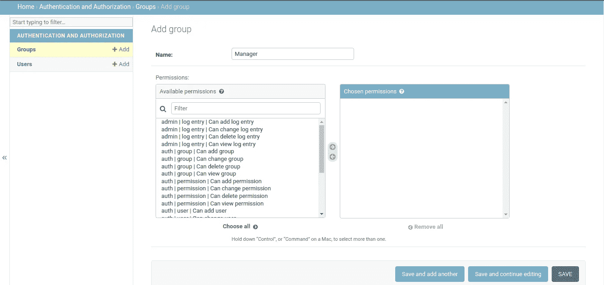
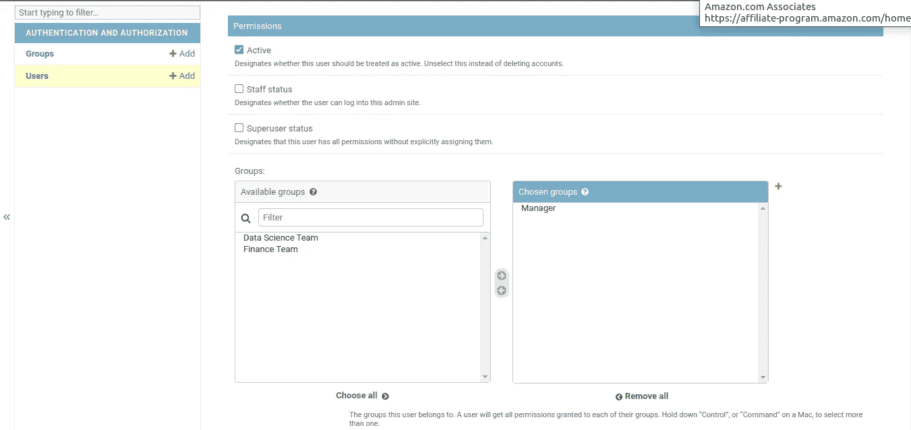
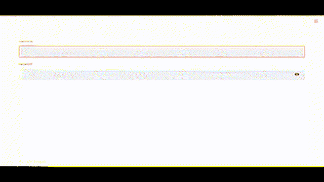

# 控制谁可以访问您的 Streamlit 仪表盘

> 原文：<https://towardsdatascience.com/streamlit-access-control-dae3ab8b7888>

## 让 Django 的许可系统负责授权控制


来自[佩克斯](https://www.pexels.com/)的蒂姆[莫斯霍尔德](https://www.pexels.com/photo/sorry-we-re-closed-but-still-awesome-tag-1101720/)的照片

身份验证可能会阻止外来者，但是我们需要一个授权流来控制谁可以看到什么。

[Steramlit](https://streamlit.io/) 简化了数据科学家最大的困难之一——构建一个与他们的机器学习模型互动的应用程序。它提供了一组创建 web 组件的声明性方法。

但当你与他人分享 Streamlit 应用时，安全性是一个问题。Streamlit 有一个内置的解决方案来限制用户的访问。但它远非完美。

在之前的帖子中，我分享了我们如何使用 [Django 的认证框架](https://docs.djangoproject.com/en/dev/topics/auth/default/)来提高 Streamlit 应用的安全性。

</secure-your-streamlit-app-with-django-bb0bee2a6519>  

这篇文章延续了上一篇文章，涵盖了针对您的 Streamlit 应用程序的更细粒度的访问控制策略。我建议你在深入研究之前先读第一本书。

[为什么我们需要授权控制？](#44c2)
[用 Django 控制仪表板权限。](#0981)
∘ [在 Django 管理控制台中创建用户组。](#3e9c)
∘ [在 Django 管理控制台中创建用户。](#8fdc)
∘ [查看细流应用](#d007)中的权限

</how-to-create-stunning-web-apps-for-your-data-science-projects-c7791102134e>  

# 为什么我们需要授权控制？

登录屏幕防止身份不明的人访问系统。我们称之为用户认证。

然而，身份验证只是其中之一，但却是安全清单上的一项重要内容。有几种方法可以改善这一点。

例如，你可以在你的防火墙上设置一个 IP 限制。但是这样做是阻止大量用户的高级规则。

如果您想要粒度控制，该怎么办？

> 假设您只需要向员工展示仪表板的特定部分。但是您可以决定提供一个团队级别的仪表板，并为团队领导提供单独的仪表板。

做到这一点的能力就是访问控制。

我们已经讨论了为什么 Stramlit 建议的用户认证流程对于生产级应用来说不够好。我们用姜戈来弥补差距。

Streamlit 也没有授权选项。让我们继续扩展 Django 认证来处理权限。

</github-automated-testing-python-fdfe5aec9446>  

# 用 Django 控制仪表板权限。

计划很简单。

将用户分配到特定的组。一个用户也可以在多个组中。我们可以在管理界面中这样做。

然后，在 Streamlit 应用程序中，我们检查登录用户的组成员资格。

如果这项检查通过，我们将呈现仪表板。否则，我们将显示一条消息，说明“您无法查看此仪表板。”

但是我们首先不需要群体吗？让我们从那里开始。

</python-project-structure-best-practices-d9d0b174ad5d>  

## 在 Django 管理控制台中创建用户组。

如果您正在阅读上一篇文章，那么您现在已经有了一个正在运行的 Django 应用程序，并且可以访问管理门户。

我们也创造了用户。同样，让我们单击“组”旁边的“添加”按钮，添加以下组。

*   经理
*   数据科学团队
*   财务团队



[作者截图。](https://thuwarakesh.medium.com)

## 在 Django 管理控制台中创建用户。

在上一篇文章中，我们已经看到了如何从管理控制台添加新用户。让我们添加一些具有以下组成员身份的用户。

*   经理
*   B —数据科学团队的成员
*   C —财务团队成员
*   d-没有团队成员。

您可以通过将组从“可用”部分移动到“已选择”部分来分配它们。只要您单击“保存”，就可以在用户创建页面上找到此部分



[作者截图。](https://thuwarakesh.medium.com)

## 检查 Streamlit 应用程序中的权限

最后，我们调整 streamlit 应用程序代码来检查组成员。

如果用户(A)是经理组的成员，他们可以访问所有仪表板。该应用程序不需要更多权限。

如果用户(B & C)只有团队成员资格，他们可以访问其团队的仪表板。但不包括其他仪表板。

最后，不属于任何组的用户(D)可以登录。然而，他们无法访问任何仪表板。

调整后的 streamlit 应用程序代码将如下所示:

在上面的代码中，最关键的是，

*   第 30 行:在会话中存储 Django 用户对象
*   第 65 行:检查经理或数据科学团队成员资格的条件
*   第 74 行:匹配经理或财务团队成员的条件

让我们运行我们的应用程序，看看权限是否正常工作。要启动服务器，让我们运行:

```
streamlit run quickstart.py
```

如果我们在浏览器上检查应用程序，这是它对我们所有四个用户的工作方式。



由[作者截屏。](https://thuwarakesh.medium.com)

# 最后的想法

我们进一步扩展了我们的 Streamlit 应用程序，以处理本帖中的权限。

通过使用 Django 内置的许可系统，我们受益于它的管理界面。我们可以使用这个界面来创建新的用户和用户组，并管理组成员。

正如我们在之前的帖子中看到的，Streamlit 仍然年轻。开发其认证和授权系统需要时间。在此之前，我们可以使用 Django 更安全地构建生产级应用。

</plotly-dashboards-in-python-28a3bb83702c>  

> 感谢阅读，朋友！在[**LinkedIn**](https://www.linkedin.com/in/thuwarakesh/)[**Twitter**](https://twitter.com/Thuwarakesh)[**Medium**](https://thuwarakesh.medium.com/)上跟我打招呼。
> 
> 还不是中等会员？请使用此链接 [**成为会员**](https://thuwarakesh.medium.com/membership) 因为，不需要你额外付费，我为你引荐赚取一小笔佣金。