# 从头开始简化:使用简化的布局和 UI 功能构建数据仪表板

> 原文：<https://towardsdatascience.com/streamlit-from-scratch-build-a-data-dashboard-with-streamlits-layout-and-ui-features-a2fc2f0a6a59>

## Streamlit 为用户交互和布局提供了简单而有效的组件，让我们能够构建有效且有吸引力的数据科学和仪表板应用程序


不，我们不会做一个这样的仪表板——照片由[克里斯·莱佩尔特](https://unsplash.com/@cleipelt?utm_source=medium&utm_medium=referral)在 [Unsplash](https://unsplash.com?utm_source=medium&utm_medium=referral) 上拍摄

我们将探索 Streamlit 的一些布局和用户界面特性，以便创建一个简单而有效的数据仪表板应用程序。

在本系列的前几篇文章中，我们已经了解了如何呈现文本、媒体和数据，现在我们将使用这些知识并添加布局和用户界面组件来创建一个完整的应用程序。

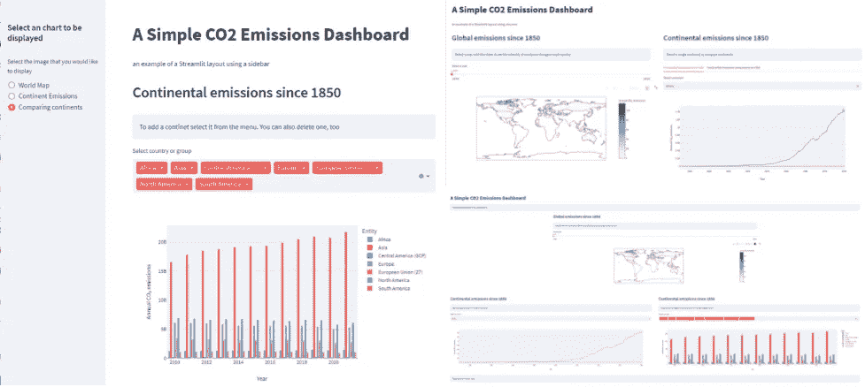

居然三个 app！—作者图片

Streamlit 使应用程序开发人员的生活变得简单，并且没有 HTML 和 Javascript UI 库等其他技术中可用的大量 UI 选项。但是使用它的布局组件，你可以很容易地设计一个有吸引力的和有能力的网页。

Streamlit 应用程序由各种容器元素和用户界面组件(如滑块和选择框)构成，我们将查看一些最有用的组件。

但是首先，我们需要一些数据。

下面的代码从我的 Github 库 [CO2](https://github.com/alanjones2/CO2) 中获取四个数据文件。它们包含了过去几百年全球二氧化碳排放量的数据。我从 Data[1]中下载了我们世界的数据，并把它分成了四个不同的子集。第一个包含世界上每个国家的数据，第二个按洲细分，第三个是全世界的数据，最后一个按收入类型表示国家组。(我们不会使用所有的代码，所以你可以忽略下面的代码，但是如果你需要的话，它就在那里。)

我还包括了我们将在本文中使用的所有库。

# 获取数据并缓存

```
import streamlit as st
import plotly.express as px
import pandas as pd
import numpy as np

@st.cache
def get_countries_data(): 
    url = "https://github.com/alanjones2/CO2/raw/master/data/countries_df.csv"
    return pd.read_csv(url)
@st.cache
def get_continent_data():
    url = 'https://github.com/alanjones2/CO2/raw/master/data/continents_df.csv'
    return pd.read_csv(url)
@st.cache
def get_world_data():
    url = 'https://github.com/alanjones2/CO2/raw/master/data/world_df.csv'
    return pd.read_csv(url)
@st.cache
def get_group_data():
    url = 'https://github.com/alanjones2/CO2/raw/master/data/income_types_df.csv'
    return pd.read_csv(url)

df_countries= get_countries_data()
df_continents= get_continent_data()
df_world = get_world_data()
df_groups = get_group_data()
```

你可能想知道为什么我编写了函数来下载并为每个文件创建一个数据帧。Python 装饰器`@st.cache`指出了这样做的原因。

每当用户与 Streamlit 应用程序交互时，例如输入值或更改设置，整个 Streamlit 应用程序都会从头开始运行。这可能看起来效率很低，但这就是 Streamlit 的工作方式，通常不会对用户体验产生太大影响。

除了有时候会这样。这种影响可能是巨大的。

如果从外部源下载大量数据，这将需要时间。虽然这在应用程序第一次启动时是可以接受的，但你真的不希望当用户试图改变某些东西时有长时间的停顿。这就是`@st.cache`装饰的全部意义。

以这种方式标记函数告诉 Streamlit 缓存任何结果数据，并停止再次调用该函数，除非传递给它的参数已经更改。相反，缓存的数据被返回给调用者。

我们的函数中没有参数，所以它们只会被调用一次。这正是我们想要的；数据不会改变，所以只会在第一次调用函数时获取。此后，将使用缓存的数据。

数据帧看起来都像这样:

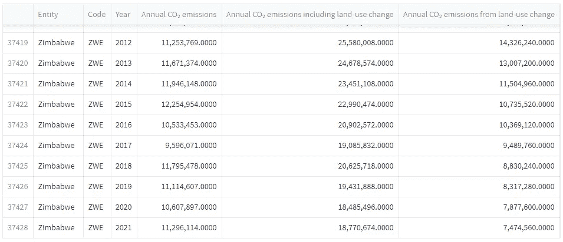

示例数据—作者提供的图片

它们包含用于的列

*   *实体*:国家、洲、收入群体或“世界”
*   *代码*:ISO 国家代码(如果是国家)
*   *年*
*   *年度二氧化碳排放量*:来自燃烧化石燃料和工业过程
*   *包括土地利用变化在内的 CO2 年排放量*:上栏和下栏之和
*   *土地利用变化的年 CO2 排放量*

我们将使用前四列来显示每种实体类型随时间推移的排放量。

我们将建立不同的应用程序，使用不同的用户界面和布局功能。我们将首先看看组件，然后看看如何构建应用程序。

# 用户界面

我们首先关注的是世界。我们将在地图上展示世界上所有国家的排放量是如何变化的。用户将选择一个年份，国家将根据其排放水平打上阴影。

这是我们遇到第一个 Streamlit UI 组件的地方。我们将使用一个滑块来允许用户选择年份。

## 滑块

滑块非常容易使用:

```
year = st.slider('Select year',1850,2020)
```

`st.slider`方法需要三个参数、一个提示字符串和两个数值限制。返回值介于两个极限之间，对应于滑块的位置。在下图中，范围介于 1850 和 2020 之间，返回值为 1978。

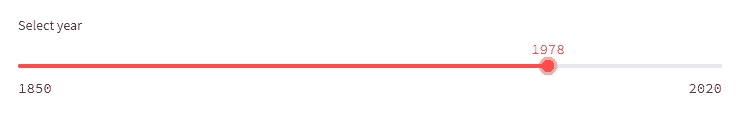

滑块—作者的图像

请记住，当一个 UI 控件发生变化时，整个应用程序将再次运行。但是只有当滑块移动时，该值才会更新。

可以给出第四个参数来设置滑块的默认值，例如

```
year = st.slider('Select year',1850,2020,1950)
```

我们将在一个 Plotly choropleth 中使用 year 值，它将给出一个如下图所示的数字。

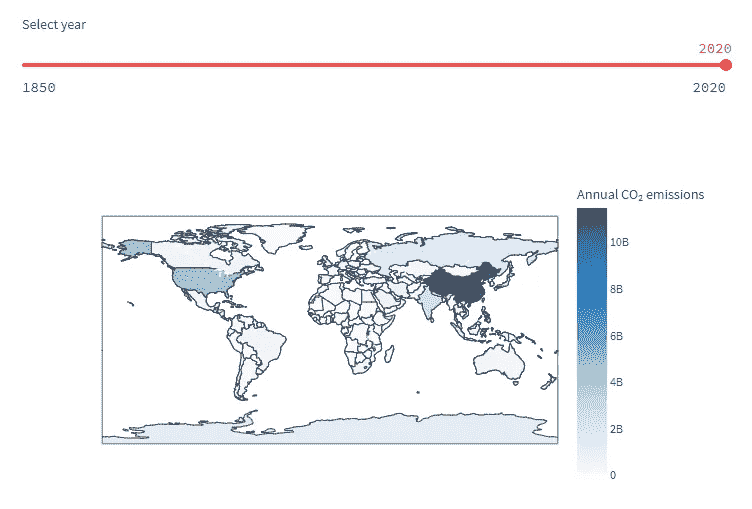

显示全球二氧化碳排放量的图表——图片由作者提供

创建 choropleth 没有什么特别困难的。Plotly 为您做了所有艰苦的工作，我们只需提供适当的价值观。这是代码。

```
max = df_countries['Annual CO₂ emissions'].max()

year = st.slider('Select year',1850,2020)
fig1 = px.choropleth(df_countries[df_countries['Year']==year], locations="Code",
                    color="Annual CO₂ emissions",
                    hover_name="Entity",
                    range_color=(0,max),
                    color_continuous_scale=px.colors.sequential.Blues)
st.plotly_chart(fig1)
```

在代码中，我们使用了`year`的值来过滤数据帧，并生成 choropleth 将使用的数据。我们还计算了表格中二氧化碳排放量的最大值，这用于设置地图上使用的颜色范围。除了数据之外，参数还包括:

*   `locations`:将用于在地图上识别区域的 ISO 代码
*   `color`:将用于设置颜色的值
*   `hover_name`:悬停在地图上时显示的字符串，即国家名称
*   `range_color`:将被映射到颜色上的数值范围
*   `color_continuous_scale`:将要使用的颜色列表(在这种情况下，Plotly Express 提供了一系列连续的蓝色)

该图的细节有点难以看清，但如果您使用扩展器控件(将图像扩展到全屏)和/或缩放工具，可以很容易地看到各个国家。

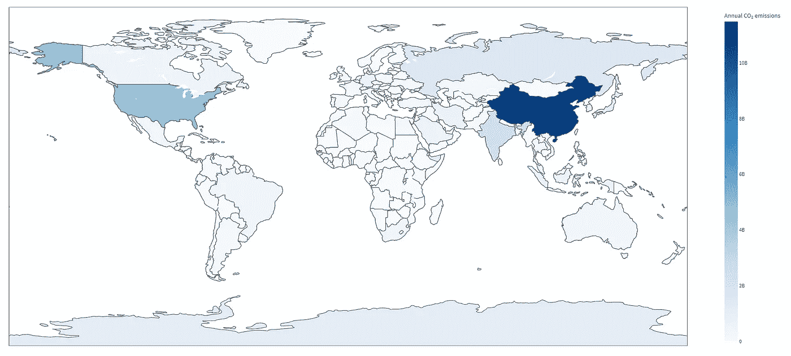

国家特写——作者图片

滑块也可以用于分类值，它们可以支持一个范围。例如:

```
start_month, end_month = st.select_slider(
    'Select a range of months',
    options=['Jan', 'Feb', 'Mar', 'Apr', 'May', 'Jun', 
             'Jul', 'Aug', 'Sep', 'Oct', 'Nov', 'Dec'],
    value=('Jan', 'Dec')
)

st.write('You selected months between', start_month, 'and', end_month)
```

这让用户可以选择月份列表的开始和结束，默认结果是“一月”和“十二月”。结果如下:

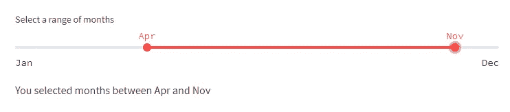

范围选择器—按作者分类的图像

## 选择框

Streamlit 提供了两个 *selectbox* 方法:一个用于选择单个项目，另一个用于选择多个项目。

下面是单个*选择框*的例子。它可以让您选择一个洲，并以线形图的形式显示该洲的二氧化碳排放量。首先，我们需要创建一个大陆列表，并将其存储在变量`continents`中，然后我们会看到*选择框*，它将让用户选择一个大陆。使用该值，我们过滤数据帧，并用 Plotly 绘制一个折线图。

```
continents = df_continents['Entity'].unique()

selected_continent = st.selectbox('Select country or group',continents)

df = df_continents[df_continents['Entity'] == selected_continent]

fig2 = px.line(df,"Year","Annual CO₂ emissions")

st.plotly_chart(fig2, use_container_width=True)
```

结果看起来是这样的。

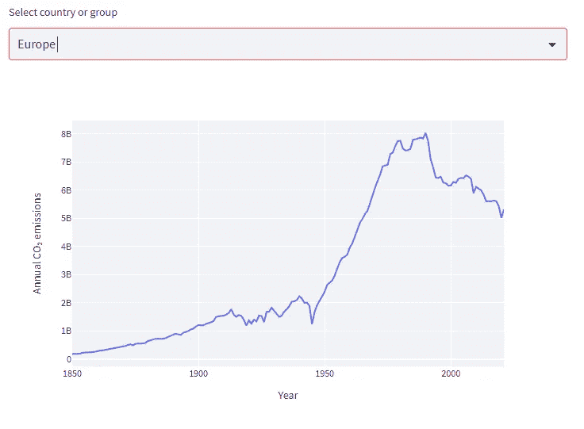

带有下拉选择器的折线图—按作者分类的图像

单击显示洲的字段将会弹出一个菜单，从中可以选择其他值。

如果我们想运行类似的东西，但我们可以比较国家，那么我们需要*多选择框*。

下面是一个使用`st.multiselect()`的类似函数。这允许用户以类似的方式从下拉菜单中选择，但是一旦选择，该值将保存在菜单上方的框中显示的列表中。要从列表中删除一个项目，单击该项目的 *x* ，该项目将从框中删除并重新出现在菜单中。

该代码与前面的函数非常相似，只是我们没有根据单个值过滤数据帧，而是使用`isin()`方法来检查洲名是否在所选列表中。我还限制了年数，这样数字更易读。

```
continents = df_continents['Entity'].unique()

selected_continents = st.multiselect('Select country or group',
                                      continents, continents)
df = df_continents[df_continents['Year'] >= 2010]
df = df[df_continents['Entity'].isin(selected_continents)]

fig = px.bar(df,"Year","Annual CO₂ emissions",color="Entity", barmode='group')
st.plotly_chart(fig, use_container_width=True)
```

以下是选择了五大洲的结果。

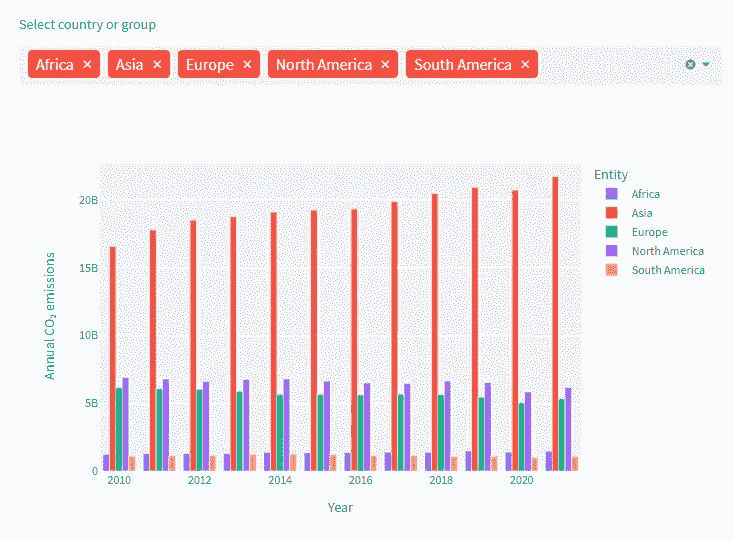

多选条形图—按作者分类的图像

## 单选按钮

我们要看的下一个 UI 组件是一个实现单选按钮的组件。

代码应该看起来很熟悉，首先是一个提示，然后是可以选择的项目列表。接下来是一组测试`chart`值的`if`语句，并显示我们之前创建的正确图表。

```
chart = st.radio(
    "Select the chart that you would like to display",
    ('World Map', 'Continent Emissions', 'Comparing continents'))

if chart == 'World Map': 
    st.plotly_chart(fig1)
if chart == 'Continent Emissions': 
    st.plotly_chart(fig2)
if chart == 'Comparing continents': 
    st.plotly_chart(fig3)
```

结果看起来是这样的。

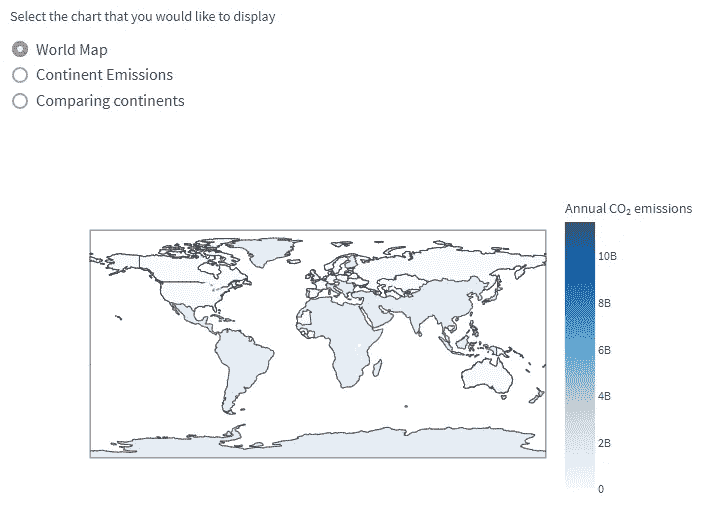

单选按钮-按作者分类的图像

# 布局

Streamlit 还提供了其他几个 UI 组件，但我们现在就不讨论了，因为为了构建一个有效的应用程序，我们需要知道如何布局我们到目前为止看到的组件。

Streamlit 提供了许多布局元素、容器、列和侧边栏。我们将使用这些特性，根据我们看到的数据构建两个版本的仪表板应用程序。

然而，在我们开始之前，让我们看看使用布局组件的两种方法——对象符号和`with`。

## 使用对象符号或'`with’`

布局组件可使用对象符号或`with`关键字进行编程。这里有一段虚构的代码显示了这种差异。

```
# Object notation
layoutcomponent1.write('This will be written inside component 1')
layoutcomponent1.write('This will also be written inside component 1')

# 'with' notation
with layoutcomponent2:
    st.write('This will be written inside component 2')
    st.write('This will also be written inside component 2')
```

这两个例子的工作方式相同，产生的结果也相同。

使用对象表示法，布局对象的名字代替了`st`，所以当你写`st.write("stuff")`来写布局组件中不包含的东西时，在这样的组件中写的时候，你用组件名代替了`st`。

当使用`with`符号时，使用`with component_name:`打开一个块。块内写入的任何内容都显示在布局组件中，并使用正常的`st`前缀。

使用`with`可以让您将布局组件上的操作组合在一起，而对象符号可以让您自由地将这些操作分散到整个代码中。使用哪一个完全取决于你，但我倾向于尽可能选择`with`选项——我认为如果可以的话，将代码放在一个块中更合理。

如果这一点还不完全清楚，那么当我们处理一些具体的例子时，它就会变得清楚了。

我们就这么做吧。

## 侧栏布局

侧边栏是 Streamlit 中最早的布局组件之一。这允许您将用户输入控件分组到屏幕一侧的区域中，并在主窗口中显示应用程序的其余部分。

这是如何使用它的一个例子。侧边栏包含三个单选按钮，允许您选择三个图表中的一个显示在主窗口中。(为了简洁起见，我将注释放在了我们已经看到的代码所在的位置。然而，可下载的代码是完整的。)

```
# Code to import libraries and get the data goes here

# The side bar that contains radio buttons for selection of charts
with st.sidebar:
    st.header('Select an chart to be displayed')
    chart = st.radio(
    "Select the image that you would like to display",
    ('World Map', 'Continent Emissions', 'Comparing continents'))

# The main window

st.title("A Simple CO2 Emissions Dashboard")
st.write("an example of a Streamlit layout using a sidebar")

with st.container():

    if chart == 'World Map': 

        # code to draw the choropleth

    if chart == 'Continent Emissions': 

        # code to draw the continent chart

    if chart == 'Comparing continents': 

        # code to draw the multiple continents chart
```

你可以看到我已经使用了`with`块来包含显示代码；一个用于侧边栏，另一个将显示在主窗口中，作为`st.container()`，它只是一个通用容器，确实可以做任何非常特殊的事情。

结果实际上是一个简单但完整的仪表板应用程序，看起来像这样。

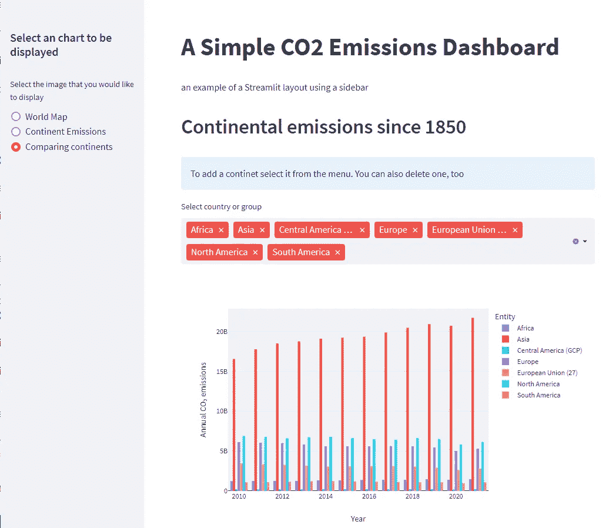

带有侧边栏的应用程序——作者图片

## 列布局

列允许您在屏幕上并排放置组件，我们将了解如何创建基于列的排放应用程序版本。创建列的最简单方法如下:

```
col1, col2 = st.column(2)
```

对`st.column()`的调用返回一个列对象列表，列对象的数量由参数值决定。它们将在主窗口或另一个布局组件中相邻显示。

您还可以使用附加参数来调整列之间的间距，例如

```
col1, col2 = st.columns(2, gap="large")
```

这里我们使用*大*间隙，但该值也可以是*小*(默认)或*中*。

默认情况下，列的宽度是相同的，但是您可以通过在 tuple 中指定它来获得不同的宽度。例如:

```
col1, col2 = st.columns((2,4))
```

元组中的值不是实际宽度，而是表示相对比例。因此，在上面的示例中，第一列的宽度是第二列的一半，使用元组(1，2)或(50，100)可以达到相同的效果。

在下面的例子中，我们有两个上下叠放的容器。每个容器被分割成列，这些列包含绘制图表的代码。

第一个容器被分成三列，中间一列是容器宽度的一半。我们将只使用这个中间的列，左右的列将作为较大的边距。地图画在这一栏里。

第二个容器有两个包含其他图表的等宽列。

```
# Set app to use a wide layout 
# - this must be executed before any code that displays anything 
st.set_page_config(layout = "wide")

# Code to import libraries and get the data goes here

# The main window
st.title("A Simple CO2 Emissions Dashboard")
st.info("An example of a Streamlit layout using columns")

# This container will be displayed below the text above
with st.container():
    col1, col2, col3 = st.columns((25,50,25))

    with col2:
        st.header("Global emissions since 1850")
        st.info("""Select a year with the slider to see the intensity
                of emissions change in each country""")

        # code to draw the choropleth

# This container will be displayed below the first one
with st.container():
    col1, col2 = st.columns(2, gap="large")
    with col1:
        st.header("Continental emissions since 1850")  
        st.info("Select a single continent or compare continents")

        # code to draw the single continent data

    with col2:
        st.header("Continental emissions since 1850")
        st.info("To add a continent select it from the menu. You can also delete one, too")

        # code to draw the compared continent data
```

有了这个，我们就有了一个完整的应用程序，看起来像这样:

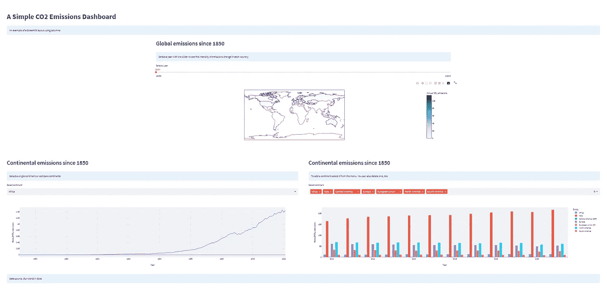

一个基于栏目的应用程序——作者图片

## 制表符

上面的应用程序非常大，你必须向下滚动才能看到所有的内容。(为了得到截图，我不得不缩小浏览器。)

如果我们想以某种方式将下面的两个图表组合起来，我们可以将它们放在第一个图表的旁边，并立即在屏幕上显示所有的数据。

我们可以通过使用标签来实现。

选项卡的构造方式与列类似，只是您传递了一个将用作选项卡标题的字符串列表。

```
tab1, tab2 = st.tabs(["Header1"],["Header2"])
```

这将创建两个选项卡，标题分别为“标题 1”和“标题 2”。它们的使用方式与列类似。

我们可以在下一个例子中看到这是如何工作的。我们只有一个容器，它被分成两个相等的列。第一个包含地图，第二个包含两个选项卡。每个选项卡都包含一个图表。

```
# Code to import libraries and get the data goes here

st.set_page_config(layout = "wide")

# The main window

st.title("A Simple CO2 Emissions Dashboard")
st.info("An example of a Streamlit layout using columns")

with st.container():
    col1, col2 = st.columns(2, gap="large")

    with col1:
        # code to draw the choropleth
    with col2:
        st.header("Continental emissions since 1850")  
        st.info("Select a single continent or compare continents")

        tab1, tab2 = st.tabs(["Continental emissions since 1850", 
                              "Continental emissions compared since 1850"])
        with tab1:
            # code to draw the single continent data
        with tab2:
            # code to draw the compared continent data
```

这产生了下面的应用程序。您可以在右栏中看到选项卡，以红色突出显示的选项卡是被选中的选项卡。如果我们单击另一个，将显示第二个图表。

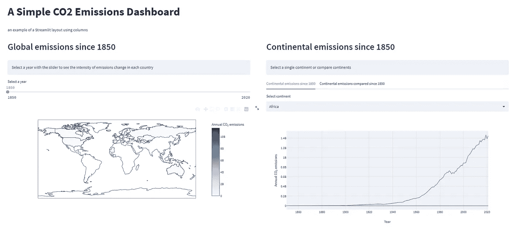

带标签的应用程序—作者图片

# 结论

因此，我们有三个应用程序基于相同的数据，但具有不同的布局和 UI 元素。我们可以涵盖更多的 Streamlit 功能，但我认为我们在这里看到的功能可以用来创建有用的数据仪表板应用程序。

这个简短系列中的文章涵盖了如何开始使用 Streamlit，如何包含图像和其他媒体，呈现数据，最后一篇文章介绍了 UI 和布局功能，并创建了三个简单的仪表板应用程序。以下是以前文章的链接:

[从头开始简化 it:入门](https://medium.com/towards-data-science/streamlit-from-scratch-getting-started-f4baa7dd6493)

[从头开始精简:嵌入图像、视频和音频](https://medium.com/towards-data-science/streamlit-from-scratch-embedding-images-video-and-audio-8b2e8b98fad4)

[从头开始精简:呈现数据](https://medium.com/towards-data-science/streamlit-from-scratch-presenting-data-d5b0c77f9622)

你可以从 [Streamlit from Scratch](https://alanjones2.github.io/streamlitfromscratch/) 网站下载所有文章的完整代码，包括这篇文章。

# 笔记

[1] [我们的数据世界](https://ourworldindata.org/)是一个信息宝库，其使命是发布*“研究和数据，以针对世界上最大的问题取得进展”*。他们所有的作品都可以在[知识共享协议下通过许可](https://creativecommons.org/licenses/by/4.0/)获得。