# 从头开始简化:呈现数据

> 原文：<https://towardsdatascience.com/streamlit-from-scratch-presenting-data-d5b0c77f9622>

## 从文本和表格到复杂的图表。从熊猫 dataframes 到 Matplotlib、Plotly、Altair 等图表。Streamlit 提供了一套全面的工具来展示您的数据


马库斯·斯皮斯克在 [Unsplash](https://unsplash.com?utm_source=medium&utm_medium=referral) 上的照片

Streamlit 是为数据科学家设计的，因此数据呈现是它的基础。

Streamlit 支持几个图表包，如 Pyplot、Plotly、Altair 和 Bokeh，以及以文本形式呈现数据的方式。我们将简要地看一下它们，以及 Streamlit 的内置图表。

在之前的文章中，我已经介绍了如何[开始使用 Streamlit](https://medium.com/towards-data-science/streamlit-from-scratch-getting-started-f4baa7dd6493) 以及如何在 Streamlit 应用程序中包含各种形式的文本、[图像、视频和音频。现在，我们开始呈现您辛苦发现、处理和分析的数据的本质。](https://medium.com/towards-data-science/streamlit-from-scratch-embedding-images-video-and-audio-8b2e8b98fad4)

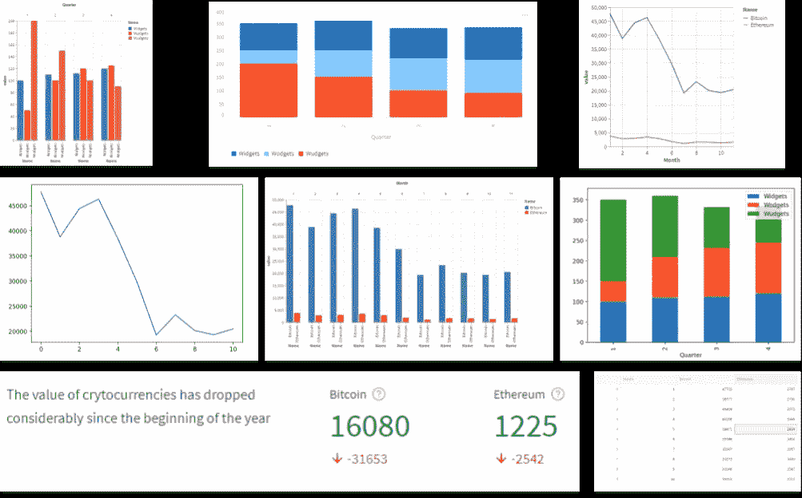

我们将创建的一些图表—按作者分类的图片

我将展示一些代码片段，你们可以复制。此外，整个代码可以从我的网站下载。我会在文章的最后放一个链接，它应该在这篇文章发表后不久就可以使用了。

如果您想按照编码进行，您需要做的第一件事就是包含 Streamlit 包。

```
import streamlit as st
```

如果你需要一本关于如何开始使用 Streamlit 以及需要哪些工具的入门书，请参见本系列的第一篇文章 [*Streamlit 从头开始:入门*](/streamlit-from-scratch-getting-started-f4baa7dd6493) 。

# 数据

我们将使用两个小型数据集。第一个是今年迄今(2022 年 11 月)的真实加密货币数据，第二个是一些虚构的销售数据。

加密数据没有正式的来源，我只是谷歌了今年每个月第一天比特币和以太坊的美元价值，到目前为止(2022 年 1 月至 11 月)，我为这篇文章虚构了销售数据。

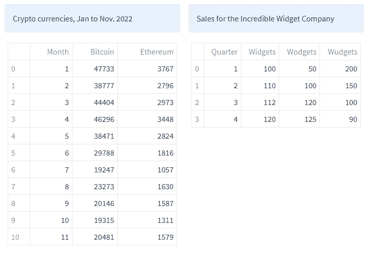

两个简单的数据集——作者图片。数据来源:谷歌

要创建这些数据，请执行以下代码。

```
# Crypto monthly data
d = {'Month':[1,2,3,4,5,6,7,8,9,10,11],
     'Bitcoin':[47733,38777,44404,46296,38471,29788,19247,23273,20146,19315,20481],
     'Ethereum':[3767,2796,2973,3448,2824,1816,1057,1630,1587,1311,1579]}

cryptodf = pd.DataFrame(data = d)

# The Incredible Widget Company
d = {'Quarter':[1,2,3,4],
     'Widgets':[100,110,112,120],
     'Wodgets':[50,100,120, 125],
     'Wudgets':[200,150,100,90]}

salesdf = pd.DataFrame(d)
```

# 文本

我们将很快简化它的图表功能，但呈现数据并不总是与图表有关。有时候，一个简单的文本演示或一个表格就足以让你的信息被理解。

Streamlit 提供了一种简洁的方式来表示值的简单变化:`st.metric()`。看起来是这样的:

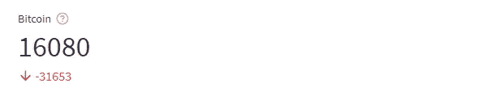

圣米制()— *图片作者*

这很容易建造。下面的代码使用`st.metric()`来显示今年以来比特币(BTC)的价值变化。我先定义 3 个变量，`btcCurrent`，写的时候 BTC 的值，`btcYrBeg`，年初的值，`btcDelta`，从那时到现在的变化。

```
btcCurrent = 16080
btcYrBeg = 47733
btcdelta = btcCurrent - btcYrBeg

st.metric("Bitcoin", btcCurrent, delta=btcdelta, delta_color="normal", 
          help="Change in Bitcoin dollar value since the year beginning")
```

有四个参数:第一个是标题；第二个是当前值，它将是显示的大数字；三是数值的变化，会以红色(数值减少)或绿色(数值增加)显示；第四个参数允许我们改变 delta 值的颜色编码，取值为“正常”(默认)、“相反”(交换红色和绿色)或“关闭”(灰色)；最后是选项工具提示。

我用以太坊(ETH)做了同样的事情，然后将两个*指标*和一些文本组合成三列，以提供一个简单但有效的演示。这里是以太坊需要的代码。

```
ethCurrent = 1225
ethYrBeg = 3767
ethdelta = ethCurrent - ethYrBeg
```

以下是以列显示数据的代码:

```
# Use columns to display them together
col1, col2, col3 = st.columns([50,25,25])
col1.write("The value of crytocurrencies has dropped considerably since the beginning of the year")
col2.metric("Bitcoin", btcCurrent, delta=btcdelta, delta_color="normal", 
            help="Change in Bitcoin dollar value since the year beginning")
col3.metric("Ethereum", ethCurrent, delta=ethdelta, delta_color="normal", 
            help="Change in Ethereum dollar value since the year beginning")
```

结果看起来像这样:

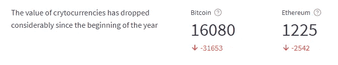

列中显示的公制()示例— *作者图片*

我们在以前的文章中简要地提到了专栏。这里我们创建三列，并根据传递给`st.columns()`方法的列表中的值对它们进行加权。因此`col2`和`col3`的宽度相同，而`col1`的宽度是另外两个的两倍。我们通过在方法调用之前加上列名而不是`st.`来写入这些列

# 表格和数据框架

在 Streamlit 中，您还可以将数据显示为*表格*或*数据框*。

表格可能看起来有点无聊，但它们很容易被读者理解，因为它们无处不在。手指沿着行向下移动，直到找到您感兴趣的那一行，然后穿过行，直到找到正确的列，这就是您正在寻找的数字！

从表面上看，这两种方法似乎没有太大的区别；他们都展示了一张桌子。然而`st.dataframe()`更加灵活。

两者都可以将 Pandas dataframe 作为数据源，但是`st.table()`没有其他选择，它只是在适合页面(或容器)的表格中显示数据。`st.dataframe()`更灵活，你可以指定高度和宽度，或者填充容器的宽度，如果数据框太大，它将是可滚动的。`st.dataframe()`也是交互式的——点击一个单元格，它就会高亮显示；单击一列，数据将按该列排序。

下表显示了 BTC 和 ETH 价格的月度视图。

```
st.table(cryptodf)
```

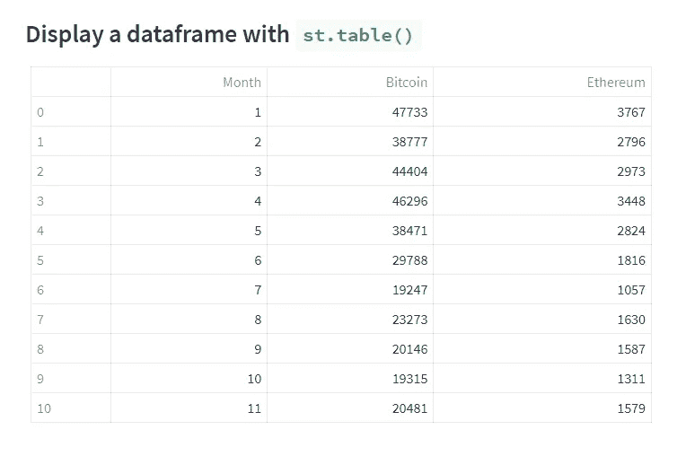

*一张 Streamlit 表——作者图片。数据来源:谷歌*

这是数据帧版本，有一个用户高亮显示的单元格。

```
st.dataframe(cryptodf, use_container_width=True)
```

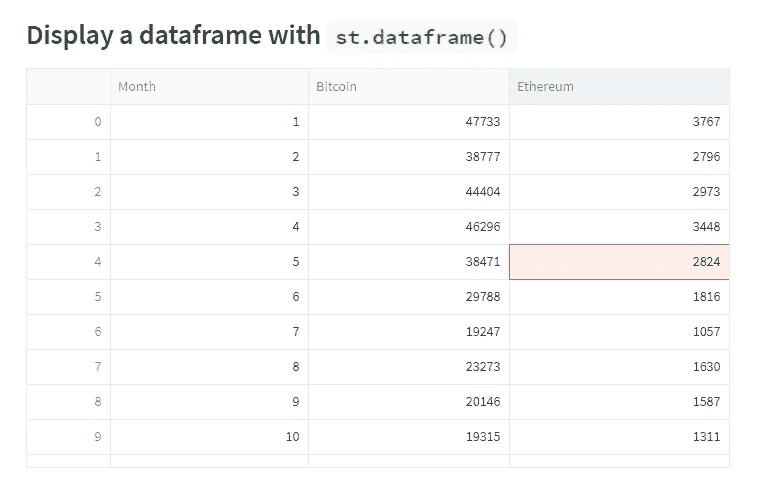

*一个精简的数据框架——作者图片。数据来源:谷歌*

我通过将`use_container_width`参数设置为`True`来保持数据帧与表格的宽度相同。

如果您知道要查找什么，表格提供了对数据的简单访问。但要发现趋势或相关性并不是特别容易。

为此你需要图表。

# 流线图

Streamlit 支持几个图表包，也有三个内置图表，本质上是它们的 *Altair* 对等物的包装器。我们将首先查看内置的包，然后探究其他受支持的包。

内置图表有`st.line_chart()`、`st.bar_chart()`和`st.area_chart()`。它们很有吸引力，也很容易使用，但是不够灵活。

这是一个折线图，显示了 2022 年大部分时间里比特币和以太坊的衰落。

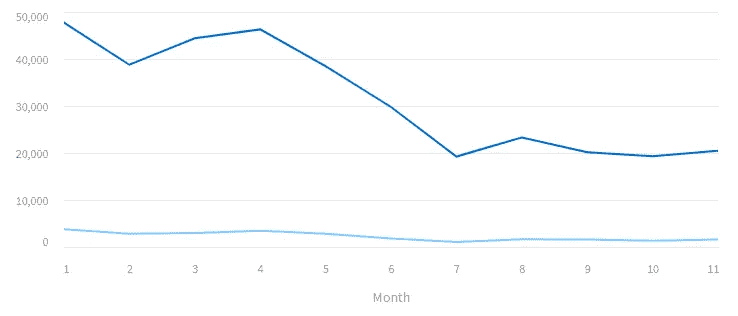

流线折线图—作者图片

这是产生它的代码。

```
st.line_chart(df, x='Month')
```

内置图表需要一个数据源`df`和一个数据列作为 x 轴。如果 y 轴未定义，则将绘制所有剩余的列。否则，y 轴应该是单个列名或列名列表。

这是比特币数据的柱状图。

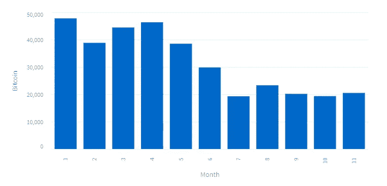

Streamlit 条形图—作者图片

```
st.bar_chart(df, y = 'Bitcoin', x='Month')
```

在这里，我只绘制了一列，因为此图表的默认行为是绘制堆叠条形图，这意味着我们要添加一组或多组值来构建条形图。

这完全适合销售图表，在销售图表中，各个项目可以累加形成一个总数。比如这个，它记录了令人难以置信的小配件公司生产的产品一年来的销售情况。他们的主打产品是 *Widget* ，但是他们还有另外两款产品，分别是 *Wodget* 和 *Wudget* ，下面我们可以看到它们的销售情况。

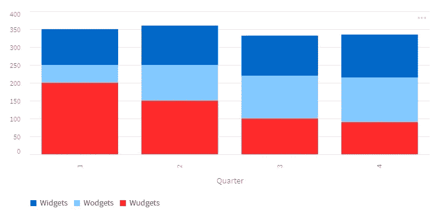

流线堆积条形图-作者图片

从这张图表中，我们可以看到，尽管 Wodgets 明显很受欢迎，但整体销售并没有改善。他们的主要产品小配件的销售保持稳定，但是小配件*销售的下降让公司很失望。*

下面是生成该图表的代码。

```
st.bar_chart(salesdf, x='Quarter')
```

请注意，y 轴没有定义，所以所有剩余的列都被绘制出来。

最后一个内置图表是面积图。这是销售数据。

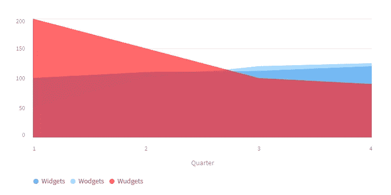

流线面积图—作者图片

```
st.area_chart(salesdf, x='Quarter')
```

在这里，您可以看到销售线的相对表现，尽管在面积图中它们不是相加的，因此我们不容易了解整体销售表现。

我不得不说，我不太喜欢这个默认的配色方案，而且似乎也没有什么明显的方法来改变它。

# Pyplot

我们要看的第一个支持的图表包是*py plot*——本质上这是对 Python Matplotlib 包的支持，但是我们也可以使用 Pandas 绘图方法，因为它们是建立在 Matplotlib 包之上的。

以下是加密数据的折线图代码。

```
fig, ax = plt.subplots()
plt.plot(df['Bitcoin'])
st.pyplot(fig)
```

代码的第一行初始化图形变量`fig`和轴变量`ax`。在这个例子中，没有使用`ax`，但是我们必须初始化`fig`，这样我们就可以将它传递给`st.plot()`。

这是生成的图表。

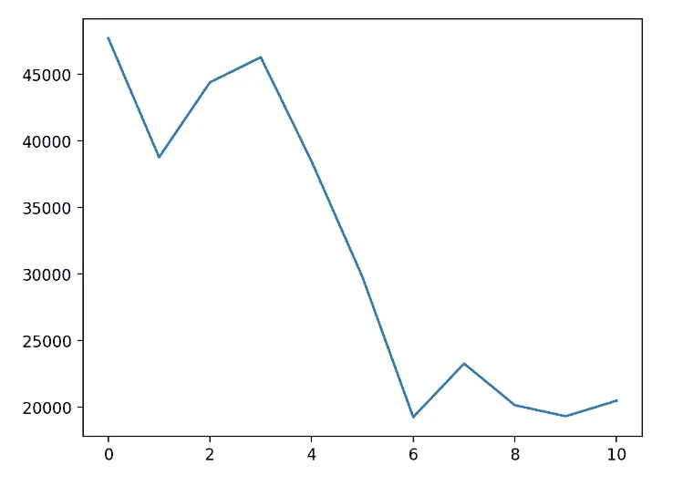

Pyplot 折线图—图片由作者提供

它非常简单，但是我们可以用一些附加的命令来定制它。在这里，我们向轴添加标签、标题，并在条形图上绘制 y 轴网格线。

```
# Pyplot charts are customizable
fig, ax = plt.subplots()
plt.bar(df.Month, df.Bitcoin)
ax.set_ylabel("Value in dollars")
ax.set_xlabel("Month 2022")
ax.set_title("Bitcoin")
plt.grid(axis='y')
st.pyplot(fig)
```

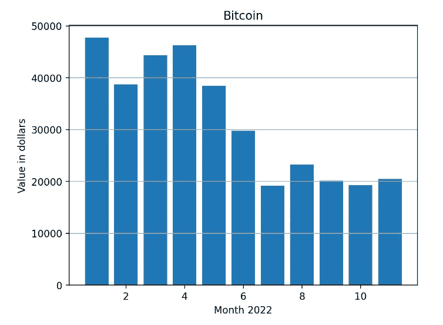

Pyplot 条形图—作者图片

这样更好。Matplotlib 图表是高度可定制的，但是要得到你想要的图表，你可能要写很多代码。

一个折衷的办法是使用 Pandas 的绘图方法，它用最少的代码提供了一个稍微复杂一点的图表。

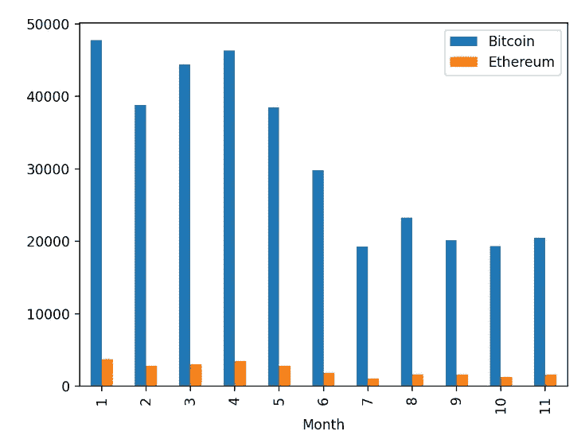

熊猫分组条形图——作者图片

```
fig, ax = plt.subplots()
df.plot.bar(x = 'Month', y=['Bitcoin','Ethereum'],ax=ax)
st.pyplot(fig)
```

请注意，在这里我们可以通过在列表中指定 BTC 和 ETH 来轻松绘制它们。同样需要注意的是，我们需要将`ax`传递给绘图函数调用——这样，新的绘图就被添加到 Matplotlib 图形中。(如果不这样做，最终会得到一个空的图表。)

# 阿尔泰尔

牛郎星图表基于 Vega-Lite 规范，因此牛郎星生成的图形将与 Vega-Lite 相同。正如我们将看到的，这是一种构造图表的声明性方法。

为了绘制 Altair 图表，我们首先需要导入库:

```
import altair as alt
```

然后我们定义一个图表，并使用`st.altair_chart(c)`，其中`c`是图表，来绘制它。

定义牛郎星图的语法与我们目前所遇到的完全不同。我们从定义一个图表对象开始。

```
c = alt.Chart(cryptodf)
```

这从数据帧`cryptodf`中创建了一个图表，但它并没有为我们做太多事情。我们现在需要声明*标记*和*编码*。

*标记*是图表的可视化方式，可以是线条、点、条等。例如

```
c = alt.Chart(cryptodf).mark_line()
```

使用`mark_line()`意味着我们要画一个折线图。还有其他几个*标记，比如*`*mark_bar()*``mark_point()`会画出不同类型的图表。

然后为了直观地理解数据，我们可以将各种*编码通道*映射到数据集中的列。

接下来，我们将使用代表点的 x 轴位置的`x`通道对数据的列`'Month'`进行编码。这给了我们一个轴。然后我们将对列`'Bitcoin'`到`y`进行编码。

```
c = alt.Chart(cryptodf).mark_line().encode(
    x='Month:O', y='Bitcoin')
```

代码中奇怪的`:O`告诉 Altair`'Month'`是一个序数值，因此它将显示为一个整数列表(否则它们将显示为实数，用数字 1.0 表示*一月*有点奇怪)。

为了绘制图表，我们称之为`st.altair_chart()`方法:

```
st.altair_chart(c)
```

这导致了过去 11 个月 BTC 值的一个简洁的折线图。

你喜欢条形图吗？简单。用`mark_bar()`代替`mark_line()`即可。

这是两张图表。

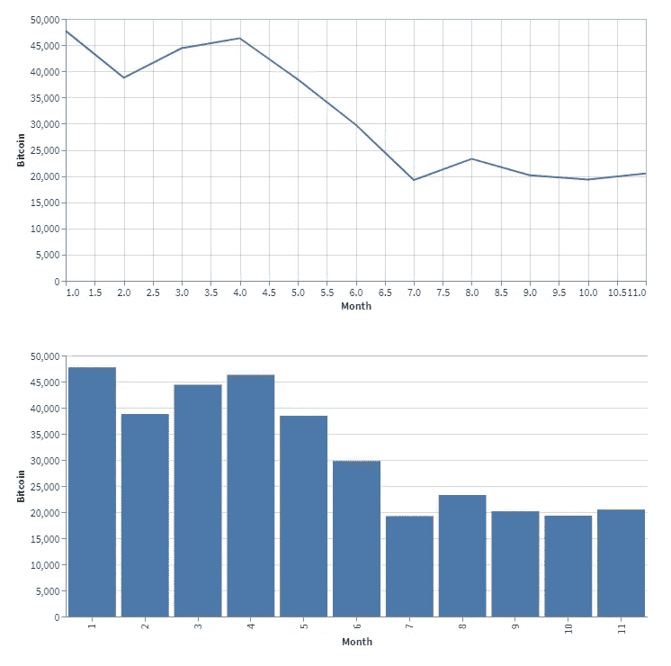

牛郎星图表-作者图片

# 重新访问数据

这对于绘制单个列很有效，但是如果我们想在同一张图上显示 BTC 和瑞士联邦理工学院，我们需要对数据进行一些处理——实际上是非常多的处理。

根据加密图表，我们需要将 BTC 和 ETH 值放在同一列中。但是由于我们需要区分它们，我们需要另一个列来标记它们是 *BTC* 还是*以太*。

同样，对于销售数据，每个值必须在同一列中，这一次我们需要一个新列，将这些值标记为 *Widget* 、 *Wodget* 或 *Wudget* 。

我们可以用 Pandas `melt()`方法转换我们当前的数据帧。代码如下:

```
cryptodf1 = pd.melt(cryptodf, 
              value_vars=['Bitcoin','Ethereum'], 
              id_vars=['Month'],
              var_name='Name'
              )
salesdf1 = pd.melt(salesdf, 
              value_vars=['Widgets','Wodgets','Wudgets'], 
              id_vars=['Quarter'],
              var_name='Name'
              )
```

解释这段代码会让我们跑题，所以如果你不熟悉`pd.melt()`你可以在这里找到它[。](https://pandas.pydata.org/docs/reference/api/pandas.melt.html)

现在我们有两个新的数据帧，如下所示:

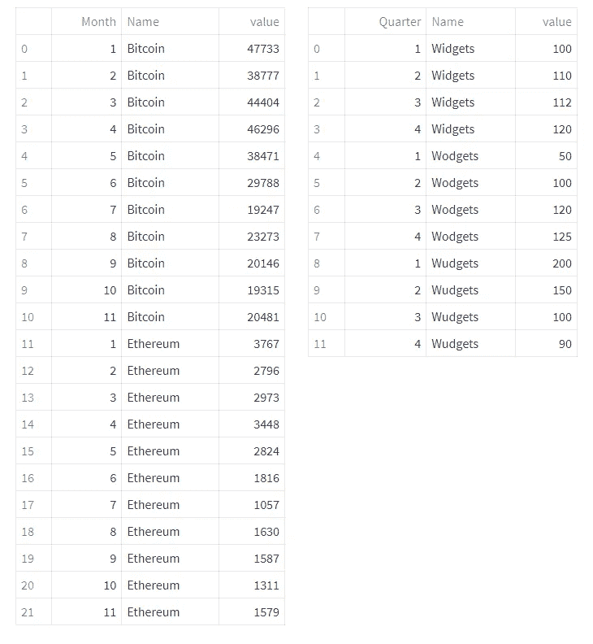

修改后的数据—作者图片

这是相同的数据，但是这种格式允许我们用接下来要看的图表包做更多的事情。

# 回到牵牛星

像这样重新调整数据意味着我们可以用 Altair 做到这一点:

```
c = alt.Chart(cryptodf1).mark_line().encode(
    x='Month', 
    y='value', 
    color = 'Name:N'
    )

st.altair_chart(c)
```

y 轴现在映射到包含 BTC 和 ETH 值的*值*列。但是现在我们有了第三个编码`color`，它被映射到*名称*列。所以我们在同一个图表上有两条不同颜色的线。

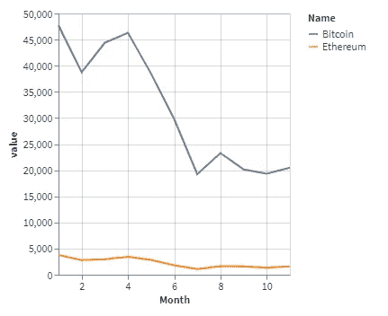

牛郎星线图——作者图片

使用这种数据格式，我们可以对条形图进行分组。在下图中，我们通过并排显示每个条形来比较这两种加密货币。

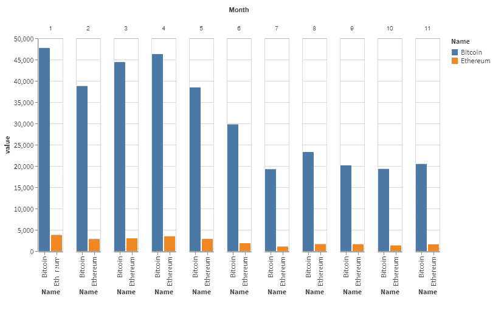

一组牛郎星条形图-作者图片

我们通过添加一个新的编码`column`来实现这一点，该编码被设置为“Month”。这会将每个月的数据排列在有序的列中，并在这些列中绘制各个条形。

```
c = alt.Chart(cryptodf1).mark_bar().encode(
  x='Name:O',
  y='value:Q',
  color = 'Name:N',
  column = 'Month:N')

st.altair_chart(c)
```

您可以看到，我在各种编码中添加了新的数据类型。它们的含义如下:

`:O`序数，一个离散的有序数量

`:Q` 定量一个连续的实数值

`:N` 名义上，一个离散无序的范畴

是时候去普洛特利了。

# Plotly

Plotly 是 Python 和 web 上最流行的绘图包之一。可以说，它比 Altair 更容易使用，比 Pyplot 更好看——尽管在 Streamlit 中使用它有一些限制。

我们将使用 Plotly 推荐的包， *Plotly Express* ，为了使用它，我们像这样导入它。

```
import plotly.express as px
```

这是我们在用 Plotly Express 绘制 ETH 和 BTC 值之前看到的简单线形图。

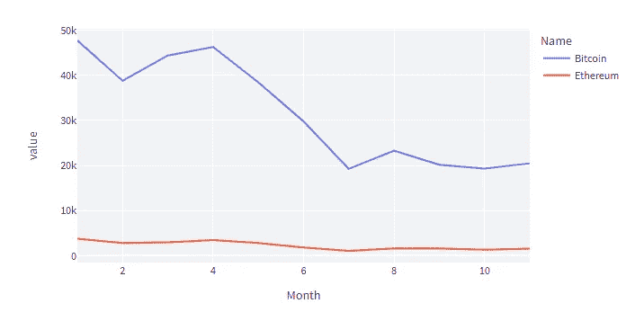

Plotly 折线图—作者提供的图片

代码非常简单。使用`px.line()`绘制一个线图，我们指定数据、x 轴和 y 轴以及一个数据列，用于给我们绘制的线着色。

```
c = px.line(cryptodf1, x="Month", y="value",
             color='Name', 
             height=400)

st.plotly_chart(c)
```

我已经额外设置了图形的高度。

条形图也一样简单。这是我们销售数据的分组柱状图。


一个精心分组的条形图——作者图片

这是代码。

```
c = px.bar(salesdf1, x="Quarter", y="value",
             color='Name', barmode='group',
             height=400)

st.plotly_chart(c)
```

我们使用`px.bar()`来绘制图表，但除此之外，它与折线图的唯一区别是可以指定`barmode`是`group`还是`stack.`

Plotly 是最简单的软件包之一，但我对默认的配色方案有一点小问题，我真的不太喜欢它——我承认这纯粹是个人抱怨。

现在，通常这不是一个问题。Plotly 提供了许多可供选择的主题供您使用。比如有*剧情 _ 黑暗*、*剧情 _ 白色*和*简单 _ 白色*主题。我通常更喜欢使用其中的一个。

问题是 Streamlit 不支持 Plotly 中的主题化。这是有意还是无意，我不知道，但 Plotly 主题在 Streamlit 中不起作用。

有一种方法可以绕过它。构建图表后，您可以用如下代码更改它的某些方面。

```
c.update_layout(paper_bgcolor="white", 
                plot_bgcolor="white", 
                yaxis_gridcolor= "black",
                yaxis_linecolor= "black",
                xaxis_linecolor= "black")
```

上面的方法应该可以让你改变整个主题，但是虽然这对 Streamlit 不起作用，你可以做一些小的改变，就像上面看到的那样:将纸张颜色和背景改为白色，将 x 轴和 y 轴以及 y 网格改为黑色。

我已经将该代码应用到一个处于*堆栈*模式的条形图中，并绘制出我们的销售数据。

这里是代码，下面是实际的图表。

```
c = px.bar(salesdf1, x="Quarter", y="value",
             color='Name', barmode='stack',
             height=400)

c.update_layout(paper_bgcolor="white", 
                plot_bgcolor="white", 
                yaxis_gridcolor= "black",
                yaxis_linecolor= "black",
                xaxis_linecolor= "black")

st.plotly_chart(c)
```

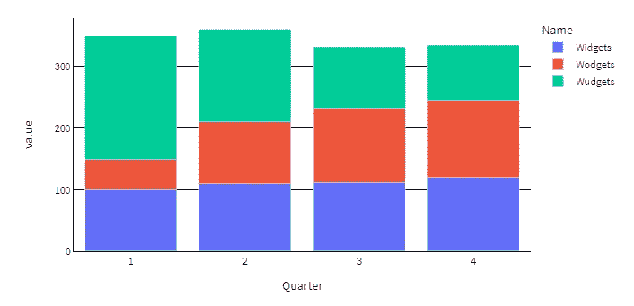

背景已更改的 Plotly 堆积条形图—图片由作者提供

你可以看到上面的图表有白色背景和黑色线条。

Plotly 图表是交互式的。将鼠标悬停在它们上面会向您显示数据点，您还可以平移和放大绘图。

# 散景

散景还可以让您创建交互式绘图，您可以平移和放大。生成类似的图需要更多的代码，但是结果非常吸引人。不过，这可能会变得相当复杂。

出于我们的目的，我们像这样导入库。

```
from bokeh.plotting import figure
```

这是我们的加密线图，同样，散景风格。


散景折线图—作者图片

您在下面看到的代码相对较长。我们首先创建一个带有标题和轴标签的散景图形对象。然后，我们向该对象添加两行，指定 x 和 y 数据的列、图例标签和颜色。我们还将线宽设置为 2。

```
# create a new plot with a title and axis labels
p = figure(title="Simple line example", 
           x_axis_label="Month", 
           y_axis_label="value")

# add a line renderer with legend and line thickness
p.line(cryptodf['Month'], 
       cryptodf['Bitcoin'], 
       legend_label="BTC", 
       color = 'blue',
       line_width=2)
p.line(cryptodf['Month'], 
       cryptodf['Ethereum'], 
       legend_label="ETH", 
       color = "green",
       line_width=2)

st.bokeh_chart(p)
```

BTC 数据的条形图如下所示。

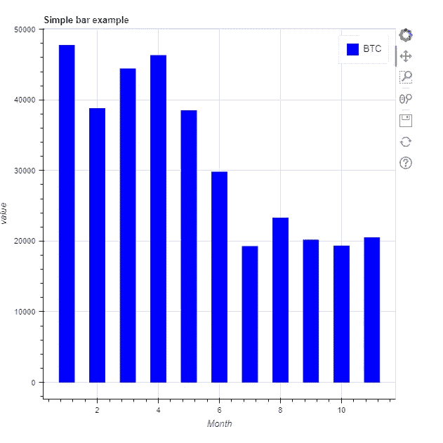

散景条形图—作者提供的图像

它是由这段代码产生的。

```
p = figure(title="Simple bar example", 
           x_axis_label="Month", 
           y_axis_label="value")

p.vbar(x=cryptodf['Month'], 
       top=cryptodf['Bitcoin'], 
       legend_label="BTC", 
       width=0.5, 
       bottom=0, 
       color="blue")
```

这与折线图非常相似，但是我们必须指定条形的顶部和底部。这里底部总是零，每个条形的顶部是“比特币”栏的值。

# Vega-lite

Vega-Lite 是一种用于交互式可视化的平台中立的图形规范语法。

Vega-Lite 图形被指定为 JSON 结构，就像 Vega-Lite 示例 web 页面中的这个。

```
{
  "$schema": "https://vega.github.io/schema/vega-lite/v5.json",
  "description": "A simple bar chart with embedded data.",
  "data": {
    "values": [
      {"a": "A", "b": 28}, {"a": "B", "b": 55}, {"a": "C", "b": 43},
      {"a": "D", "b": 91}, {"a": "E", "b": 81}, {"a": "F", "b": 53},
      {"a": "G", "b": 19}, {"a": "H", "b": 87}, {"a": "I", "b": 52}
    ]
  },
  "mark": "bar",
  "encoding": {
    "x": {"field": "a", "type": "nominal", "axis": {"labelAngle": 0}},
    "y": {"field": "b", "type": "quantitative"}
  }
}
```

[*清单由 Vega-Lite 示例网页*](https://vega.github.io/vega-lite/examples/line.html) 提供

这也是一个 Python 列表的有效声明，所以我们可以将它赋给一个变量，并像这样绘制它。

```
st.vega_lite_chart(c)
```


Vega-Lie 条形图——作者图片

在我看来，这是一种相当冗长的创建图形的方式，因为 Altair 是 Vega-Lite 在 Python 中的实现，因此对 Python 程序员来说是一个更有吸引力的提议，我们将把 Streamlit 的这一特定特性留在那里。

有关 Vega-Lite 规范的更多信息，请参考 [Vega-Lite 网站](http://vega.github.io/vega-lite/)。

# 结论

这是一个由 Streamlit 支持的图表包的快速浏览。不可能在一篇文章中对它们做出公正的评价——你可以就它们中的每一个写一本书。老实说，我已经避免在任何一个包中使用任何过于复杂的东西，但是我希望我已经给了你每一个包的味道。

为了快速和简单，我的可视化软件包要么是熊猫，要么是 Plotly。但是选择当然是你的。

在未来的文章中，我们将探讨如何使用 Streamlit 布局功能来生成一个仪表板或类似的应用程序，以一种高效和令人愉快的方式整合多个元素。

感谢您的阅读——我希望您发现它很有用。你会发现所有 Streamlit from Scratch 文章的链接，以及从[*Streamlit from Scratch*](https://alanjones2.github.io/streamlitfromscratch/)网站下载所有代码的链接，包括这段代码。

我的 [Github 页面](/alanjones2.github.io)包含其他文章和代码的链接。

[](https://alan-jones.medium.com/membership) 