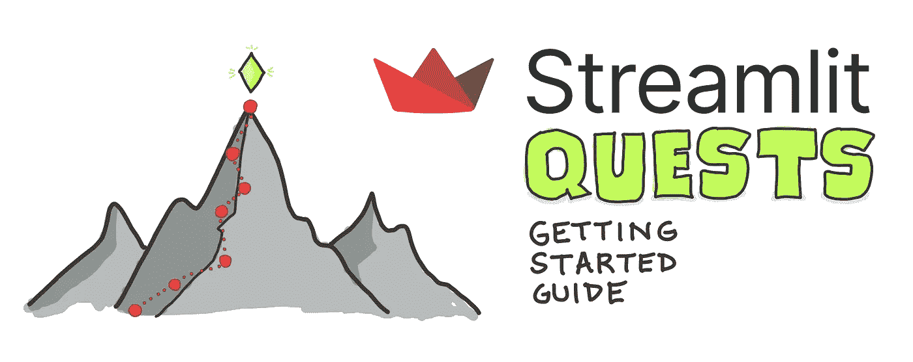
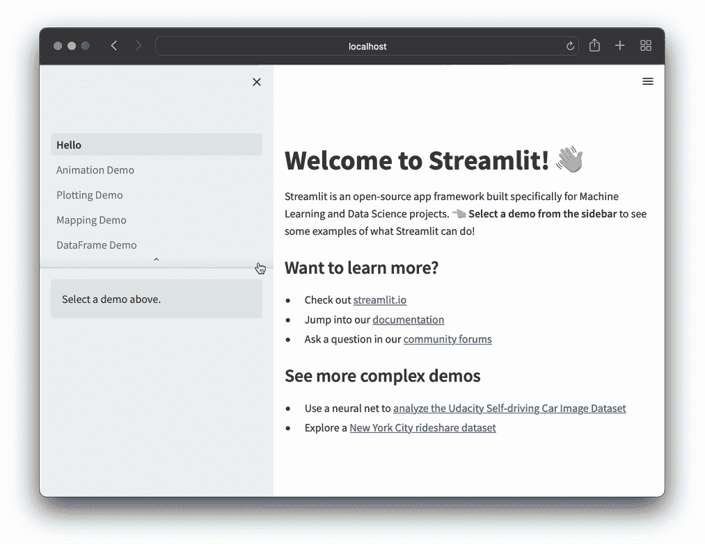

# 简化任务:简化任务入门

> 原文：<https://towardsdatascience.com/streamlit-quests-getting-started-with-streamlit-42fa6f11c2a8>


塞缪尔·费拉拉在 [Unsplash](https://unsplash.com/s/photos/mountain-climbing?utm_source=unsplash&utm_medium=referral&utm_content=creditCopyText) 上的照片

## 指导学习的路径简化了

Streamlit 是一个 Python 库，它使得用几行代码构建漂亮的交互式应用程序变得容易。但是每个新的库都有它的怪癖和惯例，这需要时间去学习。您可能想知道从哪里开始，是否有任何资源。别担心。我掩护你！

让我们通过这本名为**的指南来学习简化任务**。它的灵感来自角色扮演游戏，玩家通过完成一系列任务来浏览风景。

# 两个任务

你的学习之旅将有两个目标:

1.  **👨‍💻专家探索。**这是一条连续的赛道。学习从简单开始，逐渐变得复杂。
2.  **🎈社区探索。**这是一个非顺序轨道。您可以在旅途中的任何时候参考这些资源。



作者手绘。

下面的主题清单有双重用途:目录和待办事项清单，您可以随时参考(在学习 Streamlit 的过程中，可以将它视为您的指南针):

▢安装 Streamlit **👨‍💻**
▢通过`streamlit hello` **运行演示应用👨‍💻**
▢创建一个[单页面 app](https://docs.streamlit.io/library/get-started/create-an-app) **👨‍💻**
▢使用 [Streamlit App Starter Kit](https://blog.streamlit.io/streamlit-quests-getting-started-with-streamlit/github.com/streamlit/app-starter-kit) 快速构建单页面 app **🎈**
▢在`[https://docs.streamlit.io](https://docs.streamlit.io/)` **阅读了关于细流命令的具体信息的文档🎈**
▢在`[https://30days.streamlit.app](https://30days.streamlit.app/)`完成`#30DaysOfStreamlit`挑战(前三周是初学者友好期， 而最后一周更高级)**👨‍💻**
▢在`[https://streamlit.io/gallery](https://streamlit.io/gallery)` **通过探索画廊中的 Streamlit 应用程序获得灵感🎈**
▢使用或创建细流组件(扩展细流功能的第三方模块) 在`[https://streamlit.io/components](https://streamlit.io/components)` **👨‍💻**
▢从 [Streamlit 组件中心](https://components.streamlit.app/) **发掘数百个组件🎈**
▢创建一个[多页 app](https://docs.streamlit.io/library/get-started/multipage-apps) **👨‍💻**
▢使用 [Streamlit 多页面应用初学者工具包](https://github.com/dataprofessor/multipage-app-starter-kit)快速构建多页面应用**🎈**
▢`[https://streamlit.io/cloud](https://streamlit.io/cloud)`**在细流社区云上部署细流 app👨‍💻**
▢在 Twitter/LinkedIn 上分享你的 Streamlit 应用，并给我们加标签`@streamlit` **🎈** ▢在`[https://discuss.streamlit.io](https://discuss.streamlit.io/)` **问论坛解套🎈**
▢阅读我们的博客，了解`[https://blog.streamlit.io](https://blog.streamlit.io/)` **的最新发展和使用案例🎈**

```
👉 NOTE: Emojis at the end of each task mark tasks as part of the Expert or the Community Quest.
```

我们开始吧！

# 安装细流

安装 Streamlit 最简单的方法是使用`pip`。只需在命令行中键入以下内容:

```
pip install streamlit
```

# 运行演示应用程序

安装 Streamlit 后，通过在命令行中键入以下命令来运行演示应用程序:

```
streamlit hello
```

过一会儿，一个新的浏览器应该会启动，显示以下演示应用程序:



它展示了广泛的 Streamlit 功能，向您展示您可以构建什么。

# 创建单页应用程序

在大多数情况下，一个执行新任务的基本应用程序可以由一个[单页应用程序](https://docs.streamlit.io/library/get-started/create-an-app)来执行。从概念上讲，该应用程序在`streamlit_app.py`文件中有一个单独的页面。

在本文的[中学习如何构建一个](https://docs.streamlit.io/library/get-started/create-an-app)[单页应用](https://docs.streamlit.io/library/get-started/create-an-app)。

或者更好的是…

# 使用 Streamlit 应用入门套件

使用来自 [Streamlit App starter Kit](https://github.com/streamlit/app-starter-kit) 的 Starter 代码，在几分钟内启动并运行一个模板应用(在本文的[中了解如何操作)。](https://blog.streamlit.io/streamlit-app-starter-kit-how-to-build-apps-faster/)

# 阅读文档

在`[https://docs.streamlit.io](https://docs.streamlit.io/)`的 Streamlit 文档中提供了对每个 Streamlit 命令的深入介绍，以及代码示例。还有入门文章、备忘单、教程和知识库文章。除了涵盖 Streamlit 库，还有 Streamlit 社区云上的内容。

在构建 Streamlit 应用程序时，我会将文档放在手边，以便快速方便地参考。我总能找到合适的 Streamlit 命令或代码示例来重新调整我的应用程序的用途。

# 完成`#30DaysOfStreamlit`挑战

30 天的 Streamlit 帮助新用户了解 Streamlit 库。我们在 2022 年 4 月 1 日推出，每天发布新的挑战(有三个难度等级)。然后我们把它们都编译成一个公共应用`[https://30days.streamlitapp.com](https://30days.streamlit.app/)`。

这款应用鼓励你通过在 Twitter 或 LinkedIn 上贴标签`#30DaysOfStreamlit`或标签`@streamlit`与社区分享你的进步(这样我们就可以转发它)。它现在有葡萄牙语、法语、西班牙语和俄语版本。

想帮忙翻译成你的语言吗？去`[https://github.com/streamlit/30days](https://github.com/streamlit/30days)`开始吧。

# 探索图库中的 Streamlit 应用程序，获取灵感

Streamlit Gallery(可在`[https://streamlit.io/gallery](https://streamlit.io/gallery)`获得)是用我们的框架构建的最好的应用的集合。在这里，您可以通过浏览应用程序或通过查看代码学习如何构建特定类型的应用程序来为您的下一个应用程序寻找灵感。这些应用按主题分类:科学和技术、金融和商业、数据可视化等。

# 使用或创建 Streamlit 组件

Streamlit 组件是扩展 Streamlit 功能的第三方模块。在`[https://streamlit.io/components](https://streamlit.io/components)`有一个精选的收藏。

要使用 Streamlit 组件，如 AgGrid:

1.  通过`pip`安装如下:

```
pip install streamlit-aggrid
```

2.只需导入组件并使用其功能，即可在 Streamlit 应用中使用:

```
from st_aggrid import AgGrid

AgGrid(my_dataframe)
```

要创建自己的 Streamlit 组件，请参考以下优秀文章:

*   如何构建自己的 Streamlit 组件:学习如何从头开始构建组件！
*   [介绍 Streamlit 组件:为 Streamlit 应用添加和共享自定义功能的新方式](https://blog.streamlit.io/introducing-streamlit-components/)
*   关于[定制组件](https://docs.streamlit.io/library/components)的文档(包含关于创建和发布组件以及组件 API 的附加信息)
*   [简化组件、安全性，以及历时五个月发布一行代码的任务](https://blog.streamlit.io/streamlit-components-security-and-a-five-month-quest-to-ship-a-single-line-of-code/)

请查看这个由 2 部分组成的视频教程系列:

1.  [如何构建 Streamlit 组件—第 1 部分:设置和架构](https://youtu.be/BuD3gILJW-Q)
2.  [如何构建一个 Streamlit 组件——第 2 部分:制作一个滑动窗口部件](https://youtu.be/QjccJl_7Jco)

# 创建多页面应用程序

更复杂的应用程序可能需要几个页面。因此，你可能想要构建一个[多页面应用](https://docs.streamlit.io/library/get-started/multipage-apps)。该应用程序由两个主要组件组成:

1.  作为多页应用程序入口点的主页。
2.  当用户从左侧边栏面板中点击感兴趣的页面时，位于`pages`文件夹中的几个页面之一被调用。

在本文中学习如何构建多页面应用程序。

# 使用 Streamlit 多页应用入门套件

就像使用单页应用程序的 Streamlit App Starter Kit 一样，查看功能齐全的早期版本的 [Streamlit 多页应用程序 Starter](https://github.com/dataprofessor/multipage-app-starter-kit) (一篇关于这方面的文章即将推出)，立即制作一个多页应用程序。

# 在 Streamlit 社区云上部署 Streamlit 应用

假设您已经构建了自己的 Streamlit 应用程序，并希望与社区共享。您可以在`[https://streamlit.io/cloud](https://streamlit.io/cloud)`使用 Streamlit 社区云进行分享。

要部署到社区云:

1.  将应用程序文件上传或 Git-push 到 GitHub 存储库
2.  在 Community Cloud 中，点击“新建应用”，然后选择 repo、branch 和 app file。

就是这样！应用程序启动并运行后，与社区分享其唯一生成的 URL。

# 分享您的 Streamlit 应用程序

准备好与社区分享您创建的 Streamlit 应用程序了吗？跳上 [Twitter](https://twitter.com/streamlit) 或 [LinkedIn](https://www.linkedin.com/company/streamlit) 并标记`@streamlit`。这是一种为社区做出贡献并获得有用和建设性反馈以改进应用的好方法。

# 通过询问论坛来摆脱困境

您在创建 Streamlit 应用程序时遇到过错误吗？要摆脱困境，请尝试以下方法:

1.  当应用程序加载时，阅读命令行中显示的错误日志。这些错误会告诉你为什么应用程序的某些方面可能无法加载或显示。他们还会暗示哪些依赖库可能是问题的根源。
2.  搜索 Google、Stack Overflow 或 Streamlit 论坛(`[https://discuss.streamlit.io](https://discuss.streamlit.io/)`)，看看是否有可能已经有解决方案的相关帖子。
3.  如果你已经做到了以上几点，但仍然停滞不前，请在 Streamlit 论坛上发表你的问题。参见本文 [*如何在 Streamlit 论坛*](https://discuss.streamlit.io/t/how-to-post-a-question-in-the-streamlit-forum/30960) 发帖提问，来精心制作一个有思想又实用的问题。

# 阅读我们的博客，了解最新进展

博客文章是了解最新发展和用例的好方法，尤其是关于 Streamlit web 框架。

Streamlit 博客(可在`[https://blog.streamlit.io](https://blog.streamlit.io/)`获得)有 106 篇文章(截至本文撰写之时)，提供关于新功能、产品发布和其他新闻的及时信息，可以帮助您保持领先。它还提供了来自该领域专家的客座博文，这些客座博文通过分享他们的第一手经验，为最佳实践和实际应用提供了宝贵的见解。

# 包扎

恭喜你！您已经熟悉了构建 Streamlit 应用程序的所有基本资源。是时候利用你所学的知识创造非凡的东西了！

如果你有任何问题，请在下面的评论中留下，或者在 Twitter 上联系我，地址是 [@thedataprof](https://twitter.com/thedataprof) 或者在 [LinkedIn](https://www.linkedin.com/in/chanin-nantasenamat/) 。

# 接下来看这个…

*   [简化 YouTube 播放列表](https://www.youtube.com/watch?v=ZZ4B0QUHuNc&list=PLtqF5YXg7GLmCvTswG32NqQypOuYkPRUE)——我在我的 YouTube 频道 [*数据教授*](https://www.youtube.com/@DataProfessor) 上创建的 49 个教程视频的不断增长的集合。

*最初发表于*[*https://blog.streamlit.io/*](https://blog.streamlit.io/streamlit-quests-getting-started-with-streamlit/)T22*2022 年 11 月 18 日。*

[](https://data-professor.medium.com/membership) 