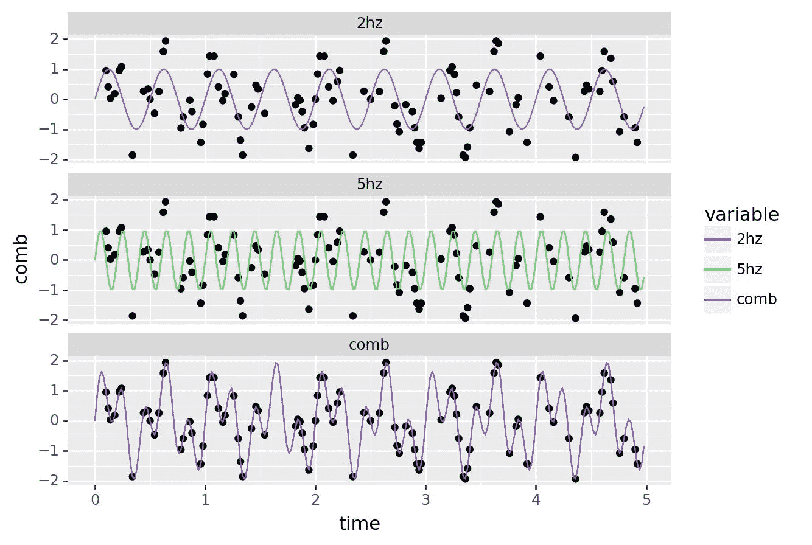

# 数字优势:为什么梯度推进机器工作得这么好？

> 原文：<https://towardsdatascience.com/strength-in-numbers-why-does-a-gradient-boosting-machine-work-so-well-8450d3b114c0>

## *我们在这里了解为什么使用简单的基函数解决复杂的问题是一个如此强大的概念*

像 [xgboost](https://github.com/dmlc/xgboost) 这样的梯度推进算法是表格数据中表现最好的模型。与随机森林等其他模型一起，梯度推进属于集合模型的范畴。这个名字来源于这个类别的一个核心特征:它们不适合一个单一的大模型，而是一个由模型组成的整体。集合模型与基函数的概念密切相关。两者都使用更简单的构建模块来解决更复杂的问题。在本文中，我将首先介绍基函数的概念，然后扩展基函数如何应用于梯度推进模型。最后，我阐述了一个关键的见解:梯度推进中的基函数需要相对简单，算法才能有效地工作。

这篇文章很大程度上受到了哈斯蒂等人的优秀的[《统计学习的要素》](https://hastie.su.domains/Papers/ESLII.pdf) (EOSL)一书的第 8 章到第 10 章的启发。因此，要进行更深入的讨论，包括所有的数学，我很乐意向读者推荐这本书。

# 从单一函数到基函数

在最基本的情况下，任何监督学习算法都试图在特征和标签之间拟合一个函数。我们可以使用许多更小的底层*基函数*来构造这个函数，而不是使用一个大函数。在下面的例子中，我想说明基函数的概念。目标是用正弦波重构一个时间序列函数。下面我们有一个潜在的“实”函数`comb`，它是一个 5 Hz 和 2 Hz 信号的组合，以及我们从中得出的观察值(黑点):

```
import numpy as np
import pandas as pd
from plotnine import *

np.random.seed(1234)

time_step = 0.02
time_vec = np.arange(0, 5, time_step)
sine_wave = np.sin(2 * np.pi * 5 * time_vec)
sine_wave2 = np.sin(2 * np.pi * 2 * time_vec)

reference_data = pd.DataFrame({'5hz': sine_wave, '2hz': sine_wave2, 'comb': sine_wave + sine_wave2, 'time': time_vec})
observations = reference_data.sample(100)
(
    ggplot(aes(x='time')) 
      + geom_point(observations, aes(y='comb')) 
      + geom_line(reference_data.melt(id_vars='time',  value_vars=['5hz', '2hz', 'comb']), aes(y='value', color='variable'))
      + facet_wrap('~variable', ncol=1)
)
```



一个组合正弦波和组成该组合波的分量波(自生成)

重构我们的基本函数`comb`的一个简单方法是使用一个正弦函数:我们可以改变正弦波的频率和振幅。但是无论我们做什么，没有一个正弦波能完全符合观测结果。这是合乎逻辑的，因为观察值是从 5 Hz 和 2 Hz 的组合线路中得出的。

为了获得良好的拟合，我们需要拟合一个结合了 2Hz 和 5Hz 函数的模型。在这种情况下，2Hz 和 5Hz 函数是*基函数*，我们从其构建整体函数。可以使用傅立叶分析来确定哪些基函数适用于该信号。在某种意义上，我们使用正弦函数的*集合*来构造一个整体上更复杂的函数。除了傅立叶变换，基函数还用于小波、神经网络、主成分分析和泰勒展开。

# 基函数需要简单

梯度推进模型中使用的基函数是小决策树。第一个基函数是最佳单节点树，即模型由单个是/否决策树组成( [EOSL，第 360 页](https://hastie.su.domains/ElemStatLearn/))。连续基函数采用大小为𝐽J 的树的形式，并且建立在先前拟合的基函数的残差上。因此，第一个子树解释了数据中的一点点差异，而每个额外的子树解释了数据中越来越多的差异。每个*单独的*子树在建模数据时并不十分有效，正如我们在 2Hz 和 5Hz 的例子中看到的，因此被认为是*弱学习器*。然而，弱学习者的集合是非常强的学习者，这是梯度推进成功所基于的核心机制。

注意，我们*故意*通过将子树的大小限制为𝐽J 大小来创建弱学习器( [EOSL，361 页，10.11 节](https://hastie.su.domains/ElemStatLearn/))。这防止了第一批树变得非常大，限制了我们在拟合后面的子树时的灵活性。我们希望我们的子树是弱的，并让 boosting 算法做许多繁重的工作，以支持使用大的单个子树。这非常符合神经网络解决问题的方式:非常简单的数学运算在一个大的集合中解决复杂的问题。复杂的解决方案来自于底层简单基函数的突发行为。

# 梯度推进中的梯度

梯度推进机器如何在每个子树之后计算残差进一步揭示了为什么弱学习器是一个特征而不是一个缺陷。我在这里的解释很大程度上受到了[这篇 SO post](https://stats.stackexchange.com/questions/338658/gradient-in-gradient-boosting) 的启发，有点数学化，所以请原谅我。假设对于给定的观测值，我们有一个真值𝑦和一个值𝑦̂，其中包含我们已经拟合的所有先前子树的总预测。接下来，我们构造一个新的子树，产生结果𝑧，以新的总预测𝑦̂ +𝑧.结束新的子树应该可以最小化𝑦̂ +𝑧和𝑦.之间的损失本质上，𝑧=𝑦−𝑦̂would 给了我们完美的答案。

如果我们使用 MSE 作为我们的损失 function((𝐿=1/2(𝑦−𝑦̂ )^2，这个损失函数相对于新预测的梯度是𝑦−𝑦̂ =−∂𝐿/∂𝑦̂。我们已经证明了𝑦−𝑦̂是最优解，所以这个梯度也提供了最优解。通过使用该梯度作为新子树应该拟合的残差，我们在𝑦̂:的预测空间中有效地执行梯度下降，其中𝑦̂的最小变化导致损失函数的最大减少。这就是梯度提升中的梯度所指的:使用一系列弱学习者，慢慢地朝着良好的整体模型构建。每个子树都提供了使我们的损失最小化的最佳步骤，即解决模型在推进过程中的那个步骤中正在努力解决的最大问题。我参考[这个链接](https://explained.ai/gradient-boosting/descent.html)来获得梯度推进这个属性的更多数学推导。

在提升期间保持我们在预测空间中的步长较小，即使用小的子树，确保我们缓慢地探测预测空间表面，并且不会陷入局部最小值。此外，使用小的子树确保我们的连续基函数可以专门解决特定的挑战性观测。使用非常大的树将促进关注整体平均性能，而不是关注较小的细节。使用小树，从而弱学习器，允许梯度提升在如何解决给定问题上非常灵活。

# 结论:弱势学习者群体

梯度提升的核心概念是通过选择下一个弱学习器来*提升*连续系列(或集合)弱学习器的有效性，该弱学习器最小化朝向真实值的*损失*。集合中的每个子树需要相对较弱，以允许*梯度*下降灵活地朝着好的解决方案工作。这使得梯度增强成为一种非常有效的方法，它通常不需要太多调整就可以开箱即用。

本文也可以在 github 上阅读[，包括全部代码。](https://github.com/PaulHiemstra/ensemble_model_article/blob/main/ensemble_model_article.ipynb)

# 承认

感谢 Rob Wanders 和 Martijn ter Schegget 为本文的早期草稿提供评论。

# 我是谁？

我叫 Paul Hiemstra，是荷兰的一名教师和数据科学家。我是科学家和软件工程师的混合体，对与数据科学相关的一切都有广泛的兴趣。你可以在 medium 上关注我，或者在 LinkedIn 上关注。

如果你喜欢这篇文章，你可能也会喜欢我的其他一些文章:

*   [掌握数据科学并不是学习一系列技巧](/mastering-data-science-is-not-learning-a-series-of-tricks-df66d8529c29)
*   [学习 AI 机器人玩井字游戏系列文章](https://towardsdatascience.com/tagged/rl-series-paul)
*   [牛郎星图解构:可视化气象数据的关联结构](/altair-plot-deconstruction-visualizing-the-correlation-structure-of-weather-data-38fb5668c5b1)
*   [面向数据科学的高级函数式编程:用函数运算符构建代码架构](/advanced-functional-programming-for-data-science-building-code-architectures-with-function-dd989cc3b0da)
*   [通过规范化扩展您的回归曲目](/expanding-your-regression-repertoire-with-regularisation-903d2c9f7b28)