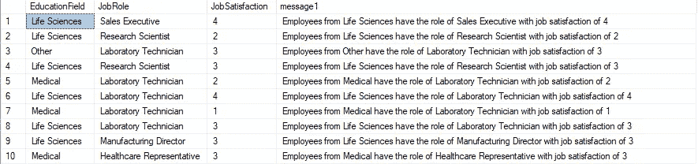
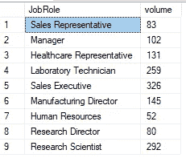
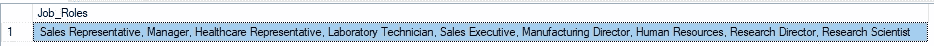
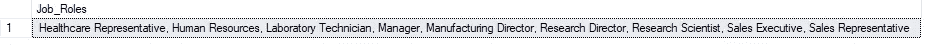
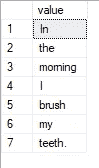

# SQL 中的字符串，第 2 部分

> 原文：<https://towardsdatascience.com/strings-in-sql-part-2-21a467374b84>

## 用 SQL 聚集和分割字符串变量

[克里斯·摩尔](https://unsplash.com/@chrismoore_?utm_source=medium&utm_medium=referral)在 [Unsplash](https://unsplash.com?utm_source=medium&utm_medium=referral) 上拍照

## 介绍

关于字符串的第一篇文章有助于为这种变量类型的数据操作提供一些初步的见解。我们能够提取字符串的元素来搜索共同的群组。通过使用索引方法，可以研究字符串中的任意数量的特征。

</strings-in-sql-part-1-122185dd0099>  

本文旨在展示如何将数据聚合整合到数据分析中。

## 输入数据和软件

对于这段分析，IBM HR 分析数据集的一个样本取自 Kaggle。在这个数据集中，有几个字符变量可用。

<https://www.kaggle.com/pavansubhasht/ibm-hr-analytics-attrition-dataset>  

本文中显示的 SQL 代码是使用 Microsoft SQL Server Management Studio 18 的一个实例创建的。

## CONCAT & CONCAT_WS

通过连接，该方法旨在将多个字符串值组合成一个完整的字符串。一个简单的例子是将第一个和第二个名字组合在一起创建一个总名。在 SQL 中，有许多方法可供使用。包含三个用户定义的 declare 语句提供了创建所需消息的灵活性。

SQL 代码 1.1 使用串联方法

在上面的 SQL 代码中，第 10 行和第 11 行显示了使用加号的第一种连接方法。用这种简单的方法，可以很容易地组合变量。需要添加空格以确保在每个单独的字符串之间添加一个空格。如果我们忘记包含这个元素，那么当一个变量结束，下一个变量开始时，所有的文本将被压缩在一起。另外，请注意，我们已经展示了如何使用 cast 方法将 JobSatisfaction 变量转换为不同的字符串数据类型。如果变量数据类型不是字符串数据类型，那么这个 cast 方法可以用来转换。

采用 concat 方法仍然需要在每个字符串变量之间包含每个空格分隔符。使用逗号分隔字符串的每个元素会使事情变得更简单。但是，仍有可能会缺少一个空格。concat_ws 方法通过声明一次分隔符简化了连接字符串的创建。在方法开始时提供此分隔符可确保所需的编码更少，并减少出错的机会。

SQL 输出 1.1 由第一个串联方法产生

SQL 输出显示串联字符串是如何生成的。每种方法都会产生相同的结果。

## 字符串 _ 聚集

当处理较大的数据集时，有时字符串方法会显示过多的信息。对于本文中显示的示例，我们使用 1，000 行表格数据的样本。当运行某些 SQL 字符串方法时，这可能会导致显示错误，因为查询已超出预定义的内存容量。但是，解决这个问题的一个方法是创建一个公共表表达式(CTE ),它提供一个临时的命名结果集。

SQL 代码 1.2 创建 CTE 参考数据集

SQL 代码将汇总查询存储在 Job_Roles 变量中。在查询中，我们按不同的工作角色总结了数据，以减少 string_agg 方法正常工作的潜在值的数量。

工作角色卷的 SQL 输出 1.2 摘要

从 CTE 查询的结果中，我们可以看到一些角色比其他角色具有更高的比例。

SQL 代码 1.3 使用作业角色的字符串聚合方法

为了生成作业角色的列表，string_agg 方法将采用字符串变量 JobRole 并创建一个连接列表。使用下面的结果，我们可以遍历列表并过滤每个群组的整体数据集。

SQL 输出 1.3 在一个字符串中显示作业角色列表

由于工作角色是按照它们第一次出现在初始数据集中的顺序显示的，所以理解任何类似的角色可能会很棘手。在下面的 SQL 代码中，我们看到了 string_agg group 如何按字母顺序排序。

SQL 代码 1.4 对工作角色列表进行排序的方法

列表的排序有助于以更有意义的方式处理数据。

SQL 输出 1.4 作业角色已按字母顺序排序

## 字符串 _ 拆分

到目前为止，我们已经使用了组合字符串值的方法。使用这种方法，我们将把字符串变量分割成其独特的部分。有时我们需要了解一个字符串中包含的单词数量，因此使用这种方法可以帮助最初的发现。

SQL 代码 1.5 使用拆分方法在声明的字符串中创建标记

通过声明一个字符串消息，我们可以试验这个方法。因为消息由空格分隔，所以这是包含在方法的第二个参数中的分隔符。

SQL output 1.5 分隔到输出数据集中每一行的标记列表

查询输出显示了由 split 方法标记的每个元素。未来的任务可能是对每个标签进行计数，以理解术语频率。

## 结论

在本文中，我们展示了字符串是如何组合和拆分的。通过理解我们想要询问数据的问题，我们可以在应用字符串方法之前首先创建概括的查询结果。使用串联方法允许用户创建可用于进一步处理数据的消息或 id。最后，我们看到分割字符串如何提供标签列表，这些标签可以在自然语言处理(NLP)数据分析中进行检查。

*非常感谢您阅读*

[1]:ka ggle dataset IBM HR analytics attraction dataset 来自[https://www . ka ggle . com/pavansubhasht/IBM-HR-analytics-attraction-dataset](https://www.kaggle.com/pavansubhasht/ibm-hr-analytics-attrition-dataset)，许可协议为【https://opendatacommons.org/licenses/dbcl/1-0/ 