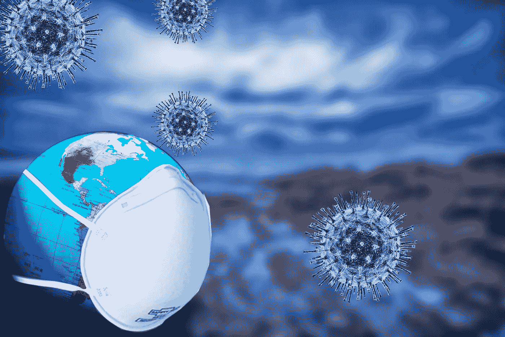

# 废水新冠肺炎信号与住院和死亡的强相关性

> 原文：<https://towardsdatascience.com/strong-correlation-of-wastewater-covid-19-signal-to-hospitalization-and-death-fc33eaf52a23>

## 美国废水的 Biobot 数据集强有力地预测了具有高相关值的新冠肺炎病结果。完整的 Python/pandas 代码。



图片由来自 [Pixabay](https://pixabay.com/?utm_source=link-attribution&utm_medium=referral&utm_campaign=image&utm_content=4985553) 的[Fernando zhimaicela](https://pixabay.com/users/fernandozhiminaicela-6246704/?utm_source=link-attribution&utm_medium=referral&utm_campaign=image&utm_content=4985553)拍摄

# 摘要

来自[生物机器人](https://biobot.io/data/)的美国废水数据集与[新冠肺炎疾病数据](https://covidactnow.org)相结合。从水样日期开始及时调整结果指标以匹配疾病进展——住院 14 天，死亡 28 天。使用标准 Spearman 等级法对水样与结果的数据对进行相关性分析。结果是废水 RNA 水平与住院人数、病床数和死亡率之间有很强的统计相关性(0.8/1.0)。这为废水监测对新冠肺炎病威胁的预测能力增加了更多的证据。

# 背景

污水中的新型冠状病毒和一周后的新冠肺炎病例之间的紧密联系现在已经众所周知。很多仪表盘，比如 [Lawrence KS](https://experience.arcgis.com/experience/4456bae8a38f4b6180e008477382fff9/page/Overview/) 和 [Louisville KY、](https://louisville.edu/envirome/thecoimmunityproject/dashboard)都让它显而易见。

但是新冠肺炎的“病例数”一直是一个可疑指标。许多人没有经过正式检查就生病了。许多患病的人进行家庭测试，但不向任何公共卫生机构报告。许多感染了新冠肺炎病毒并具有传染性的人根本不知道他们患有这种疾病。因此，在废水病毒水平和病例数之间建立统计联系是有趣的，当然也是真实的，但这不是真正重要的。衡量废水是否预示疾病的更可靠的方法是观察与住院和死亡率的相关性。

我的[上一篇文章](/covid-19-outcome-predictions-from-wastewater-fcc19400e144)使用了来自[美国疾病控制中心 NWSS](https://covid.cdc.gov/covid-data-tracker/#wastewater-surveillance) 的详细废水数据集。该数据集在一天中的一个污水处理厂的每个水测试中都有一行。我将这些数据与该县的新冠肺炎疾病结果相结合，大约与水处理区域重叠。我发现了大约 0.3 到 0.5 的持续正的斯皮尔曼相关。这一结果表明，从单个水试验的废水新型冠状病毒水平是新冠肺炎住院和死亡的预测，但没有特别强的相关性。

我假设结果比真正的相关性弱，因为有太多的数据点之间存在微小差异和随机变化，本质上在数据中引入了噪声。为了检验这个假设，我检查了更大范围(整个美国)和更长时间(每周)的废水数据和新冠肺炎病。

# 生物机器人数据集

Biobot.io 提供了各种[数据](https://biobot.io/data/)，汇总了他们的美国废水测试。在这次分析中，我选择了他们的“[区域](https://github.com/biobotanalytics/covid19-wastewater-data)”数据，这些数据将单个废水处理点汇总成美国的四个地区，并将这四个地区汇总成一个全国的总量。

以下是他们对这一过程的解释:

> ……我们每周对该国的所有样本取平均值，并根据废水样本中代表的人口对这些平均值进行加权。然后，我们取一个居中的 3 样本中心滚动平均值，该平均值对本周的测量值给予更高的权重，从而产生可视化中显示的每周值。我们使用这些数据对我们所有的采样点进行进一步平均，以获得全国范围的平均值...

在我的分析中，所有的废水值都使用了这个数据——一个为测试地点附近的人口加权的滚动平均值。

# 结果数据

CovidActNow.org[的新冠肺炎病结果取自](https://covidactnow.org)。我对这些数字进行了平滑处理，得出了入院人数、使用中的医院床位和使用中的 ICU 床位的 10 天滚动平均值。10 天的窗口是必要的，因为医院的数据只是每周报告一次。我消除了五天内每天的死亡人数，因为统计数据中有很多随机变化。

这个 pandas 代码片段展示了如何操作，CovidDF 是来自 CovidActNow 的原始数据帧。(完整的 Python/pandas 源代码在我的 GitHub 上。)

```
CovidDF["admits_rolling10"] = (CovidDF["actuals.hospitalBeds.weeklyCovidAdmissions"].rolling(10, min_periods=1, center=True, closed='both').mean() )CovidDF["deaths_rolling5"] = CovidDF["actuals.newDeaths"].rolling(5, min_periods=1, center=True, closed='both').mean()
```

该分析中所有的住院和死亡率数据都使用了这些平滑值。

# 对结果的前瞻

这种分析的数据工程的一个关键部分是将水试验结果(新型冠状病毒 RNA 的副本)与随后发生在*的*新冠肺炎结果(住院和死亡)联系起来。废水中的高病毒含量可能并不能预测当天的入院情况，但 10 天后可能会。我们希望在未来探索废水测试和新冠肺炎结果之间的相关性。

我试验了各种前瞻性补偿，发现住院两周和死亡四周与废水病毒水平的相关性最强。下面的代码片段展示了如何做到这一点。重要的数据框架有:

*   UsaDF 最初只包含整个美国的 Biobot 废水测试结果，每周一行。UsaDF 成为保存总体分析结果的主数据框架。
*   HospDF 包含每周应付给美国新冠肺炎的住院费用。
*   DeathsDF 包含美国每周因新冠肺炎导致的死亡率。

```
# Number of days to look ahead for COVID-19 outcomesHOSP_AHEAD = 14    
DEATHS_AHEAD = 28 # Create date columns in master DF with future datesUsaDF["hosp_date"] = UsaDF["week"] + pd.offsets.Day(HOSP_AHEAD)
UsaDF["deaths_date"] = UsaDF["week"] + pd.offsets.Day(DEATHS_AHEAD)# Join wastewater data with hospitalization in the futureUsaDF = UsaDF.merge(HospDF, how='inner', left_on="hosp_date", right_on="covid_facts_date")# Join wastewater data with deaths in the futureUsaDF = UsaDF.merge(DeathsDF, how='inner', left_on="deaths_date", right_on="covid_facts_date")
```

使用内部连接将水测试与疾病结果合并。原因是最近的水测试(如昨天)还没有任何已知的结果。我们不能将最近的水事实与尚未发生的结果关联起来，因此 inner join 会从整个结果集中删除最近的水测试。

# 可视化数据

我们对结果数据集中的关键项目感兴趣的是以下项目的每周数据:

*   废水中的病毒 RNA 水平，每毫升拷贝数
*   新冠肺炎后来入院治疗
*   医院和重症监护室床位晚些时候给新冠肺炎病人
*   后来的死亡主要是由于新冠肺炎

在一个图表上显示这些数据的一个问题是各种测量的数字范围很大。病毒拷贝数往往在 200 左右，而死亡数可达 3000，医院床位占用超过 10 万。对数 y 轴解决了这个问题，它允许在一个图表上显示所有五个度量值，如下所示。

图片由作者提供，使用 Flourish.studio。

由于疾病结果的日期调整，住院和死亡的峰值与废水病毒水平的峰值一致，即使疾病结果发生在数周之后。

# 相互关系

新型冠状病毒废水水平和新冠肺炎病结果之间的 Spearman 等级相关性很强。从 2020 年 4 月到 2022 年 5 月，相关性为:

*   医院接收的废水= 0.801
*   使用中的常规病床废水= 0.8
*   使用中的 ICU 病床废水= 0.745
*   废水与死亡= 0.79

我没有断言任何因果关系。废水中的病毒不会导致住院和死亡——病毒在水中是因为人们已经生病了。但是这种强烈的相关性表明废水是后来新冠肺炎病结果的一个很好的预测因子。

# 未来的工作

该分析仅关注废水新型冠状病毒信号及其对新冠肺炎结果的预测能力。其他因素结合废水数据与住院和死亡有更大的相关性，这似乎是合理的。

*   一个社区的疫苗接种水平，结合废水病毒计数，是否能对疾病结果做出更准确的预测？
*   将废水信号与一个社区以前的自然感染水平，或其社会脆弱性指数，或新冠肺炎治疗药物的可用性结合起来怎么样？

我目前正在做一个项目来解决第一个问题。

# 了解更多信息

【https://en.wikipedia.org/wiki/Correlation (斯皮尔曼和皮尔逊相关)

https://biobot.io/science/[(来自生物机器人的技术文章)](https://biobot.io/science/)

[https://data.cdc.gov/browse](https://data.cdc.gov/browse)(所有 CDC 数据集的主页)