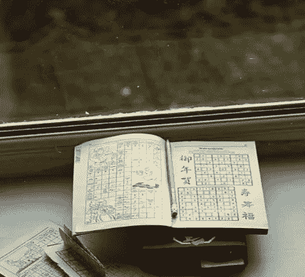
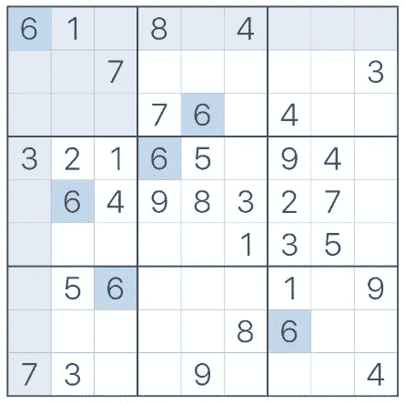
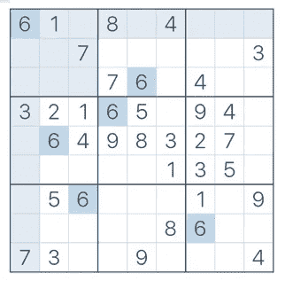
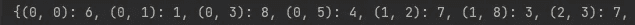
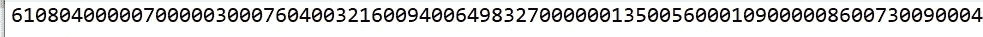
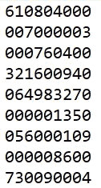

# 数独粉碎解决方案

> 原文：<https://towardsdatascience.com/sudoku-smashing-solution-470c14ce1143>

## 详尽的数独解决机器人教程:图像和光学字符识别加上文本到语音



让机器人帮你解决数独(照片由约翰·摩根在 T2 Unsplash 上拍摄)

在上一篇文章中，我们创建了一个名为[艾萨克](/chatbot-complete-pycharm-app-3517b64075f2)(用于管理和分析通信的智能解决方案)的机器人。在这篇文章中，我们将教艾萨克如何玩数独。以撒将有眼睛去看，有手写字，有嘴说话。有了这些技能，艾萨克将能够看着我们的数独游戏，并向我们口头揭示缺失的数字。


向世界问好，艾萨克！(图片由作者提供)

数独是从日语单词“suuji wa dokushin ni kagiru”缩写而来，意思是“数字(或数位)必须保持单一”。每个数独游戏由 9 列和 9 行组成，其中每列和每行只能包含数字 1-9 一次。在每个 3x3 的正方形中，不能有任何重复。



一个未解数独的例子(图片由作者提供)。

这篇文章的主要目的是展示如何将机器学习图像识别、光学字符识别(OCR)、文本到语音和 Python 中的“条件检查问题编码”整合到一个数据产品中。您将在我的 Github 资源库中找到完整的代码。为了避免信息过载，每个里程碑的细节将在单独的帖子中单独解释(链接将尽快添加)。

里程碑:

*   使用 CV2 进行图像识别(在每张图像上查找数独)
*   使用 Tensorflow 进行数字识别(在每个数独方块中查找已经输入的数字)
*   数独解决逻辑(条件检查编码)
*   使用 gtts 进行文本到语音转换

**解决方案:**

除了必不可少的 Numpy，Google 的 [Tensorflow](https://www.tensorflow.org/) 和 [gtts](https://gtts.readthedocs.io/en/latest/) 以及 [CV2](https://opencv.org/) 都是解决我们问题的魔法库。

```
import numpy as np
import cv2
from tensorflow.keras.models import load_model
from gtts import gTTS
```

> 如前所述，每个代码模块的详细解释将在以后的文章中给出。在这篇文章中，我们更侧重于理解主要概念和文本到语音的转换。

使用 CV2 是为了向 Isaac 展示数独图像。

```
picture = cv2.imread("SudokuUnfinished.jpg")
```



艾萨克将筛选这个数独 jpg(图片由作者提供)

下一步，CV2 将首先在图像上发现数独。

```
def GreatestOutline(outline):
    biggest = np.array([])
    biggestArea = 0
    for i in outline:
        area = cv2.contourArea(i)
        if area > 50:
            peri = cv2.arcLength(i, True)
            approx = cv2.approxPolyDP(i, 0.02 * peri, True)
            if area > biggestArea and len(approx) == 4:
                biggest = approx
                biggestArea = area
    return biggest,biggestArea
```

图像上最大的轮廓应该是数独。数独将进一步被分成 9*9 个方块。

```
def SplitBoxes(picture): 
    rows = np.vsplit(picture,9)
    boxes=[]
    for r in rows:
        column= np.hsplit(r,9)
        for box in column:
            boxes.append(box)
    return boxes
boxes = SplitBoxes(warpColored)
```

然后将使用 Tensorflow 检查每个方块中已经输入的数字。每个找到的数字将与先前训练的模型进行比较。如果该数字至少与模型预期的 80%匹配匹配，则该数字将被采用。否则方块将被认为是空的，因此将被视为零(记住，数独中不存在 0)。

```
def RecPrediction(boxes,model):
    result = []
    for image in boxes:
        picture = np.asarray(image)
        picture = picture[4:picture.shape[0] - 4, 4:picture.shape[1] -4]
        picture = cv2.resize(picture, (28, 28))
        picture = picture / 255
        picture = picture.reshape(1, 28, 28, 1)
        predictions = model.predict(picture)
        classIndex = model.predict_classes(picture)
        probabilityValue = np.amax(predictions)
        if probabilityValue > 0.8: 
            result.append(classIndex[0])
        else:
            result.append(0) 
    return result
numbers = RecPrediction(boxes, model)
```

Isaac 现在知道了当前填充的数独状态。



在第 0 行第 0 列，Isaac 可以看到数字 6 已被输入(图片由作者提供)

让我们检查一下是否正确。

```
textfile = open("SudokuInput.txt", "w") 
for element in numbers:
    textfile.write(str(element))
textfile.close()
```



0 表示该字段没有可用的数字

将 Isaac 的输出与数独图像进行比较，我们看到 Isaac 是正确的。但是格式不太方便阅读，所以我们会在每个 9 位数后添加新行:

```
textfiles = open("SudokuInput.txt", "r")
data = textfiles.read()
my_str = str(data)
group = 9
char = "\n"
hallo =char.join(my_str[i:i + group] for i in range(0, len(my_str), group))
textfile = open("SudokuRev.txt", "w")
for element in hallo:
    textfile.write(str(element))
textfiles.close()
textfile.close()
```

这最终看起来更像数独游戏:



SudokuRev.txt(图片作者提供)

知道了现有的数字，我们现在必须教艾萨克如何正确地玩数独。这将是显式编码部分。

```
class Sudoku:
    def __init__(self, variables, areas, condition):
        self.variables = variables
        self.areas = areas
        self.condition = condition #...explanation details to follow
```

既然艾萨克知道怎么玩了，那我们就来试试吧。让我们看看艾萨克输入的缺失数字:

6 1 5 8 3 4 7 9 2 |2 4 7 5 1 9 8 6 3 |9 8 3 7 6 2 4 1 5 |3 2 1 6 7 5 9 4 8 |5 6 4 9 8 3 2 7 1 |8 7 9 2 4 1 3 5 6 |4 5 6 3 2 7 1 8 9 |1 9 2 4 5 8 6 3 7 |7 3 8 1 9 6 5 24

干得好，艾萨克！缺失的数字已按正确的顺序正确填写。

我为我热爱数独的奶奶创造了这个解决方案。不幸的是，她更喜欢听结果(而不是在她的小电脑屏幕上查看结果)。所以艾萨克必须学会说话。多亏了谷歌的 gtts，这相当简单明了。在简单的英语中，我们通过在每个数字后添加一个空格来拆分结果字符串。也就是说，所以以撒说的是“一”、“二”、“三”，而不是“一百二十三”。否则将很难遵循数独的正确数字顺序。

```
voice_texts = ""
for line in range(0, 9):
    voice_texts += '|'
    for column in range(0, 9):
        if (line, column) in assignment:
            voice_texts += str(assignment[(line, column)])
        else:
            voice_texts += ''
        voice_texts += ' '
print(voice_texts)
voice_text = ""
for i in voice_texts.split(): 
    voice_text += i + ' '
voice_text = voice_text[:-1]
voice_text ="Hi, this is Isaac telling you your Sudoku numbers"+voice_text
tts = gTTS(voice_text)
tts.save("IsaacReadsYourSudokuSolution.mp3")
```


文本到语音转换保存 mp3 音频文件(图片由作者提供)

**恭喜:**

你教艾萨克筛选数独并告诉你答案。在以后的文章中，我们将学习如何将 Isaac 与 Flask 一起部署为一个 web 可访问的应用程序。作为更进一步，我们将建立一个 Android 应用程序。所以你可以上传一张照片给艾萨克，让他马上在你的智能手机上告诉你答案。我们还将在未来挑战 Isaac，看看他是否能够解决比数独更困难的现实生活难题:


我认为这可能不是世界上最严肃的丹麦广告

非常感谢您的阅读！希望这篇文章对你有帮助。请随时在 [LinkedIn](https://de.linkedin.com/in/jesko-rehberg-40653883) 、 [Twitter](https://twitter.com/DAR_Analytics) 或[工作室](https://jesko-rehberg.medium.com/virtual-reality-vr-for-education-a532aa5b6272)与我联系。

[](https://jesko-rehberg.medium.com/membership) [## 通过我的推荐链接加入 Medium-Jesko Rehberg

### 阅读杰斯科·雷伯格(以及媒体上成千上万的其他作家)的每一个故事。您的会员费直接支持…

jesko-rehberg.medium.com](https://jesko-rehberg.medium.com/membership) 

你可以在我的 [Github 库](https://github.com/DAR-DatenanalyseRehberg/Sudoku)中找到完整的代码。请随时在 [LinkedIn](https://de.linkedin.com/in/jesko-rehberg-40653883) 、 [Twitter](https://twitter.com/DAR_Analytics) 或[工作室(有或没有虚拟现实)](https://jesko-rehberg.medium.com/virtual-reality-vr-for-education-a532aa5b6272)与我联系。