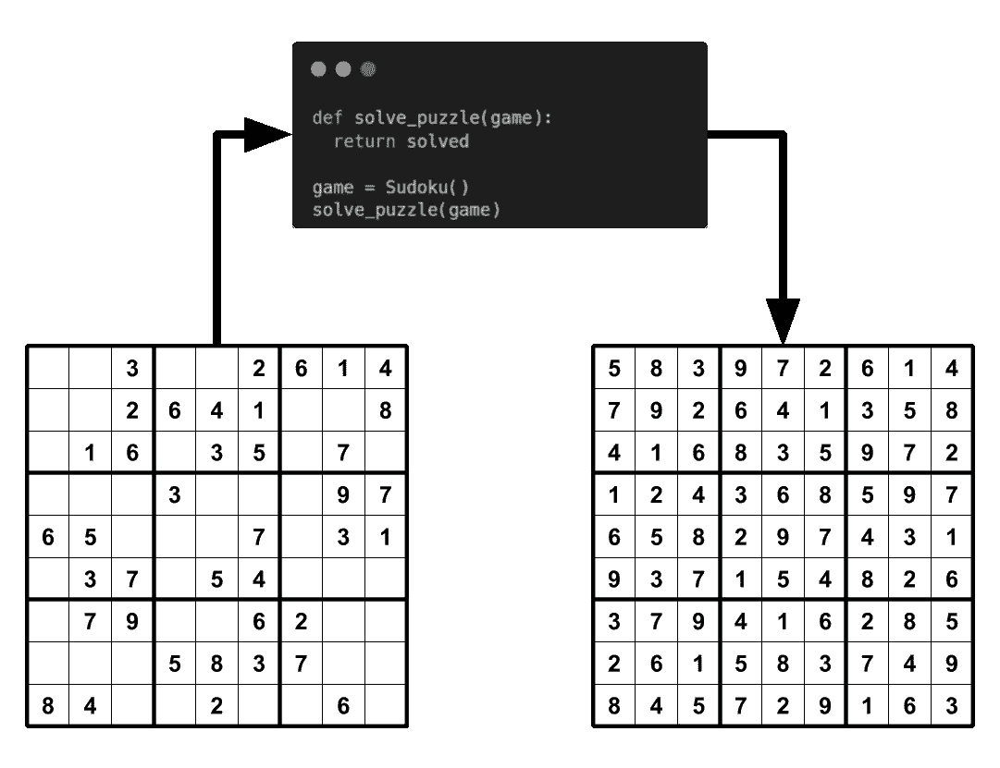
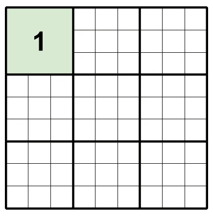
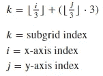
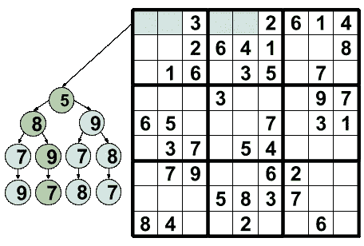
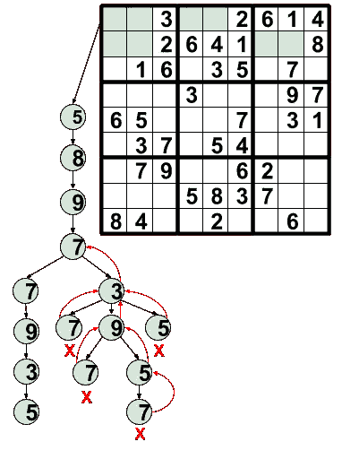

# 数独求解器

> 原文：<https://towardsdatascience.com/sudoku-solver-48cb2744fbd4>

## 用 Python3 和回溯法解数独

数独求解器|作者图片

大家好，今天我们将使用 python 3 创建一个[数独](https://en.wikipedia.org/wiki/Sudoku)解算器。在这篇博文中，我将介绍游戏理论和所需的算法，这样你就可以轻松击败任何数独棋盘。

数独是一种在 9x9 棋盘上玩的益智游戏，目标是用数字 1 到 9 填充每个方格。游戏规则很简单，在任何列、行或子网格中不能有任何重复的数字。子网格是 9x9 电路板内部的内部 3x3 网格。下面是一个数独板的描述，第一个子网格是绿色的。

子网格图|作者图片

规则很简单，但这些难题很有挑战性，因为有效的数独板只有一个解决方案。

# 构建数独谜题

首先，我们将构建生成谜题的游戏来测试我们的求解器。

为了构建游戏，我们将采取两步走的方法。我们的第一步将是用解决方案填写完整的板，以确保它是可解决的。一旦我们知道这个谜题是可解的，我们将应用一个遮罩。

为了确保我们生成独特的新电路板，我们将利用 python 标准库中提供的随机模块。使用这个库，我们将从每个方块的可能值列表中随机选择，确保我们遵循规则。

我们将逐行遍历游戏棋盘，选择一组随机的索引来创建掩码。正如 2012 年的论文“[没有 16 条线索的数独:解决数独最小线索数问题](http://www.math.ie/McGuire_V1.pdf)”中所述，我们知道 17 条是创建唯一解决方案所需的最小线索数。

创建独特的解决方案是至关重要的，因为没有独特的解决方案会导致拼图无效。由于我们目前没有求解器，我们无法验证我们的屏蔽函数是否创建了唯一的解决方案。正因为如此，我们利用了 17 条线索最小规则，确保我们给出了 17 条以上的线索。通过这样做，我们增加了创造独特解决方案的可能性。

为了这个博客，我们使用了 45 条线索，因为经过测试(我使用了我们正在构建的求解器来验证)，我发现它在大约 82%的情况下给出了唯一的解决方案。

# 简单溶体

既然我们可以生成谜题，我们需要解决它们。解决这些难题的一个简单方法是纯粹的暴力方法。为此，我们将利用递归并尝试所有可能的值组合。由于数独板有 6，670，903，752，021，072，936，960 种独特的可能解决方案，因此需要通过利用游戏规则来缩小搜索空间。

为了利用这些规则，我们可以利用记忆并保存放在当前行、当前列和当前子网格中的值。这样，我们不需要尝试 1 到 9 的所有组合，而是可以搜索尚未使用的数字。

为了记住当前行、当前列和当前子网格中已经存在的内容，我们可以使用它们各自的索引作为快速访问的关键字，将它们的值存储在集合的字典中(对于查找，字典和集合都是 O(1 ),因为它们使用散列)。确定列和行的索引很容易，但是找到子网格的索引就比较棘手了。为了确定子网格的索引，我们可以使用下面的等式。

子网格指数方程|作者图片

为了进一步加快速度，我们可以使用早期停止，并在找到第一个可行的解决方案时返回它。早期停止将有助于加快计算速度，因为我们不再需要尝试更多的组合。

这种方法确实通过成功解决问题完成了工作。然而，它的计算效率不是很高，我们可以做得比这更好。

# 回溯解

解决这个问题的一个更好的方法是使用[回溯](https://en.wikipedia.org/wiki/Backtracking)树搜索。我们可以在这里使用回溯树搜索，因为我们可以将可能的组合视为一棵树(图形数据结构)。

数独游戏树|作者图片

回溯树搜索是树搜索的一种优化形式，它不是在树的主干上重新开始搜索，而是删除不正确的节点，沿树向上返回，继续下一个选项。这样，通过保留您知道是正确的选项，您可以节省计算。下图显示了一个可能的回溯路径示例。

回溯示例|作者图片

对于我们的回溯算法，我们仍然像我们的蛮力方法一样利用递归、记忆和早期停止，只是现在我们更加关注树(图)的分支(边)并且更有效地搜索。

# 谢谢

就这样，我们成功地创建了数独解算器。你可以在我的 GitHub [这里](https://github.com/bellerb/Sudoku_Solver)查看完整版本的代码。正如你可能已经猜到的，我们可以在构建数独游戏时使用回溯算法来提高效率，我在我的 Github 上的代码中就是这么做的。

感谢阅读。如果你喜欢这样，可以考虑订阅我的账户，以便在我最近发帖时得到通知。

# 参考

*   【https://en.wikipedia.org/wiki/Sudoku 
*   [https://en.wikipedia.org/wiki/Backtracking](https://en.wikipedia.org/wiki/Backtracking)
*   [http://www.math.ie/McGuire_V1.pdf](http://www.math.ie/McGuire_V1.pdf)