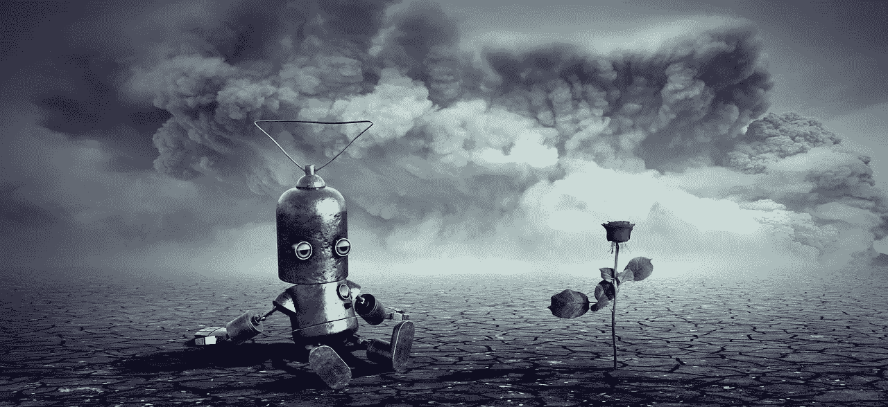
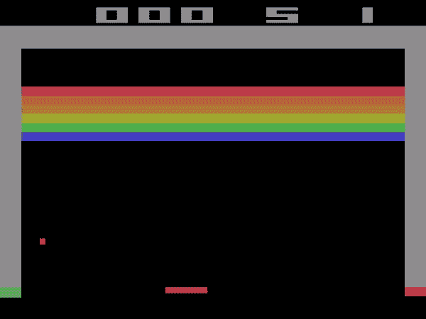
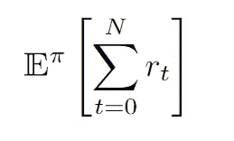
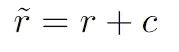
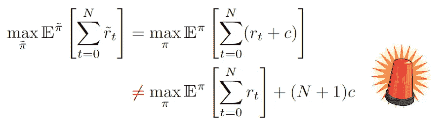
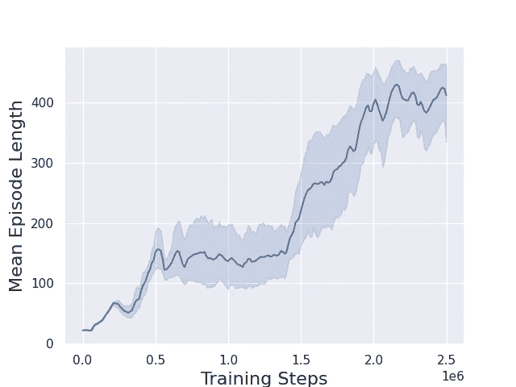
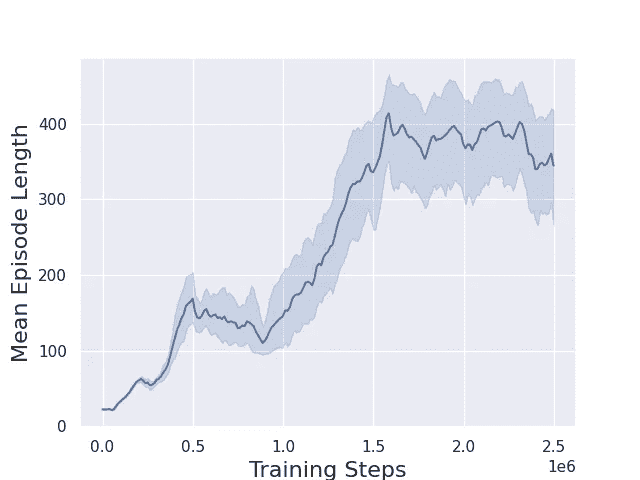
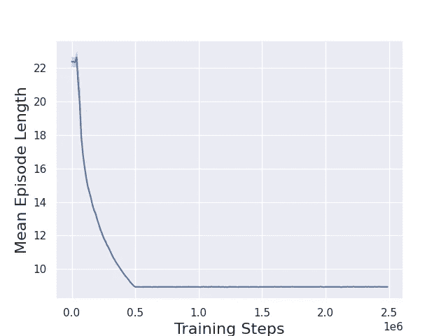
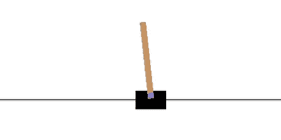

# 自毁 RL 药剂

> 原文：<https://towardsdatascience.com/suicidal-rl-agents-68159fc8f15a>

## 对 RL 奖励函数的无害改变会产生令人惊讶的行为

图片由来自 Pixabay 的 Stefan Keller 提供。

**问题设置**

强化学习是 AI/ML 的一个流行分支，它试图通过与世界互动和最大化奖励信号来学习最佳行为。例如，当玩游戏时，代理将决定如何与世界互动，环境游戏将相应地给予奖励。

雅达利突破。这里代理人的奖励信号是游戏的分数。来自 [OpenAI 健身房](https://www.gymlibrary.ml/environments/atari/breakout/)的环境。

数学优化是寻找“最佳元素”的研究。这通常是寻找一个函数的最大值或最小值，并且可以附加约束。例如，监督学习通常被记为最小化神经网络的预测值和数据集的目标值之间的损失函数的任务。然后我们用随机梯度下降法来解决这个问题。

当第一次学习强化学习时，将它视为一个简单的优化问题是非常诱人的，但可能会产生误导。让我们假设一个有限的范围设置，这样 RL 的目标是找到一个策略π:S→A，最大化未贴现的总回报:

我们使用有限的范围和γ=1 来使讨论更容易理解，但是对于一般情况可以得到相同的教训。现在考虑一个新的奖励函数，它只是用一个常数抵消了原来的奖励:

天真地，我们可能会得出这样的结论:

如果这是真的，那么原始奖励函数的最优策略π∫似乎与新的修改奖励的最优策略相同。代理人想要最大化的目标函数只是被值(N+1)c 修改了，这个值应该是独立于其行为的吧？其实不一定是这样的！事实上，对于常数 c 的不同选择，可以观察到非常不同的行为。

但是为什么呢？简而言之，N 实际上是一个随机变量，也是与政策相关的。大多数 RL 环境都有终止情节的条件，代理的行为可以影响情节的持续时间。

让我们看一下这个问题的一个具体实例，以便更好地理解发生了什么。

**直观的例子**

可能最容易玩深度 RL 和发展直觉的环境是横竿问题。概括一下:最初的奖励是为弹弓还活着的每个时间点分配 r=+1，如果:

1.  杆的角度超过阈值:
    ∣θ∣ > 12
2.  推车出界:
    |x| > 2.4
3.  达到时间限制(N=500)。

来自[奥体馆](https://www.gymlibrary.ml/environments/classic_control/cart_pole/)的翻筋斗环境。

为了建立一个基线，让我们看看不同代理的训练表现，作为常数偏移 c 的函数。为此，我们使用[稳定基线 3](https://stable-baselines3.readthedocs.io/en/master/modules/dqn.html) 和 MLP Q 网络。下面是 16 个不同代理的平均训练曲线。训练在 2，500，000 步后停止(尽管可以实现更好的性能)，因为这只是为了说明正在发生的事情。

DQN 钢管舞训练——基础奖励(r=1)。图片作者。

这没什么奇怪的。代理正在学习如预期的那样保持杆子平衡。我手动调整的唯一非默认参数是设置`exploration_fraction=0.2`

接下来，我们改变奖励函数，再次训练。对于热身，我们设置 c = 0.5，即在每步中，代理将获得 r=0.5 的奖励，直到剧集结束。然后，你认为会发生什么？为了进行比较，我们将绘制一段时间内环境的步数(恰好是原始奖励)。

DQN 钢管舞训练，r=0.5 (c=-0.5)。图片作者。

正如我们看到的，没有发生太戏剧性的事情。达到收敛的时间略有不同，但总的来说，代理人学会了最大化新的奖励，平均来说，所有代理人在大约 150 万步后学会了平衡极点。

到目前为止，一切顺利。但是如果我们设置 c = 2 会发生什么呢？也就是说，在每一步，代理人都会得到 r = 1 的回报。

DQN 钢管舞训练，r=-1 (c=-2)。图片作者。

悬赏黑客的典型例子！来自 [OpenAI 健身房](https://www.gymlibrary.ml/environments/classic_control/cart_pole/)的环境。

完全不同的行为！实际上，代理人学会尽快结束这一集。它实际上变成了自我毁灭，对我们心中的任务毫无用处，即使奖励被一个常数修改了！当然，对此的解释来自于这样一个事实，即事件的长度是可变的，并且会受到代理人行为的影响。​

**总结思路**

我觉得这种行为乍一看并不是最直观的。为什么这个代理无法学习平衡策略？毕竟，奖励函数只是被一个常数抵消了。原因是强化学习比传统优化要微妙复杂得多。在间歇式设置中，有些情况会干扰培训环境的运行。这意味着不能保证剧集能持续完整的 N 步。这就是为什么上述天真的简化不成立！

在这种情况下，特别是代理人意识到，如果它*尽快自毁*，那么负面奖励将停止累积！

> 如果代理人只知道消极的回报，那么它会知道一个更短的插曲是减少它的整体痛苦的最好方法。

这个故事的寓意很明确:

***改变一个 RL 环境的奖励函数可以导致截然不同的最优策略，即使是一个不明显的变化，比如一个加法常数。***

澄清一下——令人惊讶的不是奖励函数本身的变化会导致不同的行为。毕竟，如果我们相信[奖励假说](http://incompleteideas.net/rlai.cs.ualberta.ca/RLAI/rewardhypothesis.html)，那么奖励函数就是编码最佳行为的东西。令人惊讶的是，即使是乘法或加法常数也能产生如此大的影响。

最后，您可能已经注意到，c = 0.5 情况下的训练曲线看起来有所不同。用这种改进的奖励函数训练的代理收敛到相同的最优解，但速度不同。这与通过反向传播训练神经网络时梯度传播的方式有关，因此更多的是来自训练类型而不是来自 RL 的理论基础的人为因素。这就是为什么也有一个“奖励成形”领域，其中奖励函数被稍微调整，试图更快地收敛到期望的政策。

感谢阅读！