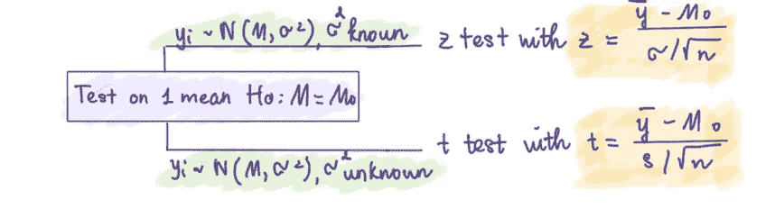
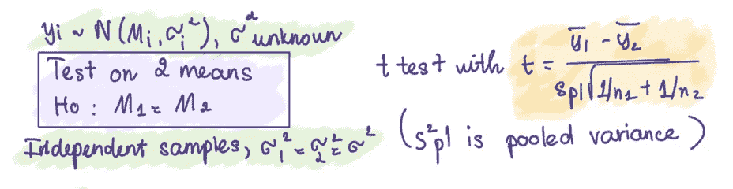
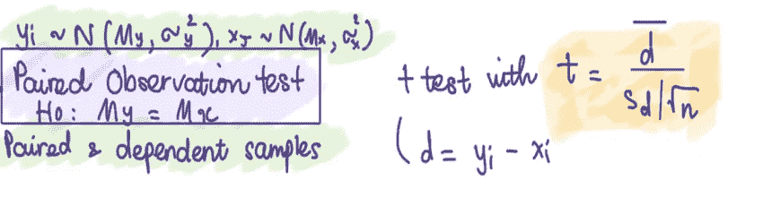
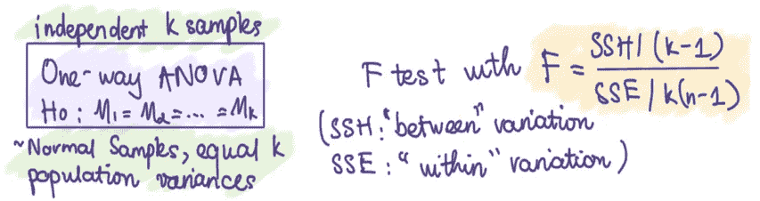
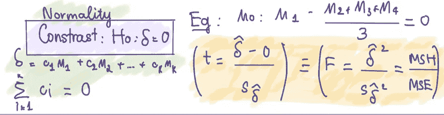
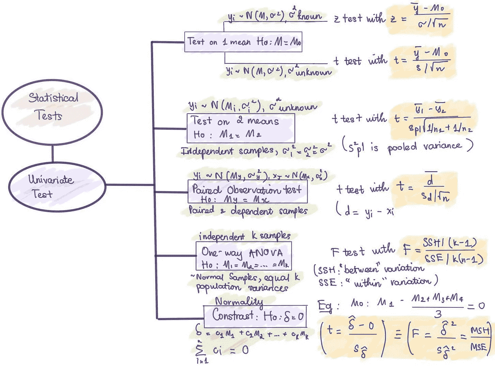

# 总结不同类型的单变量统计检验

> 原文：<https://towardsdatascience.com/summarizing-different-types-of-statistical-univariate-tests-801c7e8921c7>

## 选择合适的统计单变量检验进行数据推断综述

乔安娜·科辛斯卡在 [Unsplash](https://unsplash.com?utm_source=medium&utm_medium=referral) 上的照片

# 介绍

统计测试的目的是帮助分析人员根据收集的数据进行基本推断或得出一般性结论。许多统计测试都是可用的，这可能会使用户记不清应该使用哪些测试。这是因为不同的测试对数据有不同的假设，如数据类型、数据分布、数据变化等。，在决定用合适的测试来拟合数据之前，我们必须考虑所有这些假设。

在这篇文章中，我将总结一些单变量测试和相应的假设，以帮助您在选择应用哪些测试时避免混淆。

# 参数测试

我们将从参数测试开始。简单地说，参数统计检验定义了关于总体参数和数据分布的假设。学生的 t 检验、z 检验和 ANOVA 检验就是这些检验的例子，它们假设数据来自正态分布。

## 对一个平均值进行测试

图片 1 —作者提供的图片

**案例 1:** **已知方差(** σ)

假设我们要测试 y 的均值是否等于某个特定值，0，假设 y 的 n 个观测值来自正态分布，方差已知。我们将计算 y 的样本均值，并通过应用 ***z 检验统计量*** 将其与 0 进行比较。你可以在上图中找到公式。如果 z 值小于临界值，我们接受零假设，这是感兴趣的假设，否则我们拒绝零假设。

注意，如果 n 很大，中心极限定理保证 z 接近正态，即使观察值不是来自正态分布。

**情况 2:未知方差**

类似地，但是在我们不知道方差的情况下，应用 ***单样本 t 检验*** 。我们通过样本均值估计总体均值，通过样本方差估计总体方差，并进行 t 检验，如图 1 所示。如果 t 表中的 t 检验统计量≥临界值为 t(α/2，n-1)，我们拒绝零假设。

## 两种方法的测试:比较两种方法

图片 2 —作者提供的图片

在单变量的情况下，假设我们从σ1 = σ2 = σ且σ未知的正态分布中得到两个随机且独立的样本。 ***t 检验统计量*** 在图 2 中计算，分母中的混合方差作为共同方差(σ)的无偏估计量。请注意，独立和等方差假设是 t 统计量具有 t 分布所必需的。那么自由度是 n1+N2–2。因此，如果检验统计量大于或等于 t(α/2，n1+N2–2)，则拒绝零假设。

## 配对观察检验

图片 3 —作者提供的图片

当我们想在不同的条件下检查同一对象时，就要进行这种测试。例如，同一个女孩接受两种不同的护肤程序。因此，获得的两个样本是相关的，因为它们涉及同一个人。在这种情况下，我们不能使用双样本检验，因为样本不是独立的，因此不能得到检验的 t 分布。

进行测试的一种方法是将两个样本转化为一个，并应用 ***单样本 t 检验*** 。在上面的例子中，女孩在两种不同的治疗中得到的两个结果被称为配对观察。我们将获得成对观察值之间的差异，并专注于处理这些差异。此外，为了说明配对观测值之间的协方差，我们还必须假设配对观测值具有二元正态分布。然后，可以像图 3 中那样计算检验统计量，Sd 表示差异的标准偏差(d)。如果 t 值为> t(α/2，n-1 ),我们拒绝零假设，并得出两个处理之间存在差异的结论。

## 单向方差分析:比较 k 均值

图片 4—作者提供的图片

假设我们有一个随机样本，包含来自每个 k 正态总体的 k 个独立样本，方差相等。每个 k 个样本有 n 个观测值，被认为是一个组。然后，我们要进行测试，看看 k 组的平均值是否相等。

例如，我想知道四种教学方法的科学测试的平均分数是否不同。我们可以用 SSH 作为“介于”样本的平方和(由于平均值)，用 SSE 作为“在”样本的平方和来进行 f 检验。当 F > F(α)时，我们拒绝零假设，并得出样本均值之间至少有一个不等式的结论。

## **对比**

图片 5 —作者提供的图片

进行对比意味着对各组的均值进行比较。从图 5 可以看出，总体均值中的对比度可以定义为一个线性组合δ，其中系数之和= 0。例如，假设一所学校有 4 种历史教学方法，教师想知道第一种教学方法的平均测试分数是否比其他三种方法高三倍；在这种情况下，零假设是 Ho:1-(2+3+4)/3 = 0。以正态性为假设，可以进行 **t 检验**来检验差异。或者，f 检验也可以用作 t = F。

因此，总之，测试描述如下:

作者图片

# 非参数检验

非参数检验也称为无分布检验，这意味着对总体分布不做任何假设。在统计学中，这个术语并不总是意味着你不了解总体情况。然而，与上面的参数测试相比，“非参数”通常表示您知道总体数据不遵循正态分布。

仅在必要时使用非参数检验，例如，当您知道正态假设被违反时。此外，参数测试被认为更准确，因为测试有更好的统计能力，更有可能揭示真正重大的影响。如果样本量足够大，非参数检验可以很好地处理非正态连续数据。此外，如果:

*   你的样本量很小。
*   您的数据中存在不可移除的异常值。
*   感兴趣的假设是中间值，而不是平均值，因为你有一个非常偏斜的分布)

如果您使用非参数测试而不是参数测试，那将是最好的。

也就是说，我不会详细讨论非参数测试，而是列举一些常见的测试。

*   **单样本符号检验(~ 1 样本 z 检验，参数检验中的 1 样本 t 检验)**:估计总体的中位数，并与给定值进行比较。
*   **单样本 Wilcoxon 符号秩检验** **(参数检验中的~ 1 样本 z 检验、1 样本 t 检验):你也可以**对总体的中值进行估计，并将其与给定值进行比较，但该检验假设你的数据来自均匀分布等对称分布。
*   **Kruskal-Wallis 检验(~1-way ANOVA):** 找出两个或多个中位数是否不同。

如果你有兴趣，你可以在这个[链接](https://www.statisticshowto.com/probability-and-statistics/statistics-definitions/parametric-and-non-parametric-data/)找到更多的非参数测试。

# **结论**

以上是我对单变量检验的总结，我希望它能帮助你在进行各种数据推断时对合适的检验有一个简明的看法。在我的下一篇文章中，我将尝试对多元测试做一个类似的总结。

你可以在这里找到我以前的帖子:

</binominal-distribution-what-analysts-should-have-known-95e6a0b56129>  </simple-explanations-of-basic-statistics-concepts-part-1-bba66a1761d7>  

## **参考**

<https://www.statisticshowto.com/probability-and-statistics/statistics-definitions/parametric-and-non-parametric-data/>  

[https://www . Wiley . com/en-us/Methods+of+variable+Analysis % 2C+2nd+Edition-p-9780471461722](https://www.wiley.com/en-us/Methods+of+Multivariate+Analysis%2C+2nd+Edition-p-9780471461722)