# 超分辨率——基础研究

> 原文：<https://towardsdatascience.com/super-resolution-a-basic-study-e01af1449e13>

## 对超分辨率、其根源以及通常用于模型训练的不同类型的损失函数的研究

## 什么是超分辨率？

超分辨率是从对应的低分辨率图像重建照片级高分辨率图像的任务。在计算机视觉界，这一直是一项具有挑战性的任务。

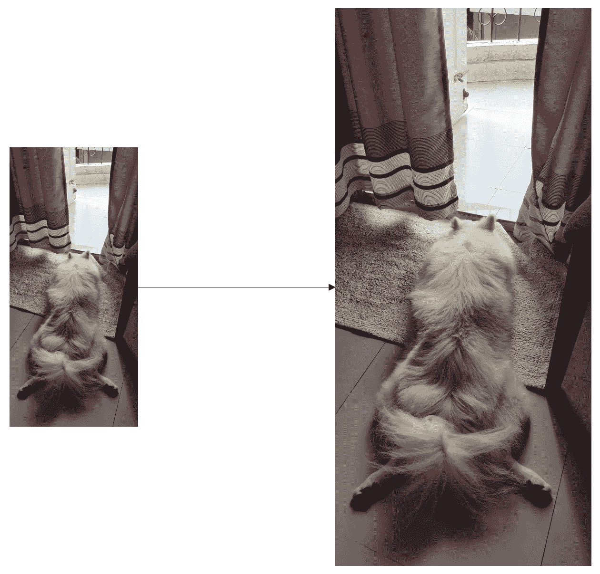

[来源:图片由作者提供]

这项任务的主要挑战是使它尽可能逼真。

> 照片写实主义是一种绘画风格，其中图像看起来如此真实，以至于很难与照片区分开来**。(来源:[ [2](https://www.macmillandictionary.com/buzzword/entries/photorealism.html#:~:text=photorealism%20also%20photo%2Drealism,hard%20to%20distinguish%20from%20photographs) )**

**让我首先从一些可以使用的基本方法开始。**

# **最近邻插值(非照片真实感)**

**目标是拍摄尺寸为 2x2(随机选择的尺寸)的图像，并创建尺寸为 4x4 的更高分辨率版本(假设尺寸加倍，可以是任何相对尺寸)。一个**天真的** **方法**是获取偶数像素，并根据需要在其附近创建尽可能多的副本(如下图所示，再创建 3 个副本以使尺寸加倍，其效果是简单地使每个像素变大)。**

**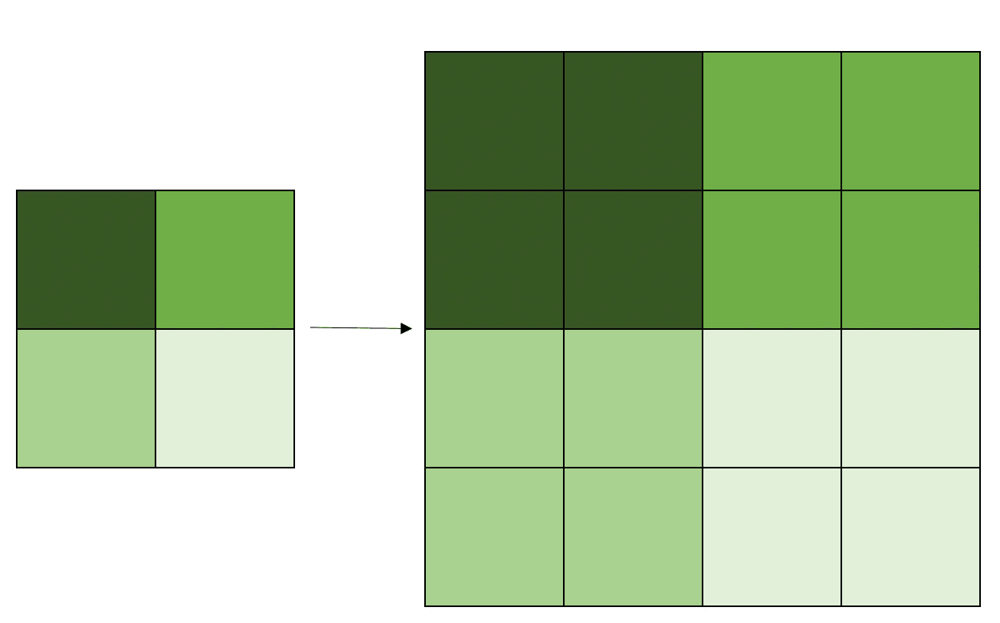**

**当应用于图像时，它给图像一个方格的外观，如下所示。**

**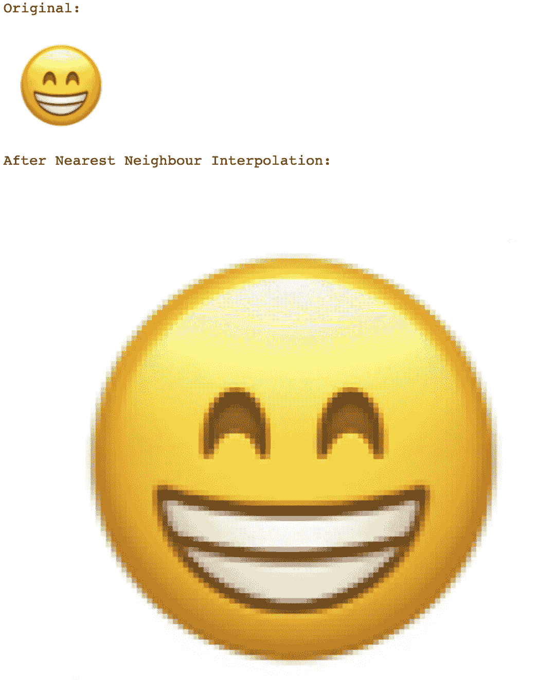**

**这种简单方法的一个可能的应用是调整条形码的大小。**

## **双线性插值**

**在这种方法中，对于每个新像素，它取其周围最近的 2x2 旧像素的加权和，根据其与旧像素的距离进行加权。由于颜色融合在一起，这会导致边缘稍微模糊。**

****

**超分辨率技术的目标是以保留边缘锐度并且图像看起来不像素化的方式进行插值。这为深度学习的进入铺平了道路，从简单的基于 CNN 的模型开始，后来使用更复杂的 GAN 架构。**

# **评估指标**

**有两个常用指标用于评估超分辨率后的图像质量:**

1.  **峰值信噪比(PSNR):**
2.  **结构相似性指数度量(SSIM)**

****PSNR****

**PSNR 是信号的最大可能功率与影响其表示保真度的干扰噪声功率之间的比率。PSNR 通常用于控制数字信号传输的质量。在图像的情况下，每个像素可以被认为是具有 8 位 RGB 值的信号的组成部分。**

**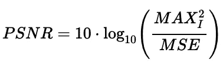**

**PSNR 表情【来源:[http://amroamroamro . github . io/mexopencv/opencv/image _ similarity _ demo . html](http://amroamroamro.github.io/mexopencv/opencv/image_similarity_demo.html)**

**这里，MAX_I 是像素的最大有效值，MSE 是高分辨率图像和超分辨率图像之间的均方误差。使用对数标度是因为像素值具有非常宽的动态范围。**

**这是对整个图像的逐像素比较**

****SSIM****

**SSIM 是一种试图复制人类视觉系统(HVS 颜色模型)工作方式的方法。它是基于三个因素设计的——相关性、亮度失真和对比度失真。**

**该指数是在图像的各个窗口上计算的，而不是直接的逐像素比较。(更详细的解释可以在维基百科上的图片来源处找到)**

**如果 *x，y* 是图像中尺寸为 *N* x *N 的窗口:***

****

**https://en.wikipedia.org/wiki/Structural_similarity SSIM 表情【来源:**

# **SRCNN 模型**

**现在被认为是一种经典的方法，这是第一个在没有大量像素化的情况下成功创建清晰边缘的模型之一。**

**它利用 CNN 作为使用卷积神经网络(CNN)从低分辨率(LR)输入到高分辨率(HR)输出的映射函数。LR 图像首先使用双三次插值进行超分辨率处理，然后通过网络输出另一幅超分辨率(SR)图像。使用通过将 SR 图像与原始 HR 图像进行比较而产生的损失来训练该模型。(当在上下文中涉及网络输入时，该论文将双三次超分辨率图像称为 LR)**

**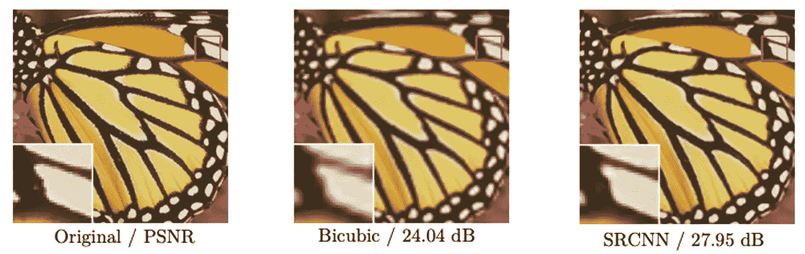**

**超分辨率对比【来源:[https://arxiv.org/pdf/1501.00092.pdf](https://arxiv.org/pdf/1501.00092.pdf)**

## **网络**

**SRCNN 的神经网络被公式化为三步过程:**

1.  **小块提取和表示:将来自 LR 图像的小块转换成由一组特征图组成的高维向量表示**
2.  **非线性映射:非线性映射将矢量表示转换成由一组特征映射组成的另一个高维矢量表示**
3.  **重建:聚合分片向量以生成最终的 SR 图像。**

**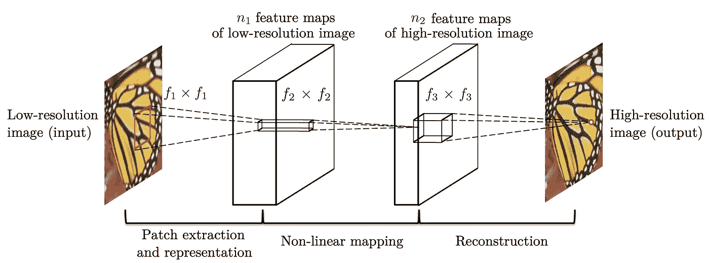**

**SRCNN 网络架构【来源:[https://arxiv.org/pdf/1501.00092.pdf](https://arxiv.org/pdf/1501.00092.pdf)**

## **损失函数**

**使用的损失函数是一组 HR 图像和 LR 图像之间的均方误差(MSE)**

**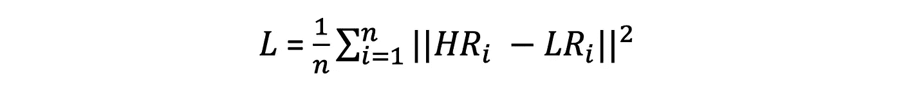**

**SRCNN 损失函数**

## **结果**

**与当时的现有模型相比，SRCNN 模型实现了最高的 PSNR 和 SSIM 值。**

**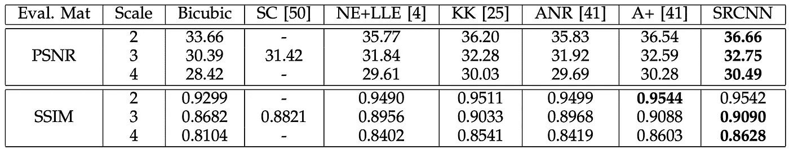**

**SRCNN 的调查结果【来源:[https://arxiv.org/pdf/1501.00092.pdf](https://arxiv.org/pdf/1501.00092.pdf)**

**这篇论文的一个更重要的结果是，它将这个问题带到了前沿，更多的人开始探索各种架构和损失函数，以提高 SR 图像的质量。**

# **损失函数**

**在过去几年中，已经设计了多种损失函数来训练超分辨率模型**

**基于像素的损耗:**

1.  **像素损失(MSE)**
2.  **平均绝对误差**
3.  **总变化损失(电视损失)**

**基于网络的损耗:**

1.  **知觉丧失**
2.  **纹理损失**
3.  **对抗性损失**

# **基于像素的损失**

## **像素损失(MSE)**

**这与 SRCNN 中使用的均方误差(L2 损失)相同，SR 图像中的每个像素与 HR 图像中的相对像素进行比较。**

****

**像素损失**

## **平均绝对误差**

**这是超分辨率图像和高分辨率图像中像素之间的 L1 损耗。它是两组对应像素之间的绝对差值之和。**

**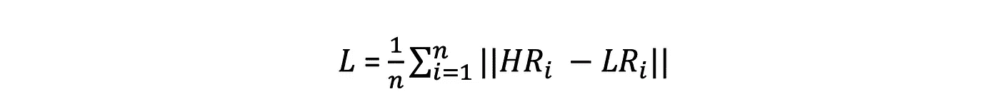**

**MAE 损失**

**因为与 MSE 相比，它受离群值的影响较小，所以从人类观察者的角度来看，它更有可能给出更高质量的图像。**

## **电视损耗**

**总变差损失用于抑制生成图像中的噪声。它通过获取相邻像素之间的绝对差值来测量图像中的噪声。**

**对于具有高度 *H* 、宽度 *W* 和通道 *C、*的 SR 图像**

**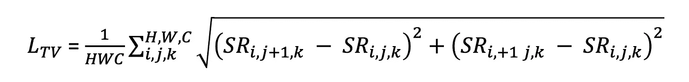**

**电视损耗**

**注意，与其他损失函数不同，这仅取决于 SR 图像，而不与其 HR 对应物进行比较。**

# **网络损耗**

## **知觉丧失**

**该损失函数基于与原始 HR 图像的感知质量相比所生成的 SR 图像的感知质量来评估损失。一种计算方法是通过使用来自预训练图像分类网络的高级特征。**

**对于给定的预训练网络 *N* (可以是 VGG 或雷斯网)，以及该网络中的层 *l* ，**

**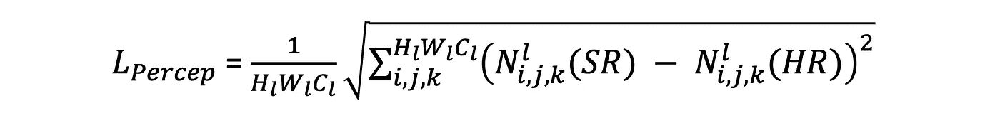**

**不是在图像的像素之间取 MSE，而是在两个图像的高级特征之间取 MSE。它也被称为内容损失。**

## **纹理损失**

**这个灵感来源于*风格转移* ( [*Gatys et。艾尔。*](https://www.cv-foundation.org/openaccess/content_cvpr_2016/papers/Gatys_Image_Style_Transfer_CVPR_2016_paper.pdf) )接近。该损失函数用于使 SR 图像具有与 HR 图像相同的风格。风格是指图像中呈现的纹理、颜色和对比度。也被称为*风格损失*或*克矩阵损失。*不是直接从特征图中获取损失，而是从特征图中计算 gram 矩阵并用于计算损失。**

**向量集的格拉姆矩阵是由这些向量的所有可能的内积组成的矩阵。在这种情况下，向量是从预训练网络 *N* 的层 *l* 获得的特征通道。**

**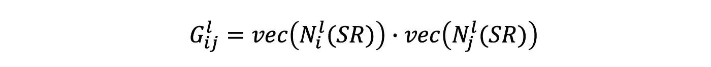**

**图像的 Gram 矩阵计算(I 和 j 表示来自同一层的两个特征图)**

**该矩阵表示各特征通道之间的相关性，本文将其定义为图像的纹理。一旦我们有了克矩阵 *G，*纹理损失被定义为**

**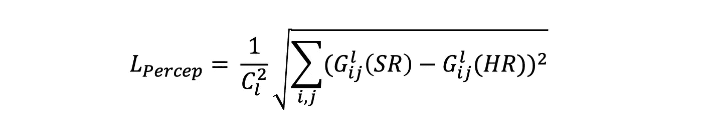**

**该损失函数中的 MSE 取自 gram 矩阵之间，而不是直接取自特征图。这种度量经常被视为在生成的图像中产生更好的色彩。**

## **对抗性损失**

**近年来，生成对抗网络被大量用于图像的超分辨率。在这方面，有两种相互竞争的模式:**

1.  **生成器—生成逼真的图像**
2.  **鉴别器—将图像分类为真实图像或由生成器生成的图像**

**通过反复训练这两个网络，我们得到了一个*生成器*，它可以从原始 LR 图像生成非常逼真的图像。**

# **参考**

***“所有图片，除非特别注明，均为作者所有。”***

**董，李，何，唐，谢:学习用于图像超分辨率的深度卷积网络。ECCV (2014 年)**

**L. A .的 Gatys、A. S .的 Ecker 和 m .的 Beth ge(2016 年)。使用卷积神经网络的图像风格转换。在*IEEE 计算机视觉和模式识别会议论文集*(第 2414–2423 页)。**

**[https://theailearner . com/2018/11/15/image-interpolation-using-opencv-python/](https://theailearner.com/2018/11/15/image-interpolation-using-opencv-python/)**

**cambridgeincolour.com/tutorials/image-interpolation.htm**

 **** **<http://amroamroamro.github.io/mexopencv/opencv/image_similarity_demo.html> **