# 监督学习导论

> 原文：<https://towardsdatascience.com/supervised-learning-61256f2aebeb>

## 其中有一个朴素贝叶斯分类算法的例子


图片说明|照片由[安妮·伦凯](https://www.pexels.com/@anniroenkae)拍摄

这是以彼此为基础的系列文章的继续。请看我上一篇关于[时间序列分析](/time-series-analysis-7138ec68754a)和[逻辑回归](/logistic-regression-cebee0728cbf)的文章。

好吧，让我们从监督学习开始。我在以前的文章中提到了一些，但是让我回顾一下这篇文章的一些细节。

*   监督学习:从已有数据中学习，这些数据被分类并标有预定义的类别。测试数据也被标记到这些类中

这适用于所有类型的学习。但是，具体来说，它有**标记的预定义类**。这是最重要的事情— **监督学习有一个被称为专家标签的东西**。这是一个有趣的词，意思是它被标记为一个结果；或者对于任何给定的情况，都有一个已知的、期望的结果。

无监督学习(聚类)并不假设它知道答案。例如，群集将查看数据，并根据数据的状态对数据进行分区。

监督学习将根据标签对数据进行分区。这是一个很大的区别。无监督学习的一个例子是聚类。监督学习的一个例子是回归，就像我之前写的一样。

例如，在回归模型中，我们有 X 和 Y，我们通过它们画一条最佳拟合线。在这个例子中，X 是我们的输入，Y 是输出。我们可以说这是监督学习，因为 Y 是专家标签；给定这些专家标签，模型正在学习如何获取 X 并得出 Y。

# 示例:

*   欺诈交易:我们知道训练数据中哪些交易是欺诈(1)，哪些不是(0)
*   再入院:我们知道哪些患者在出院后的某个时间窗内再次入院
*   推荐:我们知道哪些商品呈现给了客户，哪些商品被点击、添加到购物车或购买了
*   一个典型的例子是垃圾邮件过滤器

机器学习任务有多种用途。这里有一些经典的机器学习任务的例子:识别欺诈，识别病人的再次入院，识别推荐，就像你典型的网飞机器学习案例，当你去网飞时，你会得到你会喜欢的电影的推荐；这些电影是基于你以前看过的电影，并考虑到其他人在看过与你看过的电影相似的电影时喜欢什么，以及他们看过什么电影，除此之外。这就是所谓的推荐引擎。

> 作为一个题外话，这个推荐引擎是一种灰色区域，可能不总是被描述为监督学习，但我跑题了。

监督学习的一个经典例子是垃圾邮件过滤器。垃圾邮件过滤器是做什么的？它将你的电子邮件分为垃圾邮件和非垃圾邮件。该模型学习的方式是通过某人，一个“专家”——一个人，来将各种电子邮件标记为垃圾邮件或非垃圾邮件。然后，电子邮件和这些标签被交给一种算法，该算法预计会计算出如何自行从电子邮件到达该标签。这整个过程被称为监督学习。

# 典型的机器学习任务:

*   **分类:**我们能给输入打上标签吗？
*   **回归**:我们能做个预测吗？
*   **建议**:我们能根据用户偏好预测一些东西吗？

监督学习有两个重要步骤:首先，你训练一个模型，然后你测试这个模型。使用看不见的测试数据来测试你的模型是非常重要的。在以前的文章中，我写过监督学习，就像回归一样，我没有使用测试数据，而是使用训练数据来测试模型。这是不好的，不是一件好事。人们偶尔做这件事，做这件事有不同的原因。合法的理由很少，但是有一些。如果你用训练数据来确定你的模型的准确性，那么你充其量是在愚弄自己；最坏的情况是，你在撒谎。

所以为了测试这个模型，你需要使用所谓的“看不见的测试数据”现在，我们如何创建看不见的测试数据？嗯，这很简单。您只需将您的建模数据分成训练数据和测试数据:在模型已经在训练段上训练之后，测试数据用于模型的测试。

我们所说的学习是什么意思？你使用数据和算法得出一个性能指标或最小化一个成本函数——这是另一种说法。当你这样做的时候，你将会用新的操作数据提出一个模型，你将会得到一个答案。

# 学习的基本假设

学习的一个基本假设是训练样本的分布与测试样本的分布相同，包括未来未知的样本。更重要的是，训练样本的分布与未来的样本足够相似。鉴于它们是未来的例子，它们是看不见的。

如果你想要一个精确的度量，那么这个分布也应该类似于测试例子。这种假设不是必需的。一个要求是，为了让你相信你的准确性，你的测试例子必须和你未来的例子来自同一个分布。

如果您创建了一个可用的模型，那么您的训练示例来自哪里并不重要。如果你的训练样本来自不同的发行版，那就更有力量了。要成为有效的衡量标准，测试示例必须足够类似于在实际操作数据时使用的示例——当涉及到可操作性时。现在，对上述假设的强烈违反将导致较差的分类准确度。

## 机器学习框架

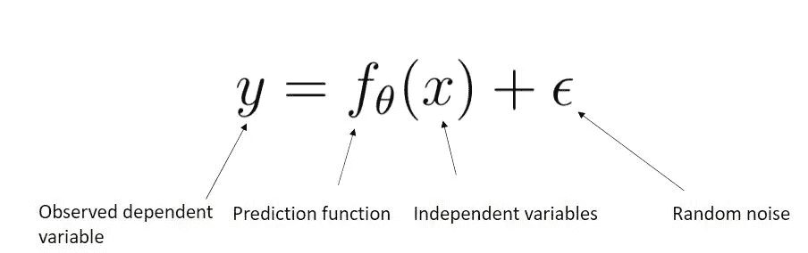

作者图片

**训练:**给定一个*训练*的标记样本集{(x_1，y_1，… (x_n，y_n)}，估计使训练集上的预测误差最小的预测函数(f)和参数(θ)

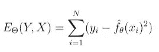

培训功能|作者图片

**测试:**将(f)应用于一个从未见过的*测试*例子(x)并输出预测值(y = f(x))

在整个机器学习框架中，你给一个 X，然后你得到一个 y。这将会有一些误差，因为有一些随机噪声与一切相关。这意味着你得到的实际 Y，并不完全是上面的函数。

# **分类工作流程**

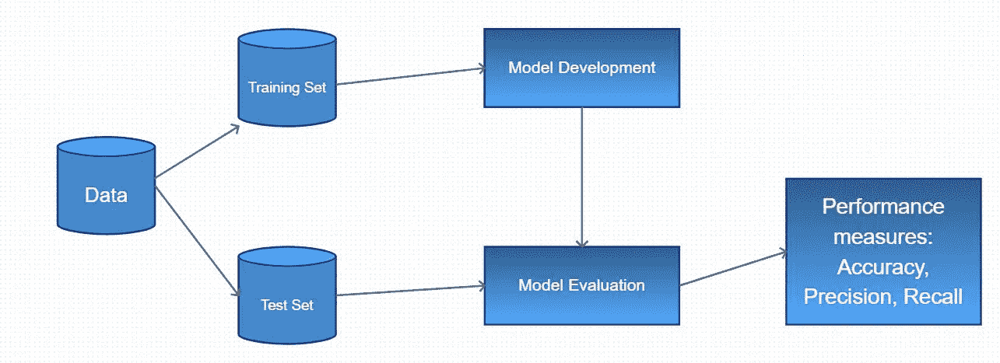

分类工作流程图|按作者分类的图片

最重要的是数据必须分成训练集和测试集。模型是在训练集中开发的，模型是在测试集上评估的。最后，您可以获得性能度量，也称为准确性度量。这里有三个性能度量:其中称为准确性的性能度量可能是最差的性能度量。准确率和召回率都相当不错。有一个更好的方法是精确度和召回率的混合，即 F1 分数。

我更喜欢它的原因是它是召回率和精确度的混合体。你会希望有良好的回忆和准确性。如果你有非常好的回忆和非常糟糕的精确度，反之亦然，你的模型是没有价值的。对于二元分类，有一个更好的准确性衡量标准 ROC AUC。

所以 ROC 曲线的曲线下面积是用来分类的。它之所以优于以前的性能度量，是因为它对所有阈值都有效；而准确度或精确度假定一个阈值，通常假定阈值为 0.5。同样，F1 分数也假定阈值为 0.5。你可以选择不同的阈值，但大多数人不会认为你会选择不同的阈值。

之所以选择不同的阈值，是因为您可能有不同的目的，其中您的假阳性可能比假阴性更糟糕，反之亦然。通过调整你的阈值，你可以权衡这些。

## 许多分类器可供选择

*   线性回归
*   逻辑回归
*   支持向量机(SVM)
*   神经网络(安，有线电视新闻网，RNN，DNN)
*   朴素贝叶斯
*   贝叶斯网络
*   随机森林(随机森林)
*   提升决策树(梯度提升树)
*   k-最近邻(KNN)

这里是所谓的分类器，监督学习中使用的算法。KNN 通常被认为是你最简单的概念，并且经常在这样的课上教授，因为算法相对简单:你可以从头开始写算法。

增强决策树和随机化森林曾经是你通常喜欢的机器学习分类算法。今天，“最新”类型的算法是神经网络。当我说最新的时候，我的陈述是大约 5 到 10 年前的，这取决于你如何看待它。但是直到大约五年前，Kaggle 竞赛[是由增强的决策树和随机森林赢得](https://www.kaggle.com/msjgriffiths/r-what-algorithms-are-most-successful-on-kaggle/data?scriptVersionId=0)。现在，深度神经网络正在赢得 Kaggle 比赛。所以不是神经网络，而是一种更复杂的神经网络，叫做深度神经网络(DNN)。

逻辑回归是每个人的最爱——每当你做一个分类，你首先做一个逻辑回归，总是这样！从这个意义上来说，朴素贝叶斯也是一个很好的例子。但是逻辑回归可能更进一步。所以你总是做逻辑回归。不是因为你想炫耀逻辑回归的结果。只是它是如此的强大，你知道如果你不能让逻辑回归起作用，你也不能让其他任何东西起作用。所以逻辑回归是你要做的第一件事。当这种方法奏效时，你就开始变得更加大胆，尝试上面列出的其他算法。

# 一般化

**欠拟合**:模型过于“简单”，无法表示所有相关的类特征——高训练误差和高验证误差。

**过拟合**:模型过于“复杂”，拟合数据中不相关的特征(噪声)——训练误差低，验证误差高(训练和验证性能差距大)

一般化意味着它工作得有多好。作为一个很好的启发**每当你说一般化，你会想到正规化**。为什么要这么做？因为你概括一个模型的方法是通过正则化这个模型。如果你有一个很好的正则化模型，它大概是广义的。泛化是什么意思？这意味着它不仅仅在最小的环境下也能工作。因此没有出现过拟合。欠拟合模型通常过于简单，需要做更多的工作来从中提取信息。但是过拟合模型不够一般化，需要正则化。

# 机器学习中的常见陷阱

*   **过拟合**
*   **欠拟合**
*   **数据泄露**:在训练数据中产生意想不到的额外信息，产生不切实际的好预测。将测试数据泄露到训练数据中。包含模型操作环境中不存在的数据

很少有欠拟合的陷阱，可能是算法的使用过于原始，导致了某种程度的欠拟合，因为人们可能已经停止了逻辑回归，他们应该使用梯度提升树，如果你想认为这是一种欠拟合。如前所述，过度拟合是你的一个大问题。

现在，下一个大问题是数据泄漏或任何类型的代理列或代理。这些问题经常发生。这个概念很难理解，很难解释，很难教为什么这样的事情会经常发生，除非你自己做过。

例如，你已经查看了一个月的数据，并对其进行了处理，只有当你的测试结果出来后，你才能看到你的机器学习算法的测试结果，比如你的准确率为. 97。这时你才意识到，“哦，我一定是数据泄露了。”简而言之——你很少能得到这么好的模型。然后你必须剖析你的模型，你必须找出为什么你的模型好得不真实。而你的模型好到不真实的原因，通常是因为数据泄露。

> 一个现实生活中的例子:前列腺癌模型包括一个变量，表明患者是否进行了前列腺癌手术。模型看不到未来，患者是否做过手术的数据应该已经从模型中删除以进行训练。

# 混淆矩阵

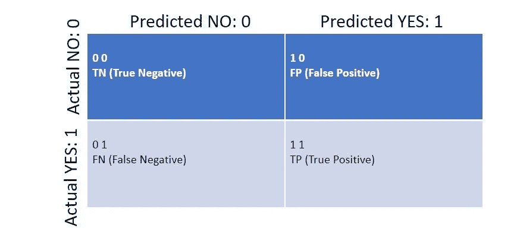

混淆矩阵的编码

这是一个混淆矩阵的例子。关于这些混淆矩阵的一个重要注意事项是，它们通常在左上角有真负值，在右下角有真正值。之所以会这样，现在看来，是因为零小于一。因为真正的否定通常被建模为零，所以首先列出它们在数字上是有意义的。当你把你的实际类和你的预测类简化成计算机最容易理解的形式时，你就把它们简化成了 0 和 1。因为零比一小，所以零先去，一后去。因为 0 比 1 小，所以 0 在垂直方向上也是先走，然后是 1。零通常与缺少某物联系在一起，通常与否定联系在一起。

在这里，阴性并不是一件坏事——如果我是新冠肺炎阴性，这意味着我没有 COVID，或者至少我的测试结果是 COVID 阴性。如果我没有 COVID，那么这就是我所说的真负值。同样，编码为 1 1 意味着我确实有 COVID，并且我检测结果为阳性。

这就是为什么真阴性和真阳性是这样排列的:真阴性在左上方，真阳性在右下方。情况并不总是这样——过去是相反的！但这是你最近大部分时间看到的。这和 0 和 1 的排序有关！

精确度和召回率是需要理解的重要概念，但超出了本文的范围。正如我上面提到的，我更喜欢 F1 分数，精度和回忆的调和平均值(相对于算术平均值)作为我的“准确性”指标，而不是选择任何一个。但是分类的最佳性能测量是 ROC 曲线。

受试者工作特征(ROC)曲线对于分类非常有用。我相信这是最重要的准确性测量，但有时它不能使用。这是有原因的，但一般来说，ROC 曲线是你想要使用的。之所以要用 ROC 曲线，是因为它考虑了所有的阈值。为了说明这一点为什么重要，考虑这个假设的面试问题:给人们假阳性、真阳性、假阴性和真阴性的数字——每种数字有 10 个。所以这可能会给你最差的准确度分数:0.5

> 顺便说一下，如果你的模型精确到了 0.01，那么只要把你的 0 类和 1 类的标签换一下，你的模型就会突然精确到 0.99

但是如果你看看概率，真阳性和真阴性的概率:都是 0 和 1 左右——意味着它们是好的。假阳性和假阴性的概率都在 0.5 左右，这意味着它们非常糟糕。这意味着错误是不可靠的，正确的结果是非常好的或非常安全的；因此，您将因此获得更高的 ROC AUC 分数！你将永远不会看到任何类似的其他准确性措施，因为**他们不考虑概率。他们只考虑布尔结果**:它是真的正还是不是真的正？

# 朴素贝叶斯

朴素贝叶斯模型的一些属性是

*   不需要先验知识
*   计算复杂度与参数/特征的数量成线性关系
*   需要最少的数据来生成概括良好的模型
*   具有简单和固有的正则化

一些应用:

*   文件分类
*   垃圾邮件检测
*   图像分类

是的，朴素贝叶斯中的贝叶斯确实指的是贝叶斯定理，我之前[写过](/bayesian-statistics-11f225174d5a)关于它。贝叶斯定理和朴素贝叶斯模型之间也有非常明确的联系。然而，朴素贝叶斯模型的假设是个体维度是独立的，或者说是朴素的。这意味着贝叶斯定理的重要部分，你可以把 A 的概率和 B 的概率联系起来，或者不需要交集。我们在这里天真地认为，我们说这些概率是相互独立的。因此条件概率基本上消失了。这就是朴素贝叶斯中的“天真”——表现得好像你的数据维度是独立的。

如果您的数据维度不是独立的，那么您的朴素贝叶斯将不会很好地工作。一个令人惊讶的结果，或者至少令人惊讶的是，如果你过于关注独立性的要求，朴素贝叶斯模型在你的维度不完全独立的情况下仍然可以很好地工作。不管怎样，我的观点是，在考虑贝叶斯定理时，一些最困难的部分因为朴素贝叶斯而变得非常简单；因为你假设概率是相互独立的——因此不需要计算或假设条件概率。维度独立性假设允许您将概率彼此相乘，这大大简化了训练和测试模型所需的计算。

就像逻辑回归是如何被用作分类器一样，你可以称之为逻辑分类器。因此，朴素贝叶斯的一个更好的名字可能是朴素概率模型，以远离贝叶斯定理中固有的条件概率。

# 朴素贝叶斯的陷阱

*   小概率相乘导致浮点下溢。这个问题可以通过计算对数概率 ln(p)来解决
*   如果没有样本/数据，则 p(xj | Ck) = 0，导致概率的乘积为 0。拉普拉斯平滑器用于确保所有 p(xj | Ck) > 0
*   共线特征不显示独立性。理想情况下，应将此类要素从数据集中移除，以防止模型出现问题
*   正则化通常是朴素贝叶斯模型的一个小问题，因为无信息特征趋向于均匀分布，这不会影响结果

# 朴素贝叶斯模型的类型

现在我们已经研究了朴素贝叶斯模型的基础，让我们看看一些具体的公式。重要的是要记住，每一类问题都需要一个特定的朴素贝叶斯模型。

**多项式朴素贝叶斯分类器**是模型的一种广泛使用的形式。多项式分类器从多种可能性中找到最可能的类。为了防止数值下溢，我们编写这个分类器，取等式两边的对数如下:

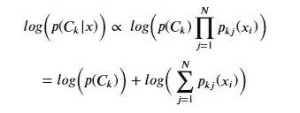

作者图片

那么最有可能的𝑦̂班是:


作者图片

对于伯努利或二元情况，多项式分类器可以简化为:

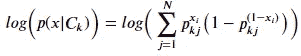

作者图片

# 文档分类示例

*   朴素贝叶斯主题模型使用以下关系，基于单词{w1，w2，…，wn}的出现，计算文档 D 具有主题 C 的概率:

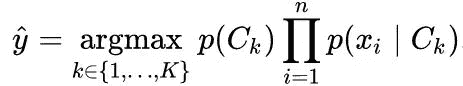

信用:[维基百科](https://en.wikipedia.org/wiki/Naive_Bayes_classifier)

在这个文档分类的例子中，你有各种各样的文档，一个所谓的文档语料库。这意味着您有一个文档集合，并且这些文档以某种方式被标记。首先，给一个文档一个“专家”标签(垃圾邮件或非垃圾邮件)。在应用标签之后，你要做的是为每个单词创建一个列，这意味着每个单词都变成了一个布尔列，就像一键编码一样。

对文档中的每个单词重复这个过程。有很多方法可以减少列数，但我的观点是朴素贝叶斯对于文档分类非常有用。现在，有什么这样的例子吗？例如，这份文件是否抄袭？这份文件到底是不是假新闻？这到底是不是垃圾邮件？朴素贝叶斯之所以是一种受欢迎的方法，是因为该模型不介意巨大的维数。可能会有一些性能下降或保真度下降，导致分类器在大量数据维的情况下不具有良好的准确性。但是，有办法去除多余的输入。从计算上来说，这非常快，因此它是文档分类的首选。

# Python 代码示例

既然理论已经奠定，让我带你看一个实际的例子。下面是朴素贝叶斯模型的一个简单例子。想想 1984 年美国众议院 435 名议员的政党和 16 项重要法案的投票。

我将使用这个数据集建立并测试一个分类器来预测国会议员的政党。让我们从进口开始:

```
import pandas
import numpy
import seaborn
from matplotlib import pyplot%matplotlib inlinevotes = pandas.read_csv('[https://library.startlearninglabs.uw.edu/DATASCI410/Datasets/house-votes-84.](https://archive.ics.uci.edu/ml/datasets/congressional+voting+records)csv', header=None, 
names=['class', 'V1', 'V2', 'V3', 'V4', 'V5', 'V6', 'V7', 'V8', 'V9','V10', 'V11', 'V12', 'V13', 'V14', 'V15', 'V16'])
print(votes.shape)
votes.head()
```


形状和数据集的前 5 行|作者的图像

# 分配主题

上述数据框中的每个投票列都对应于以下主题，因此让我们用更容易记住的名称来替换列名:

```
vote_names = [
    'handicapped_infants',
    'water_project_cost_sharing',
    'adoption_of_the_budget_resolution',
    'physician_fee_freeze',
    'el_salvador_aid',
    'religious_groups_in_schools',
    'anti_satellite_test_ban',
    'aid_to_nicaraguan_contras',
    'mx_missile',
    'immigration',
    'synfuels_corporation_cutback',
    'education_spending',
    'superfund_right_to_sue',
    'crime',
    'duty_free_exports',
    'export_administration_act_south_africa']votes.columns = ['class'] + vote_names
votes.head()
```

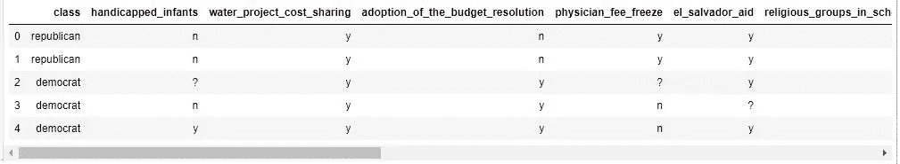

重新标记的列|作者图片

# 视觉探索—条形图

为了进一步了解这个数据，我们来做一些前 5 票的剧情。下面单元格中的代码为`Class`政党的这些投票创建了条形图。执行这段代码并检查结果:

```
# Convert dataframe columns to "category" type to take advantage
# categorical utilities like facet-based plotting in seabornvotes['class'] = pandas.Categorical(votes['class'].astype('object')
    , categories=['republican', 'democrat'])values = ['y', 'n', '?']
vote_dtype = pandas.api.types.CategoricalDtype(categories=values)
for c in votes.columns[1:]:
    votes[c] = votes[c].astype('object').astype(
        vote_dtype)
democrats = votes[votes['class'] == 'democrat']
republicans = votes[votes['class'] == 'republican']
for vote_col in votes.columns[1:6]:
    pyplot.subplot(1, 2, 1)
    pyplot.hist([1 if x == 'y' else 0 for x in democrats[vote_col]])
    pyplot.title('Democrats: \n' + vote_col)
    pyplot.ylabel('count')
    pyplot.subplot(1, 2, 2)
    pyplot.hist([1 if x == 'y' else 0 for x in republicans[vote_col]])
    pyplot.title('Republicans: \n' + vote_col)
    pyplot.show()
```

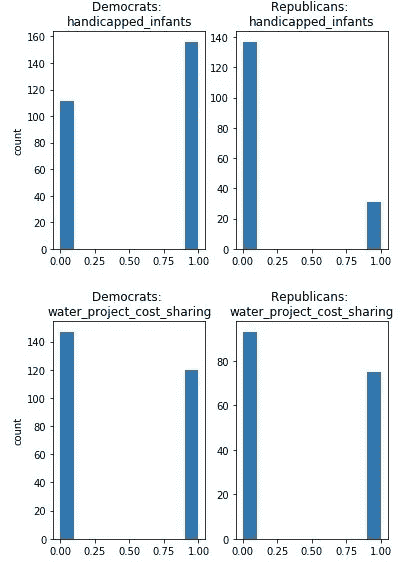

作者图片

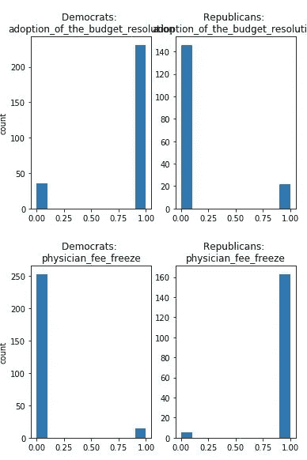

作者图片

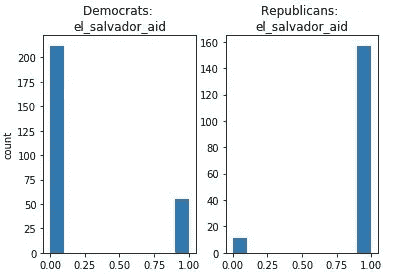

作者图片

当检查这些图表时，请记住，在这个数据集中，民主党人比共和党人多——因此它不是完全平衡的。重要的是每个政党的成员投赞成票或反对票的概率。有些投票因党派关系而颇为偏颇，比如“通过预算决议”。然而，有些投票在政党中有相似的概率，例如“水项目成本分摊”。这些政党的投票概率用于训练朴素贝叶斯模型。

# 训练和测试模型

现在我们已经了解了一些数据的特征，是时候训练和测试一个朴素贝叶斯模型了。python `sklearn.naive_bayes`包提供了一个库，用于训练朴素贝叶斯模型，并生成一个可以对新实例进行预测的模型对象:

```
import sklearn.model_selection as m_s
Votes_Train, Votes_Test = m_s.train_test_split(votes)
votes = Votes_Testlabel_col = 'class'# Convert our categorical values to numeric feature vectors
feature_vecs = numpy.array([
        votes[c].cat.codes 
        for c in votes.columns 
        if c != label_col]).T
print(feature_vecs.shape)feature_Train = numpy.array([
        Votes_Train[c].cat.codes 
        for c in Votes_Train.columns 
        if c != label_col]).T
print(feature_Train.shape)
```

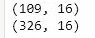

```
feature_vecs[:5]
```

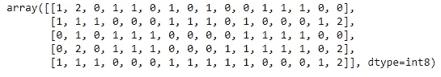

作者图片

```
# Convert our label (democrat vs republican) to numeric values
labels = votes[label_col].cat.codes
labels_Train = Votes_Train[label_col].cat.codes
# Look at the mapping for the first 5 values
list(zip(votes[label_col][:5], labels[:5]))
```

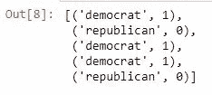

作者图片

```
import sklearn.naive_bayes# Define model
model = sklearn.naive_bayes.MultinomialNB(alpha=1e-7)
# Train model with votes dataset
model.fit(feature_Train, labels_Train)
```

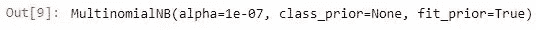

作者图片

# 评估模型性能

计算出模型后，现在让我们来评估性能。通过打印结果的前 10 行，我们可以快速了解模型的有效性:

```
predicted_party = model.predict(feature_vecs[:10])
party_probabilities = model.predict_proba(feature_vecs[:10])results = pandas.DataFrame({
        'party': votes['class'][:10],
        'predicted': pandas.Categorical.from_codes(
            predicted_party, votes['class'][:10].cat.categories),
        'proba(Republican)': party_probabilities[:, 0],
        'proba(Democrat)': party_probabilities[:, 1],
    })
results
```

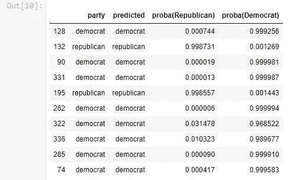

作者图片

当您检查这些结果时，请注意:

1.  有 1 例明确的分类错误，1 例分类未定，8 例分类正确。
2.  在大多数情况下，预测类的概率(得分)比其他类的概率大得多，包括分类错误的情况。
3.  一种情况下，这两类概率几乎相同。

下一步，我们计算该模型的混淆矩阵和性能指标:

```
import sklearn.metricsdef confusion_matrix(labels, predicted_labels, label_classes):
    return pandas.DataFrame(
        sklearn.metrics.confusion_matrix(labels, predicted_labels),
        index=[label_classes], 
        columns=label_classes)def performance(results):
    accuracy = sklearn.metrics.accuracy_score(
        results['party'].cat.codes, results['predicted'].cat.codes)
    precision = sklearn.metrics.precision_score(
            results['party'].cat.codes, results['predicted'].cat.codes)
    recall = sklearn.metrics.recall_score(
            results['party'].cat.codes, results['predicted'].cat.codes)print('Accuracy = %.3f, Precision = %.3f, Recall = %.3f' % (accuracy, precision, recall))

    return confusion_matrix(
        results['party'], 
        results['predicted'], 
        results.party.cat.categories)performance(results)
```


作者图片

从 435 名国会议员中的前 10 名来看，结果相当不错。

执行下面单元格中的代码，使用所有数据计算并打印模型评估，并将结果与第一个模型进行比较:

```
predicted_party = model.predict(feature_vecs)
party_probabilities = model.predict_proba(feature_vecs)results_all = pandas.DataFrame({
        'party': votes['class'],
        'predicted': pandas.Categorical.from_codes(
            predicted_party, votes['class'].cat.categories),
        'proba(democrat)': party_probabilities[:, 0],
        'proba(republican)': party_probabilities[:, 1],
    })
performance(results_all)
```

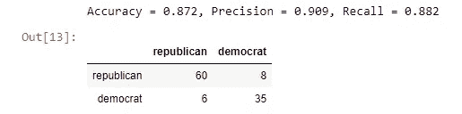

作者图片

# 拉普拉斯平滑

拉普拉斯平滑法是处理没有足够样本来计算概率的数据集的有效方法。这种方法避免了𝑝(𝑥𝑗|𝐶𝑘)=0p(xj|Ck)=0.

下面单元格中的代码使用相同的国会投票数据计算一个朴素贝叶斯模型，但是使用了一个跨度为 3 个数据点的拉普拉斯平滑器。执行这段代码并检查结果:

```
predicted_party = model.predict(feature_vecs)
party_probabilities = model.predict_proba(feature_vecs)results_all = pandas.DataFrame({
        'party': votes['class'],
        'predicted': pandas.Categorical.from_codes(
            predicted_party, votes['class'].cat.categories),
        'proba(democrat)': party_probabilities[:, 0],
        'proba(republican)': party_probabilities[:, 1],
    })
performance(results_all)
```

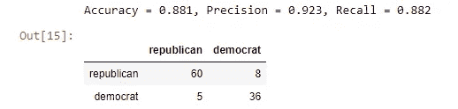

作者图片

结果类似于没有拉普拉斯平滑计算的模型。这一结果是意料之中的，因为数据集中的所有案例都有足够的数据。

# 另一个例子——人口普查收入

现在我们可以尝试另一个二元分类的例子。下面单元格中的代码加载了一些美国人口普查数据样本。我们希望构建并评估一个朴素贝叶斯模型，以 50，000 美元为分界点，根据高收入和低收入对人们进行分类。执行此代码并检查数据集中的特征。

```
# income is a pd read_csv function from a source URL that no longer works
income.head()
```

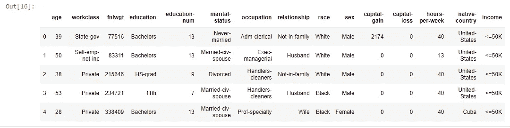

作者图片

```
income.shape
```

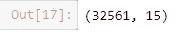

作者图片

```
income.info()
```

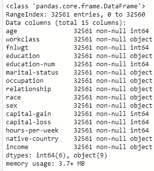

作者图片

```
income.describe()
```

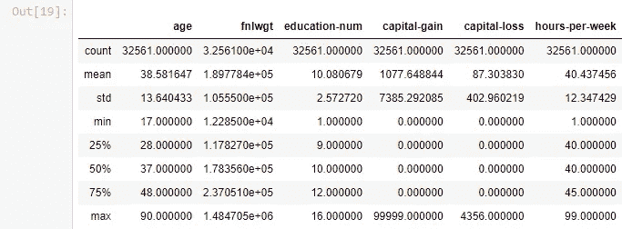

作者图片

# 减少特征

我们可以看到一些可能是共线的特征。还有一个特征，`fnlwgt`对这些人分类没什么用。下面单元格中的代码删除了这些列。执行此代码以创建一个具有简化功能的数据集:

```
income = income.drop(['workclass', 'fnlwgt', 'education-num', 'relationship'], axis=1)
income.head(10)
```

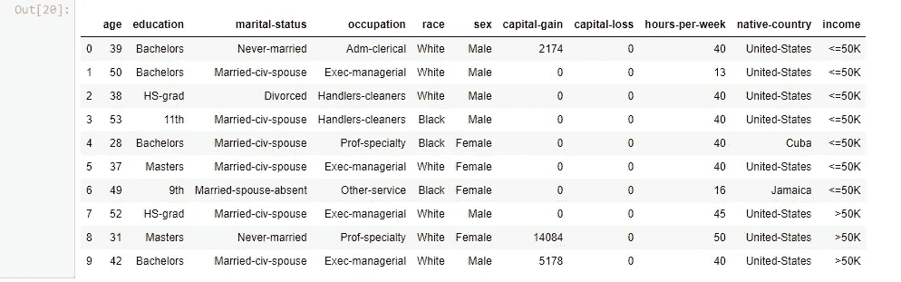

作者图片

现在，我计算一个朴素贝叶斯模型，使用收入数据集中的特征对`income`进行分类:

```
for c in income.columns:
    if income[c].dtype == 'object':
        income[c] = income[c].astype('category')income_label_col = 'income'income_labels = income[income_label_col].cat.codesfeatures = []
for c in income.columns:
    if c != income_label_col:
        if str(income[c].dtype) == 'category':
            features.append(income[c].cat.codes)
        else:
            features.append(income[c])
income_feature_vecs = numpy.array(features).T# Create model
model = sklearn.naive_bayes.MultinomialNB(alpha=3)
model.fit(income_feature_vecs, income_labels)
```

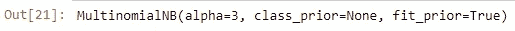

作者图片

```
features[8]
```

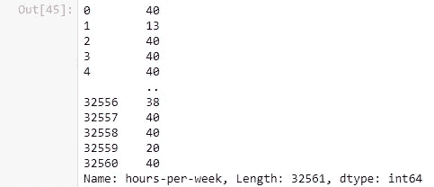

作者图片

```
conditional_probas = pandas.DataFrame(model.feature_log_prob_, columns=income.columns[:-1])
conditional_probas
```

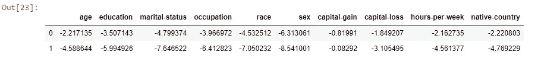

作者图片

```
(-conditional_probas).plot(kind='bar')
pyplot.show()
```

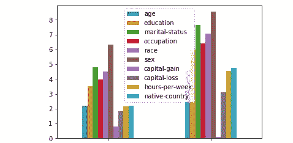

作者图片

# 改变特征的数量

现在让我们研究一下向朴素贝叶斯模型添加更多数据样本的效果。下面单元格中的代码使用 2、3、4、5 和 6 票来计算和评估朴素贝叶斯模型。执行此代码，并将结果与使用完整数据集获得的结果进行比较:

```
label_col = 'class'# We need to convert our categorical values to numeric feature vectors
feature_vecs = numpy.array([
        votes[c].cat.codes 
        for c in votes.columns 
        if c != label_col]).T
print(feature_vecs.shape)# we also need to convert our label (democrat vs republican) to numeric values
labels = votes[label_col].cat.codes
# take a look at the mapping for the first 5 values like so
list(zip(votes[label_col][:5], labels[:5]))
```

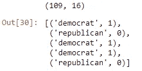

作者图片

```
for num_features in [2, 3, 4, 5, 6]:
    model = sklearn.naive_bayes.MultinomialNB()
    model.fit(feature_vecs[:, :num_features], labels)predicted_votes = model.predict(feature_vecs[:, :num_features])print('Number of features = %d' % num_features)
    accuracy = sklearn.metrics.accuracy_score(labels, predicted_votes)
    precision = sklearn.metrics.precision_score(labels, predicted_votes)
    recall = sklearn.metrics.recall_score(labels, predicted_votes)
    print('Accuracy = %.3f, Precision = %.3f, Recall = %.3f' % (accuracy, precision, recall))
    print('Confusion matrix:')
    print(confusion_matrix(labels, predicted_votes, votes['class'].cat.categories))
    print('')
```

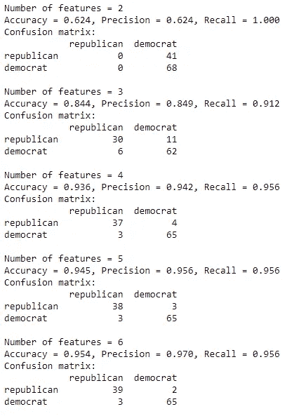

作者图片

从这些结果中可以看出，该模型仅用几个特征就能快速获得准确性。事实上，16 个特征中的 5 或 6 个提供了相同的结果。

计算一个朴素贝叶斯模型，计算并打印 100、500、1000、2000、8000 和 32561 行`income`数据集的性能统计数据:

```
NumberOfRowsTests = [100, 500, 1000, 2000, 8000, 32561]
for num_rows in (NumberOfRowsTests):
    model = sklearn.naive_bayes.MultinomialNB()
    model.fit(income_feature_vecs[:num_rows, :], income_labels[:num_rows])predicted_income = model.predict(income_feature_vecs[:num_rows, :])
    income_probabilities = model.predict_proba(income_feature_vecs[:num_rows, :])

    accuracy = sklearn.metrics.accuracy_score(income_labels[:num_rows], predicted_income)
    precision = sklearn.metrics.precision_score(income_labels[:num_rows], predicted_income)
    recall = sklearn.metrics.recall_score(income_labels[:num_rows], predicted_income)
    print('%6.0f rows:  Accuracy = %.3f, Precision = %.3f, Recall = %.3f' % (num_rows, accuracy, precision, recall))
    print('Confusion matrix:')
    print(confusion_matrix(
            income_labels[:num_rows], predicted_income, income.income.cat.categories), '\n')
```

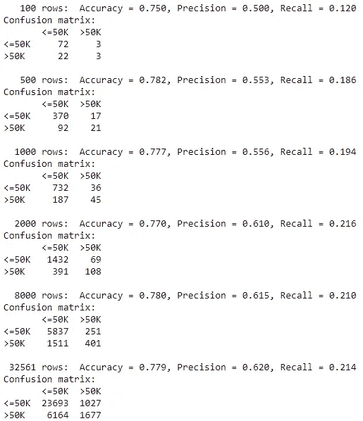

作者图片

# 摘要

在本笔记本中，我完成了以下工作:

1.  朴素贝叶斯模型理论
2.  朴素贝叶斯的陷阱
3.  良好的正则化性质
4.  计算效率
5.  计算和评估朴素贝叶斯模型的示例
6.  检查数据集大小对朴素贝叶斯模型结果的影响
7.  监督学习的解释

请记住，虽然朴素贝叶斯是一个有用且强大的分类器——但这个模型应该总是与一个[逻辑回归](/logistic-regression-cebee0728cbf)模型相比较。这种启发允许进行有用的健全性检查，并且为评估您的模型提供了重要的基础事实。

我希望你喜欢这篇文章！无论你是这个概念的新手，还是仅仅需要复习，我希望我的读者对数据科学和机器学习中这些复杂但非常重要的主题有深刻而完整的直觉和理解。

如果你想让我继续写类似的主题，请订阅！

在 [Linkedin](https://www.linkedin.com/in/james-a-w-godwin/) 上找到我

*物理学家兼数据科学家——可用于新机遇| SaaS |体育|初创企业|扩大规模*