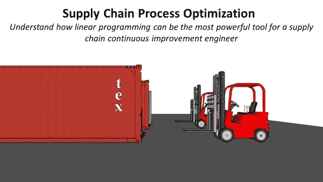
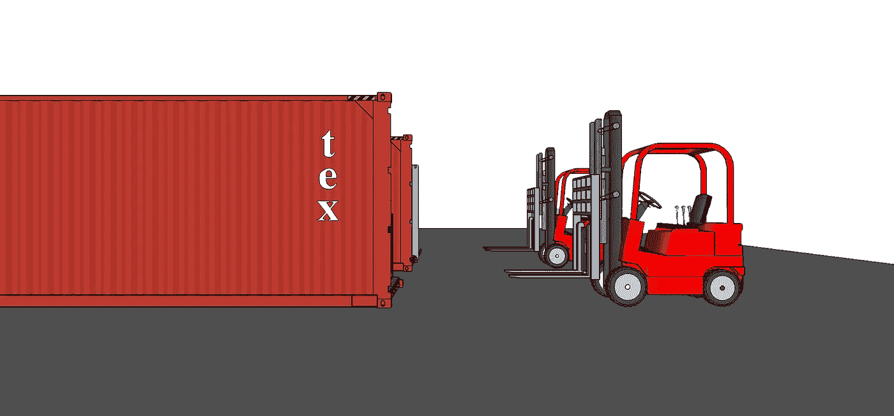
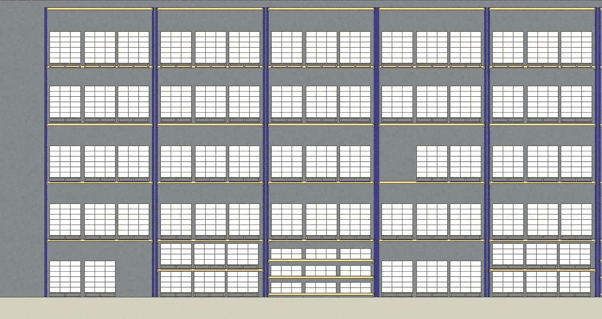
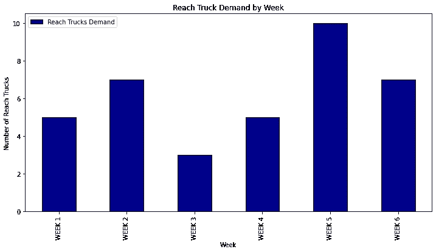
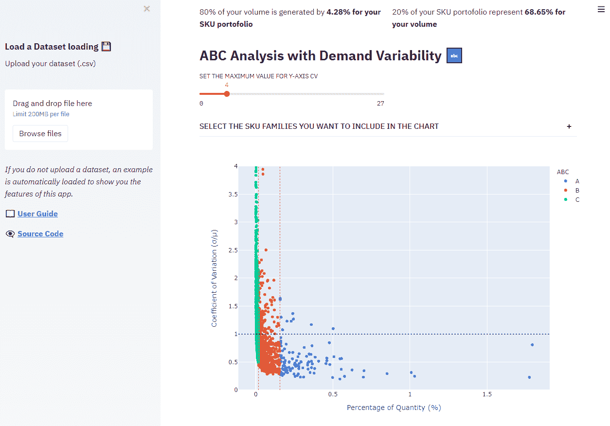

# 基于线性规划的供应链流程优化

> 原文：<https://towardsdatascience.com/supply-chain-process-optimization-using-linear-programming-b1511800630f>

## 理解线性规划如何成为供应链持续改进工程师最有力的工具



(图片由作者提供)

**目的** 理解供应链优化问题和线性规划框架之间的相似性

**简介** 供应链是一个由**流程**和**库存点**组成的面向目标的网络，用于向客户交付商品和**服务**。

在有了六年多设计和优化供应链流程的经验后，我注意到要解决的问题类型有一个模式。

它们遵循类似的结构，旨在通过影响**关键参数**来最大化(或最小化)**目标函数**，同时遵守一些**约束**。

在本文中，我们将使用几个可以快速实现的真实例子来尝试理解**线性规划**如何适合这种类型的问题**。**

💌新文章直接免费放入你的收件箱:[时事通讯](https://www.samirsaci.com/#/portal/signup)

```
**SUMMARY**
**I. Introduction to Linear Programming** Mathematical techniques used to get an optimum solution to a problem
**II. Requirements & Formulation of LP Problems**
**Requirements & Formulation** Conditions to apply the Linear Programming methodology
**Implementation using Python** Python libraries for LP implementation
**III. Methodology** Step 1: Understand the problemStep 2: Build the model
Step 3: Solving using Python
Conclusion
**III. Implement these solutions
Provide Insights
Deploy on the cloud
Share the tool using executable files (.exe)**
```

如果你喜欢看，可以看看这篇文章的视频版本

# 一、线性规划简介

**目标** 供应链分析用于帮助运营部门做出明智的、数据驱动的决策，以 [**提高服务水平**](https://www.youtube.com/watch?v=qhLqu6M7lcA)**l**[**降低成本**](https://www.youtube.com/watch?v=aJnrEElPvvs) 。

在运筹学中，线性规划(LP)是一种数学技术，用于在考虑**资源稀缺**以及外部和内部**约束**的情况下，获得给定运营问题的**最优解**。

我在以前的文章中分享了一些用于过程优化的线性规划的案例研究

*   [使用 Python 线性编程优化劳动力规划](https://www.samirsaci.com/optimize-workforce-planning-using-linear-programming-with-python/)
*   [使用 Python 进行线性规划的供应计划](https://www.samirsaci.com/supply-planning-using-linear-programming-with-python/)

在本文中，我将通过一个真实的运营案例研究来解释我使用线性编程解决这些运营问题的方法。

[](http://samirsaci.com)  

# 二。线性规划问题的要求和表述

## 要求

为了对 [**过程优化**](https://www.youtube.com/watch?v=COcoxQ8NhzM) 应用线性规划，必须满足以下要求:

1.  **问题陈述**:用**清晰的数学术语**定义目标
2.  **决策变量**:影响目标的定量输入变量
3.  **约束**:可量化、可测量的条件
4.  **目标函数**:目标和输入变量之间的关系必须是**线性的**

## 制定

*   **决策变量**:可以是数字或布尔的变量
*   **目标函数**:我们想要最小化或最大化的变量的线性函数
*   **制定约束:**组合不同决策变量的一组方程

# 三。方法学

在下面的案例研究中，我们将使用**仓库车队管理**的问题来介绍该方法。

我的目标是给你一个**详细的配方**，可以复制用于其他问题。

## 第一步:理解问题

**一家多用户仓库的运营经理**请求您的支持，以**优化其 reach 卡车车队的管理。**



reach 卡车示例—作者提供的图片

前移式卡车是仓库中用于多种应用的物料搬运设备，例如:

*   卡车或集装箱[装载/卸载](https://www.youtube.com/watch?v=nz69i6l7SzI)
*   仓库内的托盘转移
*   [收起](https://www.youtube.com/shorts/AWUnzVaAvEk):将托盘放在货架上
*   补充:从存储位置转移到地面位置



提货位置(0 级)/存储位置(1 至 4 级)-按作者分类的图像

**需求**

在与不同的团队领导取得一致后，他编制了未来五周**的**需求**预测。**

****

**reach 卡车的需求——作者图片**

**需求每周都在波动。由于预算限制，你不能租用 **10 辆卡车六周**。**

****供应****

**这种类型的设备通常是租赁的，具有更大的灵活性。您可以选择几种类型的卡车:**

*   ****类型 1** — **长期租赁卡车**:这些卡车需要租赁**六周**，价格 **225 欧元/周****
*   ****类型 2** — **短车队租赁卡车**:这些卡车可以租赁一周，价格为 **395 欧元/周****
*   ****类型 3** — **共享卡车:长期租赁**与另一仓库共享的卡车仅在**第 2 周、第 4 周和第 6 周**可用，价格 **205 欧元/周****
*   ****类型 4** — **特价**:这些卡车可以以 **200 欧元/周**的折扣价租赁**最后三周**，最大订购数量**2 辆**卡车**

**这些条件是现实的。事实上，租赁公司正在调整他们的报价，以降低物流公司的成本。**

> *****💡提示:你不能解决一个你不理解的问题。在这一阶段，确保你已经收集了设计问题所需的所有信息。
> 收集和处理数据后，花些时间向关键利益相关者展示你的愿景。确认你的理解是正确的，这是一个很好的练习。*****

## **步骤 2:构建模型**

****问题陈述**
运营经理请求你回答以下问题。**

> **对于每种类型，我应该租多少辆卡车来满足未来六周的需求？**

****决策变量** 它们会是整数，因为你只能租满卡车。**

```
**Reach trucks types**
types = [Type 1, Type 2, Type 3, Type 4]**Decision variables** (integer)t[1]: number of type 1 trucks
t[2]: number of type 2 trucks rented for the week 1
t[3]: number of type 2 trucks rented for the week 2
t[4]: number of type 2 trucks rented for the week 3
t[5]: number of type 2 trucks rented for the week 4
t[6]: number of type 2 trucks rented for the week 5
t[7]: number of type 2 trucks rented for the week 6
t[8]: number of type 3 trucks
t[9]: number of type 4 trucks
```

> ****💡提示:你需要将条件转化为数学方程** *约束并不总是简单明了的，因此你需要调整它们以适应 LP 的框架。
> 因为 2 型卡车可以随时租赁，所以我们需要为这六周创建六个变量。***

****需求约束** 第一个约束与需求有关。每周，你需要确保你有足够的卡车。**

**让我用第一周的例子来解释这个过程**

*   **我们至少需要 5 辆卡车**
*   ****1 型卡车可以租赁**:在等式中包括 t[1]**
*   ****2 型卡车可以租赁**:等式中包括 t[2]**
*   ****3 型卡车不能租赁**:等式中不包括 t[8]**
*   ****不能租用 4 型卡车**:公式中不包括 t[9]**

**条件转换后的最终等式为:t[1] + t[2] >= 5**

```
**Demand constraints** (Week 1): t[1] + t[2] >= 5 
(Week 2): t[1] + t[3] + t[8] >= 7
(Week 3): t[1] + t[4] >= 3
(Week 4): t[1] + t[5] + t[8] + t[9] >= 5
(Week 5): t[1] + t[6] + t[9] >= 10
(Week 6): t[1] + t[7] + t[8] + t[9] >= 7
```

****附加限制** 我们的 4 型卡车供应有限**

```
**Rental price per type** (Type 4): t[4]<=2
```

> *****💡提示:避免条件冲突*** *在这个阶段，你需要确保条件不冲突。如果发生这种情况，你***

****目标函数** 这是六周运营的总租赁成本；基本上是每种类型的前伸式卡车数量乘以单位租赁价格的总和。**

```
**Objective functions** (Type 1): P1 = t[1] * 225 * 6
(Type 2): P2 = Sum ( t[i] * 395, i = 2 ... 7)
(Type 3): P3 = t[8] * 205 * 3
(Type 4): P4 = t[9] * 200 * 3(Objective): z = P1 + P2 + P3 + P4 
```

> *****💡提示:检查线性度*** *如果要使用线性编程工具，需要确保这个函数是线性的。***

****总结 LP 问题****

```
**Minimize 
z =** t[1]*225*6 + Sum(t[i]*395, i=2...7) + t[8]*205*3 + t[9]*200*3**Given the constraints**
(Week 1): t[1] + t[2] >= 5 
(Week 2): t[1] + t[3] + t[8] >= 7
(Week 3): t[1] + t[4] >= 3
(Week 4): t[1] + t[5] + t[8] + t[9] >= 5
(Week 5): t[1] + t[6] + t[9] >= 10
(Week 6): t[1] + t[7] + t[8] + t[9] >= 7
(Type 4): t[4]<=2
```

> ****💡提示:提出问题** *用这种问题的数学表达方式向运营团队确认你很好地理解了他们的要求。***

## **步骤 3:使用 Python 求解**

**使用库 PuLP 的实现非常简单:用 Python 编写的线性(LP)和整数编程(IP)问题的建模框架。**

**您可以在本文中找到实现的详细示例**

**[](https://www.samirsaci.com/optimize-workforce-planning-using-linear-programming-with-python/)  

> ***💡提示:浆*** *的语法请看文档**[***浆***](https://coin-or.github.io/pulp/)**了解更多信息* ***。*** *如果你被卡住了，欢迎在评论区提问，我们会尽力帮助。***

## **结论**

**最重要的部分是问题陈述。确保收集所有需要的信息，并与运营团队一起再次检查您对问题的理解是否正确。**

> *****💡提示:问题复杂度*** *你可以添加任意多的约束。然而，由于冲突的约束，问题可能无法解决。***** 

# ****三。后续步骤****

****你能用这些模型做什么？****

## ****与运营团队分享见解****

****在您的计算机上本地运行模型，并向团队展示解决方案，解释您采用的方法和假设。****

## ****在云上部署工具****

****使用 Flask 或 Streamlit 在 web 应用程序中实现解决方案，并将其部署在云上。其他用户可以运行它，更改参数和更新数据。****

********

****Streamlit Web 应用程序示例—作者图片****

****找到一个部署在云上的 Streamlit web 应用程序的示例****

****[](https://github.com/samirsaci/segmentation)  

## 使用可执行文件(.exe)

您可以将脚本嵌入到一个**可执行文件**中，该文件将从 excel 文件中获取数据。因此，其他同事可以使用你的模型**，而不用在他们的电脑上安装 python** 。

在这篇文章中找到一个例子

[](/use-python-to-design-automation-tools-for-excel-users-e824b37c646d)  

## **实施绩效 KPI**

衡量您的改进对分销网络整体绩效的影响。

# 关于我

下面连线 [Linkedin](https://www.linkedin.com/in/samir-saci/) 和 [Twitter](https://twitter.com/Samir_Saci_) ，我是一名[供应链工程师](https://www.samirsaci.com/about/)利用数据分析改善物流运营，降低成本。

如果你对数据分析和供应链感兴趣，可以看看我的网站

[](https://samirsaci.com) ****