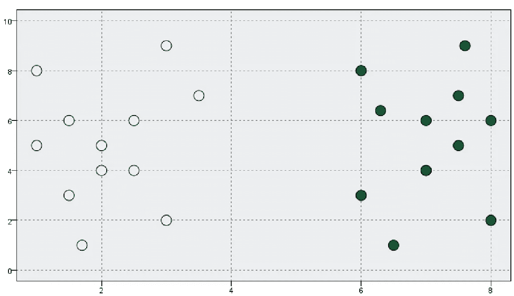
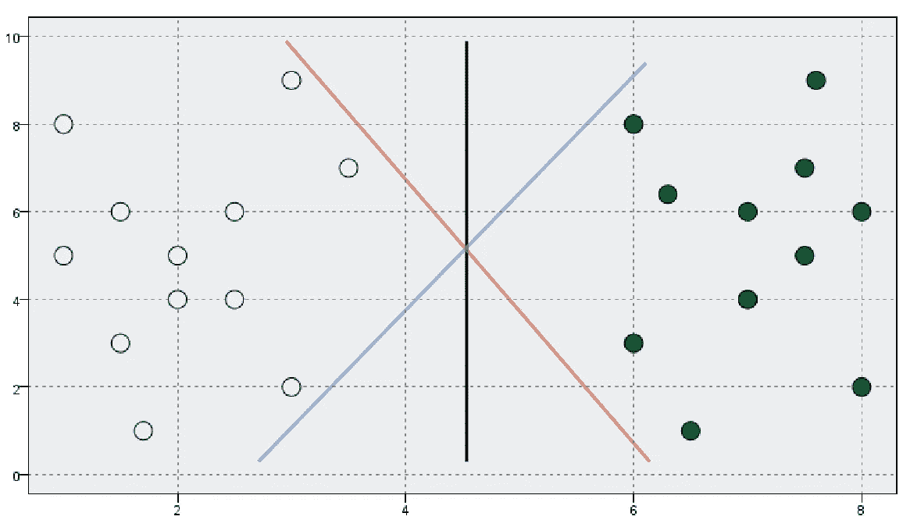
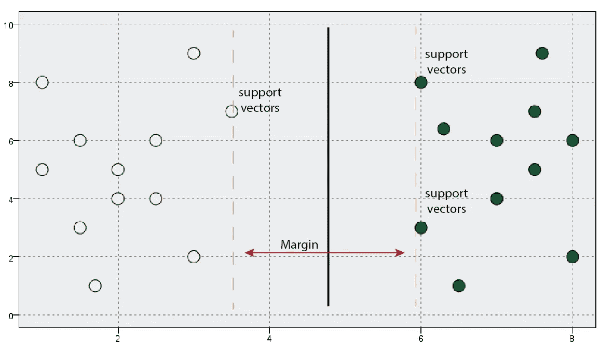
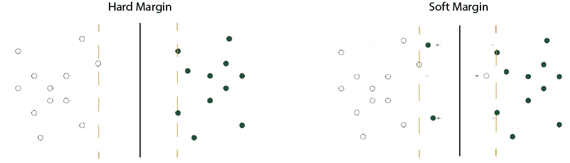
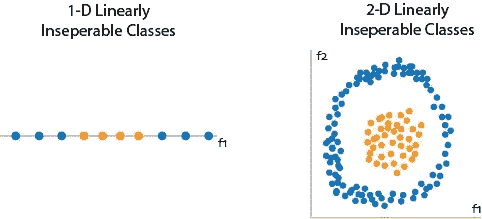
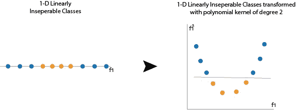
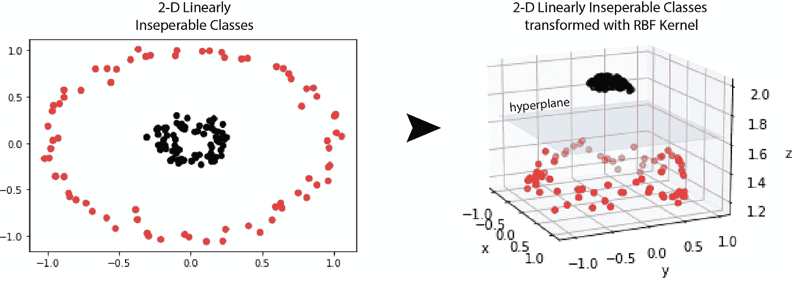

# 支持向量机(SVM)和多维魔法

> 原文：<https://towardsdatascience.com/support-vector-machine-svm-and-the-multi-dimensional-wizardry-b1563ccbc127>

## 数据科学|机器学习|算法

## 了解支持向量机内核函数背后的魔力

**支持向量机(SVM)** 是一种监督学习算法，用于回归、分类和离群点检测，但广泛用于分类。SVM 的目标是在 n 维空间中创建一条线或一个超平面，将数据清楚地分成几类。

# 线性支持向量机

我们用一个例子来理解这个。假设您有如下所示的数据点，您需要将这些数据点分为两类。关键的想法是找到一条线来分隔这两个类。

作者创造的形象

在这种情况下，画一条线把这两个阶层分开并不是很难。然而，你可以画多条线来做这件事。那么，你怎么知道这几行中哪一行是你的问题的最佳答案呢？

作者创造的形象

从上面显示的线来看，黑线最好地分隔了两个类，因为与其他线相比，它离数据点的任一侧相对更远。对于蓝色和红色的线，我们不太确定新的、看不见的数据点的性能。

显然，我们不能总是想象和选择会得出最佳分类的线条。你可以用支持向量机来完成这项任务。SVM 从两个类中查找最接近直线的点。这些点称为支持向量。直线和支持向量之间的距离称为边距。SVM 试图最大化这一距离。边缘最大的超平面是 SVM 的最优超平面。在我们的例子中，上面的最优超平面是黑线。

作者创造的形象

有两种类型的边距:

1.  **硬保证金:**

在硬边界方法中，决策边界确保所有数据点都被正确分类。在训练数据中没有出错的余地。它也可能会减少保证金的大小来实现这一点，挫败了使用 SVM 的整个目的。

作者创造的形象

**2。软边距:**

大多数真实世界的数据不是线性可分的。在软裕度方法中，我们允许在裕度中出现样本的一些错误分类。我们的想法是尽可能保持较大的利润。它试图在找到一条最大限度地增加边界的线和最小化错误分类之间进行权衡。

硬边际方法对异常值敏感，而软边际方法对异常值稳健，并能很好地概括看不见的数据。

# 非线性支持向量机

我们上面看到的样本数据是线性可分的。但是，并不是所有的数据都好到可以线性分离，这使得 SVM 的工作很困难。在这种情况下，我们不能用一条简单的直线来分隔数据。

作者创造的形象

当难以分离非线性类时，我们可以应用一种称为**内核技巧**的技术来帮助重塑数据。Kernel trick 提供了一种高效且廉价的数据转换方式。

作者创造的形象

在上图中，在应用二次多项式核后，在一个维度上不可分的数据一旦转换为两个维度，就会变得可分。

作者创造的形象

类似地，二次多项式核被应用于上述 2D 数据，并且通过使用线性平面它变得可分离。

关于如何工作的更多细节，我建议检查我的 [GitHub](https://github.com/swapnilin/SVM-Demo-and-Kernel-Functions/blob/main/SVM_Demo.ipynb) 库上的代码。

# **内核函数**

核函数是 SVM 模型中的一个超参数。它负责消除计算需求，以实现高维空间和处理线性不可分的数据。两个最广泛使用的内核函数是:

1.  多项式核

使用具有“k”次的多项式函数，通过将非线性数据变换到更高维度来分离非线性数据。

2.径向基函数核

这个核函数也称为高斯核函数。它能够产生无限数量的维度来分离非线性数据。它取决于一个超参数‘γ’(γ)。超参数的值越小，偏差越小，方差越大，反之亦然。

值得注意的是，RBF 内核不会在数据集中创建新的变量或任何转换。计算在内部进行，就好像这些点在更高维度中一样。您不必为 RBF 内核创建 z 变量来施展它的魔法。

为了实现 SVM 并理解内核函数的作用，我建议检查一下我的 [GitHub](https://github.com/swapnilin/SVM-Demo-and-Kernel-Functions/blob/main/SVM_Demo.ipynb) 库上的代码。

感谢您的阅读。如果您有更多问题，请通过 LinkedIn 联系。

 [## Swapnil Kangralkar

### Swapnil Kangralkar。我是加拿大渥太华的一名数据科学家。

swapnilin.github.io](https://swapnilin.github.io/)