# 支持向量机:重要的推导

> 原文：<https://towardsdatascience.com/support-vector-machines-svms-important-derivations-4f50d1e3d4d2>

## 机器学习理论

## SVM 理论的全面阐释和形象化

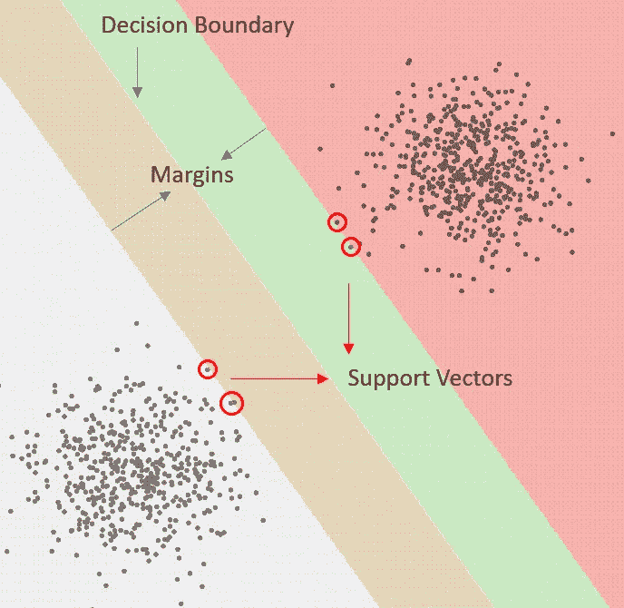

作者图片

这里是每个数据科学家在应用特定的机器学习模型之前应该知道的一些推导。在这篇文章中，我将介绍所有你需要了解的关于支持向量机的知识。

# 介绍

由于内核方法的易用性、可解释性以及在各种应用中的强大性能，它们在机器学习世界中非常流行。支持向量机(SVMs)在处理高维数据时尤其强大，因为它们使用了核，并且它们能够很好地防止过拟合，因为它们通过选择最大可能的余量来调整自己。在本文中，我将向您展示支持向量机背后的理论，以及您需要理解的重要推导，以便有效地应用它们。

# 支持向量机和机器学习

机器学习分类器可以分为许多类别。两种流行的分类器是:

*   后验概率的估计量
*   决策边界的直接估计量

估计后验概率的模型例如是朴素贝叶斯分类器、逻辑回归或者甚至是神经网络。这些模型试图重建一个后验概率函数。然后可以评估后验概率的近似函数，以确定样本属于每个类别的概率，然后做出决定。

决策边界的直接估计器，例如感知器和支持向量机(SVMs ),并不试图学习概率函数，相反，它们学习“线”或高维超平面，这可用于确定每个样本的类别。如果一个样本在超平面的一边，它属于一个类，否则，它属于另一边。

这两种方法是根本不同的，它们会影响分类器的结果。

# 核心方法

支持向量机是一种核心方法。核方法使用核将输入数据空间映射到更高维度的空间，在该空间中数据被假设为线性可分的。在这个新的空间中，线性分类器被训练，数据被标记。

## 但是内核是什么呢？

同样，矩阵是向量空间的线性映射，核是函数的线性映射。它们允许我们将输入数据映射到一个不同的空间，在这个空间中对数据进行分类可能会更容易。

对于支持向量机，核是半正定的是很重要的。这与内核技巧有关，你可能以前听说过。如果我们选择一个半正定核，那么将存在一个函数使得核等于扩展特征空间的内积。

这意味着我们可以评估扩展特征空间的内积，而无需直接计算它，从而节省大量时间，并允许我们在数据分类中使用非常高维的空间。

# 支持向量机如何学习？

在这一部分，我将讨论支持向量机通常是如何学习的。稍后，我将通过数学来了解他们为什么以这种方式学习。

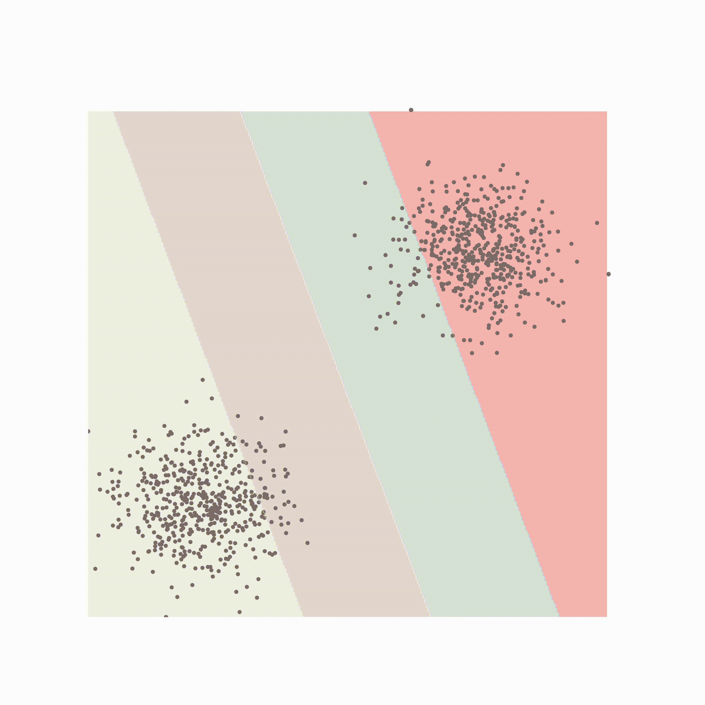

SVM 的 Gif 在二元分类中寻找最优决策边界(GIF 由作者提供)

支持向量机就是定义一个决策边界。决策边界是一个超平面(或者是一条线，如果是二维的话),其中这条线根据数据在哪一边来决定数据属于哪一类。

为了找到最佳线，支持向量机优化以下标准:

我们希望找到一个决策边界，该边界最大化从最近点到每个类的边界的距离。

我来解释一下；首先取一个初始边界，从两个类中找出离它最近的点。离决策边界最近的点称为支持向量，它们是唯一影响决策边界的点。一旦我们有了支持向量，我们就能找到离这些支持向量最远的线。

作者图片

上面是支持向量、边界和决策边界的图示。边距是决策边界和最远的支持向量之间的空间。当数据不是线性可分时，它们特别有用。

# 数学上表达上述内容

可悲的是，我们不能只要求计算机找到符合上述标准的线。为了实现支持向量机，我们需要用数学方法表达优化问题，然后求解它。我会一步一步来。

## 点到直线的距离

你们可能从小学就记得，给定一条线的方程，代入线以上任意一点的坐标都等于一个大于零的值，线以下任意一点都等于一个小于零的值。

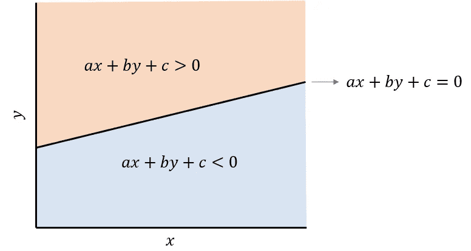

根据直线方程的空间符号(图片由作者提供)

我们可以用向量的形式表示直线的相同方程，并且作为我们的核ϕ.的函数

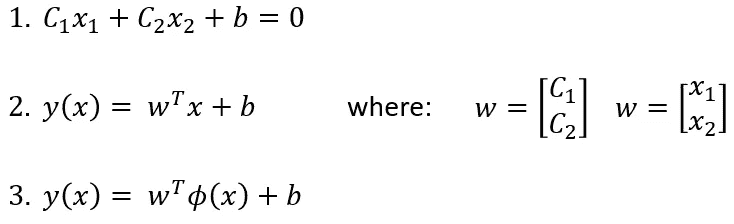

在上面的方程中，第一个是和上面图像中的直线相同的方程，第二个是矢量形式的相同方程。第三，可以使用核ϕ(x).将输入数据空间(x)映射到特征空间

第三个等式将我们的决策边界 y(x)表示为权重和偏差(w，b)以及数据ϕ(x).的特征空间的函数

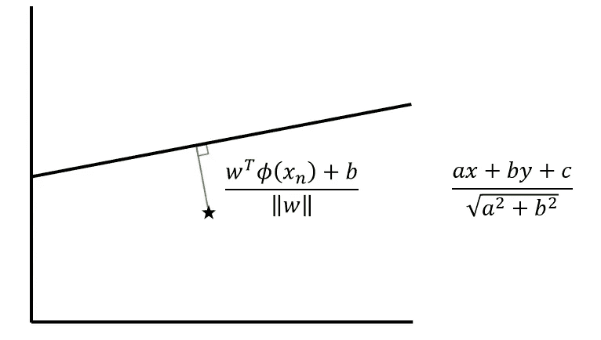

点到一条线的距离(图片由作者提供)

点和线之间的距离可以通过上图中的表达式来计算。我已经包括了向量形式的版本和你们在学校会遇到的版本。

由于该点在线的下方，距离将为负，如果该点在线的上方，距离将为正。

## 问题设置

让我们回到支持向量机的分类问题。

因此，我们将决策边界 y(x)定义为权重和偏差(w，b)、核函数(ϕ)和数据(x)的函数。

在任何监督分类问题中，我们被给定数据(x)和数据的标签(t)。对于二元问题，标签要么是 1，要么是-1。

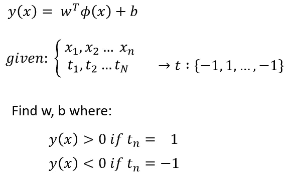

目标是找到权重和偏差(w，b ),其中一个类的 y(x) > 0，另一个类的 y(x) < 0。还记得我之前展示的图片吗，这意味着每个类都在决策边界的两边。

## 目标函数

这最终将我们引向目标函数。这个函数在求解时会产生我们决策边界的权重和偏差(w，b)。

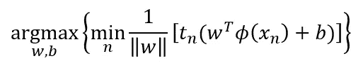

首先看看最小化的内部。我们正在寻找使数据点(x n)和决策边界 y(Xn)之间的距离最小化的索引 n。

唯一的区别是我们乘以了类成员 tn。当距离为正时，类成员为 1，当距离为负时，类成员为-1。乘以类别巧妙地将距离的符号在分类正确时转换为正，在分类错误时转换为负。

最大化找到其决策边界最大化决策边界和最近点之间的距离的权重和偏差(w，b)。

## 解决优化问题

为了找到权重和偏差(w，b ),我们需要解决我上面展示的优化问题。

直接解决上面的问题会非常困难。相反，我们可以应用一些约束，并创建一个更容易解决的等价优化问题。

添加的约束只是将距离决策边界最近的点的线的评估值缩放为等于 1。因此，对于数据中的任何其他点，它将大于或等于 1:

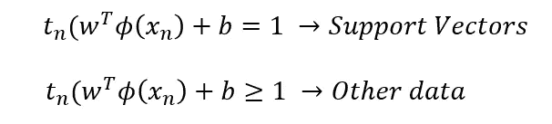

将约束插回到我们的目标函数中，优化问题简化为:

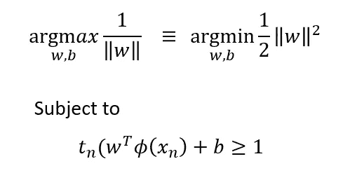

n 上的最小化消失了，因为 w 不依赖于 n。

这个新的最优化问题是可解的。这是一个带有线性不等式约束的二次优化问题，可以用拉格朗日乘子法求解。

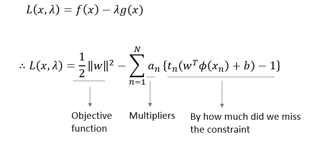

在拉格朗日乘子法中，我们希望最大化上面的拉格朗日。右手边的第一项是目标函数，我们试图最大化它。第二项是拉格朗日乘数，第三项是由不等式约束导出的误差项。最大化拉格朗日量相当于求解最优化问题。

为了最大化，我们将表达式对 b 和 w 的导数等于 0，然后将结果插回。

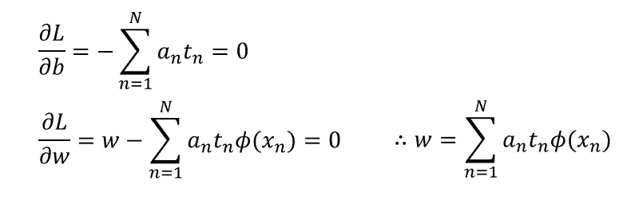

把 w 插回去，我们得到:

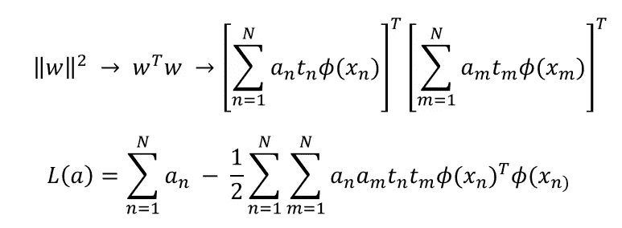

这个拉格朗日是可以求解的。需要一些进一步的约束(拉格朗日乘数应该是非负的，并且每个类别的支持向量应该是相同的)。

求解时，你总会发现所有拉格朗日乘子(a)不是 0 就是 1。实际上，除了极少数例外，几乎所有的拉格朗日乘数都是 0 是可能的。拉格朗日乘数为 0 的点对决策边界没有影响。唯一对决策边界有影响的点是拉格朗日乘数为 1 的点(边缘内的点)支持向量。

# 软利润 SVM

到目前为止，我们假设数据在特征空间中是线性可分的。然而，很多时候这并不是一个好的假设。为了应对这种情况，可以实施软利润 SVM。

软边界支持向量机允许一些数据存在于边界内，同时应用一个小的惩罚。软边距 SVM 的推导过程类似，并引入了松弛变量作为边距内点数的惩罚。发送结果也非常相似，有相同的拉格朗日函数，但有不同的约束。

这里有一个软保证金 SVM 结束:

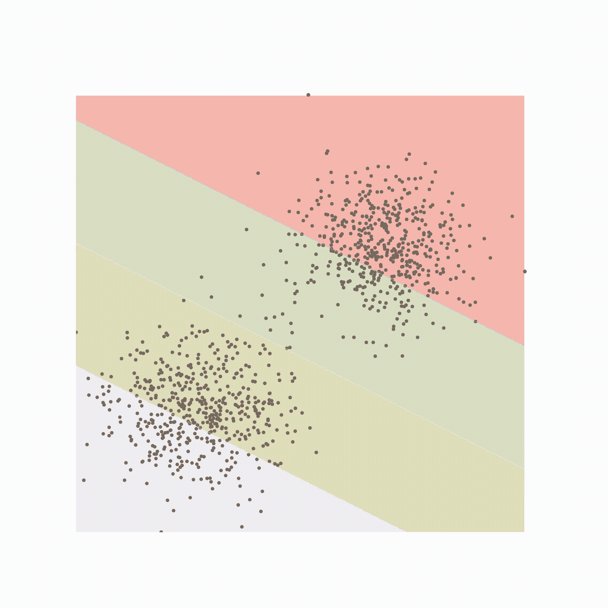

软边距 SVM (GIF 由作者提供)

# 结论

在本文中，我将介绍支持向量机为什么如此强大，以及它们是如何学习的。支持向量机是一种强核方法，可用于处理高维问题。由于它们的余量，它们也有利于防止过度拟合。与其他核方法类似，支持向量机通过使用数据可线性分离的核将数据转换到更高维的空间。最后，通过所示的推导，我们了解到支持向量机直接估计它们的决策边界，并且仅基于数据中很少的点，其余的数据对决策边界没有任何贡献。理解这一点对于了解支持向量机是否是应用您的特定问题的最佳模型是非常重要的。

## 支持我

希望这对你有所帮助，如果你喜欢，你可以 [**关注我！**](https://medium.com/@diegounzuetaruedas)

你也可以成为 [**中级会员**](https://diegounzuetaruedas.medium.com/membership) 使用我的推荐链接，获得我所有的文章和更多:[https://diegounzuetaruedas.medium.com/membership](https://diegounzuetaruedas.medium.com/membership)

## 你可能喜欢的其他文章

</kernel-methods-a-simple-introduction-4a26dcbe4ebd>  </unsupervised-learning-k-means-clustering-6fd72393573c> 