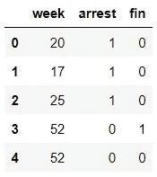
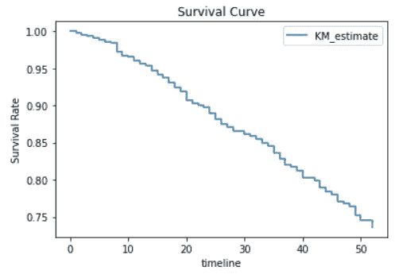
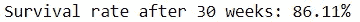
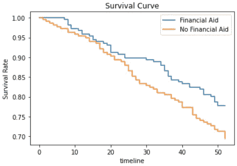
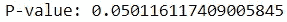

# 生存分析:简介

> 原文：<https://towardsdatascience.com/survival-analysis-a-brief-introduction-bdba3a275b5f>

## 最适合检查事件时间数据的方法初探


安德里亚斯·瓦格纳在 [Unsplash](https://unsplash.com?utm_source=medium&utm_medium=referral) 上拍摄的照片

生存分析是一种从时间到事件数据中获得洞察力的可靠方法。

不幸的是，尽管花了大量的时间学习生存分析，我在追求自己的项目时忽略了这项技术，即使它的使用是合适的。

这很可能是因为我用来学习这种技术的许多资源都直接解释了这种方法，而没有花足够的时间强调事件时间数据的本质。

我希望通过提供生存分析的概述来避免其他人犯同样的错误，同时重点关注使这种技术不可或缺的事件发生时间数据的特征。

## 生存分析

生存分析是统计方法的一个分支，主要分析时间-事件变量。这个名字源于它最初用于检查疾病和疾病的死亡率。

也就是说，这种分析的可用性远远超出了医疗保健，也存在于制造业和金融业等领域。如今，企业利用这种技术来评估各种事件，如机器故障、客户流失和贷款偿还。

在这种情况下,“幸存”一词描述了研究中没有经历所述事件的受试者。例如，在一项机器故障研究中,“幸存”下来的机器是仍在运行的机器。

使用这种技巧，您可以回答类似以下的问题:

*   受试者在 X 年后存活的概率是多少？
*   不同组的受试者表现出不同的存活率吗？
*   哪些特征影响受试者的生存能力？

你可能会看着问题列表想:这个分析没什么特别的。人们可以用传统的统计方法回答同样的问题，对吗？

嗯，不一定。

## 为什么要用生存分析？

生存分析的好处在于事件时间变量的性质。

由于获取事件时间数据的方式，产生的数据集通常包含审查。

**审查**是当一项研究未能准确捕捉受试者的存活时间时出现的一种现象。

总共有三种删截类型:右删截、左删截和区间删截。

当受试者的真实存活时间大于记录的存活时间时，出现右删截。当真实存活时间比记录的存活时间少时，出现左删截。当真实存活时间在一定范围内时，出现区间删失。

审查是数据收集程序固有缺陷的产物。根据具体情况，审查可能很难(如果不是不可能的话)防止，这就是它在事件时间数据中如此普遍的原因。

## 审查的风险

出于几个原因，数据集中的审查值得关注。

1.  **删截数据扭曲结果**

由于删失数据不能准确捕捉受试者的存活时间，因此包含这些数据会产生误导性的数值。

例如，假设您正在进行一项研究，在这项研究中，您检查机器故障。在研究中，您观察了 5 台机器，并记录了它们出现故障所需的时间。然而，由于实验设计的限制，即使一些机器仍在运行，你也不得不停止观察。最后，您从 5 台机器获得以下持续时间:

```
Machine 1: 5 hours (Failed)
Machine 2: 10 hours (Operational)
Machine 3: 12 hours (Failed)
Machine 4: 6 hours (Operational)
Machine 5: 15 hours (Operational)
```

由于 5 台机器中有 3 台没有出现故障且仍在运行，记录的持续时间少于这些机器的实际持续时间。这是权利审查的一个例子。

如果您使用基本聚合来计算一台机器的平均持续时间，您将得到一个平均持续时间，它是对实际平均持续时间的低估。

同样，如果您利用机器学习并建立一个回归模型来预测机器将运行多长时间，该模型将使用不准确的持续时间进行训练，从而生成不可靠的预测。

由于这些原因，对经过审查的数据执行传统的数据科学技术可能是不可行的。

**2。删截数据难以检测**

不幸的是，与很容易发现的缺失数据不同，经过审查的数据是模糊的，很容易逃避检测。

毕竟，原始数据通常不提供直接标记审查或非审查数据的特征。这条信息通常必须从现有数据中获取。

仅识别数据集中的删改记录就是重要的一步。即使对这样的数据进行基本的汇总，考虑到审查的存在也能得出更合理的结论。

我犯了一个错误，检查了包含时间到事件变量的时间序列数据，却没有意识到一些受试者甚至没有经历过所讨论的事件。

**3。被删数据无法补救**

即使用户认识到他们的数据中有被审查的记录，他们也可以用错误的方法来解决这些问题，从而破坏他们的努力。

将经过审查的数据视为缺失数据并简单地将其从数据集中删除可能很有诱惑力。

不幸的是，虽然纳入未说明的审查数据对研究有害，但删除审查数据也不可行。由于受试者通常不会被随机审查(例如，没有出现故障的机器可能有更长的存活时间)，将他们排除在分析之外无疑会导致有偏见的结果。

## 简单来说，生存分析做了什么

生存分析的吸引力在于它处理审查的能力。

虽然它不直接填充缺失的持续时间或省略不相关的持续时间，但它能够解释删失数据。

生存分析通过用称为生存函数的概率函数对事件时间数据建模来实现这一点。

在数学术语中，生存函数可以由以下公式表示:


生存功能(由作者创建)

由 S(t)表示的生存函数表示对象存活过去时间 t 的概率

通过用模型表示事件发生时间数据，用户可以对受试者的存活率进行预测，或者确定影响存活率的因素。

进行生存分析需要两条关键信息:

1.  如果每个受试者都发生了该事件(审查或未审查)
2.  每个受试者的存活时间

## 个案研究

案例研究最适合于展示生存分析是如何处理删失数据的。

这个演示将利用[生命线](https://lifelines.readthedocs.io/en/latest/)包，这是 Python 中进行生存分析的主要模块。

它提供了一个内置的数据集，记录了受试者被捕所需的周数。



代码输出(由作者创建)

对于每一行，我们可以看到受试者被观察了多少周，受试者是否被逮捕，受试者是否接受了经济援助。

在这里，“逮捕”功能将记录标记为审查或未审查。经历过该事件(即被捕)的受试者被赋予值 1，而没有经历该事件的受试者被赋予值 0。

我们可以使用 Kaplan-Meier 估计量来估计生存函数，Kaplan-Meier 估计量是生存分析中的一个流行工具。

为了方便起见，我们可以通过构建一条*生存曲线*来可视化该数据的生存函数。



代码输出(由作者创建)

利用生存函数，我们可以很容易地确定受试者在任何给定时间点的估计存活率。

例如，我们可以得出 30 周后受试者的存活率。



代码输出(由作者创建)

根据调查结果，86.11%的受试者在 30 周后不会被捕。

此外，我们可以确定向受试者提供经济援助是否会影响他们的生存机会。

我们首先可以通过绘制每组的存活曲线来观察两组存活率的差异。



代码输出(由作者创建)

单从视觉效果来看，似乎有经济资助的人比没有经济资助的人更有可能不被逮捕。然而，尚不清楚这种差异是否具有统计学意义。

这个观察结果可以用假设检验来验证。我们可以使用*对数秩检验*，这是一种比较两组的生存分布的假设检验。

让我们进行测试，看看结果。



代码输出(由作者创建)

鉴于 p 值高于 0.05，我们没有足够的证据证明经济资助影响受试者的生存能力。

## 结论


照片由 [Unsplash](https://unsplash.com?utm_source=medium&utm_medium=referral) 上的 [Prateek Katyal](https://unsplash.com/@prateekkatyal?utm_source=medium&utm_medium=referral) 拍摄

希望除了简单解释生存分析背后的“如何”之外，我还解释了“为什么”。

我知道许多人渴望直接进入生存分析的细节(就像我一样)，但我相信理解事件发生时间数据的本质也同样重要，这些数据通常包含审查记录。

生存分析能够处理审查，这是它如此实用的原因。然而，未能识别数据中的审查记录可能会导致您坚持使用其他统计方法来获得洞察力。

只有当您识别出事件发生时间数据的潜在缺点时，您才能认识到生存分析的必要性，并利用其各种建模方法。

我祝你在数据科学的努力中好运！