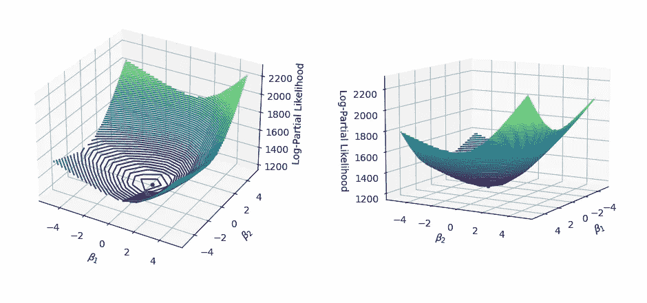
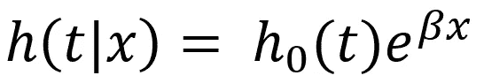
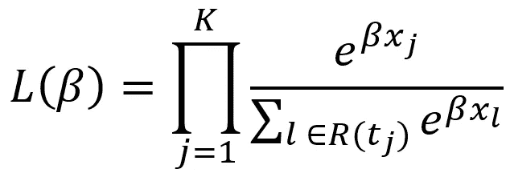
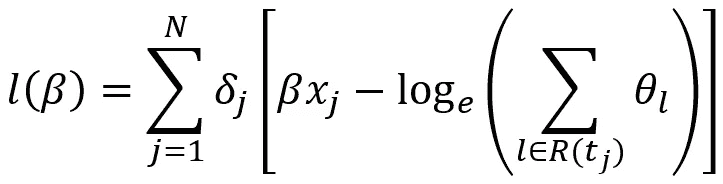
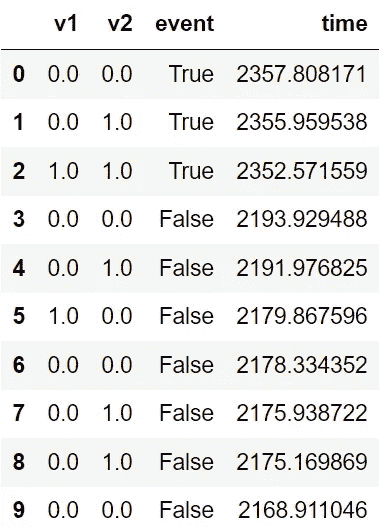
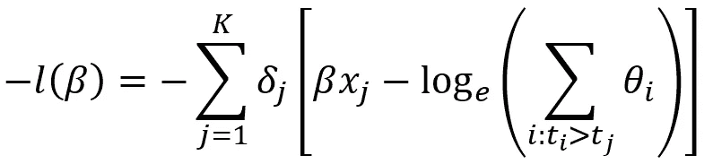
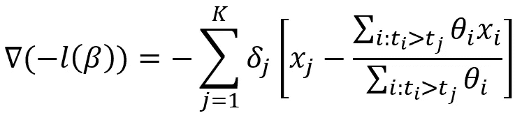
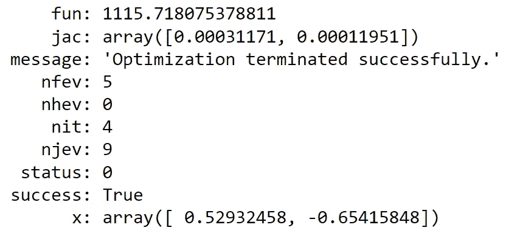
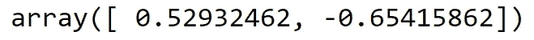
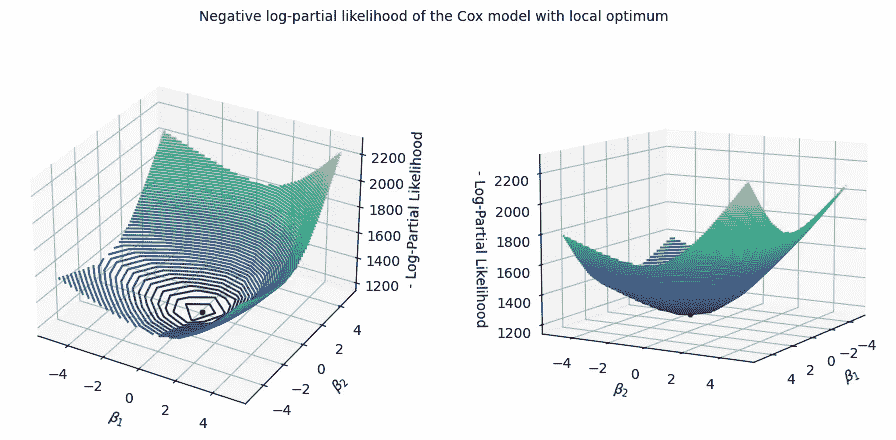

# 生存分析:优化 Cox 模型的部分可能性

> 原文：<https://towardsdatascience.com/survival-analysis-optimize-the-partial-likelihood-of-the-cox-model-b56b8f112401>

## 在 Python 中寻找最大化对数部分似然的系数



局部最优 Cox 模型的负对数部分似然。图片作者。

# 目录

1.  [简介](#1304)
2.  [考克斯比例风险模型](#53f9)
3.  [优化问题](#5627)
4.  [实施](#d192)
5.  [结论](#0e6a)
6.  [参考文献](#99e3)

# 1.介绍

生存分析包括描述事件时间数据的统计方法的集合。

在这篇文章中，我们介绍一个流行的生存分析算法，Cox 比例风险模型。然后，我们定义了它的对数部分似然和梯度，并通过一个实际的 Python 例子对它进行优化以找到最佳的模型参数集。

# 2.考克斯比例风险模型

我们将*存活率*定义为一段时间后未经历不良事件(如死亡)的患者百分比。

Cox 比例风险模型可以评估变量和生存率之间的关系。给定一组协变量`x`，它将风险函数定义为:



图片作者。

从公式中，我们观察到风险函数`h(t|x)`与基线风险函数`h₀(t)`和相对风险`exp(βx)`成比例。

潜在的风险函数`h₀(t)`不依赖于协变量。由于`h₀(.)`的形式未指定，该模型为半参数模型。

让我们通过一个只有一个协变量的简化场景来解释模型系数的含义。让我们考虑一个危险因素`xᵢ`，例如吸烟，作为二元变量(0:不吸烟者*对* 1:吸烟者)。Cox 模型可表示为`h(t|xᵢ)= h₀(t)exp(βxᵢ)`，其中`exp(β)`表示吸烟与不吸烟相比，不良事件的**相对风险:**

*   吸烟带来的风险:
    `(xᵢ=1): h₀(t)exp(β⋅xᵢ) = h₀(t)exp(β⋅1) = h₀(t)exp(β)`
*   不吸烟带来的风险:
    `(xᵢ=0): h₀(t)exp(β⋅xᵢ) = h₀(t)exp(β⋅0) = h₀(t)`
*   相对风险=吸烟带来的风险/不吸烟带来的风险:
    `h₀(t)exp(β) / h₀(t) = exp(β)`

相对风险`exp(β)`——也称为**风险比**——是恒定的，不依赖于时间。

# 3.优化问题

在数据科学中，将模型“拟合”到数据集的任务表示搜索优化某个目标函数的模型参数集。一些常见的例子是损失函数的最小化或对数似然的最大化。

在我们的例子中，我们需要在不知道`h₀(.)`的情况下估计`β`。为此，Cox 提出了最大化部分可能性:



图片作者。

在上一个等式中:

*   `K`是按时间顺序排列的事件(死亡)时间的集合:`t₁ < t₂ < ... <tₖ`。
*   `R(tⱼ)`识别在时间`tⱼ`处于危险中的一组受试者。

直觉上，部分可能性是在一组观察到的事件时间内看到不良事件的条件概率的产物，给定在这些时间处于危险中的一组患者，并假设成比例的危险。

我们可以观察到:

*   `L(β)`独立于`ho(t)`，可以不指定。
*   `L(β)`不考虑实际的事件次数，而只考虑它们的**顺序**。

我们可以将**对数部分似然**推导为:



图片作者。

在上一个等式中:

*   `N`是被试人数。
*   `θ = exp(βx)`。
*   `δⱼ`表示事件(1:死亡，0:其他)。

为了拟合 Cox 模型，需要找到使负对数部分似然最小化的`β`系数。

我们记得，在大多数情况下，负偏似然是一个严格凸函数。因此，它有一个唯一的全局极小值。

# 4.履行

让我们导入所需的库:

```
import numpy as np
import matplotlib.pyplot as plt
from scipy.optimize import minimize
from sksurv.datasets import load_whas500
```

我们加载了在`scikit-survival` ⁵包中可用的*伍斯特心脏病发作研究数据集* ⁴。特别是:

*   我们重点关注两个协变量:
    - `afb`:房颤(0:否，1:是)
    - `mitype` : MI 型(0:非 Q 波，1: Q 波)
*   我们调整数据以说明**关系**，即同时出现不良事件的患者。由于连续风险的假设，考克斯模型不承认联系。为了简单起见，我们在每个事件日期中添加少量随机噪声来消除它们。
*   我们按日期对数据集进行排序，因为部分可能性要求**排序的**事件时间。

```
# load the whas500 dataset
X, target = load_whas500()

# let us consider two covariates
cols = ["afb", "mitype"]

df = X[cols].\
        rename(columns={cols[0]: "v1", 
                        cols[1]: "v2"}).\
        astype(float)

# extract events and respective times
df["event"], df["time"] = [list(i) for i in zip(*target)]

# add random noise to the event time to avoid ties
df.time = df.time.apply(lambda x : x + np.random.normal(2, 1))

# sort observations by descending event time
df = df.sort_values("time", ascending=False).reset_index(drop=True)

# inspect first rows
df.head(10)
```



开始数据集。 **v1，v2** :协变量；**事件**:真/假(死亡/无事件)；**时间**:事件发生的时间。图片作者。

```
v = df[["v1", "v2"]].to_numpy()
time, event = df.time.to_numpy(), df.event.to_numpy().astype(int)
```

现在，我们需要定义优化任务的目标函数，即**负**对数部分似然，我们将最小化它:



负对数-部分可能性。图片作者。

***注*** :在标准机器学习问题中，`X`一般描述输入特征。相反，在我们的例子中，未知变量是`β`，我们试图找到它的最佳值。

```
def get_theta(x):
    '''
    Return theta as per negative log-partial likelihood
    of the Cox model and its gradient.
    It assumes input features v to be ordered by event time.

    Args:
        - x: beta coefficients 

    Output:
        - theta_l: cumulative theta <numpy.ndarray>
        - theta_l_v: cumulative theta by features <numpy.ndarray>
    '''
    theta = np.exp(np.dot(v, x))
    theta_l = np.cumsum(theta)
    theta_l_v = np.cumsum(v * theta.reshape(-1,1), axis=0)
    return theta_l, theta_l_v

def objective_function(x):
    '''
    Return the negative log-partial likelihood 
    of the Cox model

    Args:
        - x: beta coefficients <numpy.ndarray>
    Output:
        - Negative log-partial likelihood of the Cox model
    '''
    theta_l, _ = get_theta(x)
    return -np.sum(event * (np.dot(v, x) - np.log(theta_l)))
```

我们导出目标函数的**梯度**，即其相对于`β`的导数，如下所示:



负对数部分似然的梯度。图片作者。

```
def gradient(x):
    '''
    Return the gradient of the negative log-partial
    likelihood of the Cox model

    Args:
        - x: beta coefficients <numpy.ndarray>
    Output:
        - Gradient of the objective function
    '''
    theta_l, theta_l_v = get_theta(x)
    return -np.sum(event.reshape(-1,1) * (v-(theta_l_v/theta_l.reshape(-1,1))), axis=0)
```

我们现在可以初始化`β`并执行最小化任务。我们使用*牛顿-CG* ⁶算法和`scipy`软件包:

```
# starting values for beta
beta = np.array([1, 1])

opt_result = minimize(
    objective_function,
    beta, 
    method = "Newton-CG",
    jac = gradient
)

opt_result
```



优化任务的输出。作者的`β coefficients are stored in x.`图片。

结果是:

*   `β₁` = 0.5293
*   `β₂` = -0.6541

我们可以使用库将 Cox 模型拟合到相同的输入数据上，并验证我们将为`β`获得相同的一组值:

```
from sksurv.linear_model import CoxPHSurvivalAnalysis

model = CoxPHSurvivalAnalysis()
model_fit = model.fit(
    df[["v1", "v2"]], 
    np.array(list(zip(df.event, df.time)), dtype=np.dtype("bool, float")))

model_fit.coef_
```



图片作者。

事实上，`β`系数几乎相同，小数点后第七位略有差异。

让我们画出估计的最优值和目标函数:

```
def objective_function_in_x(x0, x1):
    '''
    Return the negative log-partial likelihood 
    of the Cox model evaluated in the given beta

    Args:
        - x0: input beta_0 <numpy.ndarray>
        - x1: input beta_1 <numpy.ndarray>
    Output:
        - objective function in beta_0, beta_1 <numpy.ndarray>
    '''
    v0, v1, l = v[:,0], v[:,1], v.shape[0]
    theta = np.exp(x0*v0 + x1*v1)
    return -np.sum(event * ((x0*v0 + x1*v1) - np.log(np.cumsum(theta).reshape(-1, l))))

def get_plot_data(inf=-5, sup=5, size=10):
    '''
    Return a three-dim square box with the evaluation
    of the negative log-partial likelihood of the Cox model

    Args:
      - inf: min value of the box, default: -5 <int>
      - sup: min value of the box, default: 5 <int>
      - size: size of the output coordinates arrays, default: 10 <int>
    Output:
      - x0: input beta_0 <numpy.ndarray>
      - x1: input beta_1 <numpy.ndarray>
      - z: objective function in beta_0, beta_1 <numpy.ndarray>
    '''
    x0, x1 = np.linspace(inf, sup, size), np.linspace(inf, sup, size)
    x0, x1 = np.meshgrid(x0, x1)
    z = np.zeros((size, size))
    for i in range(0, x0.shape[0]):
        for j in range(0, x0.shape[1]):
            z[i][j] = objective_function_in_x(x0[i][j], x1[i][j])
    return x0, x1, z

def get_min_obj_function(model):
    '''
    Return coordinates of local optimum found with optimization

    Args:
      - model: instance of <scipy.optimize._optimize.OptimizeResult>
    Output:
      - x0: optimum for beta_0 <numpy.ndarray>
      - x1: optimum for beta_1 <numpy.ndarray>
      - z: objective function in the optimum <numpy.ndarray>
    '''
    x0, x1 = np.array(model.x[0]), np.array(model.x[1])
    z = objective_function_in_x(x0, x1)
    return x0, x1, z

# generate data
x0, x1, z = get_plot_data(-5, 5, 10)
x0_min, x1_min, z_min = get_min_obj_function(opt_result)

# plot the objective function and the local optimum
fig = plt.figure(figsize=plt.figaspect(0.4))

# left subplot
ax = fig.add_subplot(1, 2, 1, projection="3d")
ax.contour3D(x0, x1, z, 100, cmap="viridis")
ax.scatter(x0_min, x1_min, z_min, marker="o", color="red", linewidth=50000)
ax.set_xlabel("$β_1$")
ax.set_ylabel("$β_2$")
ax.set_zlabel("- Log-Partial Likelihood")

# right subplot
ax = fig.add_subplot(1, 2, 2, projection="3d")
ax.contour3D(x0, x1, z, 100, cmap="viridis")
ax.scatter(x0_min, x1_min, z_min, marker="o", color="red", linewidth=50000)
ax.set_xlabel("$β_1$")
ax.set_ylabel("$β_2$")
ax.set_zlabel("- Log-Partial Likelihood")
ax.view_init(10, 30)
fig.suptitle("Negative log-partial likelihood of the Cox model with local optimum", fontsize=10);
```



图片作者。

*注*:先前定义的函数的优化问题可以用任意数量的输入变量`v`来解决。然而，三维图只需要考虑两个。事实上，一个三维绘图只能为每个轴显示一个`β`系数。

从图中可以看出，负对数部分似然是一个凸损失函数。

# 5.结论

在生存分析的背景下，我们引入了 Cox 比例风险模型，并对输入数据进行拟合。特别是，我们用 Python 写了负对数部分似然及其梯度。然后，我们将其最小化，以找到最佳的模型参数集。

# 6.参考

[1] D. R. Cox，*回归模型和生命表*，皇家统计学会杂志。B 系列(方法学)，第 34 卷，第 2 期。，第 187-220 页，1972 年。

[2][https://en.wikipedia.org/wiki/Likelihood_function](https://en.wikipedia.org/wiki/Likelihood_function)

[3] C. M. Winson 等，*Cox 部分似然的 Fenchel 对偶及其在生存核学习中的应用*，医学中的人工智能，
vol. 116，102077，2021。

[4]s . pl sterl， *scikit-survival:一个建立在 scikit-learn* 之上的时间-事件分析库，机器学习研究杂志，第 21 卷，第 212 期，第 1–6 页，2020 ( [包网站](https://scikit-survival.readthedocs.io/en/stable/index.html))。

[5][https://sci kit-survival . readthedocs . io/en/stable/API/generated/sk surv . datasets . load _ whas 500 . html](https://scikit-survival.readthedocs.io/en/stable/api/generated/sksurv.datasets.load_whas500.html)

[6][https://docs . scipy . org/doc/scipy/reference/optimize . minimize-newtoncg . html # optimize-minimize-newtoncg](https://docs.scipy.org/doc/scipy/reference/optimize.minimize-newtoncg.html#optimize-minimize-newtoncg)

*注意*:数据集`whas500`是`scikit-survival`包中的[免费提供](https://github.com/sebp/scikit-survival/tree/master/sksurv/datasets/data)使用。`scikit-survival`软件包是在 [GPL v3](https://github.com/sebp/scikit-survival/blob/master/COPYING) 下授权的。