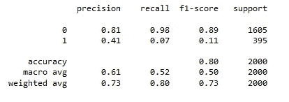
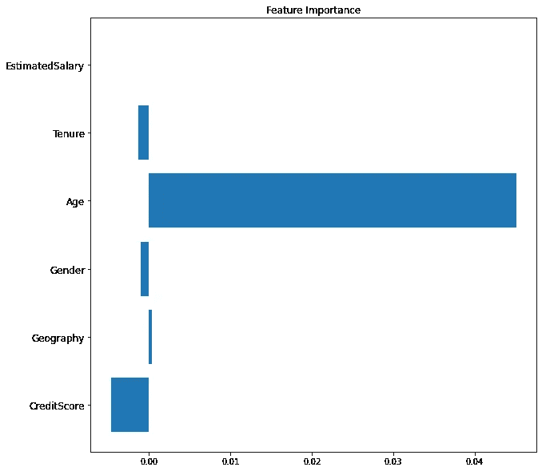
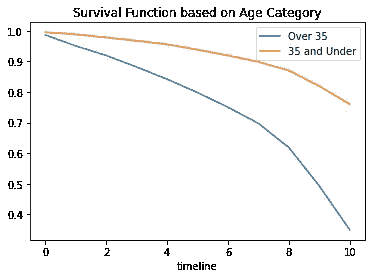

# 生存分析与逻辑回归

> 原文：<https://towardsdatascience.com/survival-analysis-vs-logistic-regression-7af964879687>

## 哪种方法适合您的客户流失分析？


[粘土银行](https://unsplash.com/@claybanks?utm_source=unsplash&utm_medium=referral&utm_content=creditCopyText)在 [Unsplash](https://unsplash.com/s/photos/customers?utm_source=unsplash&utm_medium=referral&utm_content=creditCopyText) 拍摄的照片

营销人员和企业通常关心客户流失，因为这是客户停止购买、取消订阅或以其他方式结束他们与企业关系的点。另一方面，保留指的是让客户保持活跃，无论是每月支付订阅费，参与内容，还是定期更新他们的信息。

在[的一篇文章中，Eryk Lewinson](https://medium.com/u/44bc27317e6b?source=post_page-----7af964879687--------------------------------) 介绍了生存分析作为分析客户流失/保留的方法。然而，当预测客户流失时，分析师和数据科学家通常会使用分类模型，如逻辑回归。

在本帖中，我们将回顾这两种方法之间的区别，以及什么时候一种可能比另一种更合适。首先，让我们定义感兴趣的术语:

**生存分析:**根据 [Science Direct](https://www.sciencedirect.com/science/article/pii/S1756231716300639) 中的一篇文章，生存分析侧重于分析时间到事件的数据，这意味着目标是描述起点(原点)和终点之间的时间长度。

**逻辑回归:** Science Direct 也发表了一篇关于[逻辑回归](https://www.sciencedirect.com/topics/medicine-and-dentistry/logistic-regression-analysis)的文章，解释了这种统计方法找到一个方程来预测一个二元变量的结果。

现在，当考虑客户流失时，这两个概念都适用。例如，如果你担心*客户何时*翻盘，生存分析最有意义。然而，如果你更担心确定客户是否会流失，那么逻辑回归可能是更好的选择。

为了更清楚，生存分析将回答如下问题:

顾客多久会停止购买我们的产品？

而逻辑回归将回答一个更像这样的问题:

顾客会停止购买我们的产品吗？

第一个问题有一个时间框架。第二个问题的答案要么是，要么不是。这两种分析都很有用，但它们会告诉你非常不同的东西，因此，在进入其中一个选项之前，了解您的项目和业务需求非常重要。

为了证明这一点，我们将解决一个假设的业务问题，这个问题来自于[尼尔·a·阿克伊尔迪姆](https://medium.com/u/42d9a1a70c73?source=post_page-----7af964879687--------------------------------)之前的一篇关于[客户流失分析](/customer-churn-analysis-4f77cc70b3bd)的文章。

**问题:**客户停止订阅某项服务，信用卡公司有数据来审查客户属性，如性别、年龄、任期、余额、他们订阅的产品数量、他们的估计工资。

# 不同的方法

我们要经历的第一种方法是逻辑回归。

在完成前一篇文章中描述的数据预处理后，我们构建我们的逻辑回归分类器。模型中包括的特征有:“信用分数”、“地理”、“性别”、“年龄”、“保有权”、“估计收入”

```
# split train and test data
from sklearn.model_selection import train_test_split
X_trainset, X_testset, y_trainset, y_testset = train_test_split(X, y, test_size=0.2, random_state=3)# create model using Logistic Regression Classifier and fit training data
from sklearn.linear_model import LogisticRegression
from sklearn import metrics
model = LogisticRegression()
model.fit(X_trainset, y_trainset)
```

接下来，我们进行预测并打印分类报告:

```
from sklearn.metrics import classification_report
y_pred = model.predict(X_testset)
print(classification_report(y_testset, y_pred)) 
```



作者提供的图像

总的来说，我们的模型可以以 61%的准确率预测客户流失，这对于基础模型来说是不错的。现在，我们并不担心调整模型——相反，我们想看看我们能总结出什么。

接下来要做的事情是绘制出特征的重要性，这样我们就可以确定哪些因素在预测客户流失方面发挥了最大的作用。



作者提供的图像

如你所见，年龄是最大的预测因素。因此，从逻辑回归中得出的结论是，通过观察客户的几个特征，我们可以可靠地预测他们是否会在某个时候流失。这对营销人员来说可能是有益的，这样他们就知道谁更适合作为他们产品/服务的目标，谁需要进一步的干预/参与来防止混乱。

接下来，我们将进行生存分析。在这个例子中，我们将观察两个年龄组，并比较他们的生存曲线。

在本例中，样本数据包括任期，我们将使用它作为客户使用服务的时间长度。我们的年龄组是 30 岁以上和 30 岁以下。

```
from lifelines import KaplanMeierFitter
## create a kmf object
# Plot the survival function
ax = plt.subplot()
kmf.fit(durations=Over.Tenure,
event_observed=Over.Exited, label='Over 35')
kmf.survival_function_.plot(ax=ax)
kmf.fit(durations=Under.Tenure, event_observed=Under.Exited, label='35 and Under')
kmf.survival_function_.plot(ax=ax)
plt.title('Survival Function based on Age Category')
plt.show()
```



作者提供的图像

这张图表向我们展示了 35 岁以上和 35 岁以下客户流失的时间表。正如我们所看到的，老年组的存活率较低，这与我们从逻辑回归中得出的结论相一致。

结论:这些发现如何协同工作？

虽然这些分析服务于不同的目的，但是这些发现可以共同讲述一个故事。例如，我们从预测客户是否会流失开始，并找到影响这种可能性的因素。

对于生存分析，我们更深入地挖掘了最重要的特征，年龄，以查看年龄较大和年龄较小的订户之间的生存曲线的差异。

我知道这是一个分析客户流失的基础教程，但是我觉得比较两种不同的处理类似业务问题的技术是很重要的。请随意评论我的发现，并确保查看我在这篇文章中引用的全部文章。