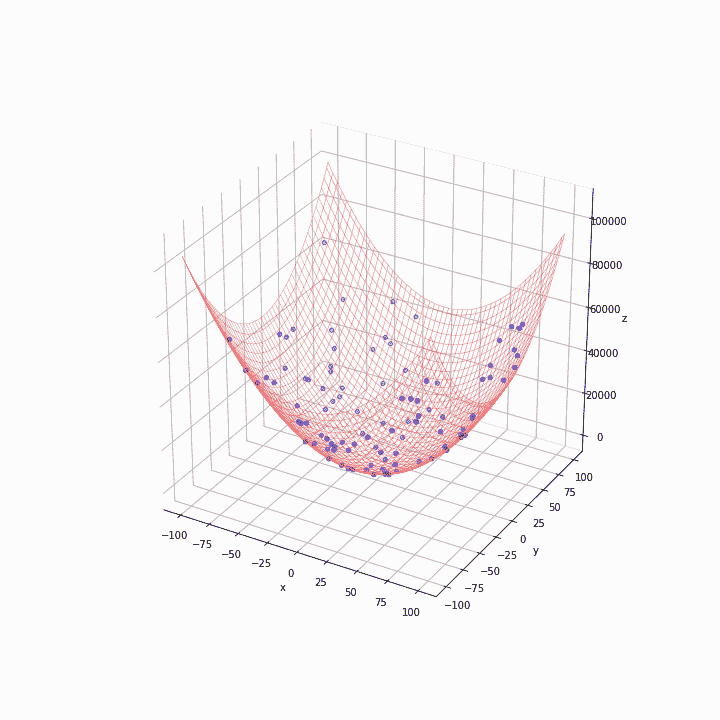

# 群体智能:Python 中粒子群优化的编码和可视化

> 原文：<https://towardsdatascience.com/swarm-intelligence-coding-and-visualising-particle-swarm-optimisation-in-python-253e1bd00772>

## 用简单的代码和动画解释自然启发的算法


塞巴斯蒂安·佩纳·兰巴里在 [Unsplash](https://unsplash.com?utm_source=medium&utm_medium=referral) 上的照片

在本文中，我们探索了受自然启发的优化算法粒子群优化的理论方面，然后将该算法应用于 Python 中的一个简单示例，用动画 gif 表示它，以便我们可以看到它是如何工作的。

如果您正在使用带有反向传播的随机梯度下降训练深度学习模型，并且无法摆脱局部最小值，本文可能会帮助您找到解决问题的替代方法。

一个群体是代理人或有机体的集合；群体智能可以被定义为群体的社会行为，其中自治的个体以分散的和自组织的方式相互作用。个体之间的相互作用提高了关于环境的经验知识，并使群体达到最佳状态。

我们可以在自然界观察到这样的智能。例如，众所周知，蚂蚁能找到从蚁群到食物源的最短路径。开始时，个人探索从目的地到目的地的各种方向。当找到一条有利的路线时，蚂蚁用信息素标记路线，信息素是蚂蚁沉积在地面上的化学物质。随着越来越多的蚂蚁走上同一条路，信息素会增强，吸引更多的蚂蚁。因此，大多数蚂蚁会跟随并收敛到最短的路径。


照片由[普拉比尔·卡什亚普](https://unsplash.com/@i__prabir?utm_source=medium&utm_medium=referral)在 [Unsplash](https://unsplash.com?utm_source=medium&utm_medium=referral) 拍摄

有一些受自然启发的算法模仿群体智能。蚁群优化(ACO)源自蚂蚁。人工蜂群(ABC)的灵感来自蜜蜂群集在它们的蜂巢周围。这篇文章是关于粒子群优化(PSO)的，它是由鸟群和鱼群暗示的。

PSO 最初是由 James Kennedy 和 Russell Eberhart 在 1995 年提出的。[1] [2]他们假设信息的社会共享会给群体带来好处。每当资源分布超出预测时，鱼群中的个体成员可以从其他成员的发现和经验中获利，而不是为了食物而竞争。关键词是“社交”。社会行为增加了个人的适应能力；结果，智能在蜂群中出现。个体的适应性和集体的智力是相互关联的。

粒子群算法简单。粒子是搜索空间中的一些简单实体。我们创建一个粒子群，并用问题的目标函数来度量它们的个体适应度。然后，基于粒子的个人最佳位置和群体目前的最佳位置，粒子从当前位置移动到下一个位置。通过迭代移动，群体在几代中逐渐达到目标函数的最佳点。

一些符号:

```
Number of particles         : iNumber of dimensions        : n
Fitness function            : f(x_i)
Particles                   : x_i = (x_i1, x_i2, ..., x_in)
Current velocity            : v_i = (v_i1, v_i2, ..., v_in)
Individual particle's best  : p_i = (p_i1, p_i2, ..., p_in)
Global particles' best      : p_g = (p_g1, p_g2, ..., p_gn)
Inertia component           : w * v_i(t)
Cognitive component         : c_1 * r_1 * (p_i - x_i(t))
Social component            : c_2 * r_2 * (g_i - x_i(t))
Velocity adjustment         : v_i(t+1) <- Inertia+Cognitive+Social
Position adjustment         : x_i(t+1) <- x_i(t)+v_i(t+1)
```

速度调整受 3 个因素的影响:以前的速度(惯性分量)，个体粒子的最佳位置(认知分量)和群体的最佳位置(社会分量)。速度是一个移动的粒子在给定方向上的速度。粒子的运动在每个方向上都受到这些重量的影响。系数 *w* 称为惯性权重，是保持粒子与上一代同向运动的力。 *c1* 和 *c2* 为常数加速度值，其中 *c1=c2* 由【1】应用于原算法。 *r1* 和 *r2* 表示超参数，它们会引起一些随机扰动。这些参数值的值越高，粒子的运动响应越快。我们还假设，在我们的情况下，适应度函数是针对最小化问题的。因此，当 *f(x_i) < f(p_i)* 时，单个粒子的最佳位置 *p_i* 被 *x_i* 覆盖。

PSO 算法如下:

```
1\. Initialise the particle population array x_i
2\. Loop
3\. For each particle, calculate the fitness using the 
   fitness function f(x_i)
4\. Compare the current fitness value with its best p_i. 
   Replace the best with the current value x_i 
   if it is better than the best.
5\. Check the swarm’s best particle from individual particle’s best 
   and assign the best array to the global best p_g.
6\. Calculate the velocity v_i(t+1) and update the position of 
   the particles to x_i(t+1)
7\. If a criterion is met, exit the loop.
8\. End loop
```

让我们把算法翻译成 Python 代码。为了可视化粒子的运动，我们可以将粒子的维度简化为两个， *x* 和 *y* 。这些脚本是按程序编写的。

**1。导入库**

**2。定义适应度函数**

我们使用的函数:*f(x,y)=(x-2y+3)^2+(2x+y-8)^2*。这个函数的全局最小值是 0。所有粒子都应该从随机点向 *x* 和 *y* 坐标的最佳位置移动，在该位置值变得接近 0。

**3。更新速度**

我们将随机值应用于 *r1、r2* 和 *w* 。 *c1* 和 *c2* 被赋予 0.1 的较小值。惯性值可以预定；从 0.9 开始，逐渐减少到 0.4。在我们的例子中，我们生成最小值为 0.5、最大值为 1 的正态分布，并按照[3]的实验，在每一代随机选择一个值。

**4。更新位置**

如算法中所述，新位置是当前位置和速度的总和。

**5。PSO 的主要功能**

首先，我们初始化粒子，它们的最佳位置，速度和适应值。我们还根据粒子的初始位置设置了全局最佳位置。然后我们从一代循环到另一代。当算法达到最大代数或成功标准时，它应该停止。在我们的例子中，它是当平均适应值超过特定值时。

**6。设置参数值并运行算法**

```
population = 100
dimension = 2
position_min = -100.0
position_max = 100.0
generation = 400
fitness_criterion = 10e-4
```

我们创建了 100 个粒子，它们的位置被随机放置在 x 和 y 坐标上，范围在-100 到 100 之间。当函数取 x 和 y 时，粒子的位置是二维的。成功标准为 0.001 或更低。如果达到标准，该计划应在第 400 代之前停止。

通过使用上述配置运行算法，我们获得了以下结果:

```
Global Best Position:  [2.60008033 2.799968  ]
Best Fitness Value:  3.7383573411040855e-08
Average Particle Best Fitness Value:  0.0009671024787191154
Number of Generations:  68
```

由于其随机性，每次运行程序时，结果都会发生变化。花了 68 代才达到成功标准。最佳粒子到达位置 *x≈2.6* 和 *y≈2.8，*，在这里适应度函数返回全局最小值。

如果我们能够可视化粒子的运动，而不是把结果写在文本中，那将会更有洞察力。

**7。Matplotlib 绘图和动画**

绘制函数的线框有助于了解全局最小值在哪里。应该为每一代人捕捉图像。下面是同一个示例的输出。



动画粒子在几代人之间的运动。作者照片。

在第一代中，粒子是分散的。他们迅速向网格的底部移动，看起来算法像预期的那样工作。我们可以通过改变适应度函数和超参数(如惯性权重 *w* 以及认知和社会系数( *c1* 和 *c2* )来进行更多的实验，以优化算法。

像 PSO 这样的群体智能是一类元启发式算法，被认为可以在合理的计算时间内找到复杂优化问题的近优解。如果我们应用该算法来训练神经网络，这是特别有用的。好处是双重的:全局搜索和并行化。

我们可以将每个粒子转化为一个 n 维数组，表示神经元之间的权重。正如我们在动画 gif 中看到的，每个粒子都向不同的方向运动。与局部搜索最优点的反向传播学习算法不同，PSO 可以同时探索许多不同的权重参数集，从而有助于避免到达局部最小值的路径。此外，适应度函数独立于网络拓扑；评估每个粒子适应度的计算可以并行化。

本文探讨了粒子群优化算法，用简单的代码来理解其中的机制。如果你对 PSO 在 ML 中的应用感兴趣，我强烈推荐阅读下面这篇关于将机器学习集成到各种元启发式算法中的文章。

[](https://www.sciencedirect.com/science/article/pii/S0377221721003623) [## 为解决组合优化问题的元启发式服务的机器学习…

### 机器学习与元启发式集成综述。*一个统一的分类法来提供…

www.sciencedirect.com](https://www.sciencedirect.com/science/article/pii/S0377221721003623) 

**参考:**

[1] J. Kennedy 和 R. Eberhart，“粒子群优化”，ICNN 95-神经网络国际会议论文集。
[2]里坡，r .，肯尼迪，J. &布莱克威尔，t .粒子群优化。群体智力 1，33–57(2007)。
【3】r . Eber hart 和史，“粒子群优化:发展、应用和资源”，2001 年进化计算大会(IEEE Cat .№01ts 8546)，2002 年 8 月。