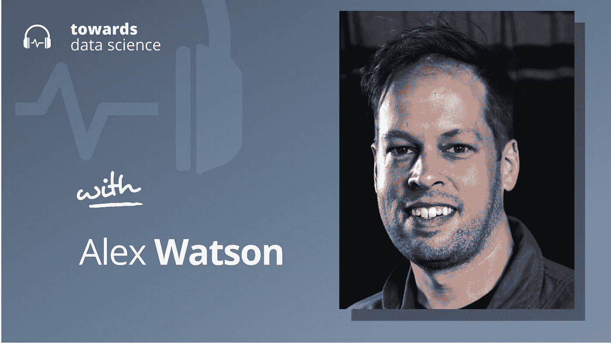

# 合成数据可以改变一切

> 原文：<https://towardsdatascience.com/synthetic-data-could-change-everything-fde91c470a5b>

## [播客](https://towardsdatascience.com/tagged/tds-podcast)

## Alex Watson 谈合成数据的隐私和性能优势

[苹果](https://podcasts.apple.com/ca/podcast/towards-data-science/id1470952338?mt=2) | [谷歌](https://www.google.com/podcasts?feed=aHR0cHM6Ly9hbmNob3IuZm0vcy8zNmI0ODQ0L3BvZGNhc3QvcnNz) | [SPOTIFY](https://open.spotify.com/show/63diy2DtpHzQfeNVxAPZgU) | [其他](https://anchor.fm/towardsdatascience)

*编者按:TDS 播客由杰雷米·哈里斯主持，他是人工智能安全初创公司墨丘利的联合创始人。每周，Jeremie 都会与该领域前沿的研究人员和商业领袖聊天，以解开围绕数据科学、机器学习和人工智能的最紧迫问题。*

有一个叫[thispersondoesnotexist.com](http://thispersondoesnotexist.com)的网站。当你参观它时，你会看到一张高分辨率、逼真的人工智能生成的人脸照片。正如该网站的名字所暗示的那样，地球上没有一个人看起来很像页面上回瞪着你的那个人。

每一张生成的图片都是一段数据，它捕捉了看起来像人类的本质。然而，他们这样做却没有告诉你任何关于某个人的任何事情。从这个意义上说，这是完全匿名的人脸数据。

这已经足够令人印象深刻了，它说明了生成图像模型在过去十年中已经走了多远。但是如果我们可以对任何类型的数据做同样的事情呢？

如果我可以生成一组匿名的医疗记录或金融交易数据，捕捉隐藏在私人数据集中的所有潜在关系，而没有泄露真实人物敏感信息的风险，会怎么样？这是 Gretel AI 的首席产品官兼联合创始人亚历克斯·沃森(Alex Watson)的使命，他致力于以保护隐私的方式释放隐藏在敏感数据集中的价值。

与亚历克斯交谈后，我意识到合成数据不仅仅是确保隐私。正如您将在对话过程中看到的那样，我们很可能会走向一个大多数数据都可以通过数据合成受益于增强的世界，在这个世界中，合成数据带来了隐私价值，这几乎是用从更广阔的世界导入的上下文丰富地面真实数据的副作用。

在这一集的 TDS 播客中，Alex 和我一起讨论了数据隐私、数据合成，以及数据生命周期的奇怪未来。以下是我在对话中最喜欢的一些观点:

*   数据综合是创建新的数据样本。一个好的合成数据集保留了原始“基础事实”数据集中存在的要素之间的所有关系，甚至可能是信息更加密集的(稍后将详细介绍)。
*   生成合成样本的一种老派方法是插值。这种策略包括生成新的样本，使它们落在特征空间的真实样本之间。但最近几个月，出现了一个新趋势:公司正在使用大型语言模型(LLM)来生成新样本。这是通过微调 LLM 来实现的，根据用户提供的提示，在 CSV 文件中生成新的行或新的 JSON 对象。
*   这种 LLM 策略有一个主要优势。在大量文本上训练的语言模型最终学习了世界的强大表示。这是因为他们基本上接受了自动完成的训练——自动完成得非常好意味着能够完成这样的句子，“将决定 2022 年美国经济增长轨迹的主要因素是……”。这样做需要大量的世界知识，以及对逻辑关系的充分理解。当这些 LLM 在诸如生成医疗保健数据的新样本等任务上进行微调时，他们能够将他们的丰富世界模型用于新任务，从而将他们从阅读数十亿高质量文本单词中获得的知识注入到他们生成的数据中。
*   最终结果是，合成数据可以更加私密，但也更具信息性和价值。它不仅结合了包含在初始地面真实数据中的信息，还结合了用于生成它的 LLM 的大量世界知识。
*   合成数据可能带来的一个挑战是记忆。LLM 有时会过度训练，这可能会导致他们记住训练数据中包含的敏感信息，如姓名、信用卡号等。因为这是一个过拟合问题，所以通常最好通过正则化来解决:像梯度裁剪、设计学习率和向随机梯度下降过程添加噪声这样的技术对此很有价值。

你可以[在 Twitter 上关注阿历克斯](https://twitter.com/AlexWatson405)，或者[我在这里](https://twitter.com/jeremiecharris)。如果你觉得这个对话很有趣，你也可以在下面找到一些链接。

*   [Gretel AI 今年在 Nvidia GTC 的演讲视频](https://www.youtube.com/watch?v=1jmIVplIJxQ)，主题是使用合成数据来平衡和改善 ML 数据集。
*   [一个关于隐私和合成数据准确性的帖子](https://gretel.ai/blog/advanced-data-privacy-gretel-privacy-filters-and-ml-accuracy)。
*   [一个关于图像合成的早期博客](/create-a-location-generator-gan-33680d81289f)。
*   Gretel AI 核心合成数据引擎的[开源代码](https://github.com/gretelai/gretel-synthetics)。

## 章节:

*   0:00 介绍
*   2:40 什么是合成数据？
*   6:45 大型语言模型
*   11:30 防止数据泄露
*   18:00 生成型与下游型
*   24:10 去偏置和公平性
*   30:45 使用合成数据
*   35:00 人消费数据
*   41:00 发现数据中的相关性
*   47:45 不同 ML 算法的概括
*   51:15 总结