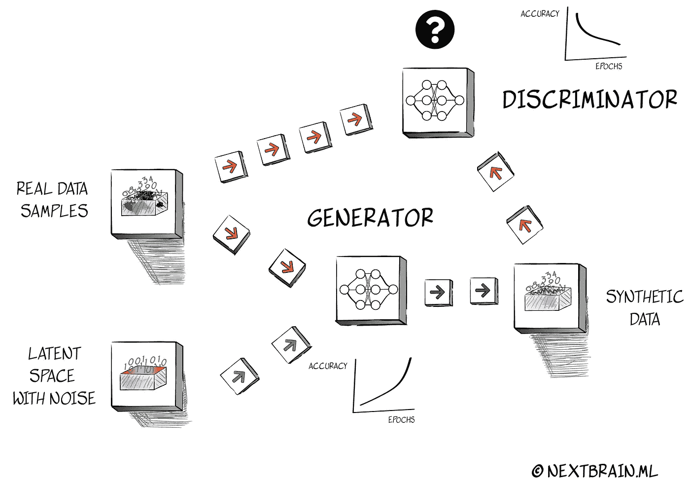
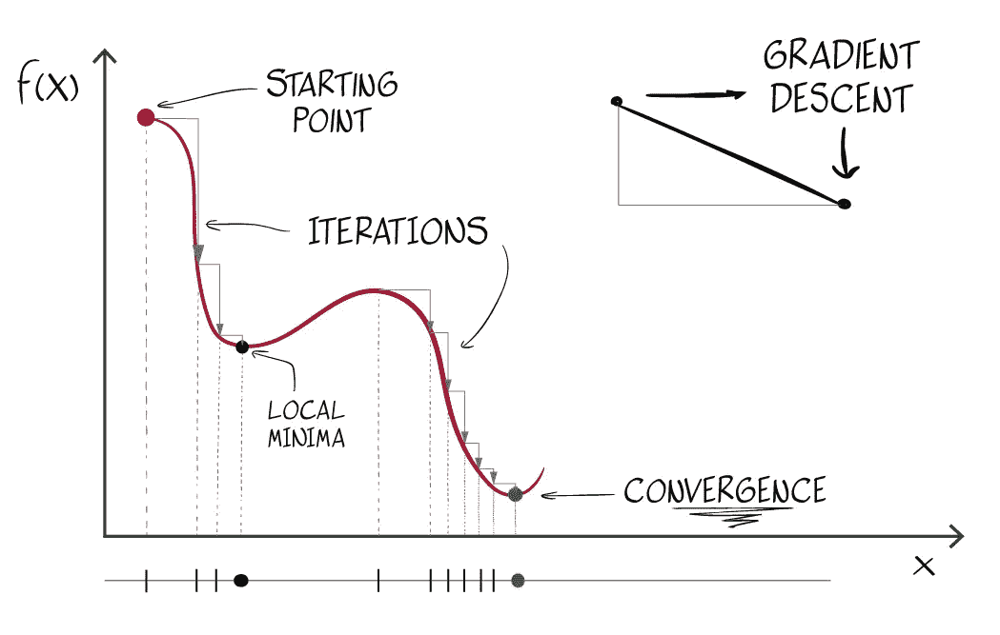
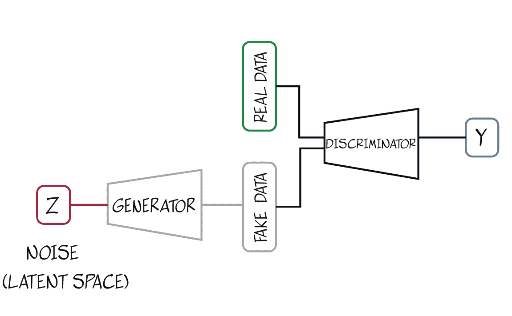
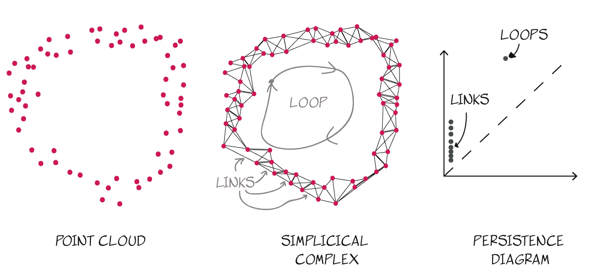
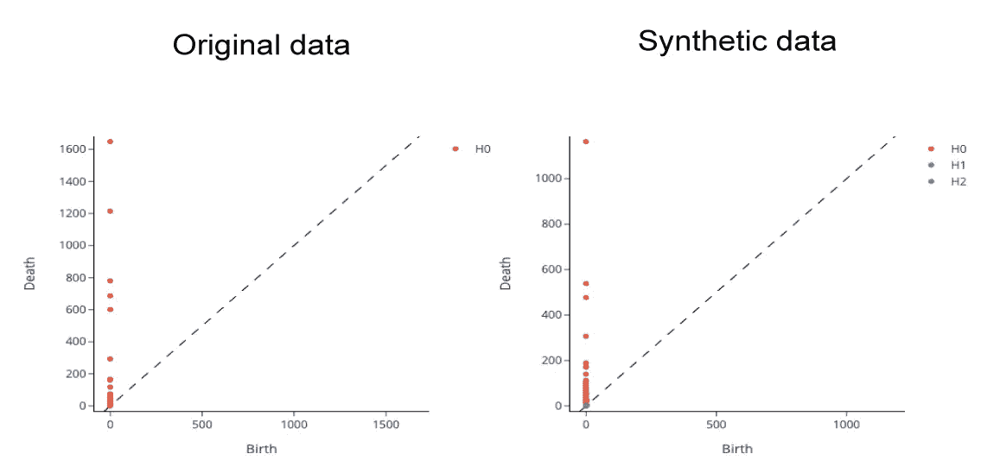
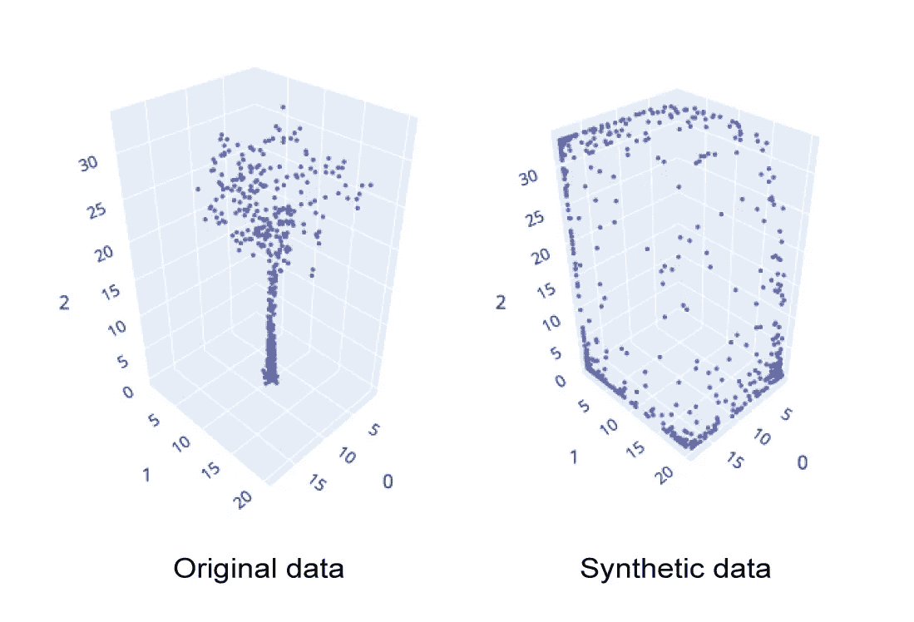

# 综合表格数据生成

> 原文：<https://towardsdatascience.com/synthetic-tabular-data-generation-34eb94a992ed>

## 介绍 nbsynthetic:一个简单但功能强大的用于小数据集的表格数据生成开源库。

图片作者。版权所有 NextBrain.ml

在这篇文章中，我们介绍了由 NextBrain.ai 创建的一个简单而健壮的无监督合成表格数据生成 python 库的开源项目<https://github.com/NextBrain-ml/nbsynthetic>***，*。**

1.  **简单:采用基于 [Keras](https://keras.io/) 的简单稳定的无监督 GAN(生成对抗网络)架构设计。**
2.  **鲁棒:具有特定的超参数调整，以确保训练的稳定性，同时最大限度地降低计算成本。**

**优势:**

*   **因为它是基于一个无人监管的架构，用户不需要有一个预定义的目标。**
*   **它主要用于具有连续和分类特征的小型数据集。**
*   **由于它们的简单性，模型可以在 CPU 上运行。**
*   **包括用于快速输入数据准备和特征工程的模块。**
*   **包括了用于运行统计测试和比较真实和合成数据(我们不喜欢“假数据”这个术语)的模块。它还包括一个特殊的统计测试(最大均值差异-MMD)，测量映射到再生核希尔伯特空间(RKHS)的两个样本的均值之间的距离。**
*   **绘图工具包括比较原始和合成数据的概率分布。**

**[在这里](https://github.com/NextBrain-ml/nbsynthetic)你可以找到 **nbsynthetic 项目**(库、文档和例子)。**

# **介绍**

# **为什么是表格综合数据生成库？**

**随着图像、视频和语音生成的应用，合成数据正经历着它的辉煌时代。最近，人们对应用程序的生成模型越来越感兴趣，例如创建新类型的艺术或模拟视频序列。然而，表格数据的发展似乎没有那么雄心勃勃，尽管它是世界上最常见的数据类型。合成表格数据正在颠覆自动驾驶汽车、医疗保健和金融服务等行业。医疗保健行业接受了这一新想法，特别是在解决患者隐私问题方面，但也在研究项目中模拟合成基因组数据集或患者病历。**

> **全球每天有近 7 亿人使用电子表格来处理以表格数据形式呈现的小样本数据。**

**全球每天有近 7 亿人使用电子表格来处理以表格数据形式呈现的小样本数据。这些信息通常用于制定决策和获得洞察力。然而，由于记录不完整或数据量小(缺乏统计意义)，它通常被认为是“质量差”的数据。机器学习在这些应用中非常有价值。但是，正如任何数据科学家都知道的那样，ML 的当前技术状态集中在大型数据集上，排除了大量潜在的 ML 用户。此外，我们必须解决现代统计学的要求，当应用于小样本数据时，警告 ML 算法的低可靠性。**

> **合成表格数据正在颠覆自动驾驶汽车、医疗保健和金融服务等行业。**

**例如，我们正在帮助一家大型精神病医院进行数据分析项目。他们带着基于过去十年收集的数据的综合研究来找我们。精神病住院治疗是至关重要的，这项研究的目标是改善早期预警和预防方案。我们以一个 38 列 300 行的电子表格的形式得到了结果。有许多空值(只有 7 行包含所有 38 个特征值)。当然，对于任何数据科学家来说，这都是很少的数据，对于统计学家来说就更少了。然而，对他们来说，收集这些数据是一项具有挑战性的工作。有了这些数据，任何统计方法的有效性都会受到质疑。通过创建合成数据集，我们能够提供具有统计有效性的可靠信息，并解决隐私问题，这是患者记录管理的一个关键点。**

# **无监督生成对抗网络**

**生成对抗网络，或 GANs，是这些生成应用的核心技术。gan 是由 Ian Goodfellow 在 2014 年提出的[1]。这个想法是设计两个独立的神经网络，让它们相互对抗。第一个神经网络从生成与输入数据统计相似的新数据开始。第二个神经网络的任务是识别哪些数据是人工创建的，哪些不是。两个网络不断相互竞争:第一个试图欺骗第二个，第二个试图弄清楚第一个在做什么。当第二网络不能“辨别”数据是来自第一网络输出还是来自原始数据时，游戏结束。我们称第一个网络**为发生器**，第二个网络**为鉴别器**。**

> **T 根据定义，同时训练发电机和鉴别器模型通常是不稳定的。**

**同时训练生成器和鉴别器模型根据定义一般是不稳定的[2]，所以 GANs 的主要缺点是训练不稳定和模式崩溃。GANs 的发展为解决这一问题带来了有趣的想法，例如向鉴别器引入额外的信息，以便获得更好的准确性，并为框架提供更多的稳定性(条件 GANs 或 cGANs)。这种变体方法需要一个“目标”或参考类，以附加信息调节 GAN 输出。但是，当我们处理上述目标用户时，我们发现许多数据集没有单一的目标要素，因为用户希望对不同的要素进行预测，以便获得关于其数据的更多见解。**

> **例如，如果用户想要使用另一个特征作为目标来解决 ML 问题，将合成数据调整为单个特征也会在生成的数据中引入偏差。这就是为什么无条件 GAN 或无监督 GAN(也称为香草 GAN)对此类问题感兴趣，因为它不需要选择目标。**

**虽然我们可以通过为 GAN 提供可靠的目标类(cGAN 中的“额外”条件)来提高准确性，但对于这些拥有中小型数据集、数据贫乏且需要获得可操作的一般见解的活跃电子表格用户来说，无监督 GAN 是一种多功能工具。但是它也有一些局限性。**

# ****构建简单、健壮的无监督 GAN 的技巧和诀窍****

**GANs 在训练过程中不稳定的原因是当发生器( *G* 和鉴别器( *D* )同时训练时，在一个非合作博弈中一个模型的改进是以另一个模型为代价的[3]。 **nbsynthetic** 使用 Keras 开源软件库**。**其架构基于线性拓扑，使用基本的顺序架构，在发生器和鉴别器中都有三个隐藏层。我们的 GAN 模型具有顺序架构，其中 *G* 和 *D* 相连。**

**该模型的设计考虑了以下因素:**

## ****1。初始化。****

**初始化是为神经网络模型的优化(学习或训练)定义起始点的过程。当这个过程不是最优时，训练过程可能由于其不稳定性而失败。我们将通过随机初始化权重来打破 GAN 的对称性。这个想法是为了避免一层中的所有神经元学习相同的信息。然后，我们将使用批量标准化[5],它通过将每个单元的输入标准化到零均值和单元方差来稳定学习。**

## ****2。收敛****

**正如我们所见，作为甘斯博弈的结果，两个模型( *G* 和 *D* )都无法收敛[4]。在图像生成中，避免这些收敛失败的主要策略是使用卷积网[5]。卷积层将输入要素映射到更高级别的表示，同时通过在多个下采样步骤中丢弃不相关的信息来保持其分辨率[6]。但是这种策略已经显示了图像和语音生成的相关进展，对于小样本表格数据来说似乎并不理想，因为我们可能会在每一步中丢失信息。实际上，当处理小样本表格数据集时，我们意识到许多为提高图像识别中 GANs 的准确性而进行的改进是不利的。我们选择了简单而密集的架构作为 *nbsynthetic* 的最佳方案。**

****

**在 GAN 中收敛。作者图片**

## ****3。激活功能****

**LeakyReLU(一种基于 ReLU 的激活函数，但其负值斜率较小，而不是平坦斜率)在 GAN 架构中很常见。然而，两者都有不同的使命。 *G* 必须生成尽可能接近原始数据的数据表示，而 *D* 必须决定(分类)输出是否不同于输入数据。为了建立发生器和鉴别器*时序模型，我们使用 *LeakyReLU* 激活函数*。*对于模型编译，我们将使用一个 *tanh* 激活函数(范围为-1 到 1)用于 *G、*和 *D* 我们将使用一个范围为 0 到 1 的 *sigmoid* 函数，因为它必须简单地“决定”数据是否有效。***

***tanh* (和 *sigmoid* 而不是 *LeaskyReLU* )是具有连续逆的连续函数。因此 *tanh* 层(生成器)保留了输出层中的拓扑属性，但导致比 *sigmoid* 函数高得多的梯度。这个想法是帮助网络更快地达到全局最小值，以避免当我们有连续和分类特征的混合时混淆它。**

**我们不能使用*线性*激活函数，因为分类特征会混淆 GAN。鉴别器的任务是将输出分类到与输入数据相同的类别中。使用 *sigmoid* 单元(鉴别器)进行分类相当于试图在最终的图层表示中找到一个分隔类的超平面。在这种情况下，使用具有较低梯度的 sigmoid 函数将提高分类精度。**

## ****4。优化****

***G* 和 *D* 都使用自适应矩估计优化器 Adam 通过随机梯度下降进行训练，以计算每个参数的自适应学习率【7】。我们使用一个小的学习率( *lr = 0.0002* )和一个低于默认值 0.9 ( *β1 = 0.4* )的简化动量项(或梯度均值)，目的是减少不稳定性。**

## ****5。噪声注入****

***G* 使用固定长度的随机向量 *ξ* 作为输入创建样本。这个向量就是潜在空间。当多维向量空间中的点与输入数据匹配时，在训练后将生成数据分布的压缩表示。 *ξ* 通常从高斯分布中采样，应该能够提高 GANs【8】的数值稳定性。这个过程也称为噪声注入。用噪声训练时的误差函数类似于正则化函数[9]，其中正则化函数的系数 *λ* 由噪声方差控制。**

**均匀分布实际上是具有最大标准差的正态分布。因此，使用均匀分布，我们增加了方差值，从而增加了系数 *λ的值。使用简单的网络结构和小样本表格输入数据，我们可以通过增加系数 *λ* 来减少训练过程中的过拟合。我们的实验支持了这个假设。***

****

**噪声注入的 GAN 模型。作者图片**

## **6。输入数据准备**

**输入数据准备可能是无监督 GAN 最重要的元素。该网络预计接收中低样本数据(最多 100 个要素，少于 1000 个实例)。此外，数据可以同时包含连续列和分类列。连续列不一定遵循正态分布，并且可能包含异常值。分类列可以是布尔值或多类。**

**数据准备中最重要的决策点是识别两种数据类型，以便区别对待它们。我们只需要将分类列从-1 扩展到 1。(因为我们使用的是 tanh 激活函数)。然而，为了对输入和异常值的不同概率分布具有鲁棒性，我们必须转换连续数据。我们将使用分位数变换将所有不同类型的输入概率分布映射为均匀分布[10]。因此，由于噪声注入(潜在空间)也是均匀分布，生成器 *G* 将只处理具有连续均匀分布的数据作为输入。**

# **图书馆中的实用程序**

**生成合成数据的一个重要挑战是确保新数据非常“接近”原始数据。有几个统计测试来确定两个样本是否属于同一概率分布。学生的*t-检验、Wilcoxon 符号秩检验*(配对学生 t-检验的非参数变量)以及针对数字特征的 *Kolmogorov-Smirnov 检验*都包含在该库中【11】。这些检验以一对一的方式比较输入数据集中每个要素和合成数据的概率分布(称为“双样本检验”，也称为“同质性问题”)。**

> **现代统计测试非常强大，但必须做出某些假设。**

**当一些特征可能与假设相冲突而其他特征不冲突时，这些假设使得将这些测试应用于公共数据集变得困难。该数据还包含具有不同概率分布的不同类型特征的组合，因此单个测试不能同时对所有这些特征有效。例如，一些测试依赖于正态假设(数据遵循正态分布)，然而我们可以拥有具有几乎任何分布特征的数据。例如，Student 的 t 检验是一种比较手段的检验，而 Wilcoxon 的检验是数据的排序。例如，如果您正在分析有许多异常值的数据，Wilcoxon 的测试可能更合适。学生的 t 检验依赖于正态假设；即样本呈正态分布。**

**另一方面，Wilcoxon 检验只对连续值有效。Kolmogorov-Smirnov 拟合优度检验[11]用于确定样本是否来自特定分布的人群。它仅适用于像 Wilcoxon 检验这样的连续分布，对于超前于正态的分布可能更稳健。**

**为了解决这个问题，我们通过使用*最大均值差异检验(MMD)*【12】提出了一个完全不同的解决方案。MMD 是一种统计检验，检查两个样本是否属于不同的分布。该测试计算两个样本之间的均值差异，这两个样本被映射到再生核希尔伯特空间(RKHS)[13]。最大均值差异已广泛应用于机器学习和非参数检验。**

**基于从它们中提取的样本，MMD 通过找到一个平滑函数来评估两个分布 *p* 和 *q* 是否不同，该平滑函数在从 *p* 提取的点上较大，在从 *q* 提取的点上较小。统计测量是两个样本的平均函数值之间的差；当这种差异很大时，样本很可能来自不同的分布。我们选择这种测试的另一个原因是，它在处理小样本数据时表现更好(这是大多数统计测试中非常常见的假设)。**

# **检查数据拓扑**

**拓扑数据分析，或 TDA [14]，是一种从不同的角度处理数据的新方法。在比较原始数据和合成数据时，应用这种尖端方法有多种优势:**

*   **定量分析忽略了隐藏在数据中的本质信息。此外，在许多数据表示中，不清楚实际数据距离有多少值，因此测量值并不总是合理的。**
*   **TDA 关心的是**距离**和**聚类**，以便在 t **拓扑空间**中表示数据。为了构建一个拓扑空间，我们必须将数据点转换成**单纯复形**。这些是将空间表示为点、区间、三角形和通过连接点(也称为过滤)形成的其他更高维类似物的联合。通过增加点周围的半径来连接空间中的点的效果导致了被称为**单形**的几何对象的创建(这就是它们被称为单形复形的原因)。**

****

**TDA 步骤:从点云到持久性图。作者图片**

**持续同源性的步骤如上图所示。首先，我们定义一个**点云**。然后，我们使用过滤方法来创建简单的复合体，最后，我们识别数据的**拓扑签名**(这就是我们如何称之为链接和循环)并在**持久性图**中表示它们。这些图表提供了一种有用的方法来总结数据点云或函数的拓扑结构。数据拓扑空间对于输入数据集是同伦等价的。**

**下图显示了输入数据集的持久性图与使用 nbsynthetic 从第一个数据集生成的合成持久性图之间的比较。正如我们所看到的，两个图是非常相似的签名。我们可以看到链路(红色点——H0)具有相似的分布，这意味着两者具有非常相似的拓扑特征。在一个合成数据集(长度是原始数据集的十倍)中，似乎有一个环(绿色点——H1)，甚至有一个空洞(H2)，但似乎也有噪声。**

**我们还可以应用定量分析测试来检查两个图是否等价。我们可以使用 Mann Whitney U 检验[16]，它用于检验两个样本是否可能来自同一个总体。在图中使用的数据中，链路的 p 值为 1，环路的 p 值为 1(我们可以拒绝零假设)，这意味着两个图是相等的。也就是说，生成的合成数据具有与原始输入数据相同的拓扑。**

****

**输入数据集和使用 **nbsynthetic** 生成的合成数据集的持久性图的比较。图片作者。**

# **限制**

**下图展示了从三维树点云中创建的 *nbsynthetic* 数据。我们可以看到，“合成树”与“真树”几乎没有什么共同之处。如果我们如前所述运行 *MMD 测试*，MMD 值是 0.12。我们通常接受小于 0.05 的 MMD 值作为原始数据和合成数据之间“接近程度”的量度(我们实验中的普通值在 0.001 和 0.02 之间)。选择这个例子是因为它清楚地展示了我们的综合局限性:处理低维输入数据(3)和只包含连续列的数据。**

****

**树木点云的合成数据生成。图片作者。**

**在正则化过程中，低维输入会混淆 GAN，导致不可理解的输出。合成数据在所有轴上都在崩溃，这意味着 GAN 的鉴别器无法区分真实数据和生成的数据。结果，当只有连续的特征馈入时，GAN 不能产生输入数据的合适表示。但是，当我们向输入数据添加具有分类数据类型的额外要素时，MMD 值会自动下降，这意味着输入数据会得到更准确的表示。我们必须记住，我们的生成器的输入潜变量(或噪声注入)具有均匀分布。如果我们切换到正态分布，精确度也会提高(尽管精确度也不是很高)。似乎范畴特征作为“引用”或“条件”输入操作，就像外部类在条件 gan 或 cGANs 中所做的那样。这一限制有助于我们更好地理解 GAN 的工作原理。**

**我们必须记住 *nbsynthetic* 并不能修复输入数据的缺陷，比如不平衡数据或严重偏斜的数据分布。合成数据不一定要了解输入数据特征的精确分布，但会很接近。我们对 GAN 网络的要求是理解这些特征如何相互连接；也就是理解模式。然后，可能有必要对合成数据执行额外的变换，以解决异方差等问题或减少不平衡目标数据产生的偏差。**

**该项目的下一步是包括一个转换输入数据的模块，以避免这些限制。**

# **结论**

**我们引入了一个用于合成表格数据生成的库，用于小型(和中型)样本数据集。为了降低复杂性和计算成本，我们使用了具有简单线性拓扑的无监督 GAN。为了使其可靠，我们敏锐地分析了超参数调整，以生成尽可能“接近”原始数据的合成数据。我们还探索了用统计工具量化这种密切关系的最佳方法。在 nbsynthetic git hub repository 教程中，您会发现库中尚未提供的其他方法，如迁移学习或拓扑数据分析(也在这里介绍)。**

**我们希望在两个方向上继续改进图书馆:**

1.  **针对上述输入数据中仅提供连续特征的情况，探索替代 GAN 架构。**
2.  **我们正在探索更多的方法来量化原始数据和生成数据的差异。拓扑数据分析是最有前途的方法。**

> **你可以在这里 **找到更多关于这个项目 [**的信息。**](https://github.com/NextBrain-ml/nbsynthetic)****

# **参考**

1.  **Goodfellow，I .、Pouget-Abadie，j .、Mirza，m .、Xu，b .、Warde-Farley，d .、Ozair，s .、和 Bengio，y .等人(2014 年)。生成对抗网络。神经信息处理系统进展，27。**
2.  **Arjovsky，m . & Bottou，L. (2017 年)。生成性对抗网络训练的原则性方法。arXiv 预印本 arXiv:1701.04862**
3.  **纳什 J. (1951 年)。非合作博弈。数学年鉴，286–295 页。**
4.  **古德费勒岛(2016 年)。Nips 2016 教程:生成性对抗网络。 *arXiv 预印本 arXiv:1701.00160* 。**
5.  **拉德福德大学、梅斯大学和钦塔拉大学(2015 年)。深度卷积生成对抗网络的无监督表示学习。 *arXiv 预印本 arXiv:1511.06434* 。**
6.  **Riad，r .，Teboul，o .，Grangier，d .，& Zeghidour，N. (2022)。卷积神经网络的学习进展。 *arXiv 预印本 arXiv:2202.01653* 。**
7.  **Ruder，S. (2016 年)。梯度下降优化算法综述。 *arXiv 预印本 arXiv:1609.04747* 。**
8.  **冯，赵，丁，查，张志军(2021 年 7 月)。了解 gans 中的噪声注入。在*机器学习国际会议*(第 3284–3293 页)。PMLR。**
9.  **主教，C. M. (1995 年)。用噪声训练相当于 Tikhonov 正则化。神经计算，7(1):108–116。**
10.  **Sci，Pedregosa *等*sci kit-learn:Python 中的机器学习(2011)。JMLR 第 12 卷，第 2825-2830 页。**
11.  **查克拉瓦蒂，拉哈和罗伊，(1967)。*应用统计方法手册，第一卷*，约翰威利父子。**
12.  **Ilya Tolstikhin、Bharath K. Sriperumbudur 和 Bernhard schlkopf(2016 年)。径向核下最大平均偏差的极小极大估计。《第 30 届国际神经信息处理系统会议录》(NIPS'16)。1938-1946 年，美国纽约州红钩镇柯伦联合公司。**
13.  **A.Gretton、K. M. Borgwardt、M. Rasch、B. Schö lkopf 和 A. Smola。(2007).两样本问题的核方法。在 b . schlkopf，J. Platt 和 T. Hoffman 编辑的《神经信息处理系统进展》19，第 513-520 页，剑桥，马萨诸塞州。麻省理工出版社。**
14.  **卡尔松，G. (2009 年)。拓扑和数据。*《美国数学会公报》*， *46* (2)，255–308。**
15.  **E.瑞尔，*语境中的范畴理论*，Courier Dover Publications，2017。**
16.  **Blumberg，A. J .，Gal，I .，Mandell，M. A .，& Pancia，M. (2014)。度量空间上持久同调的稳健统计量、假设检验和置信区间。*计算数学基础*， *14* (4)，745–789。[https://doi.org/10.1007/s10208-014-9201-4](https://doi.org/10.1007/s10208-014-9201-4)**

***nbsytnethic 是由*[*next brain . a*](http://nextbrain.ml)*I 研究团队*开发的开源项目**