# t 检验和假设检验(简单解释)

> 原文：<https://towardsdatascience.com/t-test-and-hypothesis-testing-explained-simply-1cff6358633e>

## 理解概念并找到如何避免典型错误


安德鲁·乔治在 [Unsplash](https://unsplash.com?utm_source=medium&utm_medium=referral) 上的照片

学生 t 检验通常用于推断统计中，根据样本均值之间的差异来检验假设。然而，人们经常曲解 t 检验的结果，导致错误的研究结果和研究缺乏可重复性。这个问题不仅存在于学生中。即使是导师和“严肃”的研究人员也会落入同样的陷阱。为了证明我的话，我可以链接[这篇文章](https://journals.plos.org/plosmedicine/article?id=10.1371/journal.pmed.0020124)，但是还有其他的。

另一个问题是，我经常看到和听到一些学生抱怨他们的老师没有充分解释 t 测试的概念。相反，他们专注于结果的计算和解释。如今，科学家使用计算机自动计算 t 统计量，因此没有理由钻公式和 t 分布表的用法，除非是为了了解*它是如何工作的*。至于解释，它没有错，尽管没有对概念的理解，它可能看起来像是盲目地遵循规则。事实上，它是。你还记得吗？

> 绝对 t 值大于 t 临界，因此拒绝零假设，接受备择假设。

如果你对这句话很熟悉，但理解起来仍有问题，很可能，你很不幸得到了同样的训练。直觉的这些问题会导致在测试假设时决策的问题。因此，除了知道将什么值粘贴到公式中以及如何使用 t 检验，还需要知道何时使用它，为什么使用它，以及所有这些东西的意义。

本文意在解释两个概念:t 检验和假设检验。起初，我只想解释 t 检验。后来，我决定包括假设检验，因为这些想法是如此紧密地联系在一起，以至于很难在忽略另一件事的情况下说出一件事。最终，你会发现 t-test 不仅是一个抽象的概念，而且有很好的常识。

做好准备，这篇文章挺长的。看看下面的文章大纲，不要迷路。

## 文章大纲:

1.  假设检验
2.  t 检验定义和公式解释
3.  选择重要程度
4.  t 分布和 p 值
5.  结论

## 假设检验

见见大卫。他是一名高中生，最近开始学习统计学。


嗨，我是用颜料创作的大卫！|作者

大卫想弄清楚他的 A 班同学的数学成绩是否比 b 班同学的好。学校有一个 5 分制的评分系统，其中 5 分是最好的分数。学生无法获得其他学生的成绩，因为老师对他们的数据保密，而且两个班级大约有 30 名学生。

大卫不能问所有的学生他们的成绩，因为这很奇怪，而且不是所有的学生都乐于谈论他们的成绩。如果他只问两个阶层的朋友，结果会有偏差。为什么？因为我们倾向于和志趣相投的人交朋友。所以，很有可能大卫的朋友们有着或多或少相似的分数。

也就是说，David 决定从两个班中随机抽取 6 名学生，并询问他们关于数学四分之一成绩的问题。他得到了以下结果:

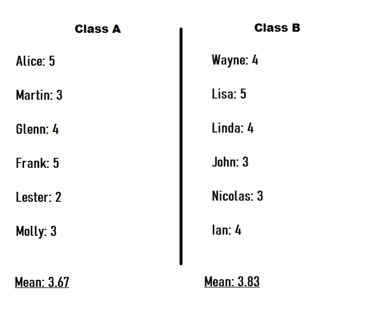

图(1)-学生的季度成绩|按作者

似乎 B 班的学生比 a 班的学生表现得更好。但是大卫没有问其他人！也许如果他问所有的学生，他可以得到相反的结果。谁知道呢？所以，问题来了，需要科学解决。

为了检查结果是否可能随机或偶然出现，David 可以使用名为**假设检验**的方法。**假设**是我们想要检验的主张或假设。这种方法非常类似于法庭审判过程，法官应该决定被告是否有罪。有两种类型的假设:

*   **零假设*****(h₀)***—我们默认的假设，或者公认的事实。通常，它意味着没有效果。通过与审判过程的类比，这是“无罪推定”——一项法律原则，即每个被指控犯有任何罪行的人在被证明有罪之前都被视为无罪。**
*   ******【h₁】**—我们要检验的假设。换句话说，只有当我们收集到足够的证据证明这种效应存在时，另一种假设才会被接受。****

****零假设和备择假设在数学上总是相反的。假设检验的可能结果:****

*   ******拒绝无效假设**—一个人被判有罪。****
*   ****未能拒绝无效假设——被告无罪释放。****

****大卫决定以如下方式陈述假设:****

*   ****h₀——a 班和 b 班学生的成绩均值没有差异****
*   ****h₁——a 班和 b 班学生的成绩均值有差异****

****现在，大卫需要收集足够的证据来证明两个班的学生有不同的学习成绩。但是，他能认为什么是“证据”呢？****

## ****t 检验定义、公式解释和假设。****

****T 检验是这样的检验，它允许我们分析一个或两个样本均值，这取决于 T 检验的类型。是的，t 检验有几种类型:****

*   ******单样本 t 检验** —将一个组的平均值与从总体中生成的指定平均值进行比较。例如，一家手机制造商承诺，他们的一款手机的电池平均支持约 25 小时的视频播放。为了查明制造商是否正确，研究人员可以对 15 部手机进行采样，测量电池寿命，得出平均 23 小时。然后，他可以使用 t 检验来确定这种差异是否不是偶然得到的。****
*   ******成对样本 t 检验** —比较从相同个人、对象或相关单位获得的两个测量值的平均值。例如，学生通过了一门额外的数学课程，发现他们的成绩在课程完成后是否变得更好将是有趣的。可以从同一组中抽取样本并使用配对 t 检验。****
*   ******独立双样本 t 检验**—用于分析两个独立组的均值比较。就像两组学生。它让你想起什么了吗？****

****没错。大卫想用独立双样本 t 检验来检验 A 班和 B 班的成绩均值是否真的存在差异，或者他是偶然得到这样的结果。两组是独立的，因为在 A 班学习的学生不能在 B 班学习，反之亦然。问题是大卫如何使用这样的测试？****

****对于我们的情况，我们有下面的 t 统计公式，其中两组的样本大小相等:****

****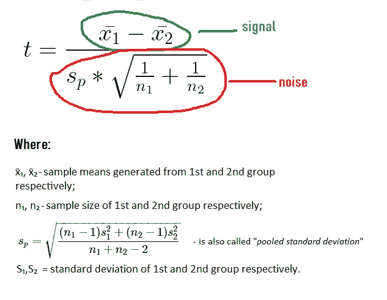****

****公式(1) — t 统计量，其中假设方差相等|作者****

****这个公式看起来相当复杂。然而，它可以以另一种方式呈现:****

****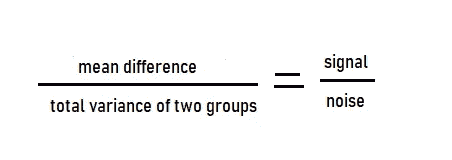****

****公式(2)—t 统计量的简化公式****

****基本上， **t 统计量就是一个信噪比**。当我们假设两组之间的差异是真实存在的，我们不会期望他们的均值完全相同。因此，均值的差异越大，我们就越有信心认为这些人群是不同的。然而，如果数据过于分散(方差很大)，那么平均值可能是随机的结果，我们是偶然得到的。特别是，当我们有一个小样本，如 3-5 次观察。****

****这是为什么呢？以生活在俄罗斯两大城市——莫斯科和圣彼得堡——的人们的工资为例。****

********

****亚历山大·斯马金在 [Unsplash](https://unsplash.com?utm_source=medium&utm_medium=referral) 上拍摄的照片****

****差异很大，因为工资从大约 100 美元到数百万美元不等。因此，如果你决定找出这两个城市的收入是否存在差异，你可以抽取 10 个人作为样本，询问他们的薪水。我知道，你不太可能在街上遇到百万富翁，我也知道，比较平均工资而不是平均工资有点奇怪。尽管如此，如果你正确地选取了样本，你可能会发现这两个城市中人们的工资高度分散。例如，在圣彼得堡，平均值为 7000 美元，标准差为 990 美元，在莫斯科，平均值为 8000 美元，标准差为 1150 美元。在这种情况下，你无法确定均值的差异是否具有统计学意义。那是因为你只问了 10 个人，而且工资的方差很大，所以你可能会偶然得到这样的结果。****

> ****因此，t 统计量的概念只是一个信噪比。方差越小，样本数据越多，平均差异越大，我们就越确定这种差异是真实的。****

****我可以更仔细地研究一下 t 统计量的公式，但为了清楚起见，我不会这样做。如果你愿意，你可以在这里阅读证明。了解 t-test 的概念就足以有效地使用它。****

****让我们也涵盖一些关于 t 检验的**假设。下面列出了 5 个主要假设:******

1.  ****数据是从总人口中随机选择的有代表性的部分收集的。这对于将我们的发现推广到我们的目标人群是必要的(在大卫的例子中——推广到两个班的所有学生)。****
2.  ****数据应遵循连续或离散的测量尺度。我们可以把分数看作是离散数据的一个例子。****
3.  ****均值应该遵循正态分布，总体也是如此。不是样本数据，正如有些人可能认为的，而是指*和*人口。这需要一个更详细的解释，我将在关于 t 分布的章节中给出。****
4.  *****(用于独立 t 检验)*观察值的独立性。每个主题应该只属于一个组。每组中的观察值之间没有关系。否则，使用*配对 t 型测试*。****
5.  *****(对于方差相等的独立 t 检验)*方差齐性。同质，或相等，样本的标准差大致相等时存在方差。可以使用 f 检验或 Levene 检验来检验方差相等性。否则，我们应该使用韦尔奇的 t 检验。****

****因此，t 统计量是大卫需要收集的证据，以证明两组学生的均值差异不是偶然发生的。如果有足够的证据，那么大卫可以拒绝零假设。问题是有多少证据就够了？****

## ****选择重要程度****

****大卫需要确定他所得到的结果是出于偶然还是某种利益因素。他可以找到 t 统计量作为证据，但是*大卫愿意为一个错误的决定冒多大的风险*？这种风险可以用显著性水平(α)来表示。****

******显著性水平是当无效假设为真**时拒绝无效假设的期望概率。例如，如果一个研究者选择α=0.05，这意味着他愿意冒 5%的错误拒绝零假设的风险。或者，换句话说，承担无辜者被定罪的 5%风险。统计学家经常选择α=0.05，而α=0.01 和α=0.1 也被广泛使用。然而，这种选择只是一种惯例，基于 R. Fisher 的论点，即 1/20 的机会代表一种不寻常的抽样发生。这个任意的阈值是在 20 世纪 20 年代建立的，当时很少使用超过 100 的样本量。****

****我们不想盲目地设定重要程度。但是我们应该用什么方法来选择这个值呢？详细描述这种方法是另一篇文章的主题，因为有很多东西要讨论。尽管如此，我还是要快速解释一下在选择最佳显著性水平时要考虑的因素。根据 J. Kim (2021)，这些因素包括:****

*   ****错误决策造成的损失；****
*   ****研究者的先验信念为 **H₀** 和**h₁**；****
*   ****测试的力量；****
*   ****被测试关系的实质重要性。****

****通过说“研究者应该考虑错误决策的损失”，这意味着研究者必须弄清楚第一类错误是否比第二类错误更重要，或者相反。****

******第一类错误**表示*当零假设实际上为真时拒绝该假设*。****

******第二类错误**发生在统计学家*未能拒绝实际上为假的零假设*的时候。****

****请注意，I 类误差的定义与显著性水平(α)几乎相同。不同之处在于，第一类错误是实际错误，而显著性水平代表犯这种错误的预期*风险*。犯第二类错误的风险由 **β** 符号表示，1-β代表测试的**功效**。换句话说，**功效是测试正确拒绝零假设**的概率。也被称为“真阳性率”。****

****可能存在 I 型错误比 II 型错误更重要的情况，反之亦然。以 A/B 测试为例。一名研究人员想要测试网站上一个页面的两个版本。在运行 t-test 后，人们错误地得出 B 版本比 a 版本更好的结论。结果，网站开始失去转化率。另一个例子是怀孕测试。假设，有两个测试可用。测试 1 有 5%的几率出现 I 型错误，20%的几率出现 II 型错误。测试 2 有 20%的机会出现第一类错误，5%的机会出现第二类错误。在这种情况下，医生更倾向于使用测试 2，因为对怀孕患者的错误诊断(II 型错误)对患者和她的婴儿都是危险的。****

****第二个需要考虑的是研究者对两个假设的先验信念。“先验”这个词的意思是，研究人员在查看自己的数据之前，对 H₀相对于 H₁的概率有一个个人假设。但是，假设不应该仅仅因为它是“个人的”就武断或不合理。它需要基于良好的论证。例如，该判断可以优选地由先前的数据和经验来告知。假设某个研究人员发明了一种可以治愈癌症的药物。在他之前有许多研究人员有类似的“发明”，但他们的尝试都失败了。也就是说，研究人员认为 H₁(即药物可以治愈癌症)的概率极不可能，约为 0.001。在另一种情况下，如果统计学家先验地认为 H₀和 H₁的可能性相等，那么这两种假设的概率都是 0.5。****

****第三个因素是实质重要性或效果大小。它解释了被测试关系的影响大小有多大的问题。当样本量较大时，t 检验通常会显示支持替代假设的证据，尽管均值之间的差异可以忽略不计。在对小样本进行测试时，t-test 可以建议不要剔除 H₀，尽管它有很大的影响。这就是为什么建议为小样本量设置较高的显著性水平，为大样本量设置较低的显著性水平。****

****在阅读所有这些的时候，你可能会想:“好的，我理解显著性水平是错误拒绝零假设的期望风险。那么，*为什么不把这个值设置得尽可能小，以便得到尽可能强的证据*？因此，如果我进行一项研究，我总是可以将α设置在 0.00001(或更小)左右，并得到有效的结果”。****

****我们不应该将α设置得越小越好，这是有原因的。部分地，我们已经在提出实质性重要性的概念时讨论过它——对于小样本量，如果α太小，我们可能会错过大的影响。但答案就藏在我们还没讨论的第四个因素里。这就是力量。****

****重要程度和权力之间有关系。这些值相互依赖。对他们做决定就像决定在哪里花钱或如何度过空闲时间。一个领域有好处，另一个领域有损失。α和β之间的关系用下面一个非常简单的图表表示。注意，β是第二类错误的概率，而不是幂(幂是 1-β)。****

****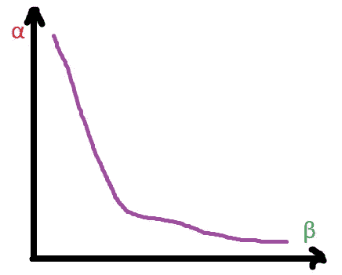****

****图(2) —作者给出的α和β |之间的关系****

****如您所见，α和β之间存在权衡。可以在估计β的值之后选择α的最佳值。可以通过以下两种方式之一完成:****

*   ****使用正态假设****
*   ****使用引导****

****最好使用第二种方法来计算功效，因为在许多情况下，正态假设会失效或不合理。bootstrapping 方法不依赖于这种假设，并且充分考虑了采样可变性。这就是它在实践中被广泛使用的原因。****

****那么，如何使用自举来计算功率呢？****

****对于 David，有 3 个步骤:****

1.  ****从 A 类和 B 类中生成独立的样本；****
2.  ****执行测试，将 A 类与 B 类进行比较，并记录零假设是否被拒绝；****
3.  ****多次重复步骤 1-2，找出拒绝率，这就是估计功率。****

****计算功率只是计算预期损耗的一个步骤。****

****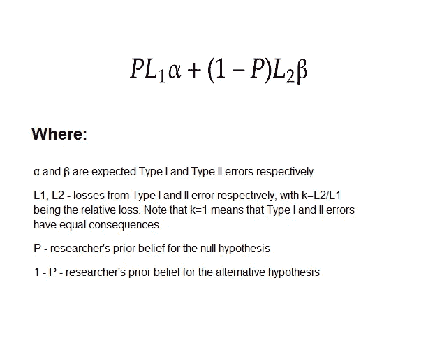****

****公式(3) —预期损失|作者图片，J. Kim 和 I. Choi 的公式(2021)****

******α的最佳值可以分三步选择:******

1.  ****选择α ∈ (0，1)的网格****
2.  ****对于每个α值，用上述公式计算β(使用上述 3 步过程)和预期损失****
3.  ****找出使预期损失最小的α值****

****让我们回到大卫身上。他想设置错误拒绝 H₀.的预期风险为了正确地做到这一点，David 考虑了我们已经讨论过的 4 个因素。首先，他认为第一类和第二类错误同等重要。第二，大卫认为两个班的学生成绩不一样。也就是说，他对自己的替代假设(P=0.4，1-P=0.6)给予了更大的权重。第三，因为样本量很小，David 决定将α提高到比 0.05 大得多，以免错过可能的实质性影响大小。他需要做的最后一件事是估计功率。为了估计功率，有必要选择一个可能的α值网格，并对每个α值进行多次 t 检验以估计功率。现在，David 知道如果 p 值大于显著性水平，应该拒绝零假设。否则，人们无法拒绝零假设。在下一节中，我将解释 p 值的含义，但我们暂时先不讨论这个问题。****

****计算最优显著性水平的整个过程可以用下面的 R 代码表示:****

```
****opt_alpha = function(x, y, alpha_list, P=0.5, k=1, sample_size=6, is_sampling_with_replacement=TRUE){

  # This function estimates the power using simulation and returns a data frame with alpha, beta and losses that should be minimized

  beta_list = c()expected_losses_list = c()

  P = 0.4
  k = 1

  for (alpha in alpha_list){
    set.seed(23)
  rejection_count = c()
  for (i in 1:500){
    sample_x = sample(x, size = sample_size, replace = is_sampling_with_replacement)
    sample_y = sample(y, size = sample_size, replace = is_sampling_with_replacement)
    pvalue = t.test(x = sample_x, y=sample_y)$p.value
    if (pvalue < alpha){
      rejection_count = append(rejection_count,1)
    }else{
      rejection_count = append(rejection_count,0)
    }
  }

  rejected = sum(rejection_count)
  total = length(rejection_count)

  power = rejected/total
  beta = 1 - power

  beta_list = append(beta_list,beta)

  expected_losses = (P*alpha)+((1-P)*k*beta)

  expected_losses_list = append(expected_losses_list,expected_losses)
  }
  solutions = data.frame(alpha_list, beta_list,expected_losses_list) 
  return(solutions)
}alpha_list = c(0.01,0.05,0.1,0.15,0.20,0.25,0.30,0.35,0.40,0.45,0.5,0.55,0.6,0.65,0.7,0.75,0.8,0.85,0.9,0.95)solutions = opt_alpha(x = a_score$Score, y = b_score$Score,alpha_list, P=0.4, k=1)optimal_solution = solutions %>% filter(expected_losses_list==min(expected_losses_list))****
```

********

****图(3) —最佳显著性水平|作者****

****大卫发现α = 0.8 是最优值。请注意，它与 0.05 的常规水平相差甚远。****

## ****t 分布和 p 值****

****因此，大卫将显著性水平设为 0.8。现在，他可以计算 t 统计量。****

****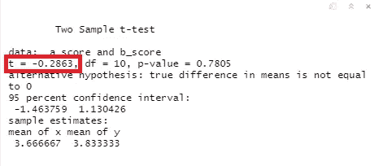****

****图(4)—t 检验的结果|作者****

****经过计算，他得出 t-statistic = -0.2863。为什么这个值是负的？因为我们观察到一种负面效应。在这个例子中，B 班的学生数学表现更好，尽管大卫认为 A 班的学生更好。我们发现的另一件事是，信号约有 28.6%来自噪声。它几乎迷路了。也许，均值的差异可以用方差来解释。但是多大的 t 统计量才能拒绝零假设呢？****

****这就是 t 分布的用武之地。它将显著性水平和 t-统计量联系起来，这样我们就可以比较证明边界和证明本身。t 分布的概念没有人们想象的那么难。考虑比较两个城市的平均 SAT 分数的例子。我们知道，在这两个城市中，SAT 分数遵循正态分布，并且均值相等，即零假设为真。注意，两个城市的 SAT 成绩代表的是两个人群，而不是样本。****

****从这一点，我们可以开始发展我们的逻辑。我们决定模拟一个人的行为，这个人想要比较两个城市的平均值，但是没有关于人口的信息。当然，我们会从每个分布中抽取样本。假设样本量为 10。下面的 R 代码生成 SAT 分布，从两者中抽取样本，并计算 t 统计量。****

```
****# 1\. Generate two normal distributions with equal meansset.seed(123)
city1 = rnorm(n = 10000, mean = 1150, sd = 150)
city1 = as.data.frame(city1)
city2 = rnorm(n = 10000, mean = 1150, sd = 150)
city2 = as.data.frame(city2)ggplot(data = city1) + geom_density(aes(x = city1), colour = 'red') + xlab("City1 SAT scores")ggplot(data = city2) + geom_density(aes(x = city2), colour = 'green')+ xlab("City2 SAT scores")****
```

****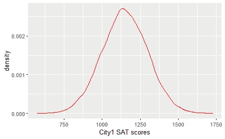****

****图(5)-城市 1 SAT 分数分布|按作者****

****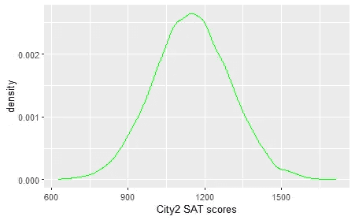****

****图(6)-城市 2 SAT 分数分布|按作者****

```
****# 2\. Take samples from both distributionsset.seed(2356)
sample_city1 = sample(city1$city1, size = 10)
sample_city2 = sample(city2$city2, size = 10)# 3\. Calculate t-value
tvalue = t.test(x = sample_city1, y=sample_city2, var.equal = TRUE)$statistictvalue = as.numeric(tvalue)****
```

****我们得到的 t 统计值等于 1.09。它显示了一些信号，这很奇怪，因为我们知道 H₀为真，t 值应该等于零。这是为什么呢？那是因为我们的样品运气不好。如果我们抽取 7 万次样本，了解 t 统计量会如何变化会很有趣。让我们开始吧。****

```
****# 4\. Do steps 2-3 70000 times and generate a list of t-valuestvalue_list = c()for (i in 1:70000){
  sample_city1 = sample(city1$city1, size = 10)
  sample_city2 = sample(city2$city2, size = 10)

  tvalue = t.test(x = sample_city1, y=sample_city2, var.equal = TRUE)$statistictvalue = as.numeric(tvalue)

  tvalue_list = append(tvalue_list,tvalue)
}****
```

****我们有一个巨大的 t 值列表。我们来画一个。****

```
****# 5\. Plot the list of t-valuesggplot(data = as.data.frame(tvalue_list)) + geom_density(aes(x = tvalue_list)) + theme_light()+xlab("t-value")****
```

****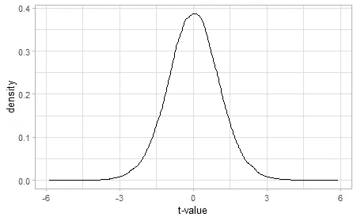****

****图(7)-作者的 t 值分布****

****就是这样。现在我们有了一个与学生 t 分布非常相似的 t 分布。t 分布看起来像正态分布，但它有更重的尾部。此外，根据样本大小，它可能看起来不同，并且随着更多的观察，它接近正态分布。t 分布可以解释如下。采集样本时，很有可能获得等于零的 t 值。这是有意义的-当零假设为真时，t 值应该等于零，因为没有信号。但是 t 值离零越远，我们就越不可能得到它。例如，得到 t=6 是非常不可能的。但是这里出现了一个问题。获得某个 t 值的可能性或不可能性有多大？****

*****在假设零假设正确*的情况下，获得至少与实际观察到的 t 值一样极端的 t 值的概率称为 **p 值**。在下图中，观察到 t > =1.5 的概率对应于曲线下的红色区域。****

****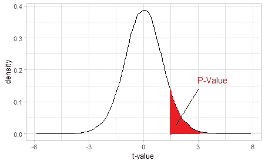****

****图(8)-单侧临界区域的 t 值分布|作者****

****非常小的 p 值意味着如果零假设为真，得到这样的结果是非常不可能的。p 值的概念有助于我们对 H₀和 H₁.做出决策 t 统计显示信号和噪声之间的比例，p 值告诉我们，如果 H₀为真，我们多久可以观察到这样的比例，显著性水平充当决策边界。类比一个法庭审判过程，p 值=0.01 有点类似于下一个陈述:“*如果这个人是无辜的，有 1%的概率一个人会有这样的行为(改变证词，隐藏证据)或者更怪异的行为*”。陪审团可以通过比较 p 值和一些证据标准(显著性水平)来确定证据是否充分。因此，如果α = 0.05，p 值=0.01，陪审团可以做出“有罪”的裁决。****

********

****照片由[萨乌尔·布西奥](https://unsplash.com/@fotoloredo?utm_source=medium&utm_medium=referral)在 [Unsplash](https://unsplash.com?utm_source=medium&utm_medium=referral) 上拍摄****

****需要做几个笔记。首先，**对于 p 值有一个常见的曲解，当人们说“p 值就是 H₀为真的概率”**。当然，p 值并没有告诉我们任何关于 H₀或 H₁的信息，它只是假设零假设为真。考虑一下这个例子，当 David 对两个班的学生进行抽样调查时，他们只得到 5 分。T 统计量显然是 0，因为在平均值上没有观察到差异。在这种情况下，p 值将等于 1，但这是否意味着零假设“肯定”为真？不，一点也不！这意味着大卫没有正确地取样，只选择了数学“好”的学生，或者他非常不幸地得到了这样的样本。第二，t 分布实际上并不是通过 bootstrapping 推导出来的(就像我出于教育目的所做的那样)。**在纪凡·戈塞特的时代，还没有计算机，所以 t 分布是用数学方法推导出来的**。我决定不再深究数学，否则，很难认同 t 检验是“简单解释”的。第三，因为 t 统计必须遵循 t 分布，**t 检验要求总体的正态性**。然而，总体不一定具有“完美的”正态分布，否则，t 检验的使用将过于有限。只要这些“不完美”允许我们做出有效的结论，在人口分布中可能存在一些偏斜或其他“不完美”。****

****最后，关键区域(图 8 中的红色区域)不一定只有一边。如果存在效应(均数差)可以为正或为负的可能性，最好使用**双尾 t 检验**。双尾 t 检验可以检测两个方向的影响。对于 David 来说，使用双尾 t 检验是合适的，因为 A 班的学生可能在数学方面表现更好(正平均差，正 t 值)，B 班的学生也可能有更好的成绩(负平均差，负 p 值)。**单尾 t 检验**适用于在未检验方向遗漏一个效应的后果可以忽略不计，或者该效应只存在于一个方向的情况。****

****所以…****

****大卫计算了一个 p 值。****

****等于 0.7805。****

****因为大卫设定α = 0.8，他必须*拒绝零假设*。****

****就是这样。t 检验完成了。大卫现在可以带着某种程度的自信说，手段的不同不是偶然发生的。但是大卫仍然怀疑他的结果是否有效。也许，这个问题与重要性的程度有关。大卫允许自己以 80%的概率错误地拒绝零假设。另一方面，如果显著性水平被设置得更低，错误地声称无效假设不应该被拒绝的可能性就更大。****

****嗯，这就是统计学的本质。我们永远无法确定。也许，如果大卫得到更多的样本，他会对结果更有信心。谁知道 t 检验的结果会显示什么？****

## ****结论****

****假设，我们是一名班主任，他有权访问学生的成绩，包括 A 班和 b 班的成绩。我们可以计算出大卫是对还是错。以下是实际结果:****

****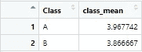****

****图(9)——两个班学生的实际平均成绩|作者****

****的确，A 班的学生比 b 班的学生在数学方面做得更好。两个班的平均成绩有差别，但差别很小。因此，替代假设成立。让我们来计算真β(真α我们无法计算，因为零假设是假的，因此，不可能错误地拒绝零假设)。对于我们的α = 0.8，我们发现β = 0.184。将该值与β = 0.14 的估计值进行比较，我们可以说我们的自举方法非常有效。然而，我们低估了第二类错误的概率。****

****从这些信息中我们可以学到什么？****

****同样，当你在做统计时，不要太自信。当有其他科学方法可用时，你不应该完全依赖 t 检验*。你的逻辑和直觉很重要。还有一点需要指出。大卫的目标是找出 A 班的学生是否比 b 班的学生获得更好的季度成绩。假设大卫进行了严格的研究，并得出了正确的答案。但是结果有实际意义吗？可能，不会。他能用这些结果做什么？是的，A 班的学生取得了更好的四分之一成绩。但这就意味着 A 班的学生数学比 B 班的学生好吗？只用一个季度的数据是不可能回答这个问题的。或许，收集其他时期的信息并进行时间序列分析会有所帮助。但是，仅仅使用观察数据是很难找出一些因果关系的，如果不是不可能的话。这是另一个教训。使用统计方法(如 t 检验或回归)时，不要试图对观察到的关系的因果关系做出结论。*****

*****如果你想看看 David 的数据集和 R 代码，你可以使用这个[链接](https://drive.google.com/file/d/1fyChFbcTXlBnJZy4L-Am7s6CxPBbGUCC/view?usp=sharing)下载所有的内容。学生成绩的完整数据集也可以在档案中找到。所有的数据集都是我创建的。*****

*****最后，如果你有任何问题、意见或批评，请在评论区写下。我们都互相学习。*****

*****感谢您的阅读！*****

## *****参考*****

*   *****大卫·科尔昆。(2017).研究的可重复性和对 p 值的误解。皇家学会开放科学。4.171085.10.1098/rsos.171085*****
*   *****格陵兰，s .，森，S. J .，罗斯曼，K. J .，卡林，J. B .，普尔，c .，古德曼，S. N .，&奥特曼，D. G. (2016)。统计检验、P 值、置信区间和功效:误解指南。*欧洲流行病学杂志*， *31* (4)，337–350 页。[https://doi.org/10.1007/s10654-016-0149-3](https://doi.org/10.1007/s10654-016-0149-3)*****
*   ****Ioannidis JPA (2005)为什么大多数发表的研究结果是错误的。PLoS Med 2(8): e124。[https://doi.org/10.1371/journal.pmed.0020124](https://doi.org/10.1371/journal.pmed.0020124)****
*   ****Kim，J.H .和 Choi，I. (2021)，选择重要性水平:决策理论方法。算盘，57:27–71。[https://doi.org/10.1111/abac.12172](https://doi.org/10.1111/abac.12172)****