# 使用 SQL 在 11 分钟内解释表连接

> 原文：<https://towardsdatascience.com/table-joins-explained-in-11-minutes-using-sql-9a3c81fc5265>


photo by[@ TV ick](https://unsplash.com/@tvick)@ unsplash . com

*【免责声明:此帖子包含一些我的 Udemy 课程的附属链接】*

如果您从事数据科学或机器学习领域的工作，您可能需要构建数据管道来帮助您组合不同的数据源。在项目层面，组合不同的数据集可能是数据科学家为取得项目成功而不得不忍受的最耗时的任务之一。

知道如何争论数据是数据科学家的一项关键技能，因为这使他们能够将更多功能纳入他们的管道，在这个过程中，数据连接概念是绝对关键的。虽然在你学会它们之后，它们看起来相当简单，但是它们有可能损害你的项目质量的小细节。为什么？

在数据争论过程中，设计不良的连接是错误的主要来源之一。执行得不好的联接可能具有很大的破坏性，它可能会在一瞬间创建重复项或减少训练数据的维数。如果你没有注意到它们，这些错误将导致你在训练模型或基于错误数据做出结论时犯下大量错误。

在这篇文章中，我的目标是用不到 11 分钟的时间解释数据连接。我将解释使用 SQL(结构化查询语言)的不同类型的数据连接，但是如果您没有支配 SQL，不要担心！我们将学习的一般原则适用于`pandas`或`R` *合并*特征。开始吧！

# 什么是联接？

基本上，数据连接是我们组合数据集的一种方式(主要是水平地)。使用数据连接有两个主要原因:

*   从其他数据集中选取列。
*   限制特定表的域。

有更多的用例，但这两个可以说是最常用的。通过连接，表之间的数据通过一个*键连接，一个*列将用于映射我们想要合并的多个表之间的行。

# 内部连接

让我们从一个可视化的图开始——著名的*内部连接*图:

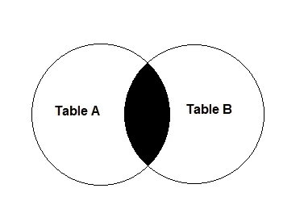

内部联接图—作者图片

内部连接**仅**包括连接中涉及的两个表的域。这是什么意思？让我们从使用`customers`和关于`customer_country`的信息在 SQL 中创建一些示例数据集开始:

```
CREATE TABLE sandbox.customers(
 customer_id INT AUTO_INCREMENT PRIMARY KEY,
 customer_name varchar(255) NOT NULL
    );

CREATE TABLE sandbox.customer_country(
 customer_id INT PRIMARY KEY,
 customer_country varchar(255) NOT NULL
    );insert into sandbox.customers (
 customer_name
) values ('John'), ('Adam'), ('Anne'), ('May');insert into sandbox.customer_country (
 customer_id, customer_country
) values (1, 'USA'), (3, 'USA'), (4, 'UK'), (5, 'UK');
```

这两个表各包含 4 行:

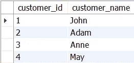

客户表-按作者分类的图像

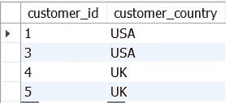

客户国家表-按作者分类的图像

*   在`customer`桌上，我们有 4 个客户，分别是`John`、`Adam`、`Anne`和`May`；
*   在`customer_country`桌上，我们也有 4 个客户，两个来自`USA`，两个来自`UK`；

很快，我们看到两个表中的域是不同的。在`customer`表中，我们有带有`ids` 1、2、3 和 4 的客户。在`customer_country`表中，我们有`ids` 1、3、4 和 5。

假设我们希望在同一个表中有客户的姓名和国家。我们怎么做呢？用*加入*！

**要执行任何数据连接，我们需要知道一些“成分”——记住下面的数字，因为我们将在整个帖子中使用它们:**

*   (1)我们想要组合的表—对于我们的例子，`customer`和`customer_country`；
*   (2)我们想要使用的键——两个表中唯一存在的列是`id`，所以我们将使用这个列作为它们之间的连接器。
*   (3)我们希望保留在输出表中的域—对于第一个连接，我们只希望输出我们知道其来源的`customer_name`和`customer_country`的客户。
*   (4)我们想要选取的列—我们想要一个带有`id`、`customer_name`和`customer_country`的输出表。

让我们把它放在 SQL 连接语法中:

```
select a.customer_id, a.customer_name, b.customer_country
from sandbox.customers as a
inner join 
sandbox.customer_country as b
on a.customer_id = b.customer_id;
```

下面是这个*查询*的结果:

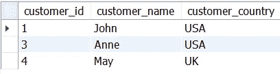

来自内部连接的结果—作者提供的图像

分解我们的代码并将每一位映射到我们定义的“成分”:

*   首先，我们使用`select a.customer_id, a.customer_name, b.customer_country`选择我们想要在表中输出的列。我们使用别名`a`来表示表`customer`和`b`来表示`customer_country`表——这是我们定义成分(4)的地方。
*   使用`from sandbox.customers as a`，我们将`customer`表映射到它的别名，命名(1)的一个成分部分。
*   使用`inner join`，我们声明我们想要的表`a`和`b`之间的连接类型。这是定义成分(3)的关键，即输出的域。
*   使用`sandbox.customer_country as b`，我们将`customer_country`映射到它的别名，命名成分(1)的另一部分。
*   使用`on a.customer_id = b.customer_id`，我们声明连接两个表的连接或列的键。正如你所料，这是定义成分(2)的关键部分。

引擎盖下发生了什么？如果我们使用`customer_id`作为连接器，SQL 将执行以下操作:

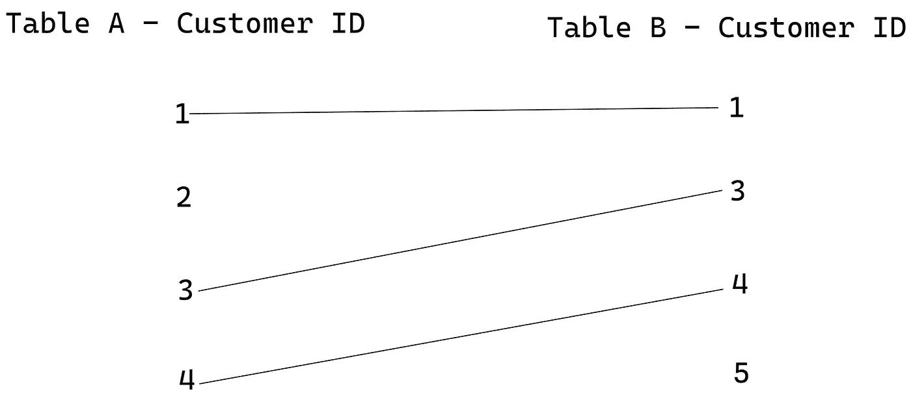

内部连接中键的可视化表示—作者提供的图像

使用`inner join`，只有在两个表中都有对应关系的客户才会出现在返回表中。

**每一行都是由输出**生成的一行，因此，在我们的输出数据中，只有在可视化表示上连接的客户(客户`1, 3, 4`)才会出现。这导致了一个重要的结论:如果您碰巧选择了内部连接，您可能会在整个管道中丢失实体(在我们的例子中是`customers`)。

让我们给这个话题加点料。谁说我们必须使用单列作为键？为了展示一个新的例子，让我再创建两个表，每个月显示一些`customers`的收入和支出:

```
CREATE TABLE sandbox.customer_income(
 customer_id INT,
 month INT,
 income decimal(19,4) NOT NULL,
    primary key (customer_id, month)
    );insert into sandbox.customer_income (
 customer_id, month, income
) values (1, 202001, 10.03), (1, 202002, 10.03), (1, 202003, 20.52),
  (3, 202001, 52.01), (3, 202002, 60.03);

CREATE TABLE sandbox.customer_expense(
 customer_id INT,
 month INT,
 expense decimal(19,4) NOT NULL,
    primary key (customer_id, month)
    );insert into sandbox.customer_expense (
 customer_id, month, expense
) values (1, 202001, 2.25), (1, 202002, 3.20), (1, 202003, 15.50),
  (3, 202001, 10.06), (3, 202002, 10.65), (3, 202003, 20.2);
```

这是我们创建的数据:

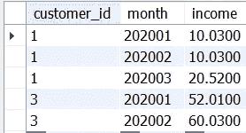

每月客户收入—按作者分类的图片

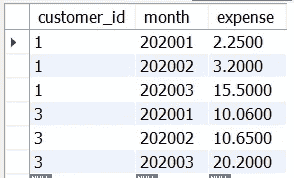

每月客户费用—按作者分类的图片

如果我们想在一个表中合并收入和支出(例如，计算余额)，我们应该只使用`customer_id`键吗？让我们看看:

```
select a.customer_id, a.month, a.income, b.expense
from sandbox.customer_income as a
inner join sandbox.customer_expense as b
on a.customer_id = b.customer_id;
```

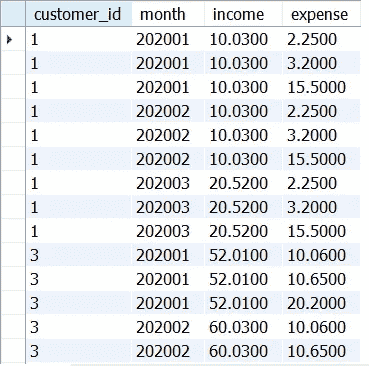

每月客户收入和支出—按作者分类的图片

啊哦！奇怪的事情发生了。让我们看看前三行——我们声明`customer_id = 1`在这个月(202001)有三笔不同的费用，这显然是不正确的，因为只有值`2.25`应该被映射。

这里发生了什么？我们错误地定义了我们的成分 2(关键)，而`SQL`只是以这种方式映射我们的数据(仅以`customer_id = 1`为例):

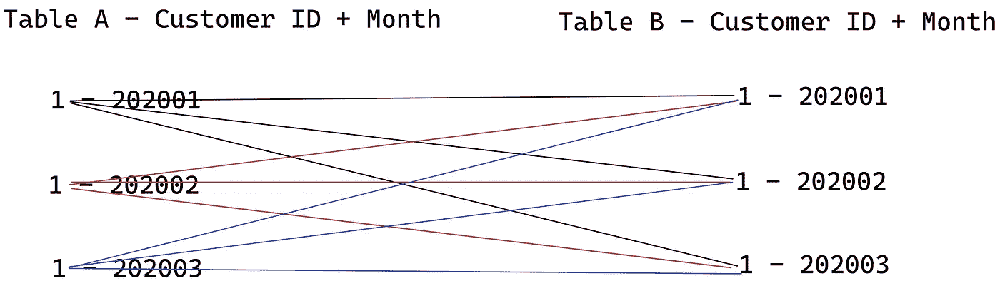

来自连接的多对多映射-按作者排列的图像

很困惑，不是吗？我只通过`customer_id`来绘制图表，因为这正是我们通过将它作为一个键所完成的映射。

SQL 将浏览表 A 寻找`customer_id = 1`，并且对于它在表 B 上找到的每个`customer_id = 1`实例，它都会生成一行，产生大量的副本！总结上图:

*   黑线是由表 a 的第一行生成的映射。
*   红线是表 a 第二行生成的映射。
*   蓝线是表 a 第二行生成的映射。

这是人们在争论数据时最常犯的错误之一— **不明白标识两个表上的行的键是什么，从而产生错误的数据。**

如何才能避免这种情况？我们显然希望在`customer_id`和每个`month`之间有一对一的关系，所以我们需要把它给我们的`join`:

```
select a.customer_id, a.month, a.income, b.expense
from sandbox.customer_income as a
inner join sandbox.customer_expense as b
on a.customer_id = b.customer_id and a.month = b.month;
```

我们通过在我们的`on`子句中传递`and a.month = b.month`来做到这一点！现在让我们看看输出:

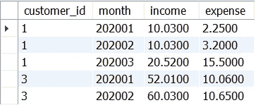

多键内部连接-作者图片

好多了！现在，我们正在进行以下映射:

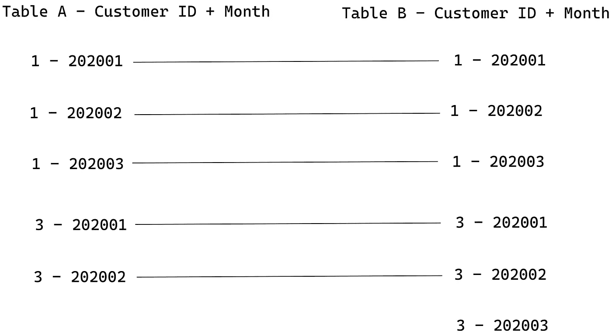

多键内部连接映射—作者图片

因为我们已经添加了正确的键，所以客户和月份之间的映射现在已经正确完成。不再有重复的支出和收入！

请注意，我们没有关于`customer_id = 3`的`month = 202003`输出的任何信息。为什么？因为我们选了一个`inner join`！

在这种情况下，我们在 2020 年 3 月从`customer_id = 3`获得`expense`是有意义的，即使我们没有从该客户获得任何`income`。

我们如何做到这一点？通过调整我们的第 3 个成分——我们希望传播到输出表的域！让我们看看，下一个。

# 右连接

再次从我们的视觉开始:

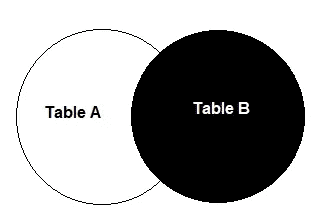

右连接图—作者图片

将关键字`inner`改为`right`，稍微调整一下我们的查询:

```
select a.customer_id, a.month, a.income, b.expense
from sandbox.customer_income as a
right join sandbox.customer_expense as b
on a.customer_id = b.customer_id and a.month = b.month;
```

该查询生成的输出是:

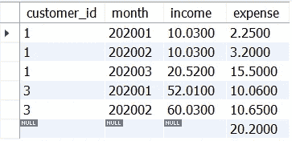

右连接输出-按作者分类的图像

我们现在有了从`customer_id = 3`到`month = 202003`的多出来的一行`expense`。然而，有些事情似乎有点奇怪，因为我们没有该行的`customer_id`或`month`的信息——为什么？

因为在`right`或`left`连接中，我们需要从命令连接的主表中选择键。我们联接中的主表是什么？你能猜到吗？

“右上”那张桌子，`customer_expense`，那上面有别名`b`！如果我们从该表中选择按键(`customer_id`和`month`):

```
select b.customer_id, b.month, a.income, b.expense
from sandbox.customer_income as a
right join sandbox.customer_expense as b
on a.customer_id = b.customer_id and a.month = b.month;
```

我们的输出表将更有意义:

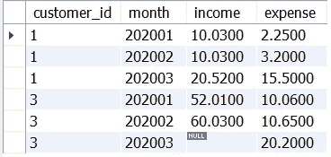

具有正确键的右连接输出—按作者排序的图像

在我们继续之前，我们已经更改了以下内容:

*   `select a.customer_id, a.month`被更改为`select b.customer_id, b.month`以匹配连接的主表。

从视觉上看，我们现在正在检索以下数据:

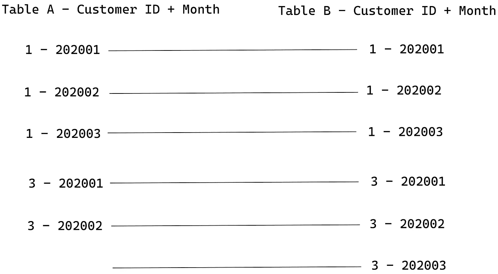

右连接映射-按作者分类的图像

简而言之，`right joins`从右边的表中检索数据(或者在我们的例子中是`table b`，不管左边的表中是否有这个键。

同样，我们也可以执行左连接！

# 左连接

在左侧连接中，“表 A”命令连接:

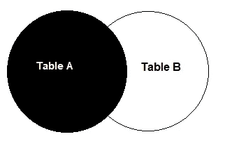

左连接图—作者提供的图片

对于左连接示例，我将再次选择`customer`和`customer_country`表:


客户表-按作者分类的图像


客户国家表-按作者分类的图像

我们已经看到，如果我们使用一个`inner`子句连接两个表，我们将只输出两个表中都可用的`customer_ids`。但是，如果我们想要宣传`Adam`，即我们没有任何原产国信息的客户，该怎么办呢？也许对于我们正在做的这个案例来说，不一定要有`Adam`的`customer_country`。

将表`customer`视为表 A，我们可以依靠表 a `left join`来完成:

```
select a.customer_id, a.customer_name, b.customer_country
from sandbox.customers as a
left join sandbox.customer_country as b
on a.customer_id = b.customer_id;
```

该`left join`将输出:

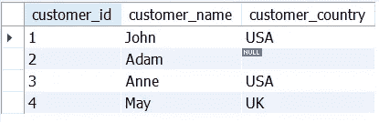

左连接输出示例-按作者排序的图像

在映射图中，会发生以下情况:

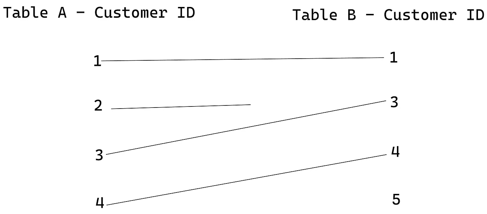

左连接映射-按作者分类的图像

只有`customer_id=5`没有被输出查询。为什么？因为它在我们在左连接中使用的“主”表上不可用，`customer`。

简而言之，当我们谈到`left joins`时，我们命名的第一个表就是主表。当我们谈到`right joins`时，主表将是关系中的第二个表。

# 完全外部连接

但是..如果我们想在输出中包含`customer_id=5`，即使我们不知道它的名字，该怎么办？我可能想要一份所有客户的汇总表，不管他们的身份如何— `full joins`随时为我们提供帮助:

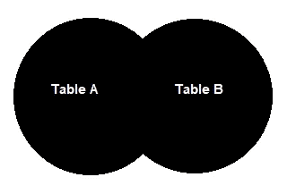

完整的外部连接图—作者提供的图片

不幸的是，`MYSQL`没有直接的`full outer join`实现(像 MS SQL 或 Oracle ),我们必须做一个变通方案:

```
SELECT 
 (case when a.customer_id IS NULL 
    THEN b.customer_id
    ELSE a.customer_id 
 END) as customer_id, 
    a.customer_name, 
    b.customer_country
FROM (
   SELECT customer_id FROM sandbox.customers UNION
   SELECT customer_id FROM sandbox.customer_country
) combined_keys LEFT JOIN
 sandbox.customers as a 
 ON a.customer_id = combined_keys.customer_id LEFT JOIN
 sandbox.customer_country as b 
 ON b.customer_id = combined_keys.customer_id;
```

该代码将输出:

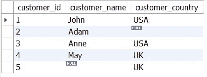

完整外部连接示例—作者图片

输出包含两个表中所有可用的`customer_ids`，并与`customers`和`customer_country`上的可用信息相关联。在映射方面，我们正在做以下工作:

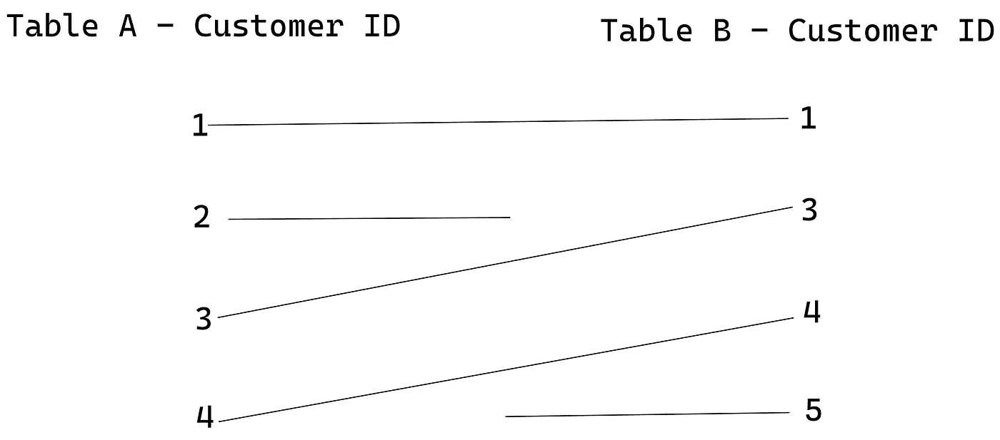

完整的外部连接映射-作者图片

`full joins`使我们能够查看我们的键的完整域，将它的每个实例映射到输出，而不管它们在哪个表中。`full joins`也是在缺失数据中寻找模式的好方法，因为它们映射了连接两边的表中可用信息的完整图景。

# 左侧或右侧反连接

最后，我们还可以执行`left`或`right`反连接——这将包括所有只在表 A 或表 B 上可用的行:

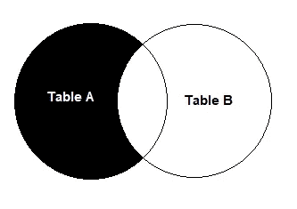

左侧反连接-作者提供的图像

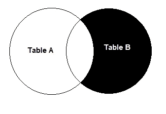

右反连接-作者图片

在 MySQL 中实现一个`anti join`非常简单。我们只需添加连接到我们想要排除的表的键的子句`IS NULL`。例如，为了执行一个`left anti join`，我们选择我们已经学过的`left join`并添加一个新的子句:

```
select a.customer_id, a.customer_name, b.customer_country
from sandbox.customers as a
left join sandbox.customer_country as b
on a.customer_id = b.customer_id
where b.customer_id IS NULL;
```

与`left join`相比，唯一改变的代码是在键定义后添加了`where`子句。

这将输出以下内容:

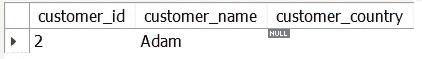

左侧反连接示例-作者提供的图像

要对右反连接进行同样的操作，只需切换键和连接类型。对于一个`right`反连接，您将需要一个`right join`与一个`where`子句相结合，该子句将具有`a.customer_id IS NULL`。

表连接对于构建稳定和正确的数据管道极其重要。作为总结，以下是您需要了解的执行正确连接类型的要素:

*   (1)我们要合并的表；
*   (2)我们要使用的密钥。
*   (3)我们希望保留在输出表中的域。
*   (4)我们要选取的列。

感谢你花时间阅读这篇文章！我在这篇文章中遗漏了一些连接，比如`cross join`或 pure `anti-join`，但是我相信当你在其他资源中读到它们时，你将能够使用这些知识来更好地理解它们。

***我在***[***Udemy***](https://www.udemy.com/course/sql-for-absolute-beginners/?couponCode=MEDIUM_SEPTEMBER)***上开设了一门关于从零开始学习 SQL 的课程，我在其中深入探讨了这些概念以及更多内容——这门课程适合绝对的初学者，我希望您能在我身边！***

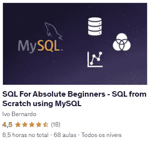

[SQL 绝对初学者教程](https://www.udemy.com/course/sql-for-absolute-beginners/?couponCode=MEDIUM_SEPTEMBER) —图片由作者提供

[](https://medium.com/membership/@ivopbernardo) [## 通过我的推荐链接加入 Medium-Ivo Bernardo

### 阅读我在 Medium 上的所有故事，了解更多关于数据科学和分析的信息。加入中级会员，您将…

medium.com](https://medium.com/membership/@ivopbernardo)