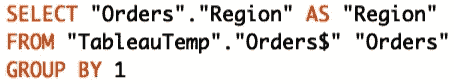
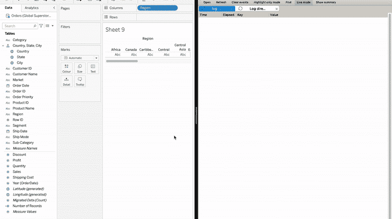
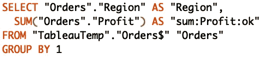
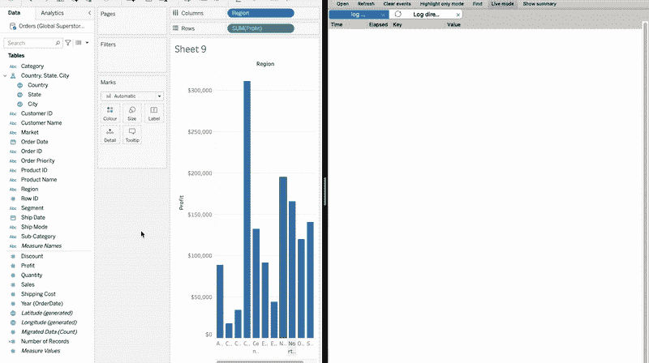
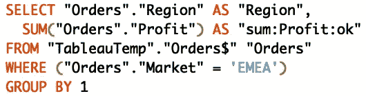
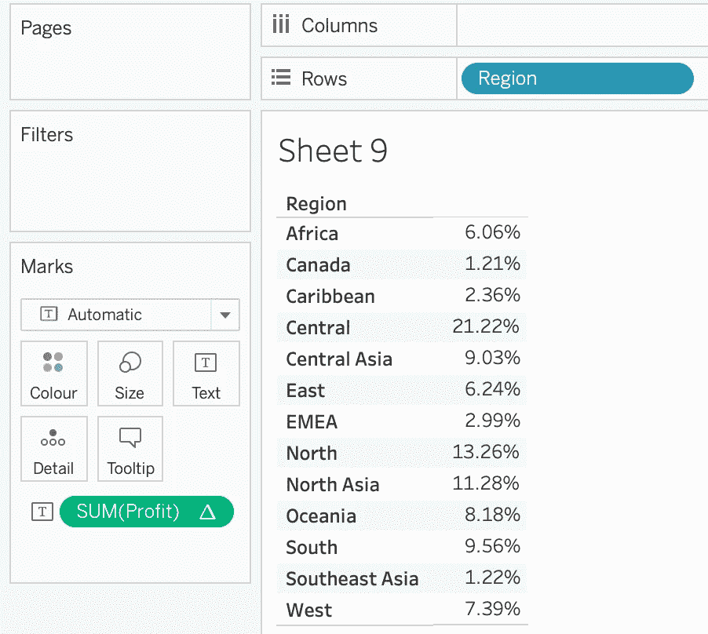
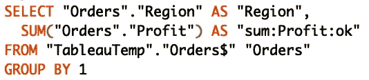
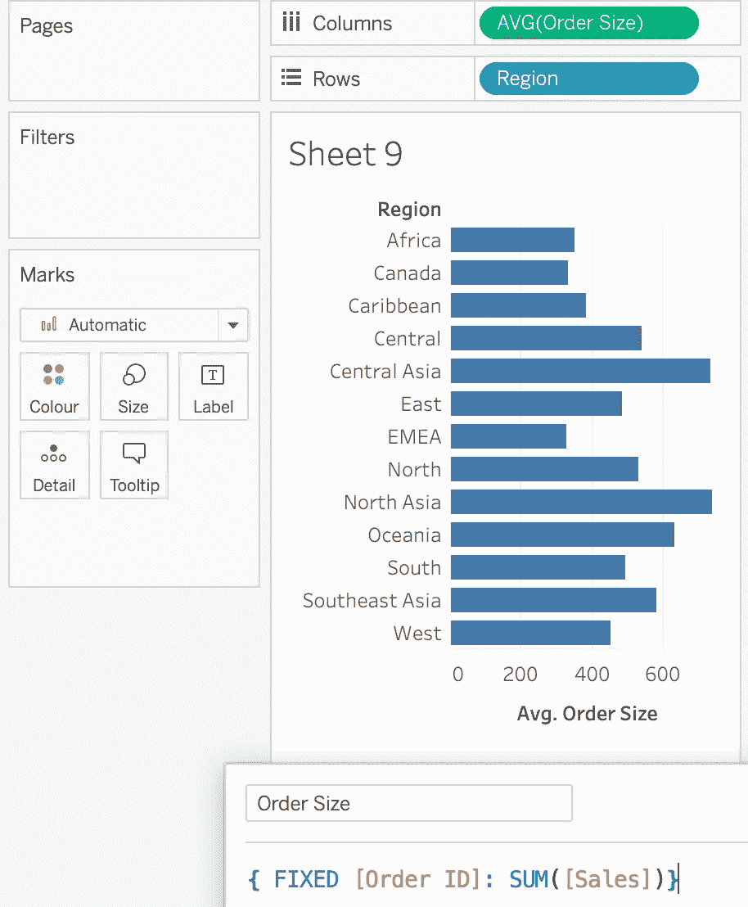
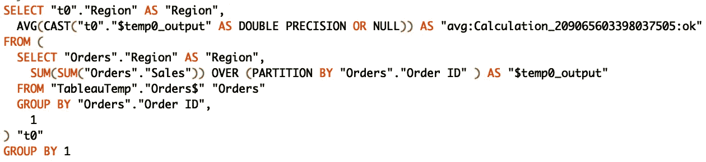
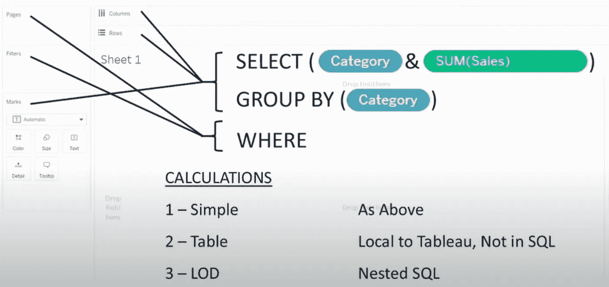

# 幕后场景

> 原文：<https://towardsdatascience.com/tableau-behind-the-scenes-ada520b5969d>

## 在您处理数据时揭示正在发生的事情

来自 Shutterstock 的波中断图像

Tableau 是一个令人难以置信的工具，它使每个人都能够看到和理解他们的数据。这可以在几秒钟内完成，其独特的拖放功能允许快速发现趋势和异常值。

> 即使你已经使用 Tableau 有一段时间了，当我们开始处理我们的数据时，仍然不太清楚到底发生了什么。

在这篇文章中，我将尝试用 4 个实际的例子来解释 Tableau 的幕后，更重要的是，如何应用这些概念来使你的 Tableau 技巧更上一层楼。

> 那么，幕后发生了什么？

本质上，Tableau 是一个 SQL 接口，这意味着当我们打开其空白画布并开始将维度和度量拖放到视图中时，Tableau 在后台为我们编写查询以提取数据并提供我们所需的分析。

更好地理解这个概念的方法是使用一个名为 **Tableau Log Viewer (TLV)** 的工具，它提供了在我们构建图表时由 Tableau 自动生成的查询的实时视图。如果你有兴趣自己尝试一下，TLV 是一个免费的工具，可以在这里下载**。此外，如果你对其他强大和隐藏的 Tableau 功能感到好奇，请查看我下面的另一篇文章，并让我知道我还应该添加什么。**

** [## 你应该马上开始使用的 10 个秘密场景

towardsdatascience.com](/10-secret-tableau-features-you-should-start-using-right-away-b0f14efa6570)** 

# **1.列和行**

**让我们从一个非常简单的例子开始。我将连接到超级商店表，我将获取“Region”**维度**并将其放入列中。正如您所看到的，在我这样做的时候，Tableau 自动生成了一个语句，将“Region”字段放在了 *SELECT* 和 *GROUP BY* 子句中:**

********

**作者图片**

**现在，让我们看看如果我们向视图添加一个**度量**会发生什么。一旦我将“利润”添加到行中，蓝色药丸就会作为 *SELECT* 语句的一部分出现。**

********

**这为什么有用？好吧，如果你努力理解蓝色药片和绿色药片之间的区别，你现在明白 Tableau 如何不同地使用它们了。事实上，当我们在视图中使用蓝色药丸或维度(“区域”)和绿色药丸或度量(“利润”)时，前者将出现在 *SELECT* 和 *GROUP BY* 语句中，而后者将只出现在 *SELECT* 语句中。**

# **2.过滤**

**再来做一个例子。我现在将“市场”放在**过滤器**架上，然后通过“EMEA”市场进行过滤。在记录器中，我可以立即看到‘Market’成为了 *WHERE* 子句的一部分。**

********

**作者图片**

**为什么重要？嗯，几乎所有进入 *WHERE* 子句的内容都可以被优化。您的数据库将通过索引进入 *WHERE* 子句的列来更快地处理查询，因此在这种情况下，我们可能会考虑对“Market”列这样做。**

# **3.简单计算和表格计算**

**现在让我们看看当我们使用**计算**时会发生什么。我已经准备好了一个“成本”，它是按照“销售额”和“利润”来计算的。正如你在下面看到的，这个计算实际上是由数据库推送和执行的，Tableau 只是将结果返回并在前端可视化。**

****

**作者图片**

****

****表格计算**被 Tableau 区别对待。在这种情况下，我关注的是不同“地区”产生的“利润百分比”。这实际上是在 Tableau 中执行的，因为如果我们查看下面的实际查询，在 *SELECT* 语句中没有提到计算总利润的百分比。**

****

**作者图片**

**同样，为什么这很重要？好吧，如果你的仪表板运行缓慢，你可能想把某些计算作为表格计算写入 Tableau。在其他一些情况下，您可能希望通过使用简单的计算将计算推到后端。**

# **4.详细等级表达式**

****

**我想展示的另一个例子与细节层次表达式(LOD)有关，它是 Tableau 中一个非常强大的工具，允许执行高级分析。就我而言，我只是试图计算出不同“地区”的“平均订单规模”。查看在后端生成的查询，我们可以看到它是一个嵌套的 *SELECT* 语句，因此我们有一个 *SELECT* 语句，它基本上是 LOD 本身，包装了另一个 *SELECT* 语句。**

****

**作者图片**

**LOD 通常被推送到后端数据库，就性能而言，您需要注意这将转化为更高级和繁重的查询。现在我们知道了这一点，我们可能希望在数据库中预先计算 LOD 表达式，这样 Tableau 就不需要自己计算它了。**

# **包装它**

**总之，下图总结了 Tableau 及其画布如何有效地成为一个 SQL 接口，在我看来，与自己编写这些查询相比，使用数据是一种更好的体验！**

****

**作者图片**

**我希望你发现了一些新的东西，这将有助于你获得最大的 Tableau！和往常一样，如果你有任何建议和意见，请联系我。**

**感谢阅读！**

**我正在创建一个与数据科学和分析相关的所有我最喜欢的课程、书籍和用例的列表。点击 [**链接**](https://landing.mailerlite.com/webforms/landing/v3w3s2) 即可在**免费**访问该内容。**

** [## 用我的推荐链接加入 Medium-Lore 那又怎样

### 阅读 Lore 的每一个故事那又怎样(以及媒体上成千上万的其他作家)。您的会员费直接支持…

medium.com](https://medium.com/@loresowhat/membership)**