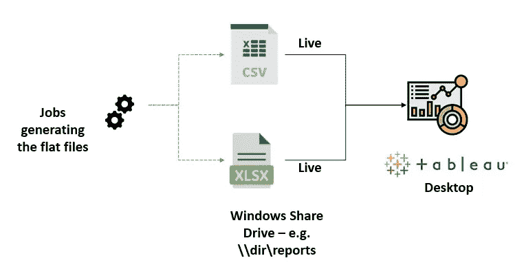
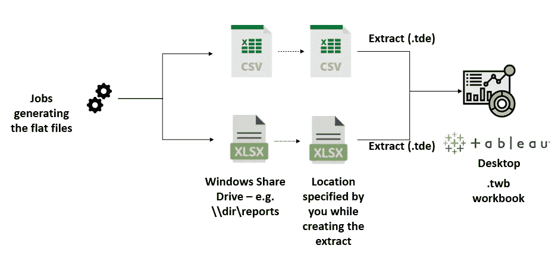
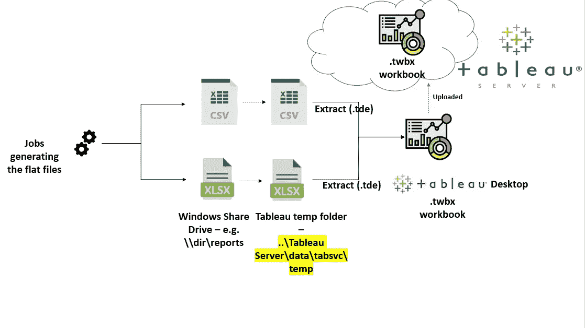

# 场景中令人毛骨悚然的怪癖和细微差别

> 原文：<https://towardsdatascience.com/tableau-the-good-and-the-bad-ba37a2ea0477>

## Tableau 中有效报告的常见问题和解决方案

图片由 [Vecteezy](https://www.vecteezy.com/) 上的 [Angga Afin87](https://www.vecteezy.com/members/anggaafin)

# 概观

众所周知，Tableau 是一个非常棒的可视化工具，可以帮助您从数据中获得可操作的见解。然而，就像俗话说的“没有完美的意大利面酱……”，Tableau 也有它的怪癖。在大多数情况下，您探索得越多，功能和解决方法就越多。让我们看看 Tableau 中几个常见问题的答案；和一些奇怪的场景。

# 我的数据存储在哪里？为什么我的仪表板没有刷新？

许多开始使用 **Tableau Server** 的人可能会问的一个常见问题是— **我的数据存储在哪里？为什么我的仪表板没有刷新？**这种情况在使用提取连接时尤其会发生。这是 Tableau 如何存储和处理数据文件的基本概述。

**图 1.0 Tableau 工作簿(。无包装和。twbx —打包)使用实时连接**(图片由作者提供)

在图 1.0 中，仪表板使用两个平面文件，它们是由一些每夜运行的作业生成的。文件被刷新，新数据不断被添加到平面文件中。由于 Tableau 桌面使用实时连接，仪表板将自动刷新，因为它引用了位于共享驱动器中由作业刷新的实际平面文件。

**图 1.1 未包装的 Tableau(.twb)使用提取连接的工作簿**(图片由作者提供)

在图 1.1 中，我们看一个使用摘录的 Tableau 工作簿。带一个。twb '工作簿中，提取文件将在创建提取时指定的相同位置进行刷新。换句话说，当您将数据连接从“实时”更改为“提取”时，它是 Tableau 要求您提供的位置。因此，如果您将它保存在原始文件所在的同一个 Windows 共享驱动器中，摘录将在那里保存和刷新。

图 1.2 Tableau 打包工作簿(。twbx)使用提取连接(图片由作者提供)

在图 1.2 中，我们看到一个使用提取连接的 Tableau 打包工作簿。作业在夜间运行，并刷新 Windows 共享驱动器中的文件。但是，Tableau 工作簿使用 Windows 共享驱动器中原始文件的提取副本。该摘录是原始文件的快照，存储在本地计算机的“Documents”文件夹中的 Temp 文件夹中。如果将此工作簿上载到 Tableau 服务器，则可以安排每天刷新摘录。这样，提取中的数据会按计划刷新，并且 Tableau 仪表板会在提取刷新后自动显示最新的数据。

图 1.3 Tableau 打包工作簿(。twbx ),使用提取连接(图片由作者提供)

在图 1.3 中，打包的工作簿驻留在 Tableau 服务器上。Tableau 服务管理器在服务器位置的“tabsvc/temp”文件夹中创建提取。

Tableau 提取极大地提高了工作簿的性能，尤其是在后续作业运行过程中有大量的行被增量添加到数据文件中时(或者在进行多个计算时)。

# 提取刷新时的错误消息故障排除

在某些情况下，Tableau 打包工作簿上可能会出现模糊的错误消息。想象一下，一个生产就绪的工作簿突然崩溃，并显示一些错误消息。这里有一个解决这些问题的技巧-

1.  打开包装。twbx 工作簿(即保存。twbx 作为. twb 工作簿)
2.  使用记事本编辑器，如 Notepad++等
3.  打开。使用 Notepad ++的 twb 工作簿
4.  。twb 工作簿采用“XML”格式。您可以对 XML 进行故障排除，以查看问题所在，并相应地修复它们。

# 向计算字段添加注释

向 Tableau 中的计算字段添加注释行通常很有用，以便在将工作簿传递给其他人时留下一些文档。在 Tableau 的计算字段中，可以使用/*添加单行注释，并以*/结尾。可以使用//添加多行注释。在早期版本的 Tableau (Tableau 2020)中，当工作簿上载到 Tableau 服务器时，它会给出一个错误。但是在 Tableau 的新版本中这个问题已经被修复了。另一个有趣的怪癖是单行注释应该在新的一行，而不是在 Tableau server 2020.2 中计算字段的同一行。在新版本中，这个问题也得到解决。

# **表格中的离散度量和小计**

不支持对离散度量值进行小计。这在 Tableau 中是一个非常糟糕的限制，它阻碍了表格报表的构建。有人可能会说 Tableau 是一个可视化工具，不应该用于构建表格报告。但是许多财务利益相关者通常想要简单的表格报表来满足他们的基本需求。

# **用真实世界的乱七八糟的数据在 word 云中缩放(调整缩放等。)**

你可能已经看到过在线博客帖子中用 Tableau 构建了漂亮的单词云。通常，这些看起来很好，因为数据被操纵以呈现良好缩放的良好输出。然而，当词云是用真实世界的数据构建的时候，规模并不是很大。“尺寸”牌有所帮助，但只是在一定程度上。当单个单词的数量几乎相同时；当你想用重量来衡量它们的时候，会变得非常棘手。

# **当一个图表被添加到工具提示中时，它不会收集所有被传递的数据值。**

是的，你没听错。如果您不知道，您可以将整个图表添加到工具提示中。当你将鼠标悬停在另一个图表上时，它就会显示出来。想象一下，有一个 KPI 单幅图块，当您将鼠标悬停在其上时，它会显示 KPI 随时间变化的趋势！这是一个很酷的功能。但是，如果您在 KPI 图块中使用了一些筛选器，则所有筛选器可能不会通过工具提示传递到正在显示的图表中。因此，在使用这个特性时，要确保所有的过滤器都从第一个图表传递到第二个图表。万一你不知道这个功能，这里有个有趣的阅读-[https://help . tableau . com/current/pro/desktop/en-us/viz _ in _ tooltip . htm](https://help.tableau.com/current/pro/desktop/en-us/viz_in_tooltip.htm)

# 数据源元数据

当您在 Tableau 中使用直接 SQL 查询作为数据连接时，字段会以精确的格式提取。例如，将列“AB_c”作为“AB_c”拉入。但是当. csv 文件用作数据源时，列“AB_c”将变成“AB C”。在将平面文件连接替换为实时数据库连接时要注意这一点，反之亦然。如果你足够早地采取行动，你可以节省很多时间来替换丢失的字段，并调整它们以使你的视觉效果再次工作。

# 某些计算函数可能无法用于某些数据连接

DATEPARSE 在实时数据库连接中不可用，但仅在平面文件连接中可用。因此，当您将数据源从平面文件替换为实时数据库连接时，您将需要替换所有使用“日期解析”函数的计算字段。同样，需要注意的是，正则表达式函数(正则表达式)可用于平面文件连接，但不能用于某些数据库连接，如 MySQL。另外，Tableau 为数据库连接提供了优秀的传递函数，使用户能够使用 SQL 语法(也称为 RAWSQL)开发计算字段。

# 刷新大型数据提取的时间

Tableau 需要很长时间来刷新大于 10gb 的提取。谢天谢地，信息实验室的 Philip Lowe 分享了这个有用的解决方法——[https://www . theinformationlab . co . uk/2016/06/23/wont-tableau-refresh/](https://www.theinformationlab.co.uk/2016/06/23/wont-tableau-refresh/)

# 按钮过滤器的可用性

Tableau 中的按钮过滤器本身不可用。但是，这可以通过使用 Bizfactory 扩展来实现。看看 https://getbootstrap.com/docs/4.0/components/buttons/。我个人最喜欢的是 btn btn-outline-info。

# KPI 单幅图块不可用

与 PowerBI 等工具不同，Tableau 没有现成可用的 KPI 图块。但是，可以使用文本表格和趋势从头开始创建它们。多个工作表可以作为浮动视图放在一起，并相互叠加，模拟 KPI 图块的外观。当发布到 Tableau 服务器时，可以使用容器将这些 KPI 图块的成分保存在一起。

# Tableau 中的警报——一个可以做得更好的很酷的功能

警报是一个非常有用的工具，可以帮助实现控制图和异常检测等功能。当一个数据点超过某个阈值时，它们可以让利益相关者得到通知。奇怪的是，每次警报运行时，Tableau 警报机制都会查找所有过去的数据，并针对每个数据违规发出警报。幸运的是，有一些变通办法可以帮助设置当前日期的提醒。这里有一些由其他开发人员提出的有趣的解决方法-[https://community . tableau . com/s/question/0d 54t 00000 c 6 cbgsab/trying-make-alerts-work-on-current-date-而不是-the-whole-graph](https://community.tableau.com/s/question/0D54T00000C6cbgSAB/trying-to-make-alerts-work-on-current-date-rather-than-the-entire-graph)

如果你不熟悉 Tableau 中的提醒，可以看看这个—[https://help . Tableau . com/current/pro/desktop/en-us/data _ alerts . htm](https://help.tableau.com/current/pro/desktop/en-us/data_alerts.htm)

# 结束语

是的，我同意霍华德·莫斯科维茨的观点——“没有完美的意大利面酱。有完美的意大利面酱”。没有一种工具是完美的，但是如果一种工具可以从另一种工具中学习，那就太好了。Tableau 不是完美的工具，但它是一个伟大的工具，不断发展和实现新的特性和功能。虽然有些古怪和细微差别，但总有一个或多个变通办法可以达到你的目的。提前计划并设计使用上述策略的仪表板可以帮助节省时间，并生成高效的仪表板和准确的业务报告。

# **其他有用的参考资料**

[Tableau 服务器“dataengineextract”文件夹消耗磁盘空间| Tableau 软件](https://kb.tableau.com/articles/issue/Tableau-Server-dataengineextract-Folder-Consumes-Disk-Space)

[临时文件夹中的 Tableau hyper Extract](https://community.tableau.com/s/question/0D54T00000C6JquSAF/tableau-hyper-extract-in-temp-folder)

[提取文件路径显示 Tableau 数据提取连接对话框中的临时位置| Tableau 软件](https://kb.tableau.com/articles/issue/extract-file-path-displays-temp-location-in-tableau-data-extract-connection-dialog)

[Tableau 桌面和 Tableau 服务器中的临时表| Tableau 软件](https://kb.tableau.com/articles/howto/temp-tables-in-tableau-desktop-and-tableau-server)

**符号&图标演职员表** 一些由[像素完美制作的图标](https://www.flaticon.com/authors/pixel-perfect)来自[www.flaticon.com](http://www.flaticon.com/)