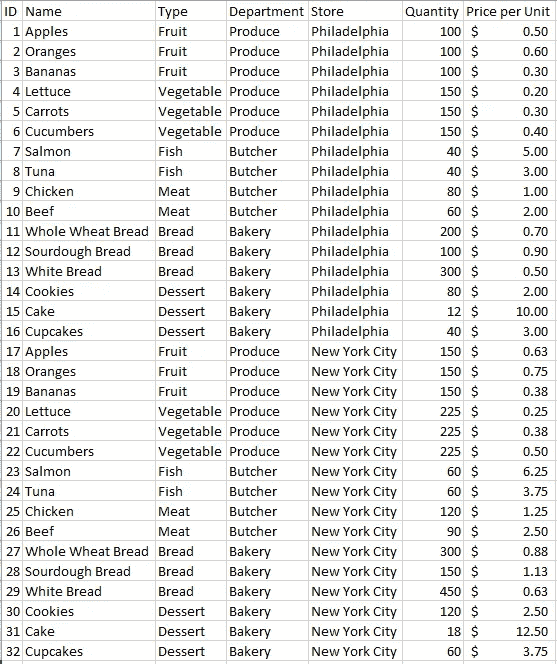
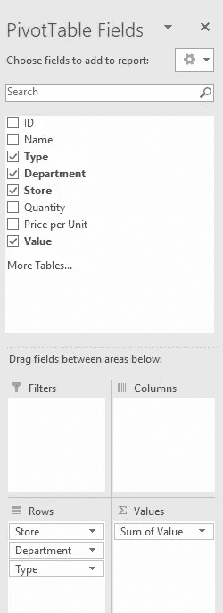
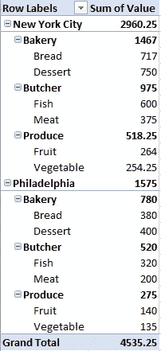
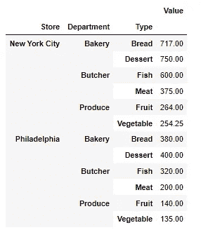
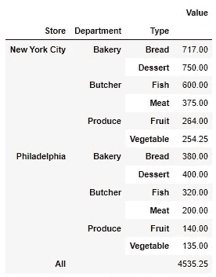
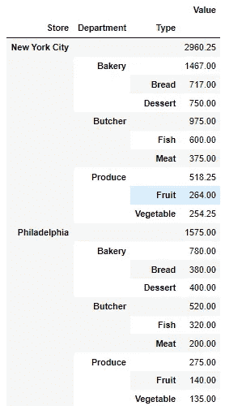
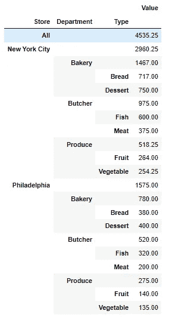

# 在 Python 熊猫透视表中动态制表小计

> 原文：<https://towardsdatascience.com/tabulating-subtotals-dynamically-in-python-pandas-pivot-tables-6efadbb79be2>


斯科特·格雷厄姆在 Unsplash 上的照片

## Pandas 库的内置 pivot 函数目前的一个缺点是缺乏为多级数据动态收集小计。我们可以编写自己的函数来添加这个特性，类似于 Excel 中的函数。

数据透视表是汇总另一个数据源的转换或操作的数据工具。它们对于展示大型数据集的关键见解非常有用，几十年来一直是 Excel 和其他类似电子表格系统的一部分。虽然在 Excel 和其他工具套件中设置它们相对容易和简单，但将它们添加到 Python 中的自动化脚本可能会稍微有些微妙，主要是在 Excel 数据透视表中默认存在的数据集上添加转换和小计时。

在我们的练习中，我们将首先在 Excel 中可视化我们的数据以进行基线比较，然后在 Python 中创建一个能够产生类似结果的函数。

我们将使用的数据集是两个不同商店的杂货店库存的虚拟样本。我们有产品、数量和单位成本的细目分类。我在本地将这些数据保存为 CSV 格式。



让我们假设一个业务问题:出于保险目的，我们想知道我们拥有的产品按类型、部门和地点的总价值是多少。这里的关键是，除了商店和商店之间的总计之外，我们还有每个级别的小计。

我们的第一步是添加一个列，它是数量和单位价格的乘积，以找到该系列商品的总价值。在这种情况下，我们在费城的苹果总价值是 50 美元，或 100 x 0.50 美元。

接下来，我们可以插入数据透视表，方法是选择所有数据，导航到“插入”选项卡，然后选择“数据透视表”和一个目标。

通过如下配置数据透视表的行和值，我们可以生成所需的细分。



Excel 数据透视表和数据

这些数据现在可以通过我们的保险代理、公司领导等进行投保。但是，如果这些数据每周都在变化，我们就会浪费时间每周创建一个新的电子表格，配置一个数据透视表，并通过电子邮件向利益相关者发送附件。这尤其浪费，因为我们每周没有创造新的价值，只是花费时间和精力来维持当前的价值！这可以通过 Python 自动化来避免。

我们选择 Python 作为数据透视表的自动化工具有几个原因:

*   易于使用，Python 的 Pandas 库拥有我们构建数据透视表所需的所有工具
*   集成，我们可以使用 Pandas 从 CSV、Excel、SQL 甚至 web 中读取数据
*   灵活的输出，我们可以将数据返回到电子表格或上传到 web 仪表板

在创建了一个新的 Jupyter 笔记本之后，这个示例应用程序唯一需要的库就是 pandas。

```
import pandas as pd
```

让我们也从上面 Excel 中使用的同一个 CSV 中读取数据。

```
df = pd.read_csv('GroceryData.csv')
df['Price per Unit'] = df['Price per Unit'].replace('\$', '', regex=True)
df['Price per Unit'] = pd.to_numeric(df['Price per Unit'])
df['Value'] = df['Quantity']*df['Price per Unit']
df
```

请注意，因为 CSV 有一个带美元符号的格式化列，所以我们需要删除该字符以转换为浮点型。我们还将为 Value 创建一个新列:单位数量和单位价格的乘积。生成的数据框如下。


有多种 Pandas 方法对上述数据进行汇总，其中有两种方法包括 [groupby 方法](https://pandas.pydata.org/pandas-docs/stable/reference/api/pandas.DataFrame.groupby.html)和 [pivot_table 方法](https://pandas.pydata.org/pandas-docs/stable/reference/api/pandas.pivot_table.html)。请注意，Pandas 确实有一个 pivot 方法，但它不同于 pivot table，因为它不包含聚合方法参数。

在我们的练习中，我们将在 groupby 上使用 pivot _ table 可以使用 groupby 开发类似的函数，但 pivot_table 本身会返回另一个数据框，从而可以轻松导出到 Excel 或其他电子表格工具。

方法的实现如下。

```
df.pivot_table(values='Value',index=['Store','Department','Type'],aggfunc='sum')
```

我们可以看到，输出看起来类似于我们在 Excel 中没有小计。



唯一对我们有帮助的内置参数是“margins ”,但是实现这个参数只会添加一个标题为“All”的最终总计。

```
df.pivot_table(values='Value',index=['Store','Department','Type'],aggfunc='sum',margins=True)
```



为了添加商店和部门的小计，我们需要构建一个循环，该循环将重复创建 pivot_table，每次迭代都添加另一个级别的索引进行制表，然后将所有数据帧连接在一起。理想情况下，这也将动态发生，以适应具有更多级别的索引或其他列的未来数据集。相关函数如下。

```
def pivot_table_w_subtotals(df, values, indices, columns, aggfunc, fill_value):
    '''
    Adds tabulated subtotals to pandas pivot tables with multiple hierarchical indices.

    Args:
    - df - dataframe used in pivot table
    - values - values used to aggregrate
    - indices - ordered list of indices to aggregrate by
    - columns - columns to aggregrate by
    - aggfunc - function used to aggregrate (np.max, np.mean, np.sum, etc)
    - fill_value - value used to in place of empty cells

    Returns:
    -flat table with data aggregrated and tabulated

    '''
    listOfTable = []
    for indexNumber in range(len(indices)):
        n = indexNumber+1
        table = pd.pivot_table(df,values=values,index=indices[:n],columns=columns,aggfunc=aggfunc,fill_value=fill_value).reset_index()
        for column in indices[n:]:
            table[column] = ''
        listOfTable.append(table)
    concatTable = pd.concat(listOfTable).sort_index()
    concatTable = concatTable.set_index(keys=indices)
    return concatTable.sort_index(axis=0,ascending=True)
```

执行这个函数，我们可以看到结果数据帧。

```
pivot_table_w_subtotals(df=df,values='Value',indices=['Store','Department','Type'],columns=[],aggfunc='sum',fill_value='')
```



请注意，现在我们有了按商店和部门分类汇总！我们现在只是缺少总计，但是我们可以通过仅在一次迭代中使用“margins”函数参数来添加总计。

```
def pivot_table_w_subtotals(df, values, indices, columns, aggfunc, fill_value):
    '''
    Adds tabulated subtotals to pandas pivot tables with multiple hierarchical indices.

    Args:
    - df - dataframe used in pivot table
    - values - values used to aggregrate
    - indices - ordered list of indices to aggregrate by
    - columns - columns to aggregrate by
    - aggfunc - function used to aggregrate (np.max, np.mean, np.sum, etc)
    - fill_value - value used to in place of empty cells

    Returns:
    -flat table with data aggregrated and tabulated

    '''
    listOfTable = []
    for indexNumber in range(len(indices)):
        n = indexNumber+1
        if n == 1:
            table = pd.pivot_table(df,values=values,index=indices[:n],columns=columns,aggfunc=aggfunc,fill_value=fill_value,margins=True)
        else:
            table = pd.pivot_table(df,values=values,index=indices[:n],columns=columns,aggfunc=aggfunc,fill_value=fill_value)
        table = table.reset_index()
        for column in indices[n:]:
            table[column] = ''
        listOfTable.append(table)
    concatTable = pd.concat(listOfTable).sort_index()
    concatTable = concatTable.set_index(keys=indices)
    return concatTable.sort_index(axis=0,ascending=True)pivot_table_w_subtotals(df=df,values='Value',indices=['Store','Department','Type'],columns=[],aggfunc='sum',fill_value='')
```



太棒了，现在有了一个完整的数据透视表，类似于从 Excel 中得到的数据透视表！该表现在可以以多种方式自动导出，例如导出到基于 web 的仪表板或 Excel 的 XLSX 或 CSV 文件。

与数据工程师通常遇到的数据集相比，我们在这里共同研究的案例范围相对较小，但是同样的原则应该适用于构建具有多个级别的动态数据透视表。请随意修改并分享您的用例！

请让我知道您的想法，并随时通过 LinkedIn 联系我，向我提供反馈，提出问题，或者看看我们如何将这些工具和思维方式引入您的组织！点击这里查看我的其他一些关于数据分析和可视化的文章[！](https://medium.com/@willkeefe)