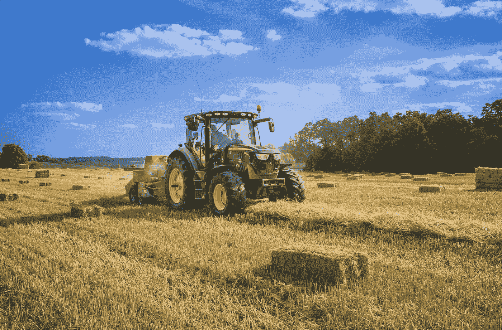
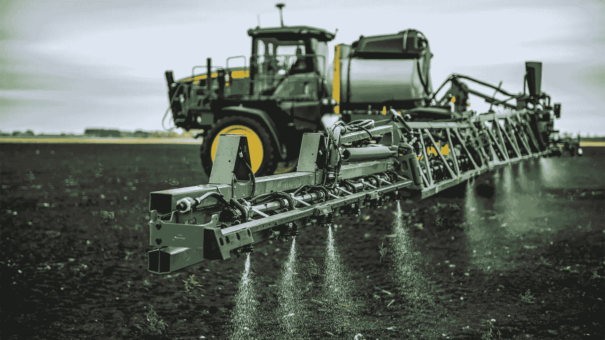
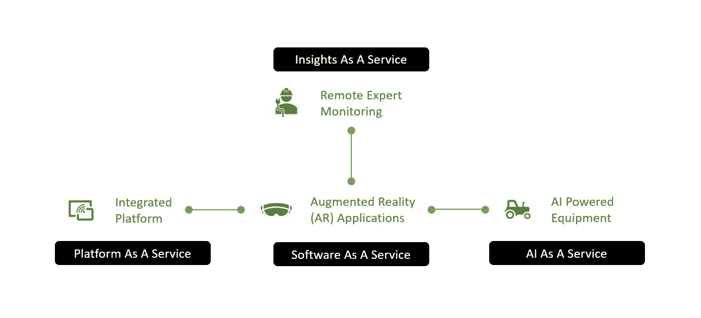
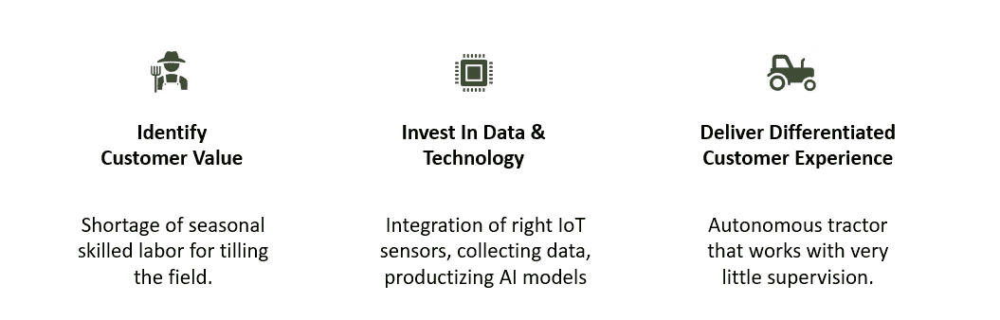
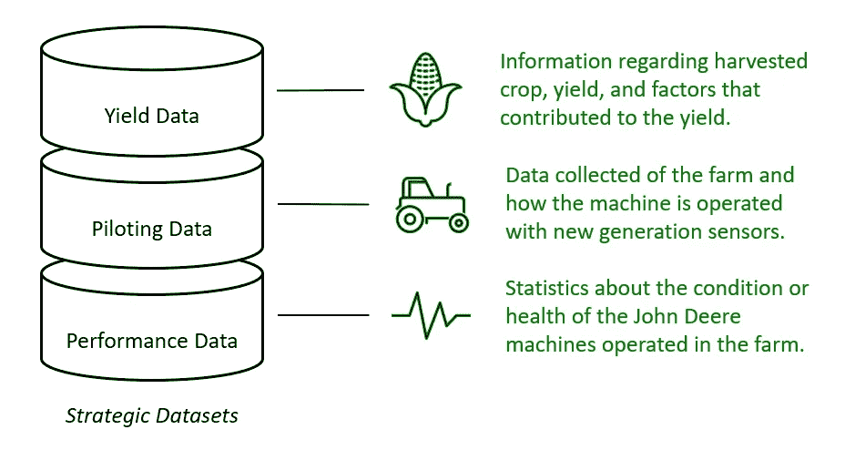
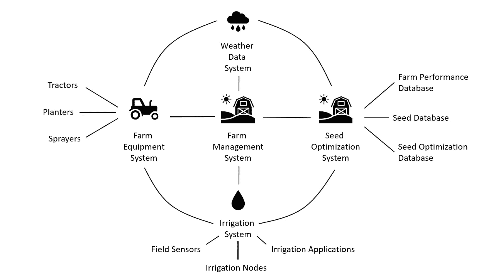

# 用数据战略应对全球食品挑战 John Deere 的故事

> 原文：<https://towardsdatascience.com/tackling-global-food-challenge-with-data-strategy-story-of-john-deere-a60664003495>

John Deere 提供的农业机械基本上允许农民进行机械化耕作，大规模种植作物，并使农业能够满足当前的需求。到 2050 年，全球人口预计将增长到 96 亿。世界资源研究所估计，为了养活如此庞大的人口，我们需要在 2050 年生产比 2006 年多 69%的食物卡路里。这个行业需要所有能得到的创新，数据肯定会起到关键作用。

兰迪·法特在 [Unsplash](https://unsplash.com?utm_source=medium&utm_medium=referral) 上的照片

在之前的一篇文章中(下面的链接)，我们确定了数据战略定义了您的组织如何利用数据来实现可持续的竞争优势。在本文中，我们将了解 John Deere 如何成功开发了一项伟大的数据战略，并正在执行该战略，以使自己在竞争中处于领先地位，并为农业行业释放新的价值。

# 商业和人工智能展望

作为一家农业设备提供商，John Deere 在一个竞争相当激烈的环境中运营。他们最大的竞争对手包括卡特彼勒(美国)、CNH Industrial(英国)、久保田公司(日本)、AGCO(美国)和 Claas KGaA(德国)。因此，一个稳健的商业战略不应该仅仅依赖于市场增长。总体战略是成为一家农业技术(或 precision ag)公司，并提供由数据驱动的附加服务。

查看来自 [John Deere 新闻稿](https://www.deere.com/en/our-company/news-and-announcements/news-releases/2021/agriculture/2021mar02-john-deere-launches-see-and-spray-select/)的& Spray 照片

John Deere 即将提供的服务之一是其由人工智能驱动的拖拉机的自主操作。操作拖拉机是一项需要大量季节性劳动力的技术工作，自动化对农民来说有着巨大的潜力。John Deere 应用人工智能的另一个领域是杂草喷雾器。John Deere 声称，See & Spray 通过只瞄准和喷洒杂草，可以帮助农民平均减少 77%的除草剂使用量。

# 商业策略

在此[视频](https://www.youtube.com/watch?v=t08nOEkrX-I)中，John Deere 分享了他们在 2013 年的愿景 Farm Forward。这是 2019 年在这个[视频](https://www.youtube.com/watch?v=nKAz-g7MAxs)中发布的一个更新版本(Farm Forward 2.0)。这个未来农场的愿景有以下几个主要部分:

1.  **人工智能驱动的设备:**人工智能为农业行业带来了巨大的潜力，因为它可以自动化单调的任务(例如驾驶拖拉机)，并使操作更加高效(例如喷洒杂草)。
2.  **集成平台:**将智能农业的所有组成部分整合在一起，简化数据访问。
3.  **远程专家监控:**通过远程连接和干预监控降低专家投入的成本。
4.  **增强现实(AR)应用:**适应新技术是农业行业面临的一项挑战。借助语音命令和增强现实，农民可以轻松掌控这些复杂的技术。

农场前进 2.0 愿景(图片由作者提供)

目前，上述大多数组件都是作为服务提供给农民的。展望未来，数据战略的角色应该是通过提供可持续的竞争优势，使这些服务在市场中独树一帜。

# 数据策略

上面解释的业务策略为形成数据策略奠定了坚实的基础。要制定强有力的数据战略，我们首先需要了解客户价值。例如，操作拖拉机的季节性熟练工人严重短缺。如果这个问题可以用自动拖拉机解决，它将为客户释放巨大的新价值。然而，为了实现这一使用案例，John Deere 需要从他们的拖拉机上收集图像。这需要前期投资来改造他们的拖拉机，建立一个平台，并分配熟练的资源来将人工智能产品化。

执行端到端数据策略的步骤(图片由作者提供)

除了图像数据，拖拉机还是其他战略数据集的数据源。战略数据集是您的组织可以利用来获得可持续竞争优势的重要资产。例如，与连接到拖拉机的机器一起，可以收集作物产量数据，并需要提供远程专业知识。在 [CES2022](https://www.youtube.com/watch?v=bZM_ZzxihTg) 上，John Deere 表示，从六个立体摄像机中收集了 5000 万幅 RGBD(红色、绿色、蓝色和深度)图像，用于构建自动驾驶拖拉机的 AI 模型。

从拖拉机收集的战略数据集(图片由作者提供)

从长远来看，竞争对手也有可能引入相同的功能，要么通过使用他们自己的人工智能系统，要么通过第三方公司。数据战略需要确保这些数据集继续成为竞争优势。此外，现在的农民不仅生产农作物，还生产大量的数据！John Deere 控制着这些数据的很大一部分，但肯定不是全部。迈克尔·波特是商业战略领域最具影响力的人物之一，他在 2014 年预见到了这种转变，并写了一篇关于 HBR 的文章。在这篇文章中，他观察了像 John Deere 这样的公司如何通过构建平台来扩展其能力，并有目的地将自己定位为系统集成商。他还进一步指出，未能适应的公司可能会被降级为 OEM 供应商。

来源:迈克·E·波特和詹姆斯·e·赫本曼在 HBR 发表的《智能互联产品如何改变竞争》(图片由作者重新绘制)

John Deere 的平台 MyJohnDeere 支持第三方在其平台上构建应用程序。由于这些应用程序可以轻松利用从机器收集的数据和从其他提供商收集的数据(即天气、土壤条件)，第三方在 MyJohnDeere 上构建其应用程序并成为其生态系统一部分的动机非常强烈。目前，该平台还可以与供应商集成，以管理农场的“及时”供应，如种子和肥料等。

John Deere 数据战略概述(图片由作者提供)

随着 John Deere 在其平台上安装更多的传感器和更多的第三方，他们可以利用的数据量急剧增加。这很好，因为远程提供专家干预需要来自所有不同来源的大量数据。通过从他们的机器上收集数据，并用人工智能和服务将其货币化；John Deere 在农场独特地定位自己及其产品，释放新的客户价值，并为满足未来的食品需求铺平道路。

**免责声明:**我与 John Deere 没有任何赞助或关联。由于我对数据策略的专业兴趣，我一直在关注他们。为撰写本文而收集的信息是通过从公共来源收集信息来完成的，为此我在下面放了一些链接。

**参考文献**

着眼于释放客户价值，迪尔宣布新的运营模式—[https://www . Deere . com/en/news/all-news/2020 jun 17-New-Operating-Model/](https://www.deere.com/en/news/all-news/2020jun17-new-operating-model/)

John Deere 在 CES 2022 上展示全自动拖拉机—[https://www . Deere . com/en/our-company/news-and-announcements/news-releases/2022/agriculture/Autonomous-Tractor-reveal/](https://www.deere.com/en/our-company/news-and-announcements/news-releases/2022/agriculture/autonomous-tractor-reveal/)

John Deere 为 400 和 600 系列喷雾器推出 See & Spray Select—[https://www . Deere . com/en/our-company/news-and-announcements/news-releases/2021/agriculture/2021 mar 02—John-Deere-launches-See-and-Spray-Select/](https://www.deere.com/en/our-company/news-and-announcements/news-releases/2021/agriculture/2021mar02-john-deere-launches-see-and-spray-select/)

农场到数据表:约翰迪尔和精准农业中的数据—[https://digital . HBS . edu/platform-digital/submission/farm-to-Data-Table-约翰迪尔和精准农业中的数据/](https://digital.hbs.edu/platform-digit/submission/farm-to-data-table-john-deere-and-data-in-precision-agriculture/)

从产品到平台:John Deere 改革农业—[https://digital . HBS . edu/data-and-analysis/product-platform—John-Deere—改革农业/](https://digital.hbs.edu/data-and-analysis/product-platform-john-deere-revolutionizes-farming/)

数据主导—[https://www . BCG . com/publications/2020/how-data-can-create-competitive-advantage](https://www.bcg.com/publications/2020/how-data-can-create-competitive-advantage)