# 应对带回家的挑战

> 原文：<https://towardsdatascience.com/tackling-the-take-home-challenge-7c2148fb999e>

## Python 和 Jupyter 笔记本电脑的 EDA 挑战示例


[照片](https://unsplash.com/photos/ZTcfIKLmMKM)由 Elisa Ventur 通过 Unsplash 拍摄

一个流行的数据职位的家庭作业包括探索性数据分析或 EDA。给你一个或三个数据集，让你分析这些数据。

一家公司可能会给你这种任务，以洞察你的思维过程。他们想看看你如何处理一个新的数据集，当然也想确保你具备他们所需的技术技能。

虽然开放式挑战可以让你展示自己的优势和创造力，但却很难知道从哪里开始。

他们经常说你可以使用任何你喜欢的技术。使用一种你熟悉的语言，并且你面试的公司也在使用这种语言，这是有意义的。

任何时候我都可以选择使用 Python 和 Jupyter 笔记本。

Jupyter 笔记本可以让您轻松展示自己的思考过程，并以一种易于呈现的格式记录您的过程。

要记住的重要一点是，如果公司决定继续进行，成功完成带回家的挑战之后通常会讨论你的工作。重要的是能够解释你的思维过程，并且在后续的采访中能够自如地谈论你的代码。

在这里，我们将完成一个带回家的挑战示例。

# 挑战

在这个挑战中，公司给了我们一个非常开放的任务:探索一些数据。

虽然获得一个灵活的任务是一个突出我们优势的好方法，也许可以避免我们的弱点，但是没有明确的目标开始也是一个挑战。

我们将在这里使用的数据集是我们在[这篇文章](/generating-fake-data-with-python-c7a32c631b2a)中创建的小部件工厂数据集，在这里我们通过 Python 生成假数据。

对于我们的示例挑战，我们有一个带说明的降价文件:


我们带回家挑战的说明

markdown 文件对于了解我们将要处理的数据类型非常有帮助。它包括数据定义和一个非常开放的指令。

因为本质上没有限制，我们将使用 Python 和 Jupyter 笔记本。

# 第 0 步——为成功做准备

我在电脑上有一个目录，里面包含了我在求职中完成的每一个带回家的挑战。在这个目录中，我有子目录，里面有我完成任务的每家公司的名称。

我喜欢保留旧代码。很多次我回到一个或另一个笔记本，知道我在过去做过类似的事情，并且能够为当前的任务修改它。

在开始之前，让我们为我们的挑战创建一个`widget_factory`目录，并将所有文件移动到其中，以便于访问和组织。

# 开始—读入数据并询问基本问题

我喜欢采取的第一步是读入数据，并针对每个数据集分别提出简单的问题:

*   我有多少数据？
*   是否存在缺失值？
*   数据类型有哪些？

让我们探索我们的数据集:

```
# read in worker data
worker_df = pd.read_csv('data/workers.csv')
print(worker_df.shape)
worker_df.head()
```

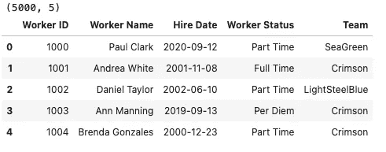

工作数据集:示例

因为我们将所有文件都移动到了我们的`widget_factory`目录中，所以我们可以使用相对路径来读入数据。

我喜欢在编码任务中使用相对路径，原因如下:

*   它使代码看起来干净整洁。
*   审阅者将无法辨别您使用的是 Mac 还是 PC。
*   我倾向于认为，让评审者无需更改路径就能简单地运行您的代码，您会得到加分。

我们读入文件，检查形状，并打印样本。我想马上采取的一些其他步骤是检查数据类型、唯一值的数量以及检查空值。

```
# check number of unique values in the dataset
for i in list(worker_df.columns):
    print(f'Unique {i}: {worker_df[i].nunique()}')
```

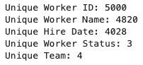

工作数据集:按列列出的唯一值

```
# checking for null values
worker_df.isnull().sum()
```

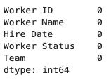

工作数据集:空值

我们有一个相对干净的数据集，没有缺失值。

```
# statistics about numerical data
### 'Worker ID' is the only numerical column  - this column is an identity column according to the readme
worker_df.describe()
```

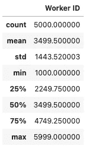

工作数据集:数字数据描述

我们唯一的数字列是`Worker ID`，它是一个标识列。

```
# checking column types
###### 'Hire Date' column isn't a date - we'll need to fix 
worker_df.info()
```

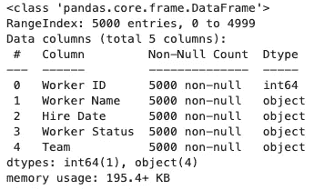

工人数据集:信息

```
# convert 'Hire Date' to datetime
worker_df['Hire Date'] = pd.to_datetime(worker_df['Hire Date'])# check that it worked
print(worker_df.info())# check date range of dataset
print(f"Min Date: {worker_df['Hire Date'].min()}")
print(f"Max Date: {worker_df['Hire Date'].max()}")
```


工作数据集:将“雇用日期”列转换为日期时间后的信息

对于小部件数据集，我们遵循与上面相同的步骤。这些步骤的代码可以在 Github 上的完整笔记本中找到。

# 绘图-可视化数据

在回答了关于数据的简单问题后，下一步是可视化。

我喜欢从更基本的可视化开始。对我来说，这意味着一次处理一个变量，然后探索特征之间的关系。

我们的工作数据集包含五个要素。让我们分别研究一下每个特性。

我们从`readme`文件中知道`Worker ID`是一个标识列。我们在检查唯一值时也证实了这一点。由于每行都有一个唯一的值，我们可以安全地跳过这个列的可视化。

虽然`Worker Name`只有 4820 个唯一值，但我认为这也是一个标识列。我们可以说，查看哪些工人有相同的名字，或者检查可能的重复记录可能是有趣的，我们现在将跳过对这个特性的进一步探索。

我们的下一个功能是`Hire Date`。在这里，我们可以绘制最常见的雇用日期，以探索员工是否有共同的雇用日期。

为此，首先我们需要计算唯一日期的数量。虽然有很多方法可以实现这一点，但我喜欢使用`Counter`。

从 [Python 文档中，](https://docs.python.org/3/library/collections.html#collections.Counter) `Counter`创建一个字典“其中元素存储为字典键，它们的计数存储为字典值”。这将很容易创建一个条形图来显示我们的计数。

获得计数后，我们可以使用 Seaborn 创建一个柱状图。

```
# visualize hire date
# first Count all unique datesfrom collections import Counterhire_dates = Counter(worker_df['Hire Date'].dt.date)# get dates and date counts
common_dates = [d[0] for d in hire_dates.most_common(15)]
common_counts = [d[1] for d in hire_dates.most_common(15)]# [https://stackoverflow.com/questions/43214978/seaborn-barplot-displaying-values](https://stackoverflow.com/questions/43214978/seaborn-barplot-displaying-values)
# function to show values on bars
def show_values_on_bars(axs):
    def _show_on_single_plot(ax):        
        for p in ax.patches:
            _x = p.get_x() + p.get_width() / 2
            _y = p.get_y() + p.get_height()
            value = '{:.0f}'.format(p.get_height())
            ax.text(_x, _y, value, ha="center")if isinstance(axs, np.ndarray):
        for idx, ax in np.ndenumerate(axs):
            _show_on_single_plot(ax)
    else:
        _show_on_single_plot(axs)# plot most common hire dates
fig, ax = plt.subplots()
g = sns.barplot(common_dates, common_counts, palette='colorblind')
g.set_yticklabels([])# show values on the bars to make the chart more readable and cleaner 
show_values_on_bars(ax)sns.despine(left=True, bottom=True)
plt.xlabel('')
plt.ylabel('')
plt.title('Most Common Hire Dates', fontsize=30)
plt.tick_params(axis='x', which='major', labelsize=15)
fig.autofmt_xdate()
plt.show()
```

在为任何演示文稿创建可视化效果时，我喜欢通过删除不需要的标签和线条来保持图表的整洁。

我还确保使用一致的调色板——这里我们用的是 Seaborn 的色盲调色板。

在带回家挑战中，可能是小细节让你的作业脱颖而出！确保您的图表有合适的标题和标签！

在每个图之后，我喜欢用一个标记单元格来标注任何可以得出的关键观察结果。即使这些观察很简单，创建一个简短的有意义的标题也可以帮助你的 EDA 看起来完整且经过深思熟虑。

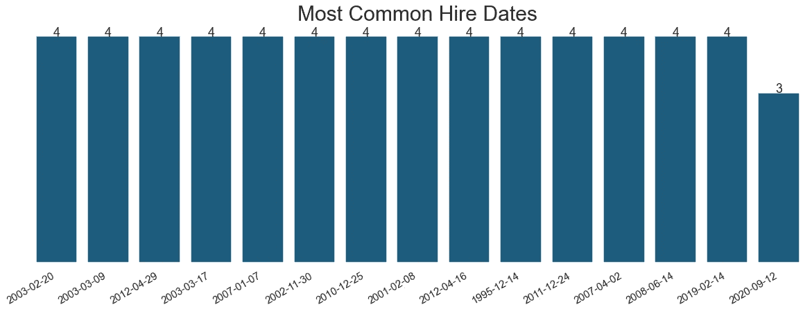

员工数据集:常见聘用日期条形图

从上面的柱状图我们可以看出，工人经常是单独被雇佣，而不是成群被雇佣。

我们还可以探索常见的雇佣月份和年份，以确定雇佣日期是否有任何模式。

```
# visualize hire date
# first Count all unique dates
hire_dates = Counter(worker_df['Hire Date'].dt.year)# get dates and date counts
common_dates = [d[0] for d in hire_dates.most_common()]
common_counts = [d[1] for d in hire_dates.most_common()]# plot 20 most common hire dates
fig, ax = plt.subplots()
g = sns.barplot(common_dates, common_counts, palette='colorblind')
g.set_yticklabels([])# show values on the bars to make the chart more readable and cleaner 
show_values_on_bars(ax)sns.despine(left=True, bottom=True)
plt.xlabel('')
plt.ylabel('')
plt.title('Workers by Year Hired', fontsize=30)
plt.tick_params(axis='x', which='major', labelsize=15)
fig.autofmt_xdate()
plt.show()
```

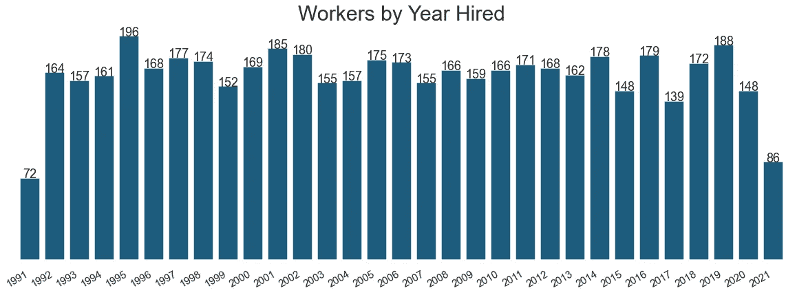

工人数据集:按年雇用的工人

这里我们可以看到按年雇佣的工人。我们看到雇佣人数最少的年份是数据集的第一年和最后一年。上面，当我们检查数据的日期范围时，我们发现最小日期是 1991-07-11，最大日期是 2021-07-08，这解释了雇用人数较少的原因。

继续进行`Worker Status`。

```
#visualize status feature
fig, ax = plt.subplots()
g = sns.countplot(x=worker_df['Worker Status'], order = worker_df['Worker Status'].value_counts().index, palette='colorblind')
g.set_yticklabels([])# show values on the bars to make the chart more readable and cleaner 
show_values_on_bars(ax)plt.title('Workers by Worker Status')
sns.despine(left=True, bottom=True)
plt.xlabel('')
plt.ylabel('')
plt.tick_params(axis='x', which='major', labelsize=15)
plt.show()
```

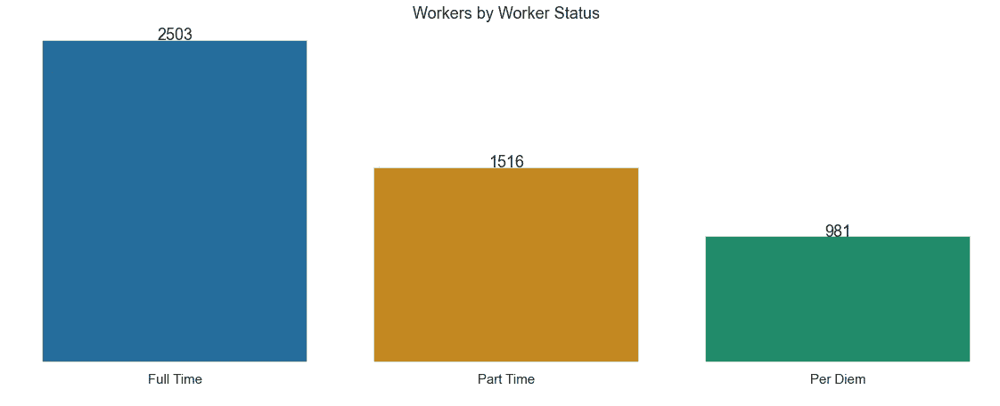

员工数据集:按状态列出的员工

在这里，我们可以看到大多数工人是全职的。我们有更少的工人被归类为兼职和每日津贴。

最后，让我们来探索团队特征。

```
#visualize team feature
sns.countplot(y=worker_df['Team'], order = worker_df['Team'].value_counts().index, palette='colorblind')
sns.despine(left=True, bottom=True)
plt.title('Workers by Team')
plt.show()
```

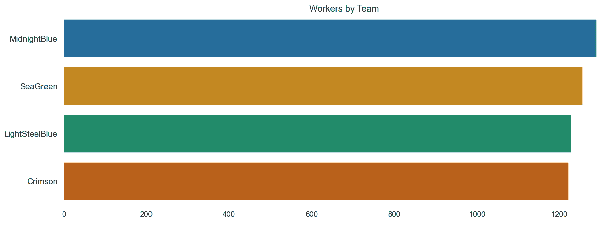

员工数据集:按团队列出的员工

开始询问有关数据的问题可能会有所帮助。一个特征和我们拥有的另一个特征有联系吗？

在这里，我们可以看到团队的规模相似。午夜蓝成员最多，深红成员最少。探索团队是如何分配的可能会很有趣。可能是基于职位、地点或工人身份吗？

现在，我们可以开始处理功能组了。让我们通过员工状态来可视化团队。

```
#visualize team by worker status
fig, ax = plt.subplots()
g = sns.countplot(x=worker_df['Team'], hue=worker_df['Worker Status'], palette='colorblind')
g.set_yticklabels([])show_values_on_bars(ax)# position the legend so that it doesn't cover any bard
leg = plt.legend( loc = 'upper right')
plt.draw()

# Get the bounding box of the original legend
bb = leg.get_bbox_to_anchor().inverse_transformed(ax.transAxes)
# Change location of the legend. 
xOffset = 0.1
bb.x0 += xOffset
bb.x1 += xOffset
leg.set_bbox_to_anchor(bb, transform = ax.transAxes)sns.despine(left=True, bottom=True)
plt.title('Workers by Team and Worker Status')
plt.ylabel('')
plt.xlabel('')
plt.show()
```

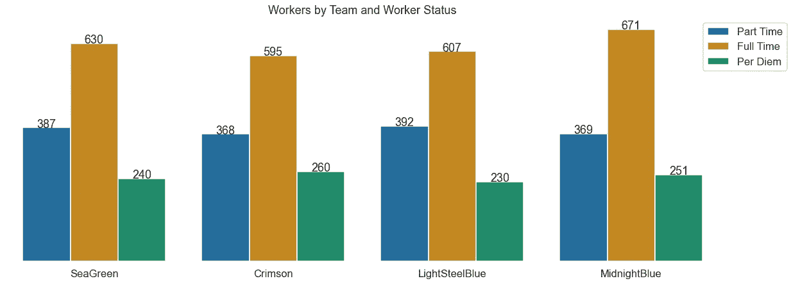

员工数据集:按小组和员工状态列出的员工

在这里，我们可以看到，根据员工状态，员工在团队中的分布相对均衡。这表明工人不是根据他们的身份被分配到团队的。

这就完成了我们的工人数据集！让我们转到小部件数据集。

我们可以创建数值数据的直方图:

```
# create histograms of all numerical data
# we know worker id is an identity column 
# so removing it from this visualization
widget_df_hist = widget_df[['Step 1', 'Step 2', 'Step 3']]widget_df_hist.hist()
sns.despine(left=True, bottom=True)
plt.show()
```

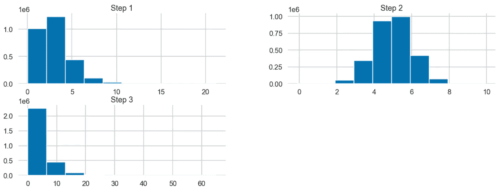

微件数据集:步骤 1、2 和 3 的直方图

这里我们看到了小部件制作过程中每个步骤的直方图。

对于第 1 步和第 3 步，看起来大多数工人很快就完成了这些步骤，并且有长尾现象，任务需要更长的时间才能完成。长尾可能是由于记录数据时的错误，或者是由于工人在完成这些步骤时遇到了困难。这将是有趣的进一步探索。

步骤 2 看起来具有正态分布。在小部件制作过程中，步骤 2 是否更容易完成或自动化程度更高？

我们已经成功探索了两个数据集中的所有功能！虽然我们可以就此打住，但这并不是最有用或最有趣的分析。

下一步，我们将合并数据集，以探索要素之间的关系。

# 走得更远—组合数据集

我们的下一步是将我们的 worker 和 widget 数据集结合在一起。这证明了我们合并数据集的能力——这是任何数据工作的关键技能。

我们将合并`Worker ID`上的数据集，因为这是数据之间的共同特征:

```
# merge dataframes together
merged_df = pd.merge(worker_df, 
                     widget_df, 
                     how='inner', 
                     on='Worker ID')
print(merged_df.shape)
merged_df.head()
```

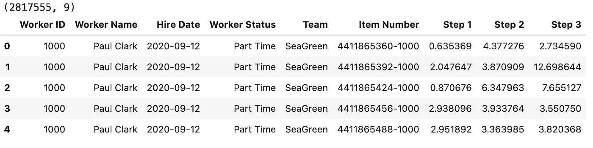

合并数据集

数据成功合并后，我们可以继续绘图。让我们按团队绘制物品计数图:

```
#visualize item count by team
fig, ax = plt.subplots()
g = sns.countplot(x=merged_df['Team'], 
                  order = merged_df['Team'].value_counts().index, 
                  palette='colorblind')
g.set_yticklabels([])# show values on the bars to make the chart more readable and cleaner 
show_values_on_bars(ax)plt.title('Item Count by Team')
sns.despine(left=True, bottom=True)
plt.xlabel('')
plt.ylabel('')
plt.tick_params(axis='x', which='major', labelsize=15)
plt.show()
```

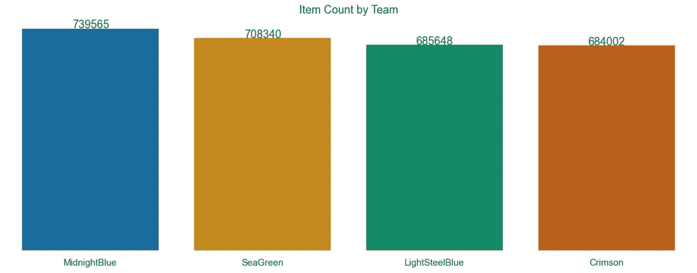

合并数据集:按团队的项目计数

午夜蓝队创造的物品最多，深红队创造的最少。我们可以推断这与分配给每个团队的工人数量有关。上面我们发现午夜蓝是最大的队伍，深红是最小的。

我们还可以按员工状态查看物料数量:

```
#visualize item count by worker
fig, ax = plt.subplots()
g = sns.countplot(x=merged_df['Worker Status'], 
                  order = merged_df['Worker Status'].value_counts().index, 
                  palette='colorblind')
g.set_yticklabels([])# show values on the bars to make the chart more readable and cleaner 
show_values_on_bars(ax)plt.title('Item Count by Worker Status')
sns.despine(left=True, bottom=True)
plt.xlabel('')
plt.ylabel('')
plt.tick_params(axis='x', which='major', labelsize=15)
plt.show()
```

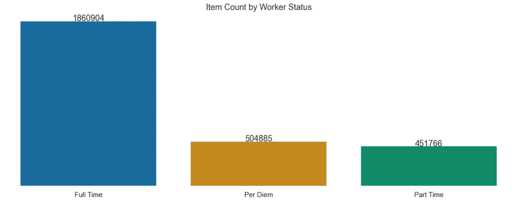

合并数据集:按员工状态列出的项目计数

在这里，我们可以看到按工人状态统计的物料数量。正如所料，全职工人创造了最多的项目。

我们还可以通过单个工人来研究项目计数。这可以显示最高和最低生产力的工人。让我们看看物品数量最少的工人:

```
#visualize workers with lowest item counts
# first create temporary df 
tmp = grouped_df.sort_values(by='Item Number Count', 
                             ascending=True).head(20)fig, ax = plt.subplots()
g = sns.barplot(y=tmp['Worker Name'], 
                x=tmp['Item Number Count'], 
                palette='colorblind')plt.title('Workers with Lowest Item Count')
sns.despine(left=True, bottom=True)
plt.xlabel('')
plt.ylabel('')
plt.tick_params(axis='x', which='major', labelsize=15)
plt.show()
```


合并数据集:具有最低项目计数的工人

这里我们看到了物品数量最少的 20 名工人。探究这些工人的工人身份将是有趣的。他们是兼职还是每日津贴？如果我们有与休息时间或工作时间相关的数据，探索是否有任何相关性将是有趣的。

为了完整性，我们可以通过打印出我们为绘图和目视检查创建的完整的`tmp`数据帧来检查绘图工人的工人状态。

另一个更简洁的选项是使用`value_counts()`来获得`Worker Status`列的唯一值的计数。

```
# check the values for worker status for the workers plotted above
tmp['Worker Status'].value_counts()>>> Per Diem    20
>>> Name: Worker Status, dtype: int64
```

我们可以看到生产最少产品的工人都是按日计算的。这里一个合乎逻辑的假设是，这些工人可能工作的班次或小时数最少，因为按日计算的工人通常是根据需要使用的。

现在，让我们排除每日津贴，并探讨全职和兼职员工在小部件制作流程中各步骤的分布情况:

```
# create temp df with only part and full time
tmp = merged_df.loc[merged_df['Worker Status'].isin(
    ['Full Time','Part Time'])]# list of steps to loop over
steps = ['Step 1', 'Step 2', 'Step 3']# create a plot for each step
for step in steps:
    fig, ax = plt.subplots()
    g = sns.violinplot(x='Team', 
                   y=step, 
                   hue='Worker Status', 
                   split=True, data=tmp) sns.despine(left=True, bottom=True)
    plt.xlabel('')
    plt.ylabel('Time') plt.title(f'{step} by Worker Status', fontsize=20) plt.show()
```

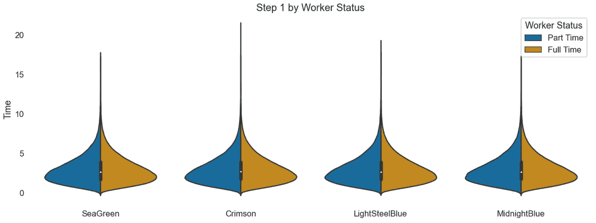

合并数据集:步骤 1 小提琴图

对于第一步，我们看到全职和兼职员工的类似分布。所有分布都有长尾。这可能是由于实际的步骤完成时间缓慢或可能的数据收集错误。这可能是有趣的进一步探索。

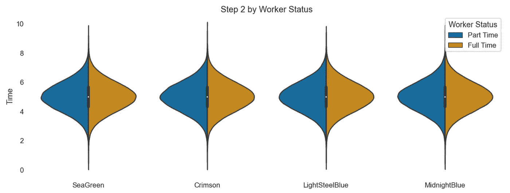

合并数据集:步骤 2 小提琴图

第二步的分布呈正态分布。所有团队的全职和兼职员工第二步的时间类似于一条钟形曲线。

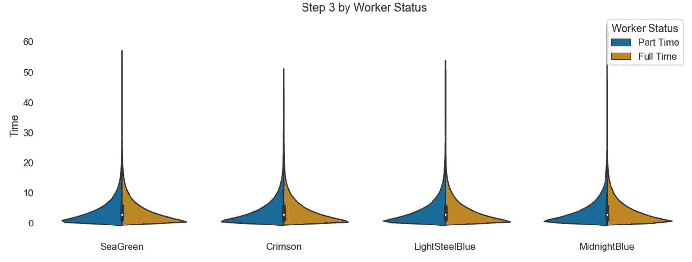

合并数据集:步骤 3 小提琴图

在第三步，我们可以看到所有组都有很长的尾巴。看起来这个步骤通常很快完成，少数异常值需要更长的时间。

在所有步骤中，我们看不到小提琴情节中各组之间的任何主要差异。这表明所有团队的全职和兼职员工在制作小部件的时间上基本一致。

这里我们可以注意到的一个限制是我们没有时间步长的时间单位。在我们的指令文件中，只注意到这些列中的值是时间，但没有给出任何单位。

虽然我们并没有探索所有可能的数据可视化，但我们已经完成了彻底的探索性分析，并将在这里开始总结这一挑战。

# 总结—结论、局限性和进一步的探索

在完成任何带回家的作业时，增加一个简短的结论部分是个好主意。我想在这里谈三个方面:

*   结论
*   限制
*   进一步探索

我们能从数据中得出什么结论吗？我们注意到了数据的哪些局限性？如果我们有更多的时间或数据，有什么值得进一步探索的？

这一部分不需要很长，每个主题几个句子就足够了。

## 结论

我们发现 MidnightBlue 团队拥有最多的工人，也创建了最多的小部件。成员数量最少的 Crimson 创建了数量最少的 widgets。

对于该数据集的时间范围，创建的小部件数量似乎与团队成员相关。

我们还发现，创建最少部件的员工都处于每日津贴状态。这表明日工的工作时间可能比兼职和全职员工少。

所有团队中的全职和兼职员工在创建小部件的时间上似乎是相似的。

## 限制

这里给出的数据不包括数据收集期的时间范围。我们只能及时地将数据作为单个快照进行分析，而不能探究小部件的创建如何随时间而变化。

如上所述，我们不知道小部件表中数据的时间单位。

## 进一步探索

随着时间的推移，探索小部件的创建会很有趣。拥有最多员工的团队总是创建最多的小部件吗？

我们还可以进一步探索小部件创建步骤的时间安排。观察这种情况是否会随着时间的推移而改变，或者探索任何潜在的异常值，将会很有意思。

这里我想做的最后一件事是重启我的笔记本，从上到下运行所有单元格。这显示了对细节的关注，也许更重要的是确保了笔记本的正常运行。

如果审查者试图运行我们的笔记本，我们希望确信它将按顺序运行，没有错误！

# 摘要

在这里，我们从头到尾完成了一个带回家挑战的样本面试。

我们从阅读数据和问简单的问题开始。

*   我们有离群值吗？
*   我们是否缺少价值观？
*   我们有什么类型的数据？
*   数据是什么样的？

然后我们继续绘图，首先可视化单个特征，然后继续探索特征之间的关系。

通过操纵数据、合并数据和创建可视化，我们能够展示我们的 Python 和数据探索技能。

完整的笔记本可以在 [GitHub](https://github.com/terrah27/ml_guides/blob/main/widget_factory/eda_challenge.ipynb) 找到。

祝你下次带回家挑战好运！