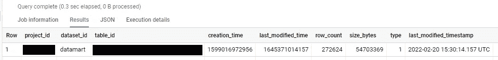
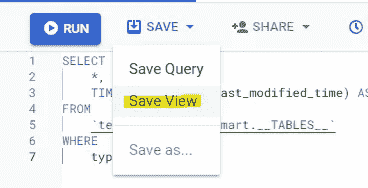
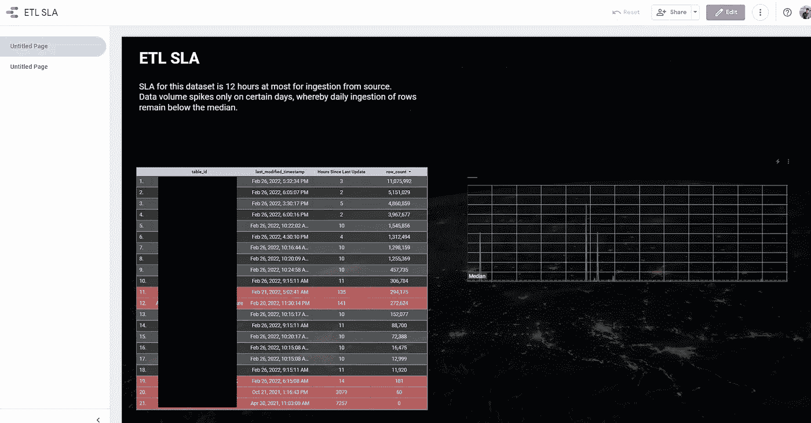
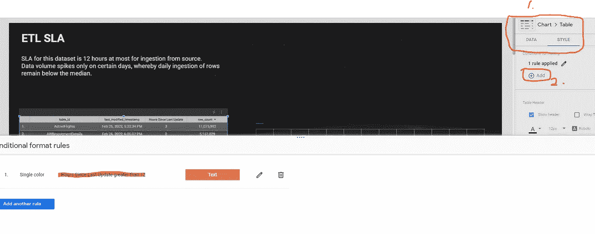
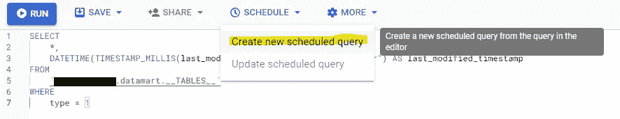
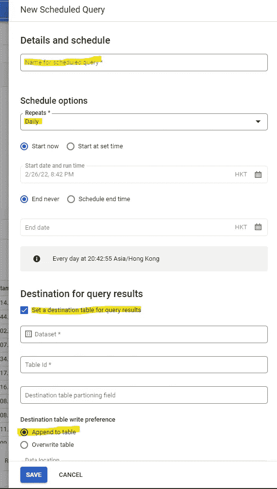
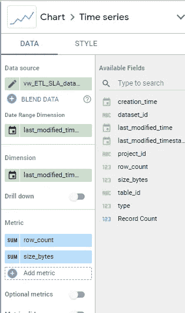

# 在 BigQuery 项目中控制您的数据接收

> 原文：<https://towardsdatascience.com/take-control-of-your-data-ingestions-in-your-bigquery-project-7ac7ad3d411>

## 创建一个仪表板来监控您的表接收是否符合 SLA 设置，并跟踪您的数据增长速度


约翰·施诺布里奇在 [Unsplash](https://unsplash.com?utm_source=medium&utm_medium=referral) 上拍摄的照片

随着您的 Google BigQuery 数据仓库随着更多的数据集和表而变得越来越大，跟踪您的表是否持续正确地更新，或者您的数据量增长有多大和多快变得越来越困难。在本文中，我们将探讨一种方法，通过跟踪数据集中表的上次更新时间戳并设置历史记录保存表来记录数据的增长，来帮助您控制和了解数据是如何随着时间的推移而增长的。

魔法门户:

*   [获取数据集表的信息](#cba5)
*   [设置仪表板进行监控](#8b95)
*   [跟踪您的数据增长](#ed01)
*   [接下来是什么](#2282)

# 获取数据集表的信息

让我们首先获得关于数据集中的表的信息。跳转到 BigQuery 并运行下面的查询。相应地更改项目 ID 和数据集 ID。

```
SELECT
  *,
  DATETIME(
    TIMESTAMP_MILLIS(last_modified_time),
    "Asia/Kuala_Lumpur")
  AS last_modified_timestamp
FROM
  `PROJECT_ID.DATASET_ID.__TABLES__`
WHERE
  type = 1
```

在继续之前，让我们仔细分析一下上面的查询是什么意思。首先，我们将从您指定的数据集中选择有关表的信息。`WHERE type = 1`表示我们只需要表格，不需要视图，因为视图被标记为类型 2。`__TABLES__`是一个内置视图，就像`INFORMATION SCHEMA`一样，包含关于数据集中的表的信息。



作者图片

在 BigQuery 中运行查询后，将返回上述结果。如图所示，我们使用函数`TIMESTAMP_MILLIS`将纪元整数中的`last_modified_time`转换为人类可读的时间戳(`last_modified_timestamp`)。但是，时区将采用 UTC，即 GMT +0。要将其转换为您的本地时区，插入一个`DATETIME(TIMESTAMP HERE, LOCAL TIMEZONE HERE)`函数，将 UTC 时间戳转换为您的本地时区。除了上次修改时间，我们还可以获得该表中的行数。正如您在屏幕截图的左上角看到的，当我们查询内置的 BigQuery 的信息模式时，0 B 被处理，因此这是免费的。

# 设置仪表板进行监控

现在我们知道了获取表信息的确切查询，让我们继续将该查询保存为视图，如下面的屏幕截图所示。



作者图片

保存视图后，转到[https://datastudio.google.com/](https://datastudio.google.com/)，创建一个仪表板，并附加您保存为数据源的视图。我不会深入研究仪表板创建和设计的基础知识，但是 YouTube 上的[Danalyser](https://www.youtube.com/channel/UCDEJmST2OTrVDFbKCUdqbxw/featured)给出了创建和设计仪表板的深入讲解，所以我强烈建议你遵循它。



作者图片

使用表 ID、最后修改时间戳和行数列，可以创建一个简单的表。为了计算“自上次更新以来的小时数”，下面的函数可以用作 Google Datastudio 自定义维度，或者在视图本身中使用。

```
DATETIME_DIFF(CURRENT_DATETIME("Asia/Kuala_Lumpur"), last_modified_timestamp, HOUR)
```

该函数所做的是计算现在和最后一次修改时间戳之间的差值，我们指定我们想要的小时差值。关于该函数的深入使用可以在 [Google BigQuery datetime 函数文档](https://cloud.google.com/bigquery/docs/reference/standard-sql/datetime_functions#datetime_diff)中找到。Danalyser 也有一个关于计算持续时间的不同方法的很棒的视频。请根据您的使用案例随意调整 SLA。

接下来，我们将使用表的内置条件格式来突出显示自上次更新以来超过小时数的行。



作者图片

如上面的屏幕截图所示，我已经创建了条件格式，如果自上次更新以来的小时数大于 12，则用红色突出显示行，并且它像预期的那样工作。

# 跟踪数据增长

要做到这一点，我们不能依赖视图，因为视图只显示最新的可用信息。相反，我们必须创建一个调度来从视图中获取最新的值，并将它附加到一个表中，帮助我们创建一个历史记录。

为此，请跳回 BigQuery 并按如下方式安排您的视图。



作者图片

选择“创建新的计划查询”将在屏幕右侧打开一个面板。



作者图片

确保选中并填写了突出显示的字段，然后单击保存。追加到表中有助于创建历史记录。

返回到 Datastudio 仪表板，选择您设置为计划目标表的历史记录表作为新的数据源。您的列不会改变，但是，您现在有了表增长的历史记录。



作者图片

通过将行计数和大小字节设置为您的度量，将上次修改时间戳设置为您的维度，您将能够查看数据随着时间的推移增长了多少，如仪表板屏幕截图上的时间序列图所示。

# 下一步是什么

虽然本文展示了使用基本 SLA/KPI 监控数据集的基本原理，但是您总是可以扩展查询来监控更多具有联合的数据集，或者扩展您的仪表板来监控是否添加或重新创建了表或视图。你甚至可以为你的仪表板创建一个预定的电子邮件，将你的报告发送给你或你的老板。

我将在本文之后发表另一篇文章，讨论如何使用 BigQuery 内置的快照来恢复丢失的数据集或表，以及如何监控 BigQuery 帮助您构建的最后一个快照是什么时候。