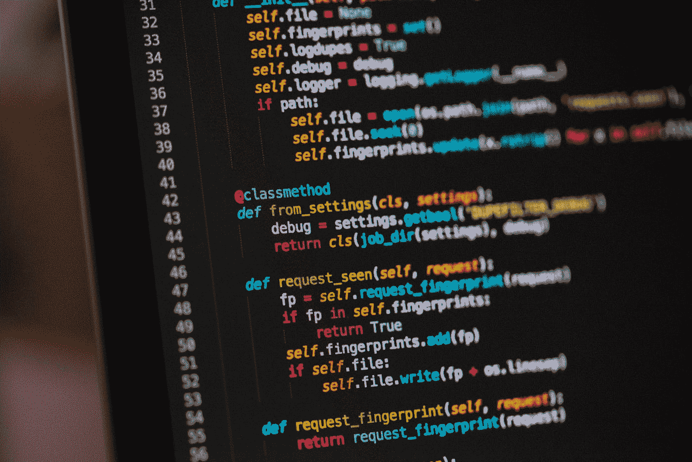
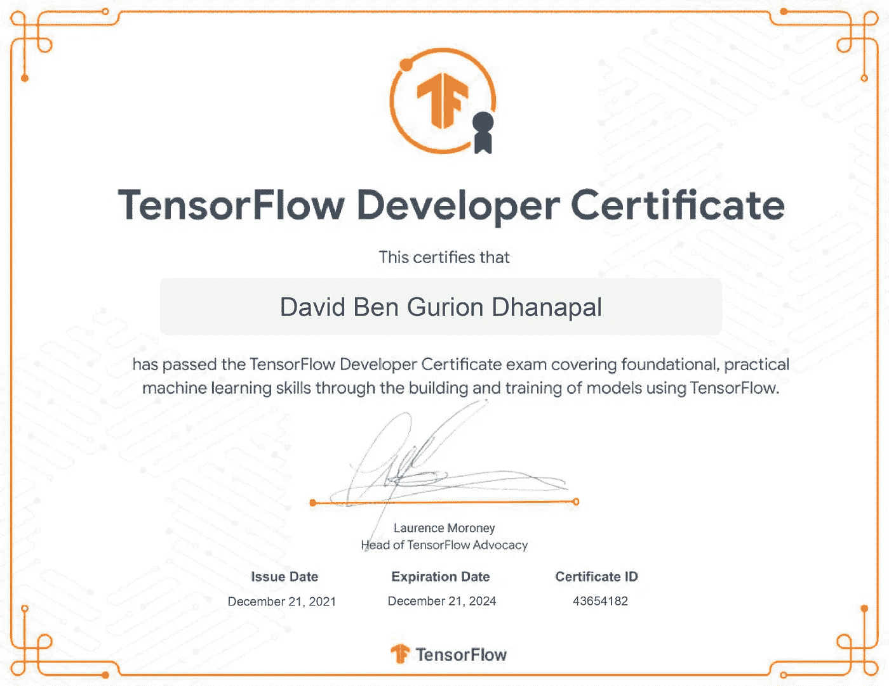

# 参加 TensorFlow 开发人员认证

> 原文：<https://towardsdatascience.com/taking-the-tensorflow-developer-certification-4ef369acac7b>

## 深度学习/张量流/认证

# 参加 TensorFlow 开发人员认证

## 我过得怎么样

我假设如果你正在阅读这篇文章，你正在考虑或准备参加 TensorFlow 开发人员证书考试。谷歌的这一基于深度学习建模的认证考试要求你仅通过使用 TensorFlow API 来构建神经网络模型。

克里斯里德在 [Unsplash](https://unsplash.com?utm_source=medium&utm_medium=referral) 上的照片

考试使用 PyCharm IDE，因此 Python 和 IDE 的基础知识非常重要。如果你是 Python 的新手，这也很好。只要记得上一门 Python 基础的课程，然后你就可以开始了。此外，在参加考试之前，请确保您熟悉 PyCharm IDE，因为 TensorFlow 认证考试只能在 PyCharm 上进行，不能在其他 python 平台上进行。

说到认证的实际深度学习部分，我可以向你保证，机器学习甚至深度学习的广泛知识是**而不是**必备条件。我这么说是因为我就是这样。尽管我对数据科学非常感兴趣，但我并不精通机器学习或深度学习。然而，我能够从各种网站、视频和免费课程中学习深度学习的基础知识，包括训练所有类型的神经网络模型。我花了大约两个月的时间才有足够的信心预定考试，并在一天后参加考试。

由[杰西卡·路易斯](https://unsplash.com/@thepaintedsquare?utm_source=medium&utm_medium=referral)在 [Unsplash](https://unsplash.com?utm_source=medium&utm_medium=referral) 拍摄的照片

顺便说一下，你不需要本地的 GPU 来进行测试。这些模型可以在一个适中的 CPU 上进行训练，而且你还有足够的时间(这是一个 5 小时的考试)。一旦您预订了费用为 100 美元的认证考试，您将收到一份 PDF 文件，该文件将带您从头到尾了解考试说明，包括设置 Pycharm 环境和 TensorFlow 认证考试插件。在开始考试之前，请务必通读上述文件中的所有说明，因为它真的很有帮助，可能会在您遇到一些问题时对您有所帮助。

请记住，您可以从[官方 TensorFlow 网站](https://www.tensorflow.org/extras/cert/TF_Education_Stipend.pdf)申请 TensorFlow 认证考试津贴，将考试费用降至 50 美元。然而，这个申请可能不总是得到批准，即使它得到批准，它通常需要大约四个星期左右。

为了更好地了解考试的结构和大纲，你可以查看 TensorFlow 自己提供的 PDF[这里](https://www.tensorflow.org/extras/cert/TF_Certificate_Candidate_Handbook.pdf)。这份方便的文件介绍了整个考试中要评估的所有内容。考试由五部分组成——回归问题、分类问题、图像处理问题、自然语言处理(NLP)问题和时间序列/预测问题。对于每个部分，您需要将一个保存的模型上传到该部分的目录中，然后单击 test。然后，认证考试的插件开始根据各种看不见的验证数据评估上传的已保存模型，并提供从 1 到 5 的分数范围，5 是每个部分的最高分。不要担心，您可以更新您的模型，并继续将任意数量的已保存模型上传到插件。请记住，在给定的时间，您只需要在部分的目录中有一个保存的模型。

我通过了认证考试！(图片由作者提供)

每一部分都比前一部分更难。在第一次尝试中，我成功地获得了前两个部分的 5/5 分。然而，对于剩下的部分，在第一次尝试中，我得到了从 1 到 3 的分数。有过一阵恐慌，但我还有很多时间。所以我不断更新模型，也创造和测试新的模型。大约两个小时后，我在所有五个部分都得了 5/5 的分数，好家伙，我很高兴！我点击提交考试，不到两分钟就收到了一封邮件，祝贺我通过了 TensorFlow 开发人员认证考试。但是它没有给出任何其他反馈。

**您还可以使用 Jupyter Notebook 和/或具有 GPU 访问功能的 Google Colab 来同时训练不同部分的不同模型，以节省大量时间并加快训练过程。然后，您只需要将保存的模型移动到 Pycharm 的目录中，然后从那里将模型上传到插件中。**

[TensorFlow](https://www.tensorflow.org/) 官方网站是找到每种类型的神经网络应用的模型训练的清晰教程的最佳地方。该网站还提供了所有可用功能、特性的详细信息，以及可用于获得最佳结果的迁移学习模型。还有其他付费和免费的深度学习课程和大量在线视频，可以帮助你很好地理解模型架构和应用。

> 如果你要参加认证考试，祝你好运！别担心。它总是比你想象的要容易。只要记得持之以恒，稳步前进。你会成功的。

如果您想阅读更多文章并在 Medium 上获得完全访问权限并在此过程中支持我，请通过我的附属链接加入 Medium[(订阅费的一部分用于直接支持我)。](https://medium.com/@davidbengurion1/membership)

另外，如果你喜欢我的内容，你可以[订阅我的电子邮件列表](https://medium.com/subscribe/@davidbengurion1)，这样我一发表文章，你就能收到电子邮件通知。

# 感谢您的阅读。