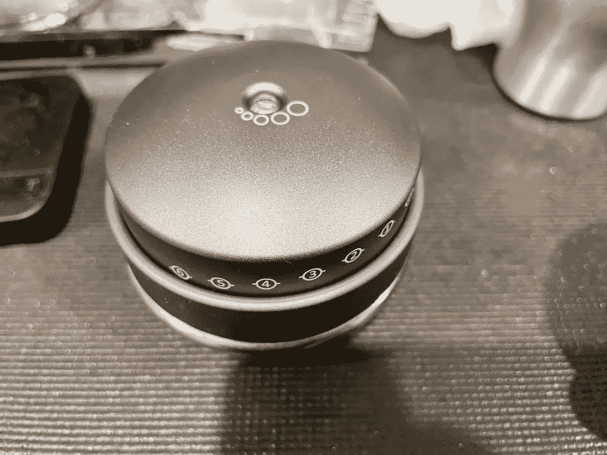
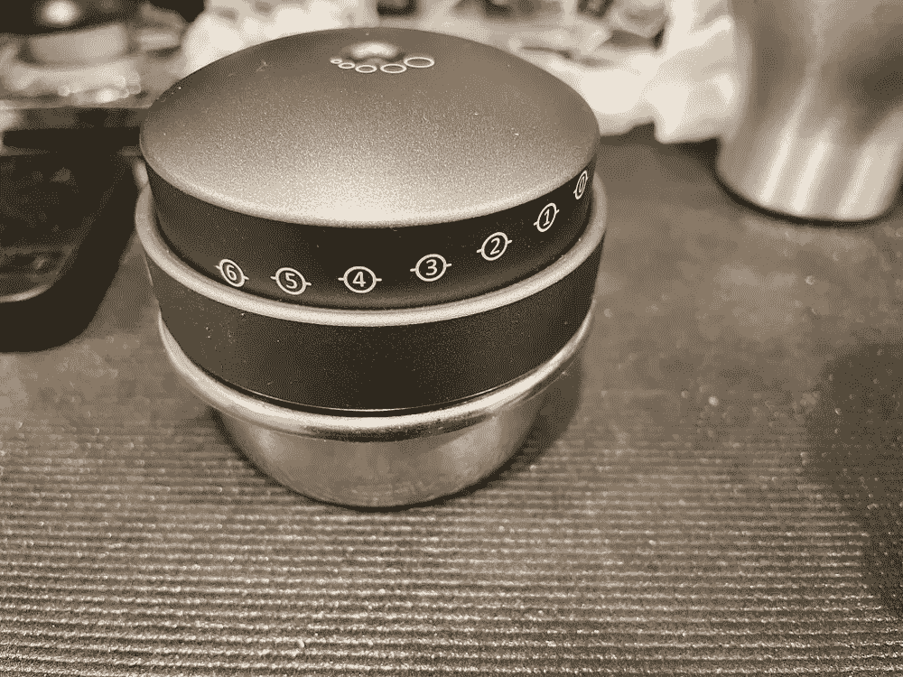
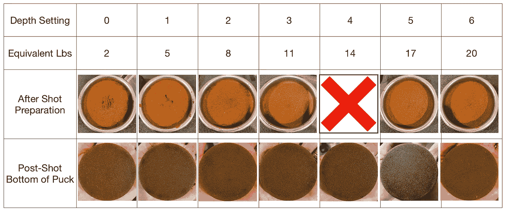
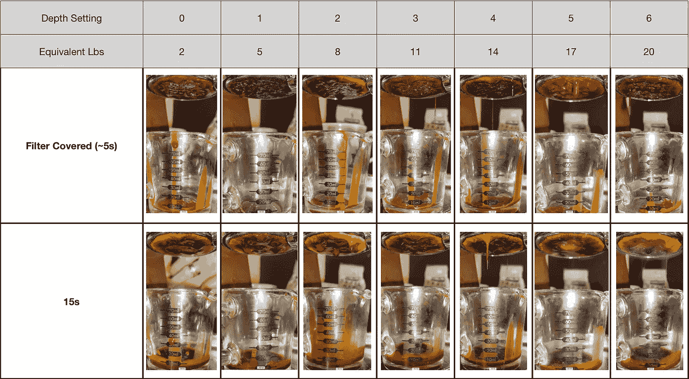
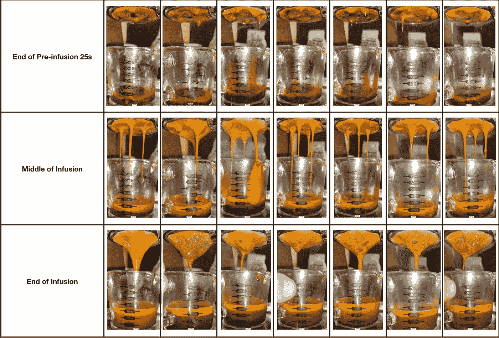
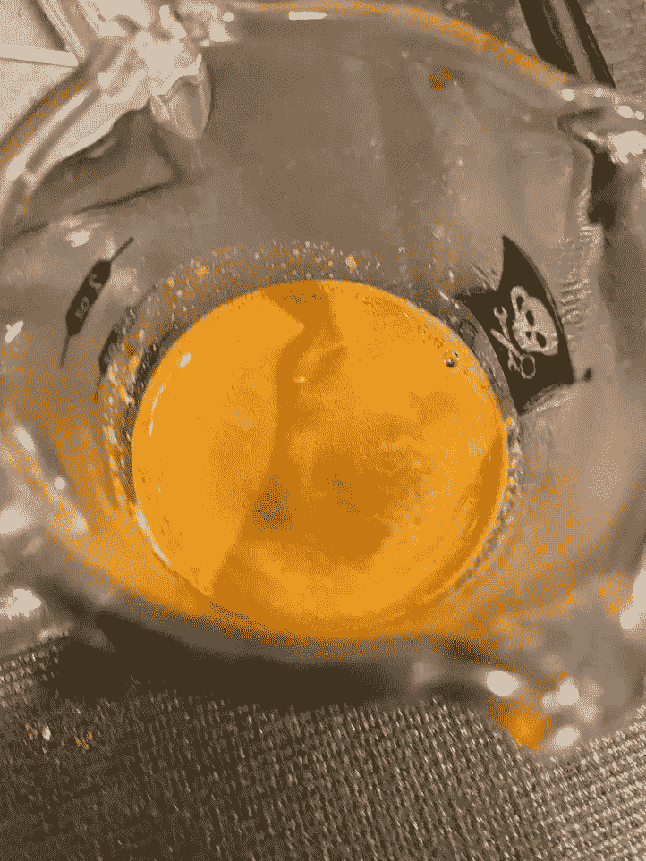
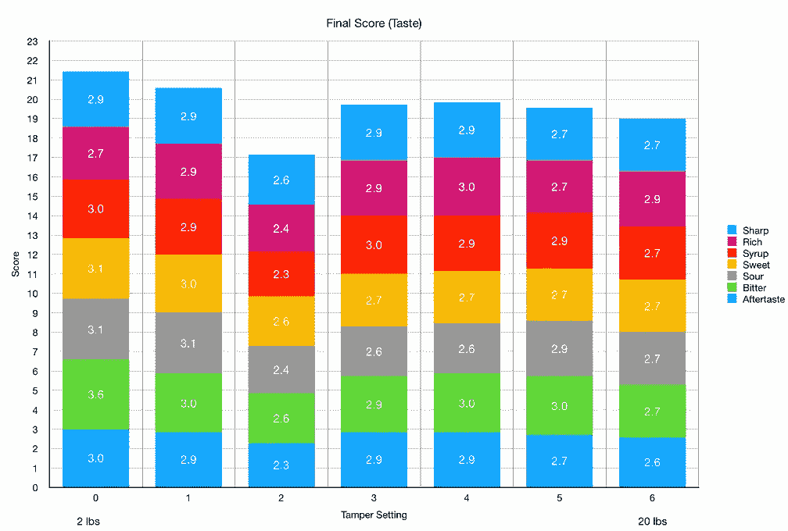
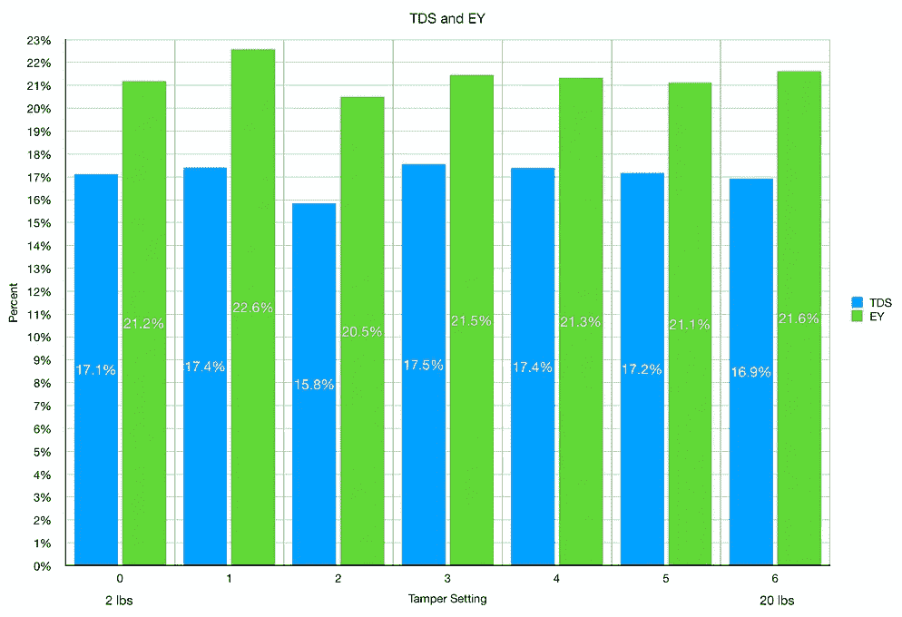
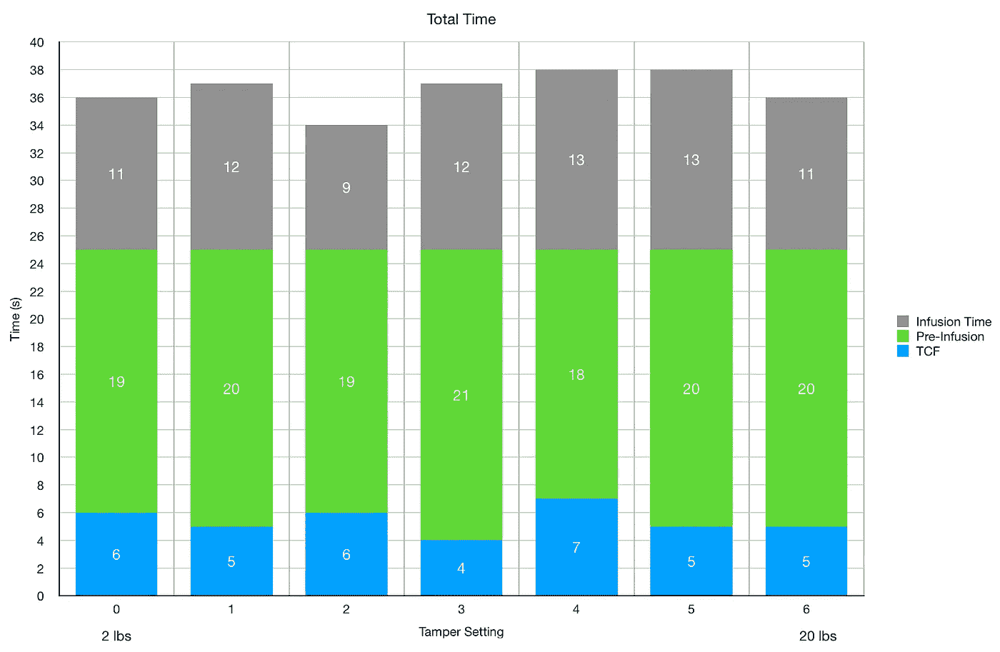

# 夯实压力为浓缩咖啡:Redux

> 原文：<https://towardsdatascience.com/tamp-pressure-for-espresso-redux-bf6191592569>

## 咖啡数据科学

# 夯实压力为浓缩咖啡:Redux

## 利用快乐夯棒

我一直在做一些关于浓缩咖啡变量的简单实验来帮助刚接触浓缩咖啡的人，在一次讨论中， [Happy Tamper](https://www.indiegogo.com/projects/happy-tamper/x/25170595#/) 的陈士骏问，使用他的夯锤是否有助于更好地控制实验的夯压。我说有可能，他把我送去测试。

在某种程度上，这是一个实验，旨在观察夯实压力以及它如何影响浓缩咖啡的味道和提取率。这也是我从收集和控制变量的角度对 tamper 的一个回顾。

所有图片由作者提供

我对夯锤的体验非常好。这是一个很好的自动调平夯，但更重要的是，你可以使用顶部的一个小螺钉在非常精细的纹理细节中调整夯压。这允许重复实验以及以市场上不常见的方式与其他用户交流。从一个咖啡师的角度来看，我可以理解为什么你会想在研磨和夯实拨号，作为一个科学家，这比用一个规模来衡量夯实压力，我目前做的。

# 设备/技术

[浓缩咖啡机](/taxonomy-of-lever-espresso-machines-f32d111688f1):金特快

咖啡研磨机:[小生零](/rok-beats-niche-zero-part-1-7957ec49840d)

咖啡:[家庭烘焙咖啡](https://rmckeon.medium.com/coffee-roasting-splash-page-780b0c3242ea)，中杯(第一口+ 1 分钟)

击球准备:[断奏捣固](/staccato-tamping-improving-espresso-without-a-sifter-b22de5db28f6)

[预灌注](/pre-infusion-for-espresso-visual-cues-for-better-espresso-c23b2542152e):长，约 25 秒

输液:[压力脉动](/pressure-pulsing-for-better-espresso-62f09362211d)

[过滤篮](https://rmckeon.medium.com/espresso-baskets-and-related-topics-splash-page-ff10f690a738) : 20g VST

其他设备: [Atago TDS 计](/affordable-coffee-solubility-tools-tds-for-espresso-brix-vs-atago-f8367efb5aa4)、 [Acaia Pyxis 秤](/data-review-acaia-scale-pyxis-for-espresso-457782bafa5d)

# 跨越夯实压力的浓缩咖啡

我在冰球顶部施加了几次夯压。对于断奏夯实，有两个时间夯实:第一半的理由，和第二半的理由。前半部分用天平称到 300 克。我用快乐夯为顶部夯通常是不可测量的，但非常轻。

首先，我展示了冰球的顶部和底部(拍摄后)。我忘了拍 14 磅夯压。

以下是在几个关键时间点拍摄的一些图像示例。

从视频中，我没有看到很多夯压的差异。我想我会看到更多的东西，尤其是在开始的时候，但是我没有注意到任何特别的东西。

杯子内部的视图:

# 绩效指标

我使用两个指标来评估技术之间的差异:最终得分和咖啡萃取。

[**最终得分**](https://towardsdatascience.com/@rmckeon/coffee-data-sheet-d95fd241e7f6) 是评分卡上 7 个指标(辛辣、浓郁、糖浆、甜味、酸味、苦味和回味)的平均值。当然，这些分数是主观的，但它们符合我的口味，帮助我提高了我的拍摄水平。分数有一些变化。我的目标是保持每个指标的一致性，但有时粒度很难确定。

# 投篮表现

当看 EY 和 TDS 时，没有太大的区别。对于最终得分(味道)，我注意到随着夯实压力的增加略有下降。我很惊讶它没有更明显。

就拍摄时间而言，他们都非常相似。从这个角度来看，似乎更用力的夯实不会降低流量。

我的大部分击球在某种程度上都是断续的，所以我并不完全依赖于良好的夯实。我的 tamps 通常很轻，我通常会留在最低端。然而，我很惊讶我有多喜欢这个捣棒。我没想到用户体验会这么好。

我对夯锤越来越有信心，因为我已经习惯了，而且它没有在我的日常工作中使用，所以我可以更好地控制我的顶部夯锤。我仍然把它设置在最轻的设置，我希望它能更轻。我用秤测了一下，我能夯实的最轻的东西大约是 700 克。

如果你愿意，可以在推特、 [YouTube](https://m.youtube.com/channel/UClgcmAtBMTmVVGANjtntXTw?source=post_page---------------------------) 和 [Instagram](https://www.instagram.com/espressofun/) 上关注我，我会在那里发布不同机器上的浓缩咖啡照片和浓缩咖啡相关的视频。你也可以在 [LinkedIn](https://www.linkedin.com/in/robert-mckeon-aloe-01581595?source=post_page---------------------------) 上找到我。也可以关注我在[中](https://towardsdatascience.com/@rmckeon/follow)和[订阅](https://rmckeon.medium.com/subscribe)。

# [我的进一步阅读](https://rmckeon.medium.com/story-collection-splash-page-e15025710347):

[我未来的书](https://www.kickstarter.com/projects/espressofun/engineering-better-espresso-data-driven-coffee)

[浓缩咖啡系列文章](https://rmckeon.medium.com/a-collection-of-espresso-articles-de8a3abf9917?postPublishedType=repub)

[工作和学校故事集](https://rmckeon.medium.com/a-collection-of-work-and-school-stories-6b7ca5a58318?source=your_stories_page-------------------------------------)

个人故事和关注点

[乐高故事启动页面](https://rmckeon.medium.com/lego-story-splash-page-b91ba4f56bc7?source=your_stories_page-------------------------------------)

[摄影飞溅页面](https://rmckeon.medium.com/photography-splash-page-fe93297abc06?source=your_stories_page-------------------------------------)

[改善浓缩咖啡](https://rmckeon.medium.com/improving-espresso-splash-page-576c70e64d0d?source=your_stories_page-------------------------------------)

[断奏生活方式概述](https://rmckeon.medium.com/a-summary-of-the-staccato-lifestyle-dd1dc6d4b861?source=your_stories_page-------------------------------------)

[测量咖啡磨粒分布](https://rmckeon.medium.com/measuring-coffee-grind-distribution-d37a39ffc215?source=your_stories_page-------------------------------------)

[浓缩咖啡中的粉末迁移](https://medium.com/nerd-for-tech/rebuking-fines-migration-in-espresso-6790e6c964de)

[咖啡萃取](https://rmckeon.medium.com/coffee-extraction-splash-page-3e568df003ac?source=your_stories_page-------------------------------------)

[咖啡烘焙](https://rmckeon.medium.com/coffee-roasting-splash-page-780b0c3242ea?source=your_stories_page-------------------------------------)

[咖啡豆](https://rmckeon.medium.com/coffee-beans-splash-page-e52e1993274f?source=your_stories_page-------------------------------------)

[浓缩咖啡用纸质过滤器](https://rmckeon.medium.com/paper-filters-for-espresso-splash-page-f55fc553e98?source=your_stories_page-------------------------------------)

[浓缩咖啡篮及相关主题](https://rmckeon.medium.com/espresso-baskets-and-related-topics-splash-page-ff10f690a738?source=your_stories_page-------------------------------------)

[意式咖啡观点](https://rmckeon.medium.com/espresso-opinions-splash-page-5a89856d74da?source=your_stories_page-------------------------------------)

[透明 Portafilter 实验](https://rmckeon.medium.com/transparent-portafilter-experiments-splash-page-8fd3ae3a286d?source=your_stories_page-------------------------------------)

[杠杆机维护](https://rmckeon.medium.com/lever-machine-maintenance-splash-page-72c1e3102ff?source=your_stories_page-------------------------------------)

[咖啡评论和想法](https://rmckeon.medium.com/coffee-reviews-and-thoughts-splash-page-ca6840eb04f7?source=your_stories_page-------------------------------------)

[咖啡实验](https://rmckeon.medium.com/coffee-experiments-splash-page-671a77ba4d42?source=your_stories_page-------------------------------------)