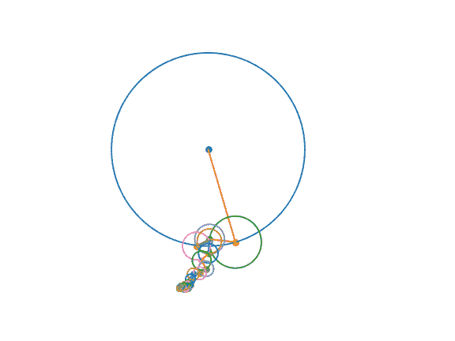

# 几何地教(和学)傅立叶变换！

> 原文：<https://towardsdatascience.com/teach-and-learn-the-fourier-transform-geometrically-ce320f4200c9>

## 通过在复平面中振荡器的可视化来理解傅立叶变换

图片作者。用傅立叶变换画出我们最喜欢的侦探！

# 介绍

在其他文章中，我写过如何应用傅立叶变换来确定实信号或复信号的频率分量。

为了进一步建立我们的直觉，让我们学习用傅立叶变换来画画吧！

# 定义振荡器

我们已经在其他上下文中讨论了频率、相位和幅度，但还是值得快速复习一下！

*   [https://towards data science . com/the-Fourier-transform-1-ca 31 ADB FB 9 ef](/the-fourier-transform-1-ca31adbfb9ef)
*   [https://towards data science . com/the-Fourier-transform-2-understanding-phase-angle-a 85 ad 40 a 194 e](/the-fourier-transform-2-understanding-phase-angle-a85ad40a194e)

频率是旋转速率，即给定振荡器旋转的速度。相位表示旋转的起始位置，即圆上开始旋转的点。幅度是信号中给定频率的数量，即振荡器的大小。

在上面的图像中，每个旋转的圆圈都是一个振荡器。每个振荡器以固定的速度旋转:它的频率。每个振荡器都从其旋转的一个给定点开始:它的相位。每个振荡器都有一个特定的半径:它的大小。

我们可以从傅立叶变换中得到所有这些信息。傅立叶变换的绝对值(np.abs)给出了幅度。傅立叶变换的相位(np.angle)给了我们相位。这给了我们所有的信息，我们需要建立一些振荡器来画一个轮廓！

*   [https://towards data science . com/the-Fourier-transform-3-magnitude and-phase-encoding-in-complex-data-8184 e2ef 75 f 0](/the-fourier-transform-3-magnitude-and-phase-encoding-in-complex-data-8184e2ef75f0)

# 用傅立叶变换画草图

## 1.将轮廓转换为复合信号

首先，我们需要从图像中获得一个轮廓。我决定使用 Canny 边缘检测来提取图像的边缘(在上面的例子中，是夏洛克·福尔摩斯的画像)。

这将给我们一个 2D 二进制数组，指示图像的边缘。现在，我们需要将这些点表示为关于原点的复数坐标。x 轴表示实部，y 轴表示虚部。

*   [https://towards data science . com/mind-your-is-and-q-s-the-basics-of-I-q-data-D1 F2 b 0 DD 81 f 4](/mind-your-is-and-q-s-the-basics-of-i-q-data-d1f2b0dd81f4)

## 2.重新排序以最小化连续点之间的距离

现在，我们需要对这些点进行排序，以使进程尽可能平滑。在实践中，我发现排序以最小化从一个点到下一个点的差异是一个好方法！

## 3.称之为傅立叶变换

我们现在将应用傅立叶变换来提取与每个频率相关的幅度和相位信息。由于可视化*所有*振荡器很慢，我们将过滤掉*自身以上的所有频率成分。_ n _ 振荡器*。

## 5.素描！

我们剩下要做的就是把片段和情节结合起来…

…创建一个 gif！

# 结论

傅立叶变换是数据科学中的一个重要组成部分，但它并不容易学习！仅仅使用 FFT 拼凑一个 2D 动画是一个建立理解的好方法。

# 下一步是什么？

接下来，我想介绍一下使傅里叶变换成为可能的数学。如果有其他你想看到解释的话题，请在评论中回复！

# 承认

提出的可视化想法是无耻地从创作者那里偷来的，比如…

*   3b1b:【https://www.youtube.com/watch?v=-qgreAUpPwM 
*   一天比一天聪明:[https://www.youtube.com/watch?v=ds0cmAV-Yek](https://www.youtube.com/watch?v=ds0cmAV-Yek)

感谢您抽出时间阅读！如果您对完整的源代码感兴趣，请查看它！

<https://github.com/peterbbryan/fourier-sketcher> 