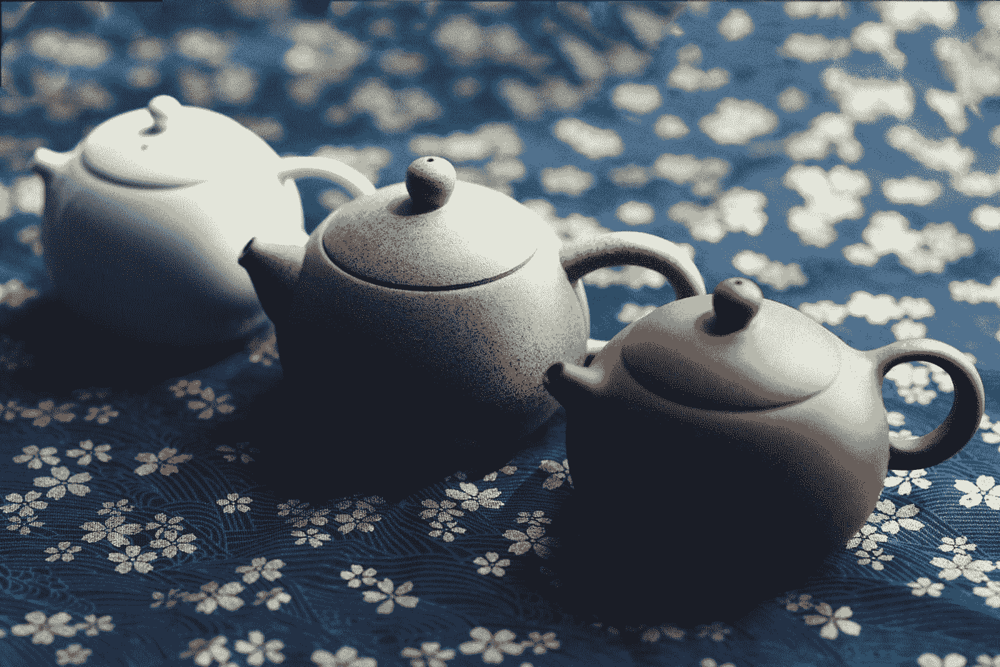
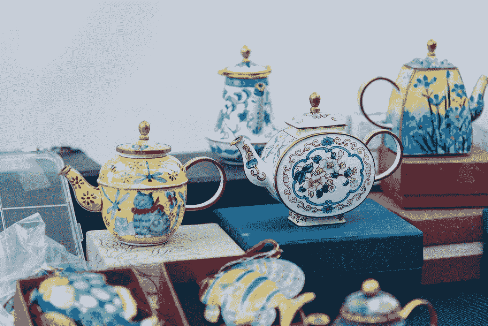
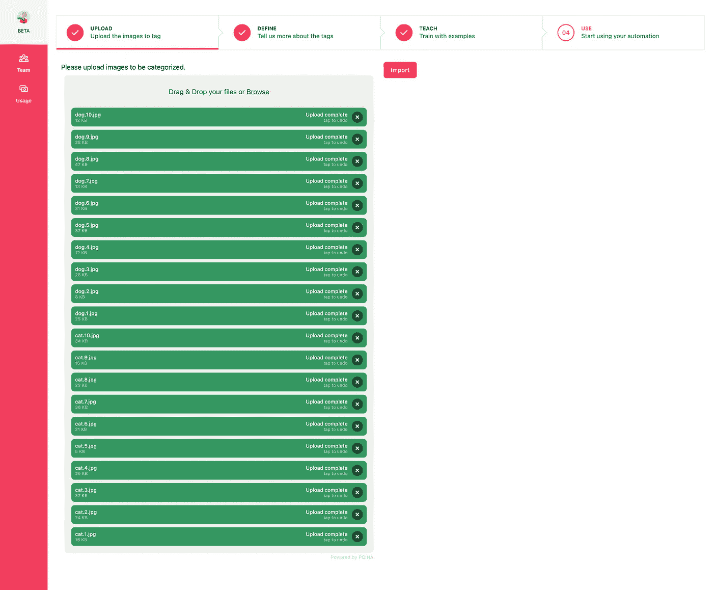
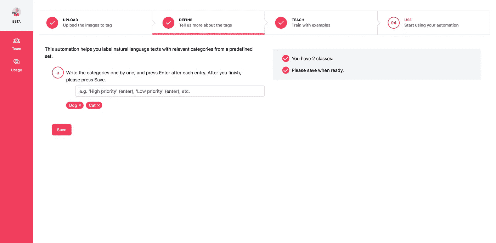
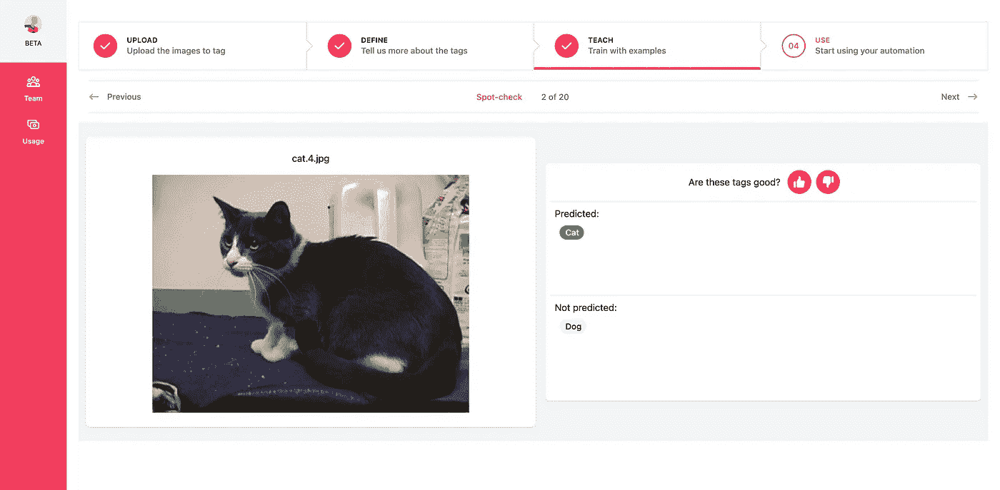
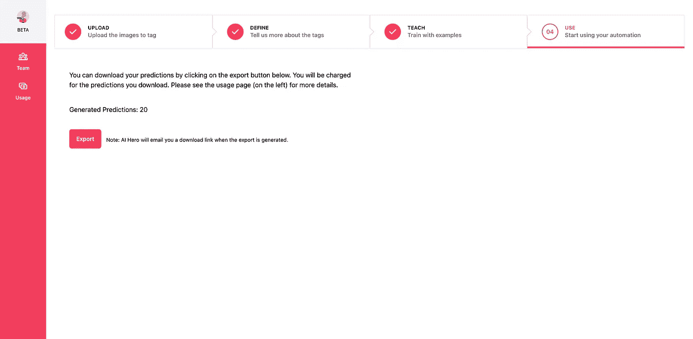

# 示例很少的教学机器

> 原文：<https://towardsdatascience.com/teaching-machines-with-few-examples-96f2caaf4a96>

当产品经理和领域专家向我提出他们可能受益于人工智能的想法时，我经常被问及我们需要多少例子来训练机器学习(ML)模型，并测试它是否能解决问题。答案总是类似于“这要看情况，但是你通常需要几百个例子”。然而，随着 ML 的最新进展，这个答案开始倾向于只需要少量的例子就可以得到一个快速的原型，甚至是一个 MVP。这篇文章解释了这些最新的发展，以及它如何使非数据科学家(即**产品经理**、**领域专家**和**业务用户**)能够尝试他们的想法。

Just from a handful of examples, we can get a sense of what a teapot might be. Photo by [童 彤](https://unsplash.com/@liz99?utm_source=medium&utm_medium=referral) on [Unsplash](https://unsplash.com?utm_source=medium&utm_medium=referral)

# 从需要大数据集到用几个例子来训练 ML——我们是怎么做到的？

在训练一个 ML 模型时，数据科学家经常会遇到这样的问题—“[我需要多少数据？](https://machinelearningmastery.com/much-training-data-required-machine-learning/)“直觉上，他们明白数据越多越好。甚至就在 3 年前，经验法则是你想要检测的每个类至少需要大约 1000 个例子。因此，他们总是试图获取尽可能多的数据。

允许更少训练数据的第一个突破是[迁移学习](https://ruder.io/transfer-learning/)。通过利用在类似任务中训练的 ML 模型，并在您的领域中定制最终的决策逻辑*(深度学习行话中的“微调最后几层”)*，您可能会得到所需的几百个示例。迁移学习实现这一点的方式是，模型中与任务无关的部分善于理解作为模型输入的文本或图像中的关键特征。因此，要使模型适应您的任务，您只需训练模型根据提取的特征做出决策。这种方法仍然如此受欢迎，以至于没有人从零开始*(深度学习行话中的“随机权重”)*，通常从预先训练好的模型开始。例如，即使你要训练一个胸部 x 光图像分类器，从一个在 ImageNet 这样的通用数据集上预先训练的模型开始，也能给出[统计上显著的性能提升](https://arxiv.org/abs/2101.06871)。

接下来是关于[合成数据](https://blogs.nvidia.com/blog/2021/06/08/what-is-synthetic-data/)的热情。数据扩充是提高模型性能的主要手段。虽然这通常是关于创建你的输入的随机变化(例如，翻转或旋转图像，用相似的单词改变文本单词，等等。)，自动驾驶公司等团队在创建管道以按需生成合成数据来创建照片级模拟方面取得了巨大成功。这导致减少了对大数据的昂贵数据收集的依赖。然而，对于许多公司来说，这些生成真实数据的管道本身成本过高，因为创建这些管道需要专业技术知识，从而导致使用受限。

在过去的几年里，[自我监督学习](https://ai.facebook.com/blog/self-supervised-learning-the-dark-matter-of-intelligence)已经成为一种使用来自数据本身的信号来训练模型的上述特征提取部分的方法。因此，减少了对昂贵的数据标记的依赖，从而为模型主体的稳健训练让路，以利用底层数据中的结构。一旦经过训练，特征提取器可以与决策“头”结合使用，并根据几个例子进行训练，以定制手边的任务。

照片由[纳沙德·阿卜杜](https://unsplash.com/@nashad?utm_source=medium&utm_medium=referral)在 [Unsplash](https://unsplash.com?utm_source=medium&utm_medium=referral) 上拍摄

# 少投学习的兴起

在过去的几年里，一个新兴的研究领域是少量学习——本质上，试图用一些例子来预测。例如，根据上面的例子，你能认出下面的图片是茶壶吗？

[纳维斯基](https://unsplash.com/@navisky?utm_source=medium&utm_medium=referral)在 [Unsplash](https://unsplash.com?utm_source=medium&utm_medium=referral) 上的照片

更正式地说，在少数镜头学习设置中，你有(a)一个在你已经知道的图像/文本和类上训练的模型，(b)你想要预测的图像/文本，和(c)一个不可见类的支持集，每个支持集有一些你想要分类图像/文本的例子。您使用训练模型的特征提取器部分来提取特征*(即深度学习行话中的嵌入)*，并将预测图像/文本的特征与支持示例进行比较。平均而言最相似的类别*(即嵌入的平均值)*，是预测的目标类别。当你使用模型来预测你是否有 *k* 个看不见的类，并且它们中的每一个都有 *n* 个支持例子时，你称之为 *k 路，n 次*分类。

虽然这种形式化听起来很学术，但对于创建一个可以通过几个例子进行预测的 UX 来说，其意义是巨大的。您现在可以提供一些先前未定义的类的图像示例，您必须在其中创建一个原型或 MVP。“我需要多少张图片”这个问题现在用“让我们从几张开始吧”来回答。文本分类也是如此。

重要的是要注意，虽然准确性可能不是你可以轻松地启动生产软件。当然，它可能需要更多的数据，但是这些方法将使你达到 5-10%的精度目标。

# 零起点学习:使用语言更进一步

强大语言模型的出现(如 [BERT](/bert-explained-state-of-the-art-language-model-for-nlp-f8b21a9b6270) )改变了机器理解文本数据的方式。从这些进展中借鉴了很多，零镜头学习旨在利用类名的语义。如果我们从语义上理解了类名，我们就可以预测我们的图像或文本的类，以预测我们是否有从我们提取的特征到类名的含义的映射。零起点学习的目标就是做到这一点。

同样，更正式地，在零镜头学习中，您学习特征到类的语义含义的映射*(即，深度学习行话中的类名嵌入)*，其中类的含义是使用在大型语料库上训练的一些语言模型提取的。当您使用一组未知的新类来预测图像/文本时，您可以提取特征，生成类的语义，并使用映射来查看您的特征映射到的最接近的类。

[Scarbor Siu](https://unsplash.com/@kameeru322813?utm_source=medium&utm_medium=referral) 在 [Unsplash](https://unsplash.com?utm_source=medium&utm_medium=referral) 上拍照

这种技术的一个有趣的优点是，你的类不必是单个的单词，它们可以更具描述性，例如，你可以说“带把手和壶嘴的陶瓷器皿”，而不是说“茶壶”(假设你已经见过其他具有陶瓷、把手和壶嘴属性的东西)。因此，这可能导致的 UX 是一个更“可教”的机器界面，机器可以尝试预测你的类别，你也许可以通过描述对象的属性来纠正它。

# 把所有的东西放在一起:用几个例子教机器

我认为，用少量例子学习的能力给机器注入了一种新的“智能”感——也就是说，如果机器甚至可以用少量例子学习，它似乎更聪明。在 UX 这边，这意味着你的用户可以通过一些例子来定制你的软件。以前，只限于在大数据上精心训练模型的数据科学家，领域专家或商业用户现在可以通过有指导的 UI 来教授机器。一旦经过训练，专家就可以使用该模型来自动化他们的工作并减少重复任务，甚至为他们自己的最终用户进行个性化设置。

通过 AI Hero，我们创建了这个引导式用户界面，使你能够快速构建这个原型/MVP。我们举个图像分类的例子——教机器对猫 vs 狗进行分类。

## a)您首先需要上传需要分类的图像。

上传你想用来训练 AI 英雄的图片。

## b)然后你将告诉 AI Hero 这些职业或者它们的描述。

告诉 AI Hero 你想把这些图像分类成哪几类

## c)抽查人工智能英雄的预测

AI Hero 使用其最佳猜测(使用零镜头学习)来预测带有图像的类，并创建一个图像列表供您“抽查”。当你确认或纠正人工智能英雄，它会自动学习！

用抽查教 AI 英雄

## d)随着 AI Hero 的学习，用更多的例子进行迭代。

一旦您对它的性能感到满意，您就可以通过下载您的预测来开始使用您的自动化。

当你对人工智能英雄的表现满意时，下载你的预测

就这么简单！

# 数据科学家的角色

所有这些并不意味着我们不再需要数据科学家。这些技术的核心是特征提取模型和语言理解部分，这需要在大型数据集上进行训练(可能在与您的用例匹配的公共领域中已经可用)。

如果你已经有了一个数据科学团队，[这里有一个简单的例子，可以让你的团队从文本分类原型开始。](https://discuss.huggingface.co/t/new-pipeline-for-zero-shot-text-classification/681)

GIF 来自拥抱脸的[博客](https://discuss.huggingface.co/t/new-pipeline-for-zero-shot-text-classification/681)关于零拍分类。

随着数据集大小的增加和自动化生产的进行，数据科学家可以帮助你在内部构建这些模型，这些模型可以理解你的领域的特点。

向构建这些不可思议功能的数据科学家大声疾呼！

# 结论

通过零投和少投学习，你可以用少量的例子创建一个原型或 MVP。它实现了一个简单的 UX，使产品经理、领域专家和业务用户能够创建他们自己的自动化。AI Hero 可以通过提供一个有指导的 UI 来帮助进一步简化这一过程，它可以让你的 MVP/原型在任何时间内建立起来。

我很想听听你的想法——你可以直接通过这里的[联系我。](https://calendly.com/ai-hero)

[文翟](https://unsplash.com/@wgzhai?utm_source=medium&utm_medium=referral)在 [Unsplash](https://unsplash.com?utm_source=medium&utm_medium=referral) 上拍照

***本文由 Rahul Parundekar 为 AI Hero 撰写。***

[*Rahul*](https://www.linkedin.com/in/rparundekar/) *是一名人工智能专家，在设计和构建人工智能产品、工程、研究和领导方面拥有 13 年以上的经验，热衷于通过人工智能改善人类体验*。他喜欢了解如何使用 ML 练习，并以他的经验帮助 ML 练习者。跟他谈 [*这里*](http://calendly.com/ai-hero) *！*

[*AI 英雄*](https://aihero.studio/) *是一个无代码平台，帮助你分分钟从* ***零到 ML*** *。您可以从我们不断增加的自动化列表中进行选择，以标记文本、推荐产品、标记图像、检测客户情绪和其他任务，所有这些都通过一个简单的、无代码的自助式平台完成。*