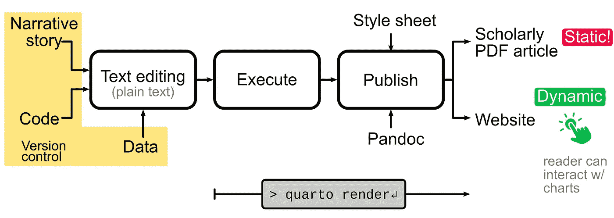
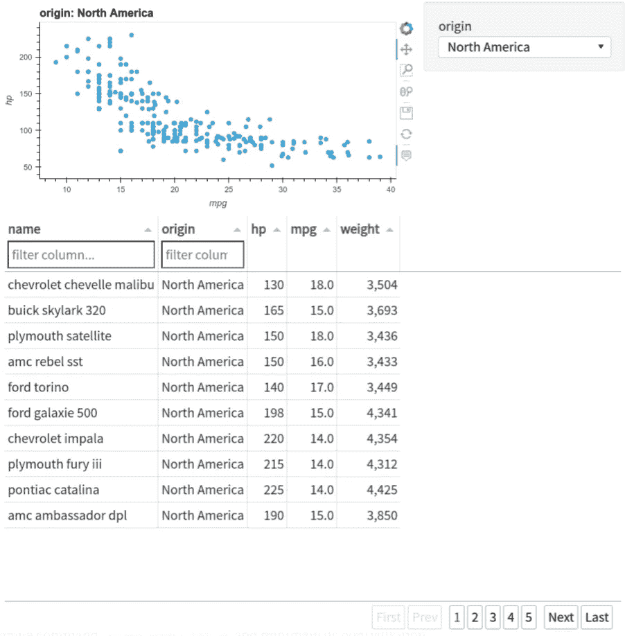
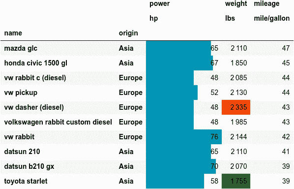
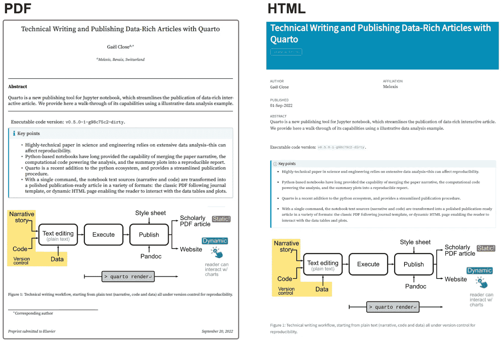

# 使用 Quarto 撰写和发布数据丰富的技术文章

> 原文：<https://towardsdatascience.com/technical-writing-and-publishing-data-rich-articles-with-quarto-d61a56bcaa64>

## Jupyter notebook 的新发布工具 Quarto 的演示，它简化了发布。

> 科学和工程领域的高技术文章依赖于大量的数据分析，这可能会影响再现性。基于 Python 的笔记本长期以来提供了将文章叙述、为分析提供动力的计算代码和摘要图合并成可再现报告的能力。Quarto 是 python 生态系统的一个新成员，它为**提供了一个简化的发布过程**。只需一个简单的命令，笔记本的文本来源(叙述和代码)就可以转换成各种格式的**精美的准备出版的文章**:遵循期刊模板的经典 PDF，或者使**读者能够与数据表和图表互动的动态 HTML 页面**。在这里，我们使用一篇假设的数据分析文章来介绍它的功能。功能类似于 nbconvert 和 jupyter-book，配置很少。

**注**。用 Quarto 生成的这篇文章的一个更长的 HTML 版本可以在[作者的博客](https://gael-close.github.io/posts/2209-tech-writing/2209-tech-writing.html)上找到。它包含完整的分析和底层代码。此外，这个长版本是**交互式的，**使读者能够参与表格和情节——这是使用 Quarto 的一个主要优势。

# 介绍

技术写作对于工程师和科学家交流他们的想法、设计、分析和结论至关重要。该分析通常是数据和计算密集型的。为了透明度和再现性，生成汇总表和图表的计算机代码应与叙述一起共享。基于 Python 的 [Jupyter 笔记本](https://jupyter.org/)长期以来提供了将叙述、代码和摘要图合并成可执行报告的能力。还需要一个步骤来格式化报告，以便正式发布。此外，对于学术文章(“论文”)，需要额外的元素，如数字编号、交叉引用、引用、格式化的参考书目。这些不是标准笔记本的一部分。

Quarto 是 python 生态系统的新成员，它简化了整个发布过程。它是在 2022 年 7 月为 Python 推出的(见这个[公告](https://www.rstudio.com/blog/announcing-quarto-a-new-scientific-and-technical-publishing-system/)),但是很久以前就为出版 R 笔记本开发了。它是专门为生成包含所有正式元素的学术文章而设计的。再者，它是基于文档转换的瑞士刀: [pandoc](https://pandoc.org/) 。因此，它支持多种输出格式——参见[四开画廊](https://quarto.org/docs/gallery/)中的多个示例。除了经典的 PDF 学术文章之外，它还可以生成现代和动态的 HTML 页面，使读者能够利用数据表和图表来发展自己的洞察力。

Quarto 不仅处理最终的格式化，还处理分析代码的执行，即时生成表格和图表。这只用一个命令`quarto render`就可以完成。因此，在文章起草期间，可以在几秒钟内重新执行完整的文章。这也有助于同行的独立验证。文章和其中的分析也可以通过改变假设或数据“分叉”以开始新的分析分支。因此，Quarto 支持再现性、透明性和协作性。

# 相关工具

可执行笔记本存在于其他语言中(matlab，R，Julia，…)，但是 Python 是最受欢迎的。至关重要的是，Python 为作者的专业领域——微系统和硬件开发中的广泛活动提供了极好的适应性。参见([Close 2021](https://gael-close.github.io/posts/2209-tech-writing/2209-tech-writing.html#ref-Close2021-wx))Python 中系统建模和分析的相关示例。

即使在 Python 生态系统中，也有类似于 Quarto 的工具。和 Python 一样，实现一项任务有多种方式。对于笔记本出版物， [nbconvert](https://nbconvert.readthedocs.io/en/latest/) 和 [jupyterbook](https://jupyterbook.org/en/stable/intro.html) 是已建立的备选方案，也生成出版物质量的输出。

# 为什么是四开？

主要区别在于学术写作的内置功能。Quarto 以最少的配置在各种科学杂志模板中生成出版物质量的文章。查看此[链接](https://quarto.org/docs/journals/)获取不断增长的受支持期刊列表。

也支持博客。甚至可以生成完整的互动网站和课程笔记。参见课程[实用深度学习](https://course.fast.ai/)获取一个广泛的例子，它被用作将 Quarto 移植到 Python 生态系统的试点。总之，Quarto 是一个包含电池的出版工具链，配置简单，擅长制作正式文章。查看此[精选列表](https://github.com/mcanouil/awesome-quarto)了解更多 Quarto 资源。

# Quarto 工作流程

Jupyter 笔记本可以用各种相关的纯文本格式表示(完整列表见 [Jupytext](/introducing-jupytext-9234fdff6c57) )。这些文件格式定义了叙述性文本的语法(基于最流行的纯文本格式:Markdown)和 Python 代码。Quarto 使用自己的降价风格(`*.qmd`)，为学术写作提供了扩展。

然后，最重要的是文本编辑器。鉴于纯文本格式的普遍性，任何编辑器都可以使用——您可以继续使用您喜欢的编辑器。这个[链接](https://quarto.org/docs/get-started/hello/text-editor.html)提供了使用 Quarto 配置任何编辑器和在侧边窗口享受自动实时渲染的技巧。

下图说明了工作流程。叙述部分在 [Markdown](https://quarto.org/docs/authoring/markdown-basics.html) 中进行文本编辑，python 代码混合在 python 代码单元格内，由````{python}`标记分隔。支持数据通常是文本文件(CSV)的形式。然后，所有的源元素都可以在文本编辑器中编辑。当源改变时，抛光的文章(或书或网站)自动呈现在侧边。



技术写作工作流程，从纯文本(叙述、代码和数据)开始，全部在版本控制下，以实现可复制性。图片作者。

除了支持图之外，文档的所有元素(叙述、等式、表格、参考书目)都以纯文本形式输入，它们被视为代码。这种范例被称为*“文档即代码”*，并且在软件工程领域越来越受欢迎。

关键优势是:

*   所有资产都以通用计算机格式存储:纯文本文件。它们可以由任何文本编辑器进行编辑，并且易于共享和重用。这与专有格式的内容不同，专有格式的内容总是需要复制粘贴**然后重新格式化**。
*   文本文件由版本控制系统有效地管理，与代码和其他文件放在一起。通过多重修订和多重贡献者，这确保了纯代码和文档元素之间的一致性。来自多个贡献者的变更可以以**可控的方式**被合并，继承自严格的软件实践。

当源文件与读者共享时，产生的文章就“可执行”了。可执行文章的正式定义见(Lasser 2020)。

> 【定义】**可执行的文章/论文**:科学论文，使读者能够重现得出论文结论的每一步，从原始数据到精心绘制的图表。

请注意，重点是最后润色的表格和情节，而不仅仅是补充材料中的临时视觉效果。这些与最终的表格和图表是分开的，并且没有显示重现最终图表和支持结论的表格的确切步骤。

# 走查

首先，按照[说明](https://quarto.org/docs/get-started/)安装 Quarto，并查看[教程](https://quarto.org/docs/get-started/hello/vscode.html)。开始在文件`article.qmd.`中起草你的文章

像许多其他基于 Markdown 的工具一样，Quarto 自然地处理常见的技术写作元素。图形、表格、内嵌方程、块方程和代码清单都被支持。这些是技术写作的核心组成部分。这些元素是基本降价的一部分，并不是 Quarto 特有的。另一方面，标题和交叉引用不是基本降价的一部分。Quarto 支持它们的开箱即用，以及其他用于学术写作的特性，如标题块、附录和其他元数据，使文章可以引用。元数据作为 YAML 键-值对被添加到文章前端。在默认配置中，添加标题、作者、日期、摘要、书目、许可证和一些 HTML 和 PDF 格式选项，然后开始编写文本和编码单元。这里是入门的基本框架`article.qmd`。

通过上面的方法，只需一个命令`quarto render article.qmd`就可以生成一个适用于《爱思唯尔期刊》的[格式的 PDF 和一个 HTML。文章将包括所有基本的结构元素(链接的交叉引用、格式化的参考书目、重用许可条款、引用的元数据等等)。根据作者的经验，这种设置与已有的替代方案相比是极简主义的。这个](https://github.com/quarto-journals/elsevier)[短片](https://www.youtube.com/embed/nuYNCPRf8Js)展示了一个简约的运营网站是如何从纯文本中建立起来的，并在 60 秒内免费发布到网上。

# 可执行代码

Quarto(以及底层 Jupyter 笔记本)的真正强大之处在于，它能够将解释故事的叙述性文本与可执行代码结合起来，以便实时重新计算并显示表格和图表。

这篇文章的更长版本可以在[作者的博客](https://gael-close.github.io/posts/2209-tech-writing/2209-tech-writing.html)上找到。它包括一个基本的数据分析来说明 Quarto 生成数据丰富的文章的能力。在这个基本分析中，我们查看了 1993 年的一个经典数据集，该数据集汇集了数百辆汽车的物理和性能特征(重量、气缸、功率、里程、加速度)。在[那里](https://docs.bokeh.org/en/latest/docs/reference/sampledata.html#module-bokeh.sampledata.autompg)可以买到。

为了在虚拟分析中练习 Quarto 工作流程，我们对入围的高里程和高功率汽车感兴趣。在[长 HTML 版本](https://gael-close.github.io/posts/2209-tech-writing/2209-tech-writing.html#html-only)中，我们展示了 Quarto 如何动态地重新生成表格和绘图。在生成的 HTML 页面中，表格和图表甚至是交互式的。绘图的交互功能包括工具提示、过滤、缩放…表格也可以通过过滤、排序变得生动…由于表格滚动功能，可以显示包含数百条记录的大型数据表。这些互动功能有利于读者的自我探索，培养对观众的新见解。



结合了关键权衡曲线和表格的仪表板。仪表板在长 HTML 版本中是交互式的。图片作者。

可以在 Python 中对表进行数字操作，以生成汇总数据透视表，或者转换单位。这两种操作都在长版本中进行了说明。通过使用[熊猫风格操作](https://pandas.pydata.org/docs/user_guide/style.html)，表格也可以被设计成显示趋势。例如，我们可以按里程(按降序)对表格进行排序，用红色和绿色突出显示重量的极值，添加功率的内嵌条形图，并添加适当的单位。参见简明代码的长版本。为了在静态 PDF 中获得相同的表格呈现，我们通过使用 [dataframe-image](https://pypi.org/project/dataframe-image/) 库将呈现的表格导出为图像，将呈现的表格视为图形。



汽车的简短列表。

# 结论

只需一个命令`quarto render <file>`和极简的配置，Quarto 就可以从同一个来源制作出版就绪的 PDF 和交互式 HTML。这两种输出都可以很容易地共享和发布。HTML 可以托管在公共或内部服务器上，作为独立的文章，或者作为完整网站的一部分。由于交互性，这是首选格式。HTML 发布在作者的博客上[。静态 PDF 可上传至预打印服务器，如](https://gael-close.github.io/posts/2209-tech-writing/2209-tech-writing.html) [TechRxiv](https://www.techrxiv.org/) 或 [arxiv](https://arxiv.org/) 。我们在[作者的研究门户简介](https://www.researchgate.net/profile/Gael-Close/research)上发布了 PDF。PDF 是完全可引用的，并以其独特的 DOI 成为科学记录的永久部分。

*   G.Close，“使用 Quarto 撰写和发布数据丰富的技术文章”，Research Gate，2022 年 9 月 22 日。可用:[http://dx.doi.org/10.13140/RG.2.2.14862.43846/1](http://dx.doi.org/10.13140/RG.2.2.14862.43846/1)

每个输出的第一页如下所示，说明了一致性。同样，使用 nbconvert 和 jupyter-book 也可能得到这样的结果。Quarto 因相对容易的配置而大放异彩，这降低了采用*“文档即代码”*范例的障碍。



并排生成 PDF 和 HTML。。图片作者。

总的来说，Quarto 是一个包含电池的出版物工具链，只需一个命令和最少的配置就能生成高质量的现代学术文章。它是 nbconvert 和 jupyter-book 的可靠替代品，值得考虑转向*“docs as code”*范式的技术作家考虑。这种范式并不适合所有人(见[这篇文章](https://document360.com/blog/docs-like-code-is-it-worth-the-hassle/)中的挑战)，因为这仍然是代码繁重的。但是 Quarto 让它更容易理解。

# 参考

接近了，盖尔。2021." Python 中的信号链分析:硬件工程师案例研究."[https://towards data science . com/signal-chain-analysis-in-python-84513 fcf 7 db 2](/signal-chain-analysis-in-python-84513fcf7db2)。

拉塞尔，贾娜。2020."创造一篇可执行的论文是一次开放科学之旅."*通信物理*3(1):1–5。[https://www.nature.com/articles/s42005-020-00403-4](https://www.nature.com/articles/s42005-020-00403-4)。