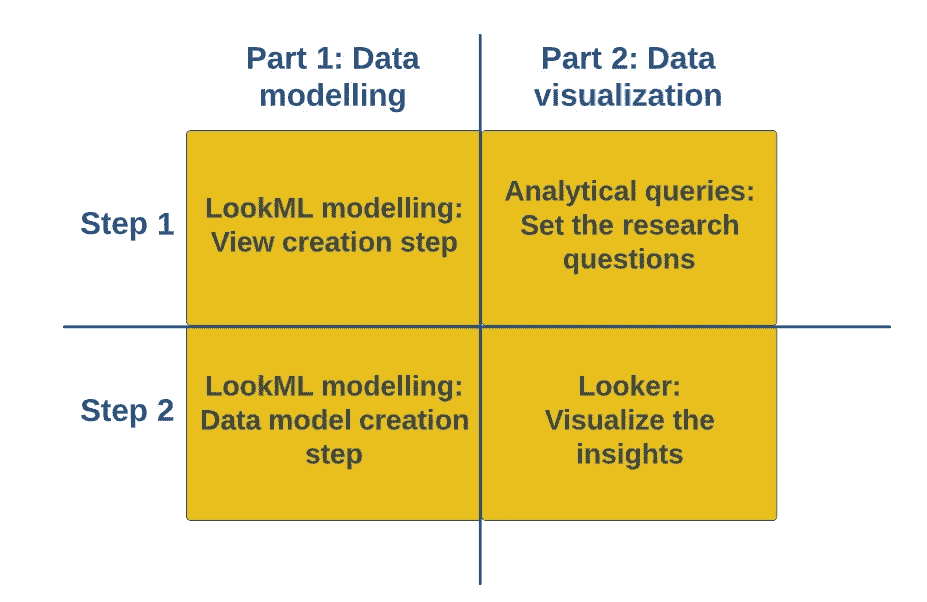
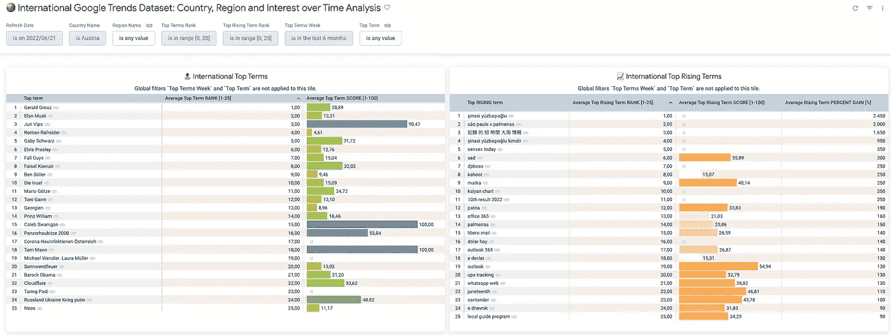
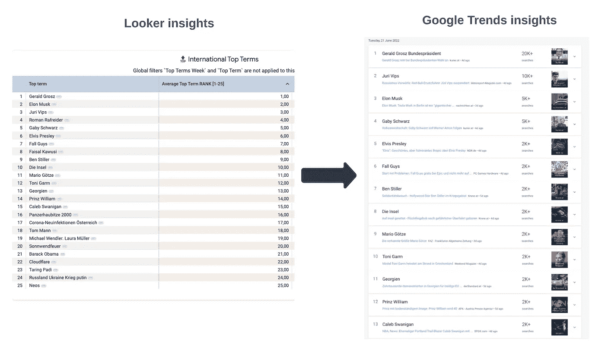
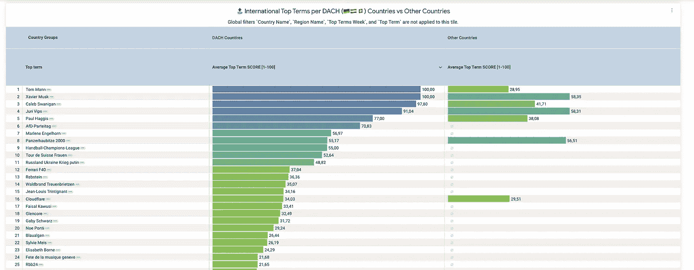
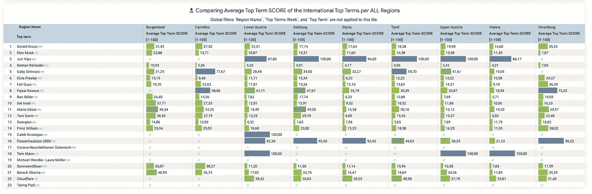
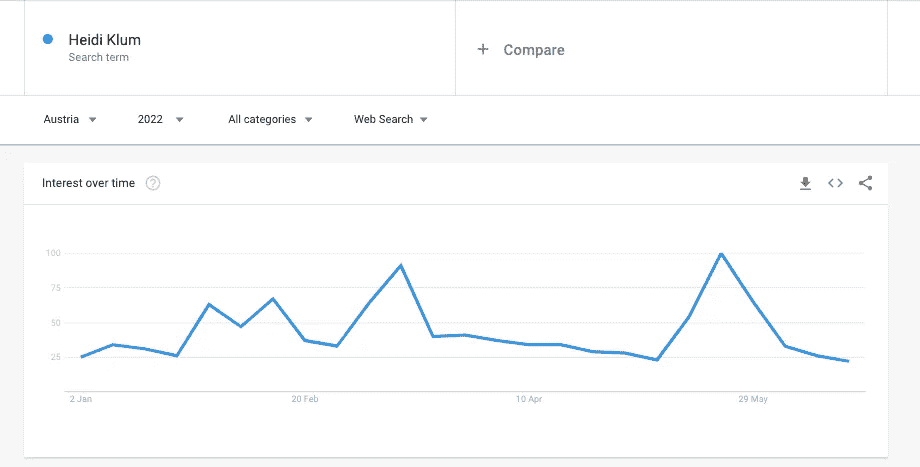
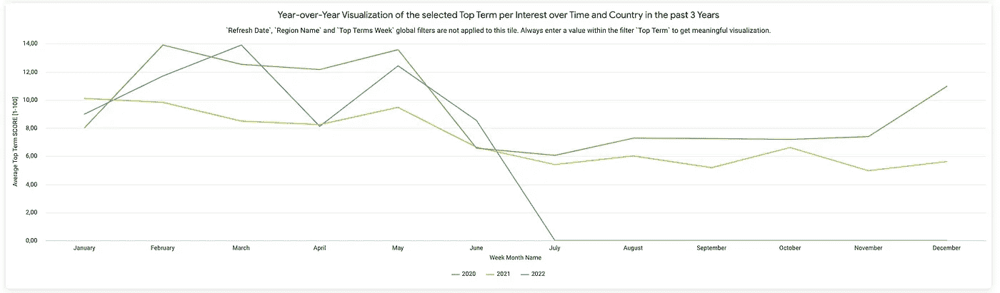
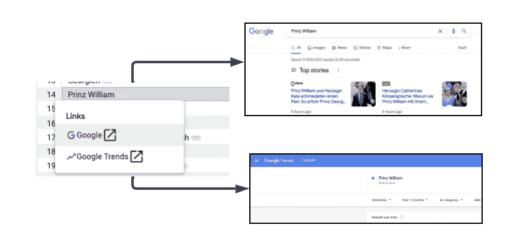
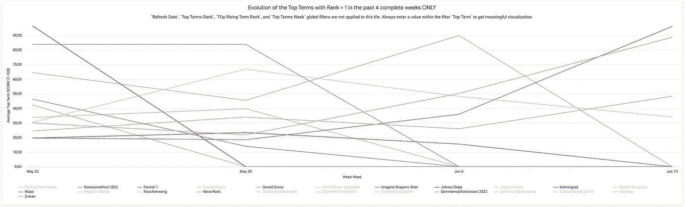

# 告诉我，big query:Google 上的趋势是什么？

> 原文：<https://towardsdatascience.com/tell-me-bigquery-what-is-trending-on-google-66a663807ffd>

## 使用 Looker 探索和丰富国际 BigQuery Google 趋势数据集

由 [Jelleke Vanooteghem](https://unsplash.com/@ilumire?utm_source=medium&utm_medium=referral) 在 [Unsplash](https://unsplash.com?utm_source=medium&utm_medium=referral) 拍摄

[Google Trends](https://trends.google.com/trends/?geo=AT) 是一个功能强大的关键词趋势研究网站，提供对热门搜索查询及其在不同国家和地区的演变的见解。

2022 年 3 月，谷歌宣布在 BigQuery 中公开[谷歌趋势国际数据集。从 2021 年的](https://cloud.google.com/blog/products/data-analytics/international-google-trends-datasets-in-bigquery)[美国公共数据集](https://cloud.google.com/blog/products/data-analytics/top-25-google-search-terms-now-in-bigquery)开始，国际数据集覆盖了全球约 50 个国家[ [1](https://cloud.google.com/blog/products/data-analytics/international-google-trends-datasets-in-bigquery) ]。

此外，Google 列出了关于国际数据集的几个重要注意事项:

*   数据集在发布前保持**匿名**、**索引**、**规范化**和**聚合**，
*   新的一组*顶级术语*和*顶级上升查询*正在被**生成** **每日**并被插入到新的表分区中，
*   **最高期限/最高上涨设定**的到期日**为 30 天**，
*   集合中的每个术语都在一个滚动的**五年**周期内用历史回填来丰富。

也就是说，BigQuery 用户现在只需运行 SQL `SELECT`语句，就可以直接与排名前 25 位的国际谷歌趋势洞察进行交互。

此外，数据分析师现在可以通过包装这些查询并在 BigQuery 上安装的任何商业智能工具中绘制可视化效果，以可视化形式呈现趋势洞察。

例如，一个公开的 [Looker](https://www.looker.com/) 仪表盘:`[全球 25 大热门谷歌搜索词](https://datasignals.looker.com/embed/dashboards/14?Region+1=&Country+Name=&Region+2=&Region+3=&theme=GoogleWhite)`已经可以使用了。此控制面板允许终端用户查询每个县和地区的见解。

然而，其中一个缺点是，我们在这个仪表板上缺少日期过滤选项。由于这一限制，最终用户只能查看每日趋势分析。这也意味着所提供的仪表板对于更长时间范围的关键词研究没有帮助，因为最终用户仍然需要切换到 [Google Trends](https://trends.google.com/trends/?geo=AT) 网站来观察趋势术语的演变模式和变化。

因此，为了克服这些捷径，我们决定探索公共 big query international Google Trends 数据集，并提供趋势数据洞察的不同可视化方面。当然是使用— [Looker](https://www.looker.com/) 实例。:)

# **解释国际谷歌趋势数据集**

首先，我们需要解释数据集模式。Google 列出了前 25 个术语/前 25 个上升术语的模式包含以下属性[ [2](https://console.cloud.google.com/marketplace/product/bigquery-public-datasets/google-trends-intl?project=triple-silo-282319) ]:

*   `term` —字符串—术语的人类可读标识符，例如“Acme Inc”，
*   `country_name` — STRING —存储国家的全文名称，
*   `country_code` —字符串—存储用于识别国家的 ISO 3166 Alpha-2 国家代码，
*   `region_name` — STRING —存储国家的地区或州的全文名称，
*   `region_code` —字符串—存储用于标识国家中的地区或州的 ISO 3166-2 国家细分代码，
*   `week` — DATE —当前行在时间序列中的位置在一周中的第一天，用于术语、国家、地区和分数的组合，
*   `refresh_date` —日期—添加新的一组术语、国家、地区和分数组合的日期；**该列也作为分区键**，
*   `score` — INT —从 0 到 100 的指数，表示该术语在当前日期相对于该术语在同一时间序列中的其他日期的流行程度(260 周= 52 周* 5 年)，
*   `rank` — INT —该术语在全球范围内与一天中其他顶级术语相比所处位置的数字表示(例如排名 1–25)；等级值在一个国家的所有历史数据和所有地区中显示相同的等级，
*   `percent_gain` — INT —与前一个日期周期相比，期限增长的百分比收益(比率)；**仅适用于排名前 25 位的上升期**。

为了提供更深入的分析见解，我们需要完全理解以下数字:

1.  **`**score**`**指标** —表示所选时间和地点的最大搜索兴趣[ [3](https://medium.com/google-news-lab/what-is-google-trends-data-and-what-does-it-mean-b48f07342ee8) ]。值为 100 的索引将意味着在指定的时间范围内，特定的术语在峰值所在的地方，即得分最高的地方，最有趋势。当我们选择不同的日期范围和国家/地区时，一个术语的分数会发生变化，这意味着分数的指数再次根据所选的过滤器进行标准化。我们需要使用`week`属性来表示每个国家和地区的一个术语的得分变化(随时间变化的兴趣)。**
2.  ****`**rank**`**指标** —表示前几项的排名，在{refresh_date，country，region，term，rank}集合中更新。每天我们都会得到一组新的前 25 个热门词汇，我们可以通过选择不同的日期、国家和地区来观察热门词汇。****

****当这一点清楚了，我们就可以开始动手了。:)****

# ****用 Looker 探索趋势洞察****

****开发方法分为 2x2 矩阵图(2 部分 x2 步骤):****

********

****开发方法概述[图片由作者提供]****

****从上图可以看出，*第 1 部分*是为 Looker 开发者设计的，而*第 2 部分*则是为那些能够从现有数据模型中创造洞察力的最终用户设计的。****

****因此，让我们从实现开始，帮助双方从国际 Google 趋势数据集产生创造商业价值的想法。:)****

# *******第一部分:*观察者语义层的数据建模******

****这一部分的任务分为两步:****

******步骤 1: LookML 建模:在前 25 个术语/前 25 个上升术语的数据集之上创建视图******

****为了实现这个步骤，我们可以使用一个[视图文件](https://docs.looker.com/reference/view-reference)中的`[derived_tables](https://docs.looker.com/reference/view-params/derived_table)`并创建两个新的[视图](https://docs.looker.com/reference/view-params/view):****

******# 1:**[**international _ top _ terms . view**](https://github.com/CassandraOfTroy/looker-google-trends-analysis/blob/main/area_google_trends/views/international_top_terms.view.lkml)**—在`bigquery-public-data.google_trends.international_top_terms`数据集的顶部保存派生表。******

******该视图增加了以下[尺寸](https://docs.looker.com/reference/field-params/dimension) / [尺寸](https://docs.looker.com/reference/field-params/measure)和功能:******

*   ******创建`country_group`维度是为了将 [DACH](https://en.wiktionary.org/wiki/DACH) 国家的顶级术语与其他国家的顶级术语进行比较。******

*   ******`top_term_refresh_date`被转换为 EDT 区域，因为我们的 BigQuery 位于 UTC 区域。******

******`DATE(DATETIME(TIMESTAMP(${TABLE}.refresh_date), “America/New_York"))`******

*   ******谷歌搜索和谷歌趋势网站的链接嵌入在`term`维度中。通过这种方式，最终用户可以很容易地从 Looker 中搜索选定的术语，并直接在 Google Trends 上查看他们的兴趣。******

*   ******测量值`score`和`rank`计算为平均值，目的是显示每个国家组/国家/地区/周的数据。******

********# 2:**[**international _ top _ rising _ terms . view**](https://github.com/CassandraOfTroy/looker-google-trends-analysis/blob/main/area_google_trends/views/international_top_rising_terms.view.lkml)**—在`bigquery-public-data.google_trends.international_top_rising_terms`数据集的顶部保存派生表。********

******该视图增加了与前一视图相似的维度/度量。******

******添加到此视图中的唯一额外度量是一个`percent_gain_measure`，它显示了与前一个日期周期相比，期限增长的速率:******

******这一步结束后，我们可以创建一个数据模型，将这两个视图合并成一个 Looker [explore](https://docs.looker.com/reference/explore-params/explore) 。******

******— — — — — — — — — — — — — — — — — — — — — — — — — — — —******

********步骤 2: LookML 建模:从步骤 1** 中创建的视图创建一个 [**数据模型**](https://github.com/CassandraOfTroy/looker-google-trends-analysis/blob/main/area_google_trends/models/international_google_trends.model.lkml)******

******太神奇了。当这一部分完成后，数据模型就创建好了，最终用户可以探索这些见解，并在观察者的表示层将它们可视化。******

# *********第二部分:*Looker 表示层的数据可视化********

******让我们直接进入第二部分，在这里我们结合了两个实施步骤的演示结果。******

******换句话说，在创建了一个研究问题列表后，我们创建了一个名为`🌏 International Google Trends Dataset: Country, Region and Interest over Time analysis`的新的 Looker 仪表板。仪表板的 pdf 可以在[这里](https://github.com/CassandraOfTroy/looker-google-trends-analysis/blob/main/%F0%9F%8C%8F%20International_Google_Trends%20Dataset_%20Country_Region_and_Interest-over-Time_Analysis.pdf)找到。******

******应用了以下全局过滤器值，以获得上述附件 pdf 文件中呈现的结果:******

*   ******`Refresh Date` = `2022/06/21`******
*   ******`Country Name` = `Austria`******
*   ******`Top Term` = `Heidi Klum`******

******需要强调的是，并不是所有的全局过滤器都应用于显示的仪表板中的每个单幅图块。这是因为我们只创建了一个控制面板来为研究问题提供综合的最终用户洞察。******

********步骤 1:分析查询:创建一组研究问题********

******&******

******第二步:旁观者:将洞察力形象化以回答研究问题******

****以下一组问题和可视化“答案”涵盖了数据可视化部分:****

******Q1:哪些 top terms/top rising terms 的** `**average rank**` **最高，它们的** `**average score**` **分别为选中的** `**refresh_date**` **、** `**country**` **、** `**region**` **？******

******视觉形式回答:******

********

****每个选定日期和国家/地区的热门词汇/热门上升词汇的排名和得分措施概述[图片由作者提供]****

****快速[检查一下](https://trends.google.com/trends/trendingsearches/daily?geo=AT)我们是否在谷歌趋势网站上看到了日期`2022/06/21`和国家`Austria`的匹配结果:****

********

****根据选定的日期和国家，将 Looker data insights 与 Google Trend insights 进行比较[图片由作者提供]****

****正如您从上图中看到的，搜索词的排名略有不同，但两个来源中的词列表都匹配。****

****— — — — — — — — — — — — — — — — — — — — — — — — — — — —****

******Q2:与其他国家相比，** [**DACH 国家**](https://www.statista.com/topics/4623/dach-countries/#topicHeader__wrapper) **的热门词汇有哪些？******

******视觉形式回答:******

********

****在所选日期，DACH 国家与其他国家相比的趋势术语概述[图片由作者提供]****

****— — — — — — — — — — — — — — — — — — — — — — — — — — — —****

******Q3:在特定的** `**region**` **中有哪些热门词汇，它们的** `**average score**` **在不同地区有何不同？******

******视觉形式回答:******

********

****每个地区和选定日期的趋势术语概述[图片由作者提供]****

****— — — — — — — — — — — — — — — — — — — — — — — — — — — —****

******Q4:随着时间的推移，对所选热门词汇的兴趣如何演变？******

****如前所述，选择的术语是`Heidi Klum`。****

******视觉形式回答:******

********

****随着时间的推移，每个兴趣的所选趋势术语的概述[图片由作者提供]****

****我们可以直接在谷歌趋势上用同样的过滤器做一个快速的[检查](https://trends.google.com/trends/explore?date=2022-01-01%202022-12-31&geo=AT&q=Heidi%20Klum):****

********

****随着时间的推移，人们对谷歌趋势网站上所选趋势术语的兴趣[图片由作者提供]****

****当比较两个图表时，可以看到趋势模式匹配，但是`score`值不同。****

****— — — — — — — — — — — — — — — — — — — — — — — — — — — —****

******问题 5:在过去三年中，人们对所选热门词汇的兴趣如何演变(用于捕捉季节性模式的逐年分析)？******

****同样，选择的术语是`Heidi Klum`。****

******视觉形式回答:******

********

****过去三年中所选趋势术语的概述[图片由作者提供]****

****从上图中可以看出，今年上半年，人们对所选术语的搜索兴趣较高。****

****— — — — — — — — — — — — — — — — — — — — — — — — — — — —****

******我们向最终用户提供的其他功能/见解有:******

******#1:嵌入到谷歌搜索和谷歌趋势网站的热门词汇/热门上升词汇中的外部链接**:****

********

******#2:识别过去几周内`rank` = 1 的**热门词汇的能力:****

********

****在这一部分，我们结束了我们的开发和可视化阶段。****

# ****结论****

****最后，我们可以分享我们的开发总结、所展示的分析创造的商业价值以及我们对所用数据集的想法。****

******开发总结:******

*   ****首先，我们提供了一个**开发教程，用于在国际 Google 趋势数据集之上的 Looker 中创建一个数据模型**。****
*   ****第二，我们通过**新创建的 Looker 仪表板**展示了趋势洞察，使我们的最终用户能够根据不同的维度粒度查看历史/近期热门术语。****

******展示分析的商业价值:******

*   ****所展示的分析被**内容创建者用于博客/帖子创建目的**，因为它显示了每个国家组、国家和地区的每日热门搜索词趋势。通过实施日期过滤器，内容创建者可以洞察整周/整月的趋势术语，**创建更多有针对性的信息文本**。****
*   ****此外，查看器 [**报警**](https://docs.looker.com/sharing-and-publishing/alerts) **针对特定情况**实施。例如:我们为每个特定国家/地区创建了一个趋势术语列表，以提醒不同的用户组注意这些术语。这种方法**避免了** **对趋势洞察的手动观察，并且用户基于他们预定义的兴趣被告知趋势术语。******

******最终想法:******

*   ****在我们看来，谷歌趋势公共数据集有助于**一般博客写作目的**，在那里你可以使用前 25 个趋势术语。但是，如果您需要检查趋势术语，以针对特定主题(例如 3d 打印)的广告进行关键字研究，这仍然应该通过 Google Trends 网站来完成。****
*   ****应该“半信半疑”地看待 BigQuery 谷歌趋势数据集，因为谷歌为它列出了以下免责声明[ [2](https://console.cloud.google.com/marketplace/product/bigquery-public-datasets/google-trends-intl?project=triple-silo-282319) ]:****

> ****免责声明:这些数据集是“按原样”提供的，没有任何形式的保证或陈述。您有责任确定这些数据是否适合您的目的。****

******总结:**我们期待在 BigQuery 中看到公开的国际谷歌趋势数据集的未来扩展，并可能获得对趋势搜索词的相关查询和主题的见解。****

****请随意分享您对当前分析的想法。:)****

******参考文献:******

****[1]谷歌云博客，访问时间:2022 年 6 月 13 日，[https://Cloud . Google . com/Blog/products/data-analytics/international-Google-trends-datasets-in-big query](https://cloud.google.com/blog/products/data-analytics/international-google-trends-datasets-in-bigquery)****

****[2] Google Cloud 公共 Google Trends 国际数据集，访问时间:2022 年 6 月 16 日，[https://console . Cloud . Google . com/market place/product/big query-Public-datasets/Google-Trends-intl？项目=三筒仓-282319](https://console.cloud.google.com/marketplace/product/bigquery-public-datasets/google-trends-intl?project=triple-silo-282319)****

****[3] S. Rogers，[什么是谷歌趋势数据——它意味着什么](https://medium.com/google-news-lab/what-is-google-trends-data-and-what-does-it-mean-b48f07342ee8) (2016)，在[谷歌新闻实验室](https://medium.com/google-news-lab)的中等职位****