# 时间融合转换器:深度学习时间序列预测—完整教程

> 原文：<https://towardsdatascience.com/temporal-fusion-transformer-time-series-forecasting-with-deep-learning-complete-tutorial-d32c1e51cd91>

## 创建准确且可解释的预测


用 DALLE [1]创建

根据[2]，[***时态融合变换器***](/temporal-fusion-transformer-googles-model-for-interpretable-time-series-forecasting-5aa17beb621) **在时间序列预测方面胜过所有著名的深度学习模型。**

包括用于表格时序数据的特色*梯度提升树*模型。

但是**时间融合变压器(TFT)【3】**是什么，为什么这么有意思？

在本文中，我们简要解释了*时间融合变压器*的新颖之处，并构建了一个基于**能源需求预测**的端到端项目。具体来说，我们将涵盖:

*   如何准备 TFT 格式的数据？
*   如何建立、训练和评估 TFT 模型？
*   如何得到关于验证数据的预测和样本外预测？
*   如何使用内置模型的*可解释注意力*机制计算**特征重要性**、**季节性模式、**和**极端事件鲁棒性**。

让我们开始吧！

> 要深入分析时态融合转换器架构，请查看我以前的文章。

# 什么是时间融合转换器

> **T** 临时 **F** 融合**T**Transformer(**TFT**)是一个基于 Transformer 的模型，它利用自我注意力来捕捉多个时间序列的复杂时间动态。

TFT 支持:

*   **多个时间序列:**我们可以在成千上万个单变量或多变量时间序列上训练一个 TFT 模型。
*   **多时段预测:**模型输出一个或多个目标变量的多步预测，包括预测区间。
*   **异构特性:** TFT 支持多种类型的特性，包括时变和静态外生变量。
*   **可解释的预测:**预测可以用变量重要性和季节性来解释。

其中一个特征是*时间融合转换器*所独有的。我们将在下一节讨论这个问题。

# 扩展的时间序列数据格式

在值得注意的 DL 时序模型中(例如*DeepAR*【4】)，TFT 脱颖而出，因为它支持各种类型的功能。这些是:

*   **时变**已知*已知*
*   **时变** *未知*
*   **时不变**实数*实数*
*   **时不变的** *分类的*

例如，假设我们有一个**销售预测案例**:

假设我们要预测三种产品的销售。`num sales`是目标变量。`CPI index`或`number of visitors`是*时变未知*特征，因为它们仅在预测时间之前是已知的。然而，`holidays`和`special days`是*时变的已知*事件。

`product id`是*一个时不变(静态)分类*特征。其他数值的和不依赖于时间的特征如`yearly_revenue`可以归类为*时不变实数*。

在进入我们的项目之前，我们将首先展示一个关于如何将您的数据转换成**扩展时间序列格式**的迷你教程。

> **注:**本文所有图像及人物均由作者创作。

# 时间序列数据集函数

对于本教程，我们使用来自 [PyTorch 预测](https://github.com/jdb78/pytorch-forecasting)库和 PyTorch Lightning 的`[**TemporalFusionTransformer**](https://arxiv.org/pdf/1912.09363.pdf)` 模型:

```
pip install torch pytorch-lightning pytorch_forecasting
```

整个过程包括三件事:

1.  用我们的时间序列数据创建一个熊猫数据框架。
2.  将我们的数据帧包装到一个 *TimeSeriesDataset* 实例中。
3.  将我们的 *TimeSeriesDataset* 实例传递给`[**TemporalFusionTransformer**](https://arxiv.org/pdf/1912.09363.pdf)**.**`

*时间序列数据集*非常有用，因为它帮助我们指定特征是随时间变化的还是静态的。另外，这是`[**TemporalFusionTransformer**](https://arxiv.org/pdf/1912.09363.pdf)` 唯一接受的格式。

让我们创建一个最小的训练数据集来展示*时间序列数据集*是如何工作的:

我们应该以下面的方式格式化我们的数据:每个彩色的盒子代表一个不同的时间序列，用它的`group`值来表示。

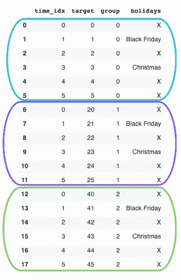

**图 1:** 样本 _ 数据熊猫数据框

我们的数据框架中最重要的一列是`time_idx`——它决定了样本的顺序。如果没有遗漏观测值，每个时间序列的值应增加 *+1* **。**

接下来，我们将数据帧封装到一个 *TimeSeriesDataset* 实例中:

所有的参数都是不言自明的:`max_encoder_length`定义了回望期，`max_prediction_length`指定了将预测多少数据点。在我们的例子中，我们回顾过去的 3 个时间步来输出 2 个预测。

TimeSeriesDataset 实例现在充当数据加载器。让我们打印一批，并检查我们的数据将如何传递到 TFT:

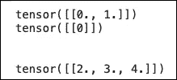

该批次包含来自第一时间序列(`group 0`)的训练值`[0,1]`和测试值`[2,3,4]`。如果您重新运行这段代码，您将得到不同的值，因为默认情况下数据是被打乱的。

# 需求能源预测教程

我们的项目将使用来自 UCI 的**electricityloaddiagrams 2011 2014**【5】**数据集。这个例子的笔记本可以从[这里](https://drive.google.com/file/d/1sVXcUQi0FXVZxgmiHX0oc5YZfrjwZzmA/view?usp=share_link)下载:**

**该数据集包含 370 个客户端/消费者 15 分钟一次的用电量(KWs)。数据跨度为 4 年(2011 年至 2014 年)。**

**一些消费者是在 2011 年之后产生的，因此他们最初的用电量为零。**

**我们根据[【3】](https://github.com/google-research/google-research/tree/master/tft)进行数据预处理:**

*   **按小时汇总我们的目标变量`power_usage`。**
*   **找出幂非零的每个时间序列的最早日期。**
*   **创建新特征:`month`、`day`、`hour`和`day_of_week`。**
*   **选择在`2014–01–01`和`2014–09–07`之间的所有日期。**

**让我们开始:**

## **下载数据**

```
wget [https://archive.ics.uci.edu/ml/machine-learning-databases/00321/LD2011_2014.txt.zip
!unzip](https://archive.ics.uci.edu/ml/machine-learning-databases/00321/LD2011_2014.txt.zip!unzip) LD2011_2014.txt.zip
```

## **数据预处理**

**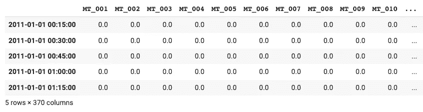**

**每一列代表一个消费者。大多数初始`power_usage`值为 0。**

**接下来，我们汇总每小时的数据。由于模型的大小和复杂性，我们只在 5 个消费者上训练我们的模型(对于那些非零值的消费者)。**

**现在，我们为*时间序列数据集*格式准备数据集。请注意，每一列代表不同的时间序列。因此，我们“融化”我们的数据框架，这样所有的时间序列都是垂直堆叠而不是水平堆叠。在这个过程中，我们创造了我们的新功能。**

**最终预处理的数据帧被称为`time_df`。让我们打印它的内容:**

**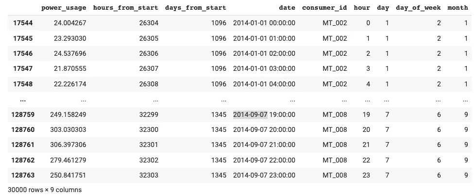**

**`time_df`现在处于*时间序列数据集*的正确格式。正如您现在已经猜到的，因为粒度是每小时一次，所以`hours_from_start`变量将是**时间索引。****

## **探索性数据分析**

**消费者/时间序列的选择不是随机的。每个时间序列的`power usage`具有不同的性质，例如平均值:**

```
time_df[[‘consumer_id’,’power_usage’]].groupby(‘consumer_id’).mean()
```

**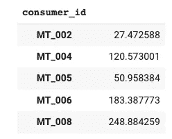**

**让我们画出每个时间序列的第一个月:**

**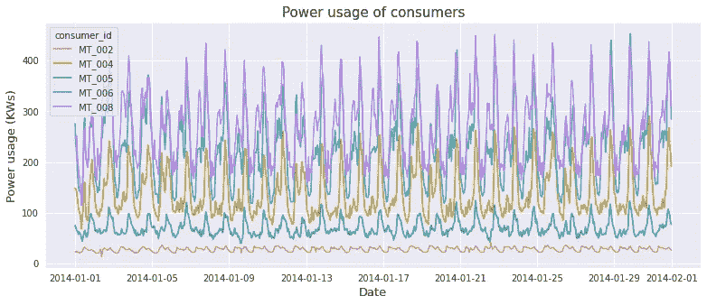**

****图 2:** 所有 5 个时序/消费者的第一个月。**

**没有明显的趋势，但每个时间序列的季节性和幅度略有不同。我们可以进一步试验和检查平稳性、信号分解等等，但是在我们的例子中，我们只关注模型构建方面。**

**此外，请注意其他时间序列预测方法，如 **ARIMA** 必须满足一些要求(例如，时间序列必须首先变得平稳。)有了 TFT，我们可以让我们的数据保持原样。**

## **创建数据加载器**

**在这一步，我们将我们的`time_df`传递给 *TimeSeriesDataSet* 格式，这非常有用，因为:**

*   **它让我们不用编写自己的数据加载器。**
*   **我们可以指定 TFT 如何处理数据集的特征。**
*   **我们可以轻松地标准化我们的数据集。在我们的例子中，标准化是强制性的，因为所有时间序列的大小都不同。因此，我们使用 **GroupNormalizer** 来分别归一化每个时间序列。**

**我们的模型使用一周(7*24)的回顾窗口来预测未来 24 小时的用电量。**

**另外，请注意`hours_from_start`既是时间索引，也是时变特征。`power_usage`是我们的目标变量。为了便于演示，我们的验证集是最后一天:**

## **基线模型**

**接下来，几乎所有人都忘记的一步:基线模型。特别是在时间序列预测中，你会惊讶地发现一个简单的预测器往往比一个更好的模型更好！**

**作为一个简单的基线，我们预测前一天的用电量曲线:**

## **训练时间融合变换器模型**

**我们可以使用 PyTorch Lightning 的熟悉的*训练器*界面来训练我们的 TFT 模型。**

**请注意以下事项:**

*   **我们使用**提前停止**回调来监控验证损失。**
*   **我们使用 **Tensorboard** 来记录我们的培训和验证指标。**
*   **我们的模型使用*分位数损失*——一种特殊类型的损失，帮助我们输出预测区间。关于分位数损失函数的更多信息，请看这篇文章。**
*   **我们使用 4 个*注意力头*，就像原稿一样。**

**我们现在准备构建和训练我们的模型:**

**就是这样！6 个周期后，提前停止开始并停止训练。**

## **加载并保存最佳模型**

**不要忘记保存您的模型。虽然我们可以对其进行酸洗，但最安全的选择是直接保存最佳纪元:**

```
!zip  -r model.zip lightning_logs/lightning_logs/version_1/*
```

**要再次加载模型，解压 *model.zip* 并执行以下命令——记住最佳模型路径:**

## ****检查张量板****

**仔细看看 Tensorboard 的训练和验证曲线:**

## **模型评估**

**获得验证集的预测，并计算平均 **P50** (分位数中位数)**损失**:**

**后两个时间序列的损失稍高，因为它们的相对量级也很高。**

## **根据验证数据绘制预测图**

**如果我们在 *predict()* 方法上传递`mode=raw`，我们将获得更多信息，包括对所有七个分位数的预测。我们还可以访问注意力值(稍后会详细介绍)。**

**仔细看看`raw_predictions`变量:**

**我们使用 *plot_prediction()* 来创建我们的情节。当然，您可以制作自己的定制图——*plot _ prediction()*具有添加关注值的额外好处。**

> ****注:**我们的模型一次性预测接下来的 24 个数据点**。这不是滚动预测场景，在滚动预测场景中，模型每次预测一个**单个**值，并将所有预测“缝合”在一起。****

****我们为每个消费者创建一个图(总共 5 个)。****

****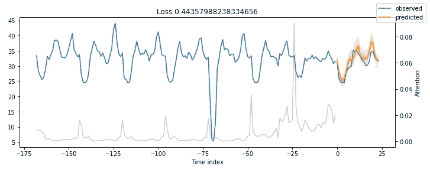****

******图 3:**MT _ 002 验证数据预测****

****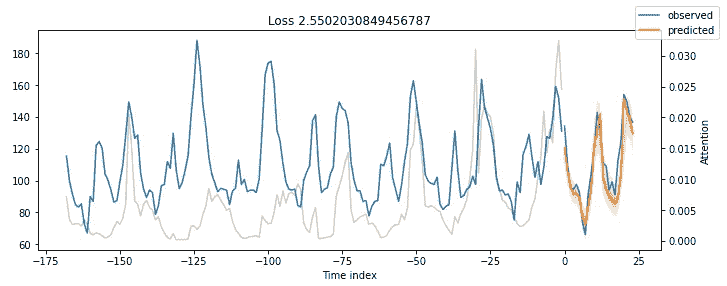****

******图 4:**MT _ 004 验证数据预测****

****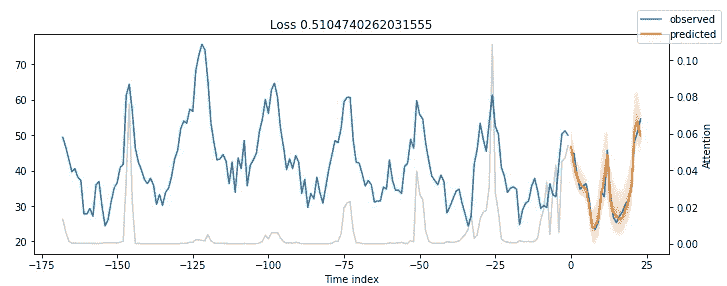****

******图 5:**MT _ 005 验证数据预测****

****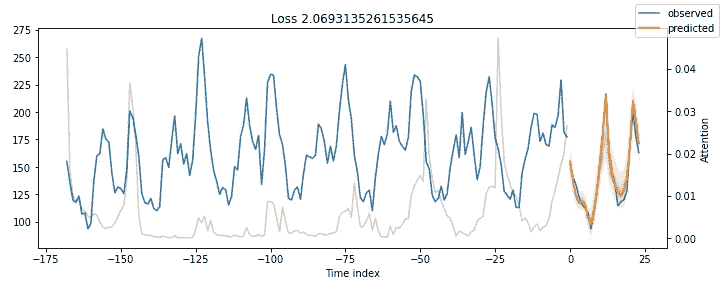****

******图 6:**MT _ 006 验证数据预测****

****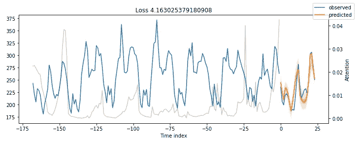****

******图 7:**MT _ 008 验证数据预测****

****结果相当可观。****

****我们的*时间融合转换器*模型能够捕捉所有 5 个时间序列在季节性和幅度方面的行为！****

****另外，请注意:****

*   ****我们没有执行任何超参数调整。****
*   ****我们没有实现任何花哨的功能工程技术。****

****在接下来的部分中，我们将展示如何通过超参数优化来改进我们的模型。****

## ****绘制特定时间序列的预测****

****之前，我们使用`idx`参数在验证数据上绘制预测，该参数在数据集中的所有时间序列上迭代。我们可以更具体地输出对特定时间序列的预测:****

****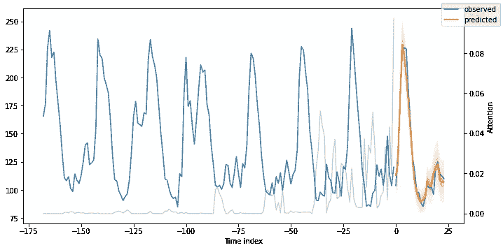****

******图 7:** 训练集上 MT_004 的提前一天预测****

****在**图 7 中，**我们绘制了 **MT_004** 消费者的前一天时间指数=26512。****

****记住，我们的时间索引列`hours_from_start`从 26304 开始，我们可以从 26388 开始得到预测(因为我们设置了更早的`min_encoder_length=max_encoder_length // 2`等于`26304 + 168//2=26388`****

## ****样本外预测****

****让我们创建样本外预测，超越验证数据的最终数据点——也就是`2014–09–07 23:00:00`****

****我们所要做的就是创建一个新的数据帧，它包含:****

*   ****`N` = `max_encoder_length`过去日期的个数，作为回看窗口 TFT 术语中的**编码器数据**。****
*   ****我们想要计算预测的大小为`max_prediction_length`的未来日期，即**解码器数据。******

****我们可以对所有 5 个时间序列进行预测，或者只对一个时间序列进行预测。**图 7** 显示了消费者的样本外预测 **MT_002** :****

****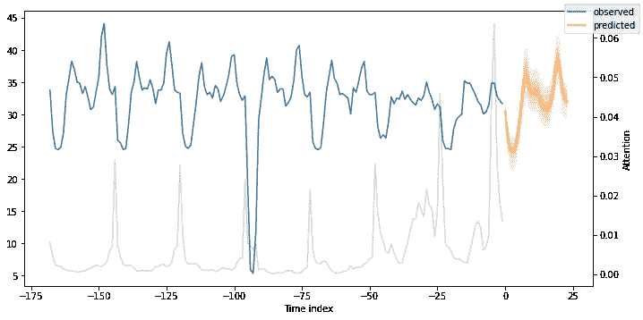****

******图 7:**MT _ 002 提前一天预测****

# ****可解释的预测****

****准确的预测是一回事，但如今可解释性也很重要。****

****而对于深度学习模型来说就更糟糕了，深度学习模型被认为是黑盒。像 **LIME** 和 **SHAP** 这样的方法可以(在一定程度上)提供可解释性，但是对于时间序列来说并不适用。此外，它们是外部的事后方法，不依赖于特定的模型。****

*****时间融合转换器*提供三种类型的可解释性:****

*   ******季节性方面:** TFT 利用其新颖的**可解释的多头注意力**机制来计算过去时间步骤的重要性。****
*   ******特征方面:** TFT 利用其**变量选择网络**模块来计算每个特征的重要性。****
*   ****极端事件稳健性:我们可以研究时间序列在罕见事件中的表现****

****如果想深入了解**可解释性多头关注**和**变量选择网络、** [的内部工作原理，可以查看我之前的文章](/temporal-fusion-transformer-googles-model-for-interpretable-time-series-forecasting-5aa17beb621)。****

## ****季节性解释能力****

****TFT 探索注意力权重，以了解过去时间步长的时间模式。****

****之前所有图中的灰线代表注意力得分。再看看那些图，你注意到什么了吗？**图 8** 显示了**图 7** 的结果，也说明了注意力得分:****

****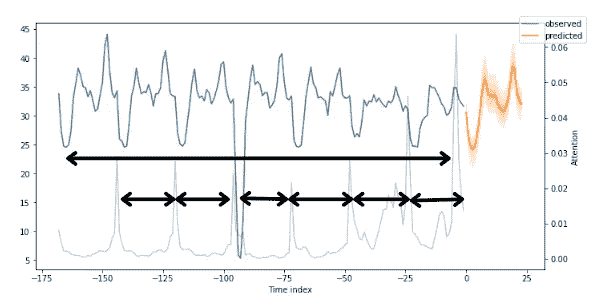****

******图 8:** 显示季节性的 MT_002 的前一天预测****

****注意力分数揭示了当模型输出其预测时那些时间步骤的影响程度。小峰反映了每日的季节性，而接近尾声的高峰可能暗示了每周的季节性。****

****如果我们对所有时间步长和时间序列(不仅仅是我们在本教程中使用的 5 个时间步长和时间序列)的注意力曲线进行平均，我们将从 TFT 纸 **:** 中得到**图 9** 中看起来对称的形状****

****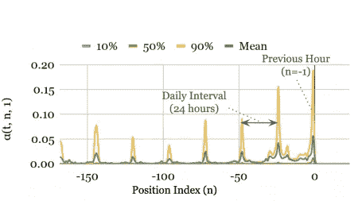****

******图 9:** 电力数据集的时间模式([来源](https://arxiv.org/pdf/1912.09363.pdf))****

> ******问题:**这有什么好处？难道我们不能简单地用 ACF 图、时间信号分解等方法来估计季节性模式吗？？****

******答案:**真。然而，研究 TFT 的注意力权重有额外的好处:****

1.  ****我们可以确认我们的模型捕捉到了我们序列的明显的季节动态。****
2.  ****我们的模型还可以揭示隐藏的模式，因为当前输入窗口的注意力权重考虑了所有过去的输入。****
3.  ****注意力权重图与自相关图不同:自相关图指的是特定的序列，而这里的注意力权重通过查看所有协变量和时间序列来关注每个时间步长的影响。****

## ****功能方面的可解释性****

****TFT 的**变量选择网络**组件可以很容易地估计**特征重要性:******

****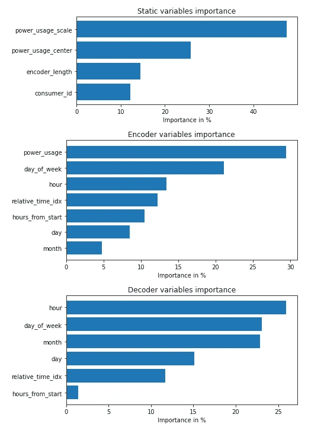****

******图 10:** 特性对验证数据的重要性****

****在**图 10** 中，我们注意到以下内容:****

*   ****作为过去的观察值和未来的协变量，`hour`和`day_of_week`都有很强的得分。原始论文中的基准也有相同的结论。****
*   ****`power_usage`显然是最有影响力的观测协变量。****
*   ****这里的`consumer_id`并不重要，因为我们只使用了 5 个消费者。在 TFT 论文中，作者使用了所有 370 个消费者，这个变量更重要。****

> ******注意:**如果你的分组静态变量不重要，很有可能你的数据集也可以用一个单一的分布模型来建模(像 ARIMA)。****

## ****极端事件检测****

****众所周知，时间序列在罕见事件(也称为**冲击**)期间易受属性突然变化的影响。****

****更糟糕的是，这些事件非常难以捉摸。想象一下，如果你的目标变量因为协变量无声无息地改变了行为而在短时间内变得不稳定:****

> ****这是某种随机噪声还是逃脱了我们模型的隐藏的持续模式？****

****利用 TFT，我们可以分析每个特性在其值范围内的鲁棒性。不幸的是，当前的数据集没有表现出波动性或罕见事件——这些更有可能在金融、销售数据等中发现。不过，我们将展示如何计算它们:****

****有些特征的值并没有全部出现在验证数据集中，所以我们只显示了`hour`和`consumer_id`:****

****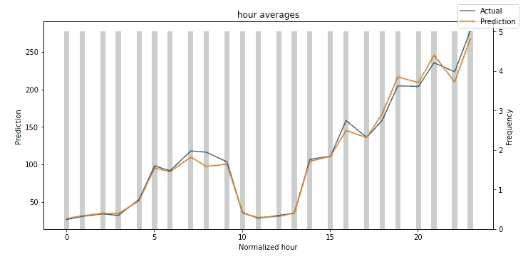****

******图 11:** 每小时的预测值与实际值(标准化平均值)****

****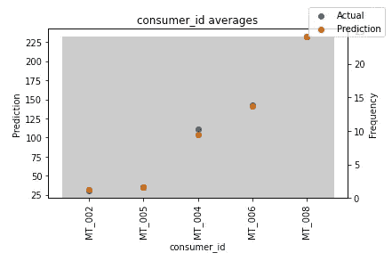****

******图 12:**consumer _ id 的预测值与实际值(归一化平均值)****

****在这两个数字中，结果都令人鼓舞。在**图 12** 中，我们注意到消费者 **MT_004** 与其他消费者相比表现稍差。如果我们将每个消费者的 P50 损失与我们之前计算的他们的平均用电量归一化，我们可以验证这一点。****

****灰色条表示每个变量的分布。我经常做的一件事是找出哪些值出现频率低。然后，我检查模型在这些方面的表现。因此，您可以很容易地检测出您的模型是否捕捉到了罕见事件的行为。****

****一般来说，您可以使用这种 TFT 功能来探测您的模型的弱点，并进行进一步的调查。****

# ****超参数调谐****

****我们可以无缝地使用*时间融合转换器* 和 **Optuna** 来执行超参数调谐:****

****问题是，由于 TFT 是基于变压器的模型，您将需要大量的硬件资源！****

# ****结束语****

*****时间融合转换器*无疑是时间序列社区的一个里程碑。****

****该模型不仅实现了 SOTA 结果，而且为预测的可解释性提供了一个框架。该模型在基于 PyTorch 预测库的 [Darts](https://unit8co.github.io/darts/) python 库中也可用。****

****最后，如果你对详细了解*时间融合转换器*的架构感到好奇，可以查看原始论文上的[配套文章](/temporal-fusion-transformer-googles-model-for-interpretable-time-series-forecasting-5aa17beb621)。****

# ****感谢您的阅读！****

****我每个月写一篇有影响力的 AI 论文的深度分析。
**保持连接！******

*   ****订阅我的[简讯](https://medium.com/subscribe/@nikoskafritsas)！****
*   ****在 Linkedin 上关注我！****

# ****参考****

****[1]由 DALLE 创建，带有文本提示“通过空间传输的蓝色霓虹正弦信号，闪亮，数字绘画，概念艺术”****

****[2] Shereen Elsayed 等人 [*我们真的需要深度学习模型进行时间序列预测吗？*](https://arxiv.org/pdf/2101.02118.pdf)****

****[3] Bryan Lim 等人 [*用于可解释的多时间范围时间序列预测的时间融合变换器*](https://arxiv.org/pdf/1912.09363.pdf) *，*2020 年 9 月****

****[4] D. Salinas 等人， [DeepAR:用自回归递归网络进行概率预测](https://arxiv.org/pdf/1704.04110.pdf)，国际预测杂志(2019)。****

****[5][electricityloaddiagrams 2011 2014](https://archive.ics.uci.edu/ml/datasets/ElectricityLoadDiagrams20112014)数据集由 UCI，CC 通过 4.0。****