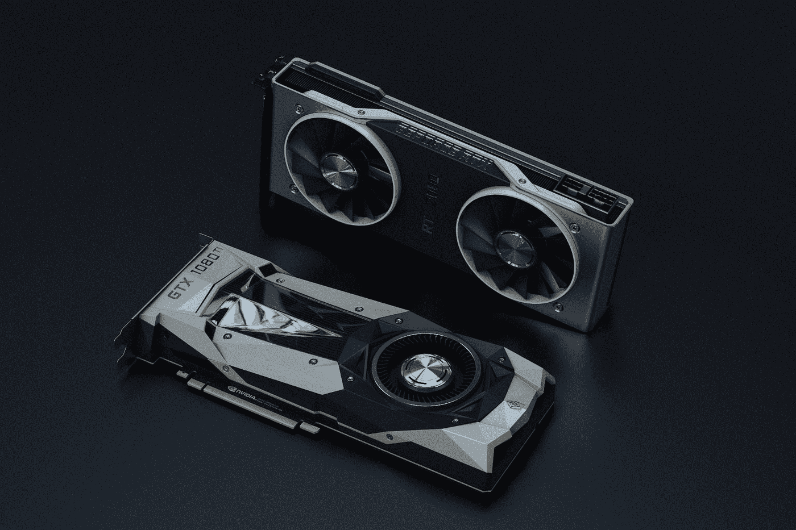
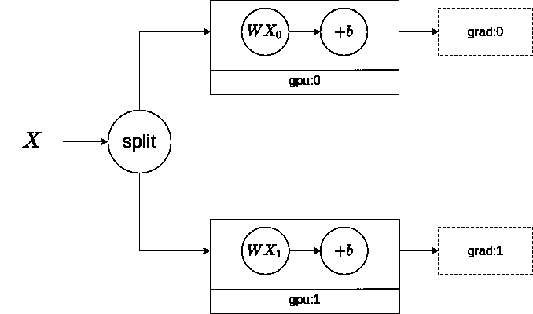
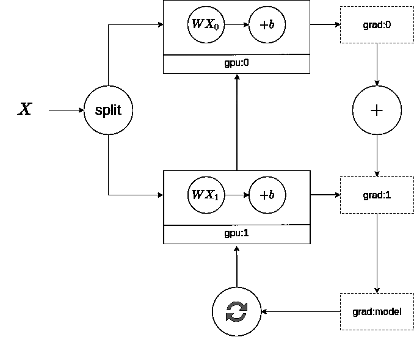

# 张量流分布:一个温和的介绍

> 原文：<https://towardsdatascience.com/tensorflow-distributed-a-gentle-introduction-fafd1e49d1b6>

## 当您可以轻松地将训练过程分布到多个 GPU 时，为什么要将自己限制在一个 GPU 上呢？

在 [Unsplash](https://unsplash.com?utm_source=medium&utm_medium=referral) 上由[娜娜杜瓦](https://unsplash.com/@nanadua11?utm_source=medium&utm_medium=referral)拍摄的照片

深度学习的最新进展主要是由于我们可以处理的数据量。另一方面，大型模型，如具有 1750 亿个参数的 GPT-3，展示了将该领域推向具有更多层的更深模型的巨大成果。

在这两种情况下，将训练过程扩展到更多计算资源的需求比以往任何时候都高。训练时间越短，迭代越快。因此，你可以很快尝试新的想法。

TensorFlow 默认情况下只会占用一个 GPU 进行训练。因此，即使我们的基础设施中有多个 GPU 设备可用，分发也不是自动的。因此，您需要对代码进行特定的更改，以让 TensorFlow 知道如何在训练期间协调事情。

分布式培训有两大类:

*   数据并行性
*   模型并行性

模型并行在高级案例中使用，主要是在研究中，这里就不涉及这个话题了。GitHub 上的 [Mesh TensorFlow](https://github.com/tensorflow/mesh) 资源库是深入研究模型并行性的一个很好的资源。

> [Learning Rate](https://www.dimpo.me/newsletter?utm_source=medium&utm_medium=article&utm_campaign=tf-dist) 是一份时事通讯，面向那些对 AI 和 MLOps 世界感到好奇的人。你会在每周五收到我关于最新人工智能新闻和文章的更新和想法。订阅[这里](https://www.dimpo.me/newsletter?utm_source=medium&utm_medium=article&utm_campaign=tf-dist)！

# 数据并行性

数据并行适用于任何模型架构。这个事实使得数据并行成为分布式训练的标准方法。需要注意的是，训练模型所需的一切都必须适合 GPU 内存。

那么，训练一个深度学习模型需要哪些东西呢？让我们来看一个 TensorFlow 中训练循环的具体例子:

上面代码片段中的注释解释了每一步发生的事情。所以，我们在这里建立一些深度学习词汇。在培训过程中，我们说:

*   训练过程运行`n` **个时期**，其中`n`是用户定义的超参数。
*   每个历元执行几个步骤，在每个**步骤**，模型看到一批**数据**。
*   我们使用每个**批次**来计算梯度并更新模型的**参数**(或**权重**)。
*   最后，当模型遍历一次数据集中的每个示例时，训练**时期**完成。因此，上面代码片段中的`train_step`函数定义了一个训练**步骤**，它将运行`n` **时期**。

例如，让我们假设我们有一个`100`图像的数据集。当模型看到每一张图片时，训练时期将结束。但是，我们不会一次将所有的`100`图像加载到 GPU 内存中。如果我们将批量大小设置为`20`，在每一步我们都加载`20`图像。因此，如果我们有一个由`100`图像组成的数据集，和一个由`20`图像组成的`batch_size`，我们在`5`步骤(`100 / 20 = 5`)之后完成一个时期。

这些`20`图像必须适合 GPU 存储器。此外，我们将模型放在 GPU 内存中。这意味着模型权重和它们的梯度也必须适合那里。

那么数据并行如何加快这个过程呢？利用数据并行性:

*   我们又增加了一个 GPU 设备用于培训。
*   我们创建一个模型副本，并将其加载到新的 GPU 上。
*   我们将数据分成两个子集，并为每个 GPU 提供相应的子集。

结果是，我们可以将批量加倍，并缩短完成一个时期所需的时间。因此，训练时间减少了。

# 同步数据并行

数据并行算法可以是*同步*或*异步*。这些术语指的是如何更新模型参数。在本文中，我们将看到同步方法。我们将在以后的文章中深入探讨异步问题。

为了使事情更具体，让我们采用一个可以使用的运行示例:

调用`model.fit(…)`时，TensorFlow 会自动占用并使用一个 GPU 设备。如果我们可以增加一个 GPU 设备，我们可以将`BATCH_SIZE`增加一倍，将每个时期的步骤减少一半。所以，让我们这样做:

首先，我们定义分销策略。在这个例子中，我们使用最简单的方法`MirroredStrategy`，它允许我们将训练过程分布在同一台机器上的多个 GPU 设备上。

接下来，我们扩大`BATCH_SIZE`超参数，以充分利用我们添加的新 GPU 设备。我们称这个新的超参数为`GLOBAL_BATCH_SIZE`。

最后，我们在分销策略的范围内定义和编译我们的模型。这一步告诉`MirroredStrategy`要在 GPU 设备间复制(即镜像)哪些变量。当我们调用`model.fit(…)`时，这个复制就会发生。

## **`**fit method?**`里面发生了什么**

**所以，让我们看看当我们调用' fit()'函数时会发生什么。理解这一点的最佳方式是通过一张图片:**

****

**向前传递-作者提供的图像**

**我们有两个 GPU 设备:`gpu:0`和`gpu:1`。TensorFlow 将数据集分成两个子集，并将它们提供给 GPU 设备。然后，我们运行两个不同的过程，计算两组不同的梯度。这些过程的下一步是使用梯度来更新模型的权重。**

**由于我们有两个不同的梯度集，我们需要在更新模型的权重之前将它们结合起来。因此，我们将对它们进行平均:**

****

**向后传递-作者提供的图像**

**在通过平均它们的值来减少两个梯度状态之后，我们可以更新模型的权重。**

**在每个训练步骤结束时，将这些梯度集合变成一个集合。然后，优化器执行模型更新，保持所有设备同步，因此得名同步。在所有工人完成上一步培训之前，任何工人都不能进行下一步培训。**

## ****多工人策略****

**TensorFlow 还有另一种策略，在多台机器上执行同步数据并行，每台机器都可能有大量的 GPU 设备。这个策略的名字叫`MultiWorkerMirrorredStrategy`。**

**这种分发策略的工作方式类似于`MirroredStrategy`。此外，如果 GPU 设备不可用，您可以使用这两种技术在多个 CPU 核心上分配培训。**

**最后，参与培训过程的每台机器被称为*工人*。除此之外，还有一个工人承担一些辅助任务。这些任务包括模型检查点和将摘要文件写入 TensorBoard。这台机器被称为`chief`。**

# **结论**

**今天我们看到了使用 Keras 发布的 TensorFlow 的简介。我们看到了分布式培训的主要类别，并深入研究了数据并行性。**

**然后，我们研究了同步数据并行方法，以及如何使用 TensorFlow 实现这一方法。**

**在下面的文章中，我们将看到一个具体的例子，并学习如何使用`MultiWorkerMirroredStrategy`分发策略！**

# **关于作者**

**我叫[迪米特里斯·波罗普洛斯](https://www.dimpo.me/?utm_source=medium&utm_medium=article&utm_campaign=tf-dist)，我是一名为[阿里克托](https://www.arrikto.com/)工作的机器学习工程师。我曾为欧洲委员会、欧盟统计局、国际货币基金组织、欧洲央行、经合组织和宜家等主要客户设计和实施过人工智能和软件解决方案。**

**如果你有兴趣阅读更多关于机器学习、深度学习、数据科学和数据运算的帖子，请关注我的 [Medium](https://towardsdatascience.com/medium.com/@dpoulopoulos/follow) 、 [LinkedIn](https://www.linkedin.com/in/dpoulopoulos/) 或 Twitter 上的 [@james2pl](https://twitter.com/james2pl) 。**

**所表达的观点仅代表我个人，并不代表我的雇主的观点或意见。**