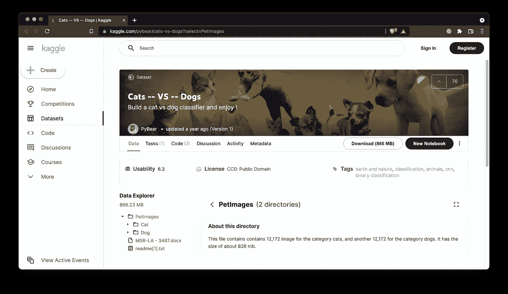
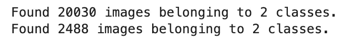
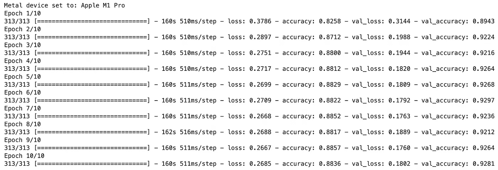
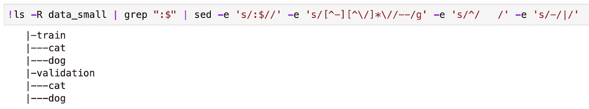
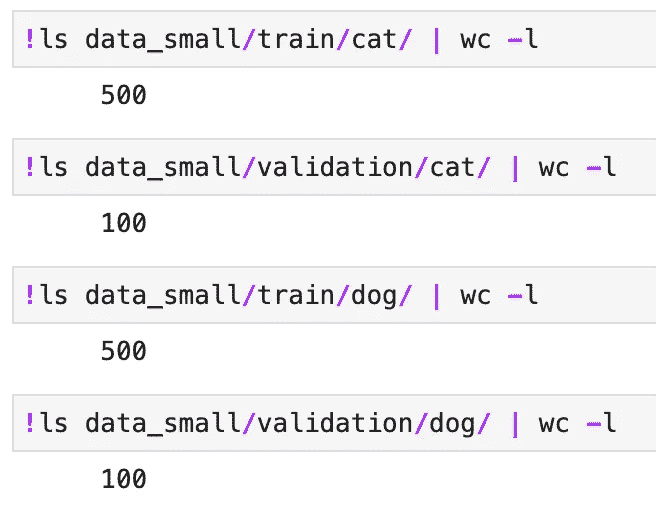
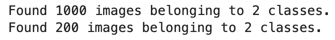
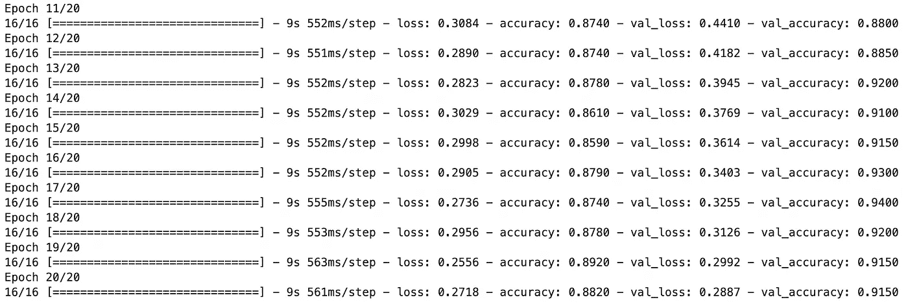

# 面向计算机视觉的 TensorFlow 轻松实现迁移学习

> 原文：<https://towardsdatascience.com/tensorflow-for-computer-vision-transfer-learning-made-easy-e3d1418b110f>

## 90+%的准确率？迁移学习使之成为可能。


照片由 [Unsplash](https://unsplash.com?utm_source=medium&utm_medium=referral) 上的 [Dmitry Ratushny](https://unsplash.com/@ratushny?utm_source=medium&utm_medium=referral) 拍摄

[上周](https://betterdatascience.com/tensorflow-for-computer-vision-how-to-increase-model-accuracy-with-data-augmentation/)，您已经看到了数据增强如何从 TensorFlow 模型中获得额外的百分之几的准确性。与你今天看到的相比，我们只是触及了表面。通过一种非常简单的方法，我们最终将在验证集上获得 90%以上的准确率。

您还将看到，如果我们将训练数据量缩减 20 倍，验证准确性会发生什么变化。剧透警告——它将保持不变。

不想看书？请观看我的视频:

你可以在 [GitHub](https://github.com/better-data-science/TensorFlow) 上下载源代码。

# TensorFlow 中的迁移学习是什么？

从头开始编写神经网络模型架构涉及大量猜测。多少层？每层有多少个节点？使用什么激活功能？正规化？你不会很快就没有问题了。

迁移学习采用不同的方法。不是从零开始，你需要一个现有的神经网络模型，这个模型已经被一个非常聪明的人在一个巨大的数据集上训练过，这个数据集的硬件比你家里的要高级得多。这些网络可以有数百层，不像我们几周前实施的 [2 块 CNN](https://betterdatascience.com/train-image-classifier-with-convolutional-neural-networks/) 。

长话短说——你进入网络越深，你就能提取出越复杂的特征。

整个迁移学习过程可归结为 3 个步骤:

1.  **以一个预先训练好的网络** —例如，以一个 VGG、ResNet 或 EfficientNet 架构为例，该架构已经在数百万张图像上进行了训练，可以检测 1000 个类别。
2.  **切掉模型的头部**——去掉预训练模型的最后几层，用你自己的替换掉。例如，我们的[狗与猫数据集](https://betterdatascience.com/top-3-prerequisites-for-deep-learning-projects/)有两个类，最终的分类层需要类似于此。
3.  **微调最终图层** —在数据集上训练网络以调整分类器。预训练模型的权重是冻结的，这意味着它们不会在您训练模型时更新。

所有这些归结起来就是迁移学习允许你用更少的数据获得更好的结果。我们定制的 2 块架构在验证集上只给出了 76%的准确率。迁移学习将使其飙升至 90%以上。

# 入门-库和数据集导入

我们将使用来自 Kaggle 的[狗和猫的数据集](https://www.kaggle.com/pybear/cats-vs-dogs?select=PetImages)。它根据知识共享许可协议获得许可，这意味着您可以免费使用它:



图片 1-狗和猫的数据集(图片由作者提供)

数据集相当大-25，000 张图像均匀分布在各个类别之间(12，500 张狗图像和 12，500 张猫图像)。它应该足够大，可以训练一个像样的图像分类器。唯一的问题是——它不是为开箱即用的深度学习而构建的。您可以按照我以前的文章创建一个合适的目录结构，并将其分为训练集、测试集和验证集:

<https://betterdatascience.com/top-3-prerequisites-for-deep-learning-projects>  

您还应该删除 *train/cat/666.jpg* 和 *train/dog/11702.jpg* 图像，因为它们已损坏，您的模型将无法使用它们进行训练。

完成后，您可以继续导入库。我们今天只需要 Numpy 和 TensorFlow。其他导入是为了消除不必要的警告消息:

```
import os
os.environ['TF_CPP_MIN_LOG_LEVEL'] = '3' import warnings
warnings.filterwarnings('ignore')import numpy as np
import tensorflow as tf
```

在整篇文章中，我们必须从不同的目录中加载训练和验证数据。最佳实践是声明一个加载图像和[数据扩充](https://betterdatascience.com/tensorflow-for-computer-vision-how-to-increase-model-accuracy-with-data-augmentation/)的函数:

```
def init_data(train_dir: str, valid_dir: str) -> tuple:
    train_datagen = tf.keras.preprocessing.image.ImageDataGenerator(
        rescale=1/255.0,
        rotation_range=20,
        width_shift_range=0.2,
        height_shift_range=0.2,
        shear_range=0.2,
        zoom_range=0.2,
        horizontal_flip=True,
        fill_mode='nearest'
    )
    valid_datagen = tf.keras.preprocessing.image.ImageDataGenerator(
        rescale=1/255.0
    )

    train_data = train_datagen.flow_from_directory(
        directory=train_dir,
        target_size=(224, 224),
        class_mode='categorical',
        batch_size=64,
        seed=42
    )
    valid_data = valid_datagen.flow_from_directory(
        directory=valid_dir,
        target_size=(224, 224),
        class_mode='categorical',
        batch_size=64,
        seed=42
    )

    return train_data, valid_data
```

现在让我们加载我们的猫狗数据集:

```
train_data, valid_data = init_data(
    train_dir='data/train/', 
    valid_dir='data/validation/'
)
```

下面是您应该看到的输出:



图像 2 —训练和验证图像的数量(按作者分类的图像)

20K 训练图像对于迁移学习来说是不是大材小用？可能吧，但是让我们看看我们能得到多精确的模型。

# 张量流在迁移学习中的应用

对于迁移学习，我们基本上是加载一个巨大的预训练模型，而没有顶级分类层。这样，我们可以冻结学习到的权重，只添加输出图层来匹配我们的数据集。

例如，大多数预训练模型都是在具有 1000 个类的 *ImageNet* 数据集上训练的。我们只有两只(猫和狗)，所以我们需要具体说明。

这就是`build_transfer_learning_model()`函数发挥作用的地方。它只有一个参数`base_model`，代表预训练的架构。首先，我们将冻结该模型中的所有层，然后通过添加几个自定义层来构建一个`Sequential`模型。最后，我们将使用通常的假设来编译模型:

```
def build_transfer_learning_model(base_model):
    # `base_model` stands for the pretrained model
    # We want to use the learned weights, and to do so we must freeze them
    for layer in base_model.layers:
        layer.trainable = False

    # Declare a sequential model that combines the base model with custom layers
    model = tf.keras.Sequential([
        base_model,
        tf.keras.layers.GlobalAveragePooling2D(),
        tf.keras.layers.BatchNormalization(),
        tf.keras.layers.Dropout(rate=0.2),
        tf.keras.layers.Dense(units=2, activation='softmax')
    ])

    # Compile the model
    model.compile(
        loss='categorical_crossentropy',
        optimizer=tf.keras.optimizers.Adam(),
        metrics=['accuracy']
    )

    return model
```

现在有趣的部分开始了。从 TensorFlow 导入`VGG16`架构，并将其指定为我们的`build_transfer_learning_model()`函数的基础模型。`include_top=False`参数意味着我们不想要顶级分类层，因为我们已经声明了我们自己的。另外，请注意`input_shape`是如何被设置成类似我们的图像形状的:

```
# Let's use a simple and well-known architecture - VGG16
from tensorflow.keras.applications.vgg16 import VGG16# We'll specify it as a base model
# `include_top=False` means we don't want the top classification layer
# Specify the `input_shape` to match our image size
# Specify the `weights` accordingly
vgg_model = build_transfer_learning_model(
    base_model=VGG16(include_top=False, input_shape=(224, 224, 3), weights='imagenet')
)# Train the model for 10 epochs
vgg_hist = vgg_model.fit(
    train_data,
    validation_data=valid_data,
    epochs=10
)
```

以下是模型训练 10 个时期后的输出:



图 3—10 个时期后 20K 训练图像上的 VGG16 模型(图片由作者提供)

这是值得大书特书的— 93%的验证准确率，甚至不用考虑模式架构。迁移学习的真正魅力在于训练精确模型所需的数据量，这比定制架构少得多。

**少多少？**让我们将数据集缩小 20 倍，看看会发生什么。

# 在 20 倍的较小子集上进行迁移学习

我们想看看减少数据集大小是否会对预测能力产生负面影响。为训练和验证映像创建新的目录结构。图像将被保存在`data_small`文件夹中，但是你可以随意将其重命名为其他名称:

```
import random
import pathlib
import shutilrandom.seed(42) dir_data = pathlib.Path.cwd().joinpath('data_small')
dir_train = dir_data.joinpath('train')
dir_valid = dir_data.joinpath('validation')if not dir_data.exists(): dir_data.mkdir()
if not dir_train.exists(): dir_train.mkdir()
if not dir_valid.exists(): dir_valid.mkdir()for cls in ['cat', 'dog']:
    if not dir_train.joinpath(cls).exists(): dir_train.joinpath(cls).mkdir()
    if not dir_valid.joinpath(cls).exists(): dir_valid.joinpath(cls).mkdir()
```

以下是可以用来打印目录结构的命令:

```
!ls -R data_small | grep ":$" | sed -e 's/:$//' -e 's/[^-][^\/]*\//--/g' -e 's/^/   /' -e 's/-/|/'
```



图 4 —目录结构(作者图片)

将图像样本复制到新文件夹中。`copy_sample()`功能从`src_folder`获取`n`图像并将其复制到`tgt_folder`。默认情况下，我们将把`n`设置为 500:

```
def copy_sample(src_folder: pathlib.PosixPath, tgt_folder: pathlib.PosixPath, n: int = 500):
    imgs = random.sample(list(src_folder.iterdir()), n) for img in imgs:
        img_name = str(img).split('/')[-1]

        shutil.copy(
            src=img,
            dst=f'{tgt_folder}/{img_name}'
        )
```

现在让我们复制训练和验证图像。对于验证集，我们将每个类只复制 100 个图像:

```
# Train - cat
copy_sample(
    src_folder=pathlib.Path.cwd().joinpath('data/train/cat/'), 
    tgt_folder=pathlib.Path.cwd().joinpath('data_small/train/cat/'), 
)# Train - dog
copy_sample(
    src_folder=pathlib.Path.cwd().joinpath('data/train/dog/'), 
    tgt_folder=pathlib.Path.cwd().joinpath('data_small/train/dog/'), 
)# Valid - cat
copy_sample(
    src_folder=pathlib.Path.cwd().joinpath('data/validation/cat/'), 
    tgt_folder=pathlib.Path.cwd().joinpath('data_small/validation/cat/'),
    n=100
)# Valid - dog
copy_sample(
    src_folder=pathlib.Path.cwd().joinpath('data/validation/dog/'), 
    tgt_folder=pathlib.Path.cwd().joinpath('data_small/validation/dog/'),
    n=100
)
```

使用以下命令打印每个文件夹中的图像数量:



图片 5 —每类培训和验证图片的数量(图片由作者提供)

最后，调用`init_data()`函数从新源加载图像:

```
train_data, valid_data = init_data(
    train_dir='data_small/train/', 
    valid_dir='data_small/validation/'
)
```



图片 6-较小子集中的训练和验证图片的数量(图片由作者提供)

总共有 1000 个训练图像。看看我们是否能从这么小的数据集里得到一个像样的模型，这将会很有趣。我们将保持模型架构不变，但是因为数据集更小，所以要为更多的时期进行训练。此外，由于每个历元的训练时间减少，我们可以进行更长时间的训练:

```
vgg_model = build_transfer_learning_model(
    base_model=VGG16(include_top=False, input_shape=(224, 224, 3), weights='imagenet')
)vgg_hist = vgg_model.fit(
    train_data,
    validation_data=valid_data,
    epochs=20
)
```



图 7 —最近 10 个时期的训练结果(作者提供的图片)

你看看这个——我们得到了与在 20K 图像上训练的模型大致相同的验证准确性，这太令人惊讶了。

这就是迁移学习的真正力量所在。你并不总是能接触到巨大的数据集，所以看到我们能用如此有限的数据建立如此精确的东西是令人惊讶的。

# 结论

总而言之，在构建图像分类模型时，迁移学习应该是您的首选方法。你不需要考虑架构，因为已经有人为你做了。你不需要有一个巨大的数据集，因为有人已经在数百万张图像上训练了一个通用模型。最后，除非数据集高度专门化，否则大多数时候不需要担心性能差。

你唯一需要做的就是选择一个预先训练好的架构。我们今天选择了 VGG16，但是我鼓励您尝试 ResNet、MobileNet、EfficientNet 和其他工具。

这是你可以做的另一个**家庭作业**——使用今天训练的两个模型来预测整个测试集。精确度如何比较？请让我知道。

*喜欢这篇文章吗？成为* [*中等会员*](https://medium.com/@radecicdario/membership) *继续无限制学习。如果你使用下面的链接，我会收到你的一部分会员费，不需要你额外付费。*

<https://medium.com/@radecicdario/membership>  

# 保持联系

*   注册我的[简讯](https://mailchi.mp/46a3d2989d9b/bdssubscribe)
*   订阅 [YouTube](https://www.youtube.com/c/BetterDataScience)
*   在 [LinkedIn](https://www.linkedin.com/in/darioradecic/) 上连接

*原载于 2022 年 1 月 3 日*[*https://betterdatascience.com*](https://betterdatascience.com/tensorflow-transfer-learning/)*。*