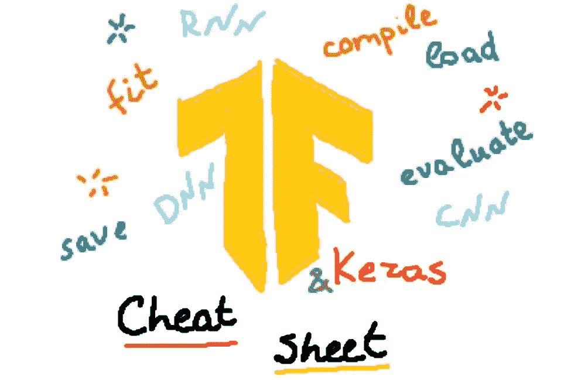
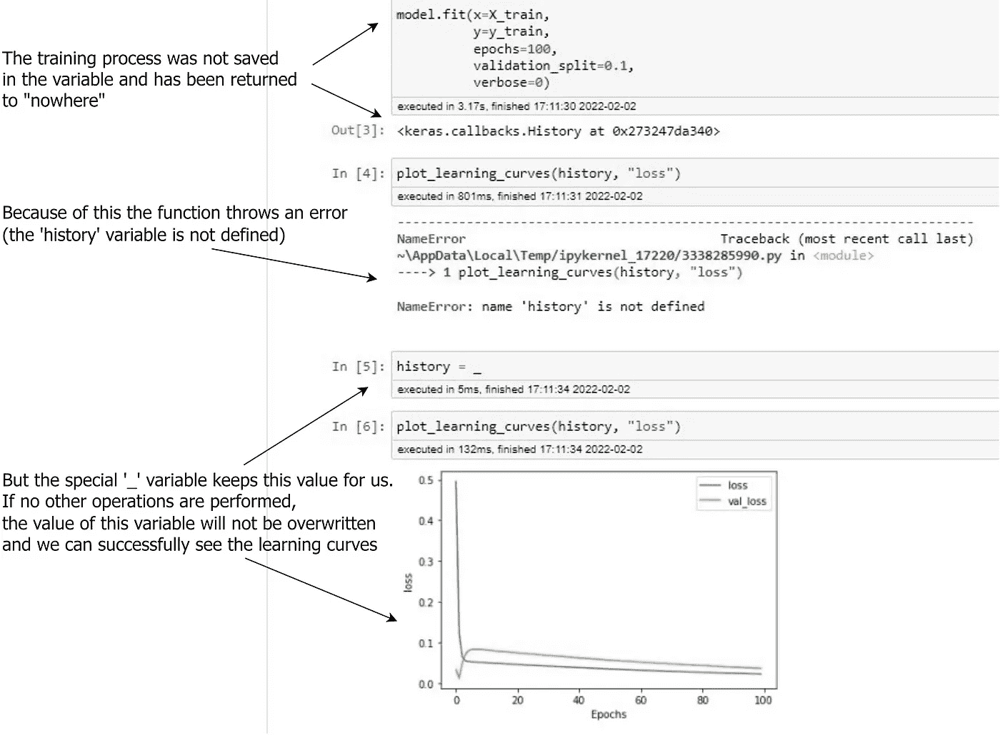
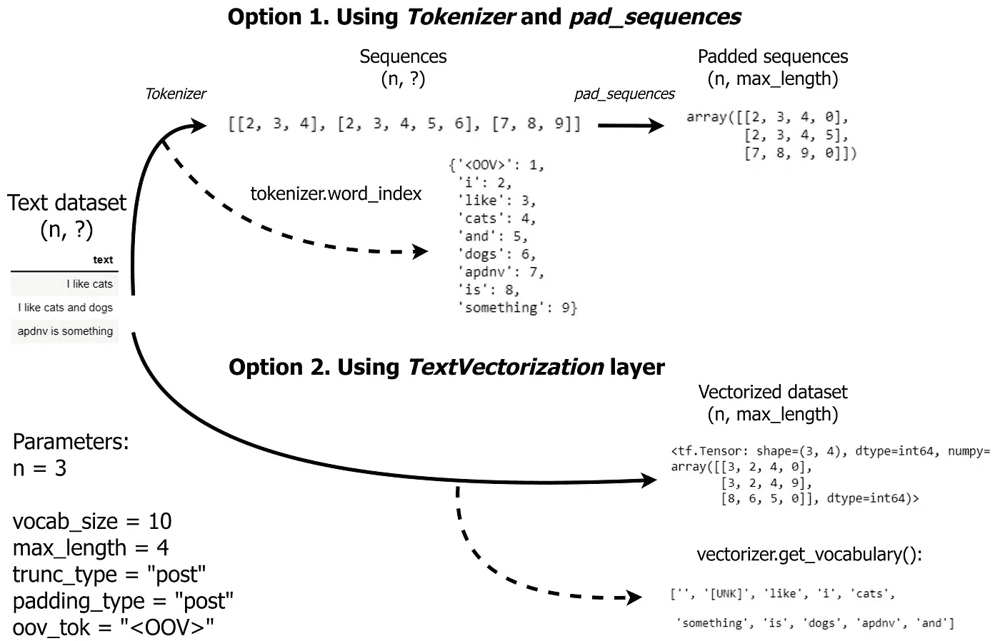

# TensorFlow/Keras 备忘单

> 原文：<https://towardsdatascience.com/tensorflow-keras-cheat-sheet-5ec99d9a1ccf>

## 我们经常使用的所有标准模式都集中在一个地方

预览。作者图片

在本文中，您将找到使用 TensorFlow/Keras 构建神经网络的完整备忘单。我在准备 [TensorFlow 开发者认证考试](https://www.tensorflow.org/certificate)时准备了这张小抄，它给了我很大的帮助。阅读以下文章，了解更多我的考试经历。

 [## 不要害怕参加 Google 的 TensorFlow 开发者考试

### 通过考试你需要知道什么，为什么现在是开始的最佳时机

medium.com](https://medium.com/@andimid/dont-be-afraid-to-take-the-tensorflow-developer-exam-by-google-e083fb26eecf) 

您可以在下面的 [GitLab 资源库](https://gitlab.com/Winston-90/tf_cheat_sheet)中访问该备忘单。

 [## Dmytro Nikolaiev / tf_cheat_sheet

### TensorFlow/Keras 备忘单

gitlab.com](https://gitlab.com/Winston-90/tf_cheat_sheet) 

事不宜迟，我们开始工作吧。

# 备忘单结构

为了与我的叙述保持一致，首先，我们将看一些具有*顺序 API* 的*典型神经网络架构*，并且还将*视为具有*功能 API* 的非顺序架构*的示例。然后我们再考虑`tf.keras.Model`对象的主要方法:*编译*、*拟合*(使用*回调*)、*求值*、*保存*和*加载*。

我们还将看看用于计算机视觉的*图像数据生成器**和用于 NLP 任务的*标记/填充句子*。在存储库中，这段代码位于代码文件的开头，但在这里我决定把它放在最后，因为它更专业，但同时又被广泛使用。*

## *进口*

*为了以后不被进口分散注意力，我马上列出来。我发现单独导入每一层不太方便，所以我使用了`tf.keras.layers.layer`或`layers.layer`结构。是个人口味，所以你的进口可能会略有不同。*

*一些变量也是事先指定的，没有列在下面的列表中。基本上，这些都是用大写字母打印的常量，或者只是帮助变量和函数，比如到一些目录或数据集准备的路径。**请注意，当你按顺序运行这段代码时，你会得到一些错误:这是一个备忘单，不是脚本或程序。***

# *具有顺序 API 的典型神经网络架构*

*神经网络的三个主要架构是深度前馈(通常称为深度)、卷积和递归网络:DNN、CNN 和 RNN。*

*   *DNN 广泛用于一般用途的任务。
    通常是一个简单的全连接(*密集*)层序列，增加了一些内容:*脱落*、*批量正常化*，跳过连接等等。*
*   *CNN 用于图像处理:图像分类、对象检测、语义分割和其他计算机视觉任务。
    通常，简单的 CNN 架构是一系列*卷积池模块*和一个小的全连接网络。*

*RNN 适用于顺序数据处理，即 NLP 任务和时序预测。*

*   *NLP 架构的典型 RNN 是一个*嵌入*层(预训练或未训练)和一系列*双向 LSTM* 层，因为所有文本对模型都是立即可见的。*
*   *时间序列预测的 RNN 通常是单向的，尽管使用双向层也可以提高质量。 *1D 卷积*等技巧和窍门在这里也被广泛运用。*

*顺序 API 的官方文档是[这里是](https://www.tensorflow.org/guide/keras/sequential_model)。*

# *具有功能 API 的更复杂的神经网络架构*

*Functional API 允许您在网络中添加非顺序连接，并指定多个输入和输出。下面是一个相当繁琐，但是演示性的网络描述，它采用文本、图像和几个数字作为输入特征。*

*功能 API 的官方文档在这里是。*

*当`model.summary()`方法不能很好地显示网络结构时，您可以可视化您的模型，以便更清楚地探索它。我在本文的[中描述了不同的可视化技术(参见**可视化神经网络架构**部分)。](/predicting-the-number-of-dislikes-on-youtube-videos-part-2-model-aa981a69a8b2)*

**

**上图网络的可视化 plot _ model()函数的输出。作者图片**

# *编译模型*

*使用`model.compile()`方法，我们设置了三个主要参数:优化器、损失函数和要观察的指标。优化器的标准选择是 *Adam* 或 *RMSProp、*，标准度量是分类的*准确性*和回归的 *MSE 或 MAE* 。*

*损失函数的选择很大程度上取决于任务，但通常情况下，这些是标准值:*

*   **MSE* ， *MAE* 或 *Huber* 回归损失，*
*   **二进制交叉熵*二进制分类的损失，以及*
*   **稀疏分类交叉熵*如果您的标签是整数(即 3 类分类为 1，2，3)，则多类分类任务的损失。
    *分类交叉熵*损失通常在你的标签被表示为一个热编码向量(即[1，0，0]，[0，1，0]和[0，0，1]用于 3 类分类)时使用。*

*`compile`方法的官方文件是[这里是](https://www.tensorflow.org/api_docs/python/tf/keras/Model#compile)。
这里的[是可用优化器的列表](https://keras.io/api/optimizers/#available-optimizers)。
这里的[是可用损失清单](https://keras.io/api/losses/)。
可用指标列表在这里是。*

# *训练模型*

*当我们定义并编译了模型后，我们就可以开始学习过程了。`model.fit()`是模型的主要方法，执行该方法，网络从数据中学习。您可以通过指定不同的数据源来训练网络，但最典型的是数组或张量形式的*常规数据*，计算机视觉的 *ImageDataGenerator* ，NLP 的*填充序列*，以及`tf.data.Dataset`对象。验证数据可以明确指定，也可以通过设置`validation_split`参数来指定。*

*应该特别注意*回调*，因为它们现在就被指定。这些是在训练期间执行的特定功能。在我看来，其中最典型的是*模型检查点*(在其训练期间保存您的模型)和*提前停止*(如果损失停止改善，则停止训练过程)。*

*`fit`方法的官方文件在这里是。
可用回调列表在这里是。
model check point 的官方文档在这里是。
提前停止的官方文件是[这里](https://www.tensorflow.org/api_docs/python/tf/keras/callbacks/EarlyStopping)。*

*请注意，上面的每个方法调用都是不同的，您必须正确指定模型结构和模型编译。有关更多详细信息，请参见 repo 中的完整代码文件。*

# ***探索学习曲线***

*不要忘记将你的培训结果保存到一个`history`变量中，以探索学习曲线——它们可以告诉你很多关于学习的信息。以下功能是[官方 TensorFlow 开发者专业认证库](https://github.com/https-deeplearning-ai/tensorflow-1-public)的一部分。*

*此外，请记住，使用 Jupyter Notebook 或 Google Collab，您可以使用特殊的`_`变量来保存学习过程，该变量会记住最后返回的函数/语句的值。更多详情请浏览回购中的[**special _ variable _ example . ipynb**](https://gitlab.com/Winston-90/tf_cheat_sheet/-/blob/main/special_variable_example.ipynb)**笔记本。***

******

***特殊变量的例子。作者图片***

# ***评估模型***

***`model.evaluate()`方法可以让你看到你的模型在以前看不到的数据上的表现——通常，这是一个在你的研究开始时被搁置的测试集。***

***`evaluate`方法的官方文件是[这里是](https://www.tensorflow.org/api_docs/python/tf/keras/Model#evaluate)。***

# *****保存并加载模型*****

***保存模型以便加载和以后使用是非常重要的。我还为您提供了一个代码来保存您的模型，在文件名中使用*当前日期和时间*，这样您就可以运行多个训练过程，并确保您的所有结果都将被保存。***

***`save`法的官方文件是[这里是](https://www.tensorflow.org/api_docs/python/tf/keras/Model#save)。
关于`load_model`功能的官方文档在这里是。***

# ***为计算机视觉和 NLP 任务准备数据***

***至此，小抄的总论部分(关于神经网络)告一段落。最后，让我为 ImageDataGenerator 和文本数据准备提供一些有用的代码片段。***

## ***使用 ImageDataGenerator***

***ImageDataGenerator 将在计算机视觉任务中为你提供很大帮助——它会根据目录结构自动标记你的图像，或者为你执行内存中的数据扩充。***

***ImageDataGenerator 的官方文档是[这里是](https://www.tensorflow.org/api_docs/python/tf/keras/preprocessing/image/ImageDataGenerator)。***

## ***自然语言处理任务中句子的标记和填充***

***标记化和填充句子是 NLP 任务的常见做法。首先，你把句子转换成向量，然后你确保所有这些向量有一个固定的长度来输入你的模型。***

***你也可以像我在[这篇文章](/predicting-the-number-of-dislikes-on-youtube-videos-part-2-model-aa981a69a8b2)中所做的那样使用文本矢量化层(参见**使用预训练的单词嵌入将文本转换为矢量**部分)。***

******

***使用 TensorFlow 的文本数据预处理选项。作者图片***

***Tokenizer 的官方文档是这里的。
`pad_sequences`方法的官方文档在这里是。***

# ***结论***

***当然，不可能在一个备忘单中收集所有潜在的 TensorFlow/Keras 模式，但我认为我成功地以方便的形式收集了这里的主要模式。***

***当你使用小抄的时候，它会带来很多好处，但是当你创建小抄的时候，好处会更多。读完这篇文章后，试着为自己创建一个类似的备忘单，纠正错误或不准确之处，并根据你的特定任务进行调整——这可能是一个很好的练习。之后，别忘了分享你的结果，并与我的进行比较(见[本资源库](https://gitlab.com/Winston-90/tf_cheat_sheet))。祝你好运！***

# ***感谢您的阅读！***

*   ***我希望这些材料对你有用。[在 Medium 上关注我](https://medium.com/@andimid)获取更多类似的文章。***
*   ***如果您有任何问题或意见，我将很高兴得到任何反馈。在评论中问我，或者通过 [LinkedIn](https://www.linkedin.com/in/andimid/) 或 [Twitter](https://twitter.com/dimid_ml) 联系。***
*   ***为了支持我作为一名作家，并获得数以千计的其他媒体文章，使用[我的推荐链接](https://medium.com/@andimid/membership)获得媒体会员资格(不收取额外费用)。***

# *****参考文献*****

*** [## Keras 文档 Keras API 参考

### Keras 文档

Keras API 参考 Keras 文档 keras.io](https://keras.io/api/)  [## 模块:tf | TensorFlow Core v2.7.0

### 张量流

核心版本 2 . 7 . 0 TensorFlowwww.tensorflow.org](https://www.tensorflow.org/api_docs/python/tf)***