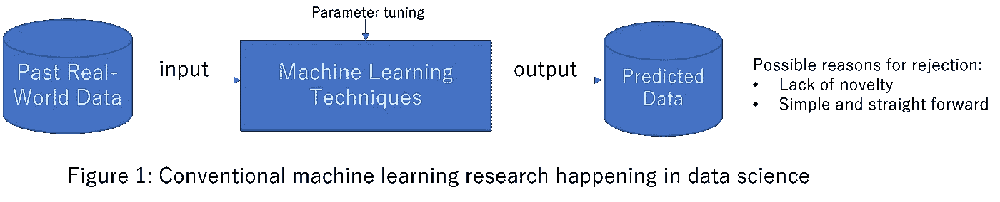
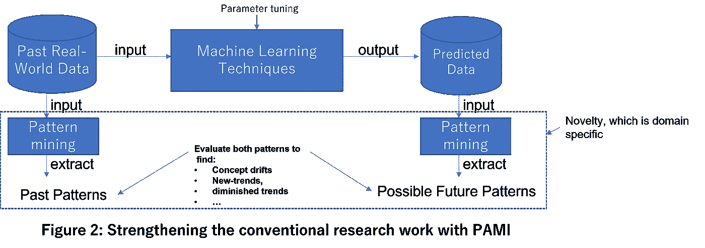

# 用 PAMI 管道化机器学习库:在顶级数据科学会议上发表论文的好方法

> 原文：<https://towardsdatascience.com/tensorflow-keras-statsmodel-sklearn-etc-pami-c7210afa62d0>

这篇文章为学生/研究人员在几个顶级数据科学会议上发表论文提供了有用的提示。本文的组织结构如下:

*   关于作者
*   “为什么我的论文在顶级会议上被拒绝？”—一个普通学生的问题
*   联合 ML 图书馆和 PAMI 加强自己的研究工作
*   PAMI 简介
*   结合 TensorFlow 和 PAMI 的降雨分析示例

# 关于作者:

我是 RAGE Uday Kiran 教授，在日本会津大学担任副教授。我还是日本东京大学 Kitsuregawa 实验室和 NICT 的客座研究员。

**研究兴趣:**大数据分析、智能交通系统、空气污染分析、推荐系统以及用于农业和环境的 ICT。

**研究生命:**

*   在顶级计算机科学会议上发表了几篇论文，如 IEEE-FUZZY、IEEE-BIGDATA、EDBT、CIKM、PAKDD、SSDBM、ICONIP、DSAA、DASFAA 和 DEXA。
*   IEEE-FUZZ、PAKDD、DEXA、DASFAA、ICONIP 和 DSAA 的评审员。
*   巴基斯坦 2021 年和 ICDM 2022 年宣传联合主席
*   DASFAA 2022 出版物共同主席。
*   本书:[周期模式挖掘(斯普林格)](https://link.springer.com/book/10.1007/978-981-16-3964-7)

关于我的出版物的更多细节可以在[【1】](https://dblp.org/pid/11/1466.html)找到。

# **“为什么我的论文在顶级会议上被拒绝？”—一个普通学生的问题**

许多(数据科学)学生这样解释他们的工作:

> “我正在获取真实世界的数据，将其推入机器学习库中，调整超参数，并获得比最先进的结果更好的结果(见图 1)。”



解释之后，他们提出的常见问题如下:

> 尽管我的成绩很好，为什么我的论文总是在顶级会议上被拒绝？

我的回答很简单，就是**“你的方法缺乏*新颖性*”**特别地，简单地将真实世界的数据推入 ML 库中不再被视为核心计算机科学研究问题。它通常被视为一个应用研究问题。事实上，提交给顶级会议的很大一部分论文也是如此，我们经常因为缺乏新颖性而拒绝这些论文。(一些读者可能会认为，为真实数据集调优超参数是一项重要的任务。是的，我们接受这项索赔。然而，我们大多数人从应用计算的角度接受这种说法，而不是从核心计算机科学的角度。这是因为现实世界的数据集比天上的星星还要多。)

# **结合 ML 图书馆+ PAMI 加强自己的研究工作**

听到我的上述回答，一些学生问

> “有没有办法加强我的工作来提高论文被接受的几率？

我的回答是“是的”超越聚类、分类和预测是可能的。图 2 显示了通过应用模式挖掘技术来加强传统机器学习研究的方法。例如，应用模式挖掘算法从过去和预测的数据中提取隐藏的模式。对这些模式执行各种分析，以了解概念漂移、新趋势、减弱趋势等等。



本文的其余部分旨在指导学生通过将 ML 图书馆与 PAMI 结合起来加强他们的研究工作。

# **什么是 PAMI？**

PAMI 代表模式挖掘。PAMI 是一个 Python 库，它包含几个模式挖掘算法来发现隐藏在海量数据集中的知识。目前，PAMI 有 50 多种算法来寻找不同类型的基于用户兴趣的模式。关于 PAMI 的安装和使用的更多信息可以在我们之前的文章[【2】](/hello-i-am-pami-937439c7984d)中找到。

# **结合 TensorFlow 和 PAMI 进行降雨分析的演练示例**

*   下载雨量数据[【3】](https://www.u-aizu.ac.jp/~udayrage/datasets/medium/rainfall/inputfile.csv)和像素数据[【4】](https://www.u-aizu.ac.jp/~udayrage/datasets/medium/rainfall/point_location.txt)
*   导入必要的库

```
# Import the necessary librariesimport pandas as pd
from statsmodels.tsa.ar_model import AutoReg as AR
from PAMI.extras.DF2DB import DF2DB as df2db
import PAMI.extras.dbStats.transactionalDatabaseStats as tds
import PAMI.extras.graph.plotLineGraphFromDictionary as plt
import databasePrune as dbPrune
```

*   对降雨数据进行自回归

```
#reading input csv file with 20 days of global rainfall datadataframe = pd.read_csv("inputfile.csv")
for i in dataframe:
   #training the model using auto regression column_values = dataframe[i].values
   model = AR(column_values,1)
   model_fit = model.fit()# forecast start period and end period are given as parameters for the prediction model. In this example, we are learning from rainfall data from 20 days and predicting for rainfall details for the next 300 (=320-20) days.output_df = model_fit.predict(start = 20, end = 320)
output_df.insert(0,'tid',output_df.index)
```

*   将预测数据转换成事务数据库

```
#Create a transactional database by considering only those pixels/points whose predicted rainfall values are greater than 500df2db_conversion = df2db.DF2DB(output_df,500, '>=', 'dense','transactionalDatabase.txt')
```

*   了解数据库的统计细节。

```
#statistics of a transactional databaseobj = tds.transactionalDatabaseStats("transactionalDatabase.txt", sep=',') #overrride default tab seperator
obj.run()
print(f'Database size : {obj.getDatabaseSize()}')
print(f'Total number of items : {obj.getTotalNumberOfItems()}')
print(f'Database sparsity : {obj.getSparsity()}')
print(f'Minimum Transaction Size : {obj.getMinimumTransactionLength()}')
print(f'Average Transaction Size : {obj.getAverageTransactionLength()}')
print(f'Maximum Transaction Size : {obj.getMaximumTransactionLength()}')
print(f'Standard Deviation Transaction Size : {obj.getStandardDeviationTransactionLength()}')
print(f'Variance in Transaction Sizes : {obj.getVarianceTransactionLength()}')itemFrequencies = obj.getSortedListOfItemFrequencies()
transactionLength = obj.getTransanctionalLengthDistribution()#Storing the statistical details in a fileobj.storeInFile(itemFrequencies, 'itemFrequency.csv')
obj.storeInFile(transactionLength, 'transactionSize.csv')# Visualizing the distributions of items frequencies and transactional lengths.plt.plotLineGraphFromDictionary(obj.getSortedListOfItemFrequencies(),50,'item frequencies', 'item rank', 'frequency')plt.plotLineGraphFromDictionary(obj.getTransanctionalLengthDistribution(),100,'distribution of transactions', 'transaction length', 'frequency')
```

*   根据 Zip 定律，高频率的项目携带的信息非常少。因此，我们从事务数据库中删除高频率项目，即频率大于或等于 275 的项目，并创建新的事务数据库。下面提供了从数据库中删除高频项的代码。请用 databasePrune.py 文件名保存下面的代码。

```
import statistics
import validators
from urllib.request import urlopen
import csv

class databasePrune:
    def __init__(self, inputFile, outputFile, threshold, sep='\t'):
        self.inputFile = inputFile
        self.lengthList = []
        self.sep = sep
        self.database = {}
        self.outputFile = outputFile
        self.threshold = threshold

    def run(self):
        self.readDatabase()

    def readDatabase(self):
        numberOfTransaction = 0
        with open(self.inputFile, 'r', encoding='utf-8') as f:
            for line in f:
                numberOfTransaction += 1
                line.strip()
                temp = [i.rstrip() for i in line.split(self.sep)]
                temp = [x for x in temp if x]
                self.database[numberOfTransaction] = temp

    def getItemFrequencies(self):
        self.itemFrequencies = {}
        for tid in self.database:
            for item in self.database[tid]:
                self.itemFrequencies[item] = self.itemFrequencies.get(item, 0)
                self.itemFrequencies[item] += 1
        myDict = {key: val for key, val in self.itemFrequencies.items() if val >= self.threshold}
        return myDict.keys()

    def dbpruning(self, itemFrequencies):
        self.dict = {}
        for tid in self.database:
            list1 = self.database[tid]
            list2 = itemFrequencies
            set_diff = set(list1) - set(list2)
            self.dict[tid] = list(map(int, set_diff))
        with open(self.outputFile, 'w') as f:
            for key, value in self.dict.items():
                if value != []:
                    f.write('{0}\n'.format(str(value).replace("[", "").replace("]", "")))
        return self.dict

if __name__ == '__main__':
    obj = databasePrune('transactionalDatabase.txt', 'newTransactionalDatabase.txt', 275,sep=',')
    obj.run()
    itemFrequencies = obj.getItemFrequencies()
    items = obj.dbpruning(itemFrequencies)
```

*   对新生成的事务数据库应用频繁模式挖掘

```
from PAMI.frequentPattern.basic import FPGrowth as alg
obj = alg.FPGrowth('transaction_300.csv',273,sep=',')
obj.startMine()
obj.savePatterns('patterns.txt')
df = obj.getPatternsAsDataFrame()#Print the runtime and memory consumed for the mining processprint('Runtime: ' + str(obj.getRuntime()))
print('Memory: ' + str(obj.getMemoryRSS()))
```

*   将交易数据库中的项目映射到像素/点

```
import pandas as pd# reading location points from the filedf = pd.read_csv('point_location.txt',header=None,sep='\t',usecols=b [0])
location_values = []
with open('pattern_loc.txt','w') as w:
    with open('patterns.txt') as f:
        # mapping respective points with location in patterns file
        for line in f:
            freq = line.split(":")[-1]
            values = list(line.split())[:-1]
            for i in values:
                a = "POINT" + "(" + str(df.iloc[int(i)].values[0]) + ")"
                location_values.append(a)
            result = re.sub(r"[',']", "", str(location_values).replace('[', '').replace(']', '')
            w.write(result + " :" + freq)
```

*   可视化生成的图案

```
import PAMI.extras.plotPointOnMap as plt
obj = plt.plotPointOnMap('pattern_loc.txt')
mmap = obj.plotPointInMap()
mmap
```

# **结论**

许多在数据科学领域工作的学生/研究人员面临的一个基本问题是“如何在顶级会议上发表论文？”这篇博客试图通过提供一种好的方法来解决这个问题，这种方法将从现有机器学习库中导出的输出(或预测)转换成数据库，并应用模式挖掘算法来发现数据中隐藏的模式。最后，我们用一个使用真实世界全球降雨量数据的玩具例子来说明我们的方法。

# **致谢**

我感谢我的研究生，小姐。拉希卡小姐。P. Likitha，感谢他们为玩具实验准备必要的代码和数据。

# **参考文献**

1.  https://dblp.org/pid/11/1466.html 的 DBLP
2.  https://towardsdatascience.com/hello-i-am-pami-937439c7984d PAMI 简介
3.  样本降雨量数据，[https://www . u-aizu . AC . jp/~ udayrage/datasets/medium/rain/input file . CSV](https://www.u-aizu.ac.jp/~udayrage/datasets/medium/rainfall/inputfile.csv)
4.  交易数据库中每个项目的点信息，[https://www . u-aizu . AC . jp/~ udayrage/datasets/medium/rain/point _ location . txt](https://www.u-aizu.ac.jp/~udayrage/datasets/medium/rainfall/point_location.txt)