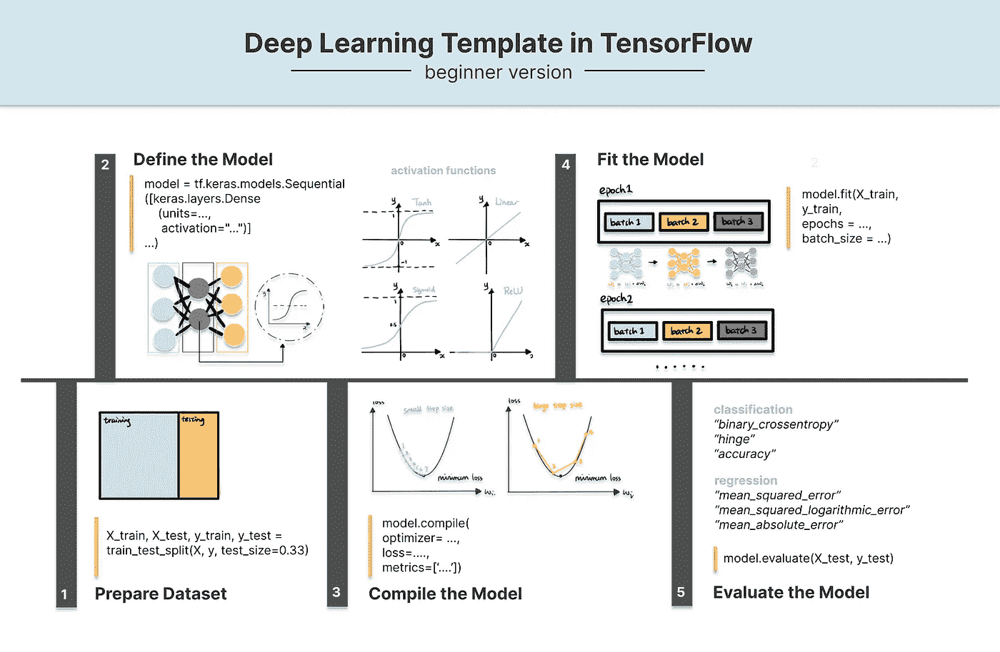
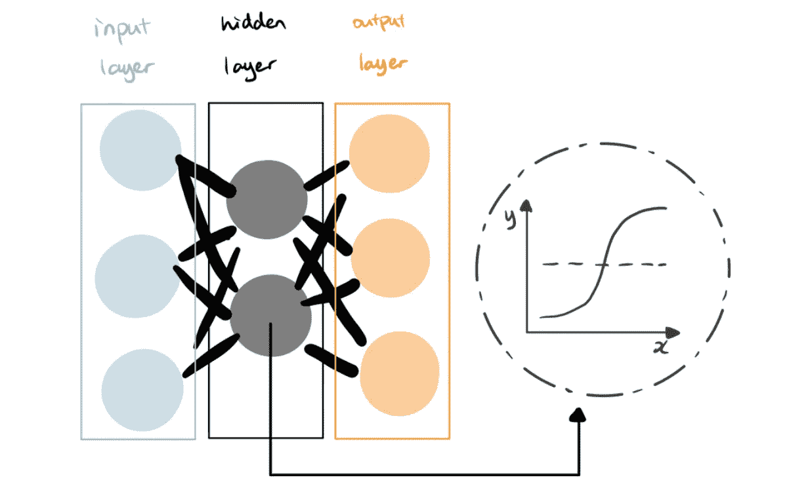
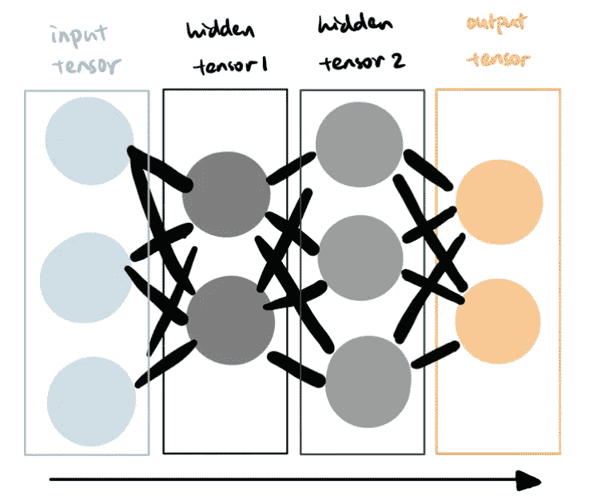
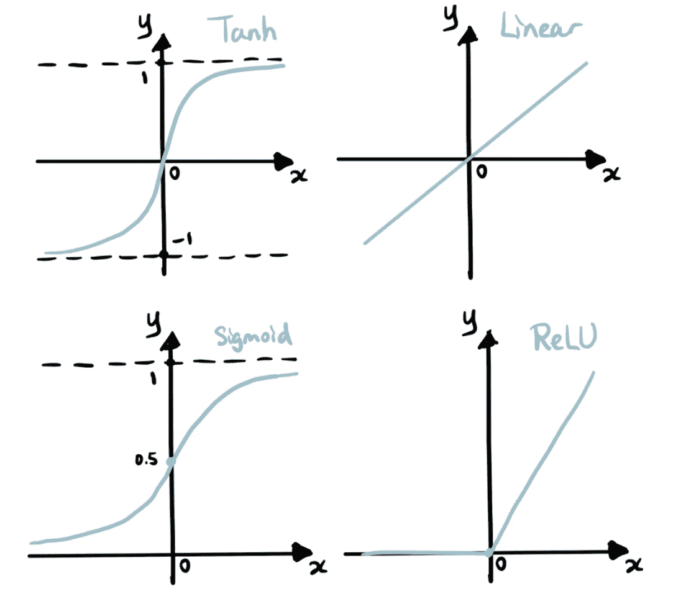
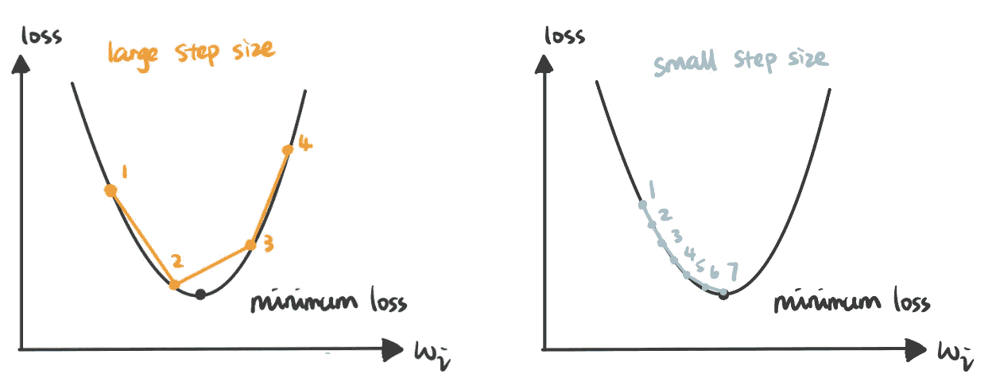
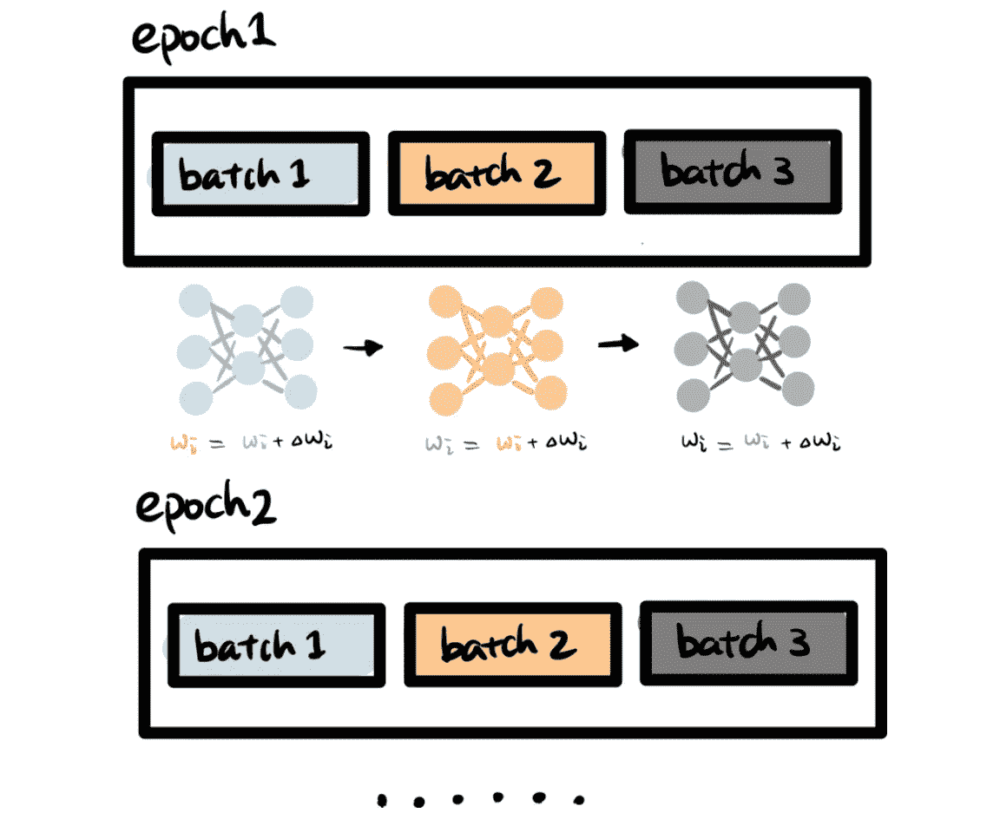

# 深度学习初学者 TensorFlow 模板

> 原文：<https://towardsdatascience.com/tensorflow-template-for-deep-learning-beginners-3b976d0ee084>

## 如何建立你的第一个深度神经网络



深度学习备忘单(图片来自我的[网站](https://www.visual-design.net/)

# 什么是深度学习？

D eep 学习是使用神经网络的机器学习模型的一个子类。简而言之，神经网络连接多层节点，每个节点都可以被视为一个迷你机器学习模型。然后，模型的输出作为后续节点的输入。



深度学习模型(图片由作者提供)

TensorFlow 是一个 Python 库，主要致力于提供深度学习框架。要安装和导入 TensorFlow 库:

```
pip install tensorflow
import tensorflow as tf
```

# 如何构建 TensorFlow 深度神经网络

深度学习模型的框架通常遵循以下结构，我们可以使用 Keras API 来实现初学者友好的深度学习模型。我们可以在每个阶段添加许多变化，使模型更加复杂。

1.  **准备数据集:**数据准备和特征工程技术
2.  **定义模型:**模型类型、层数和单元数、激活功能
3.  **编译模型**:优化器、学习率、损失函数、指标
4.  **拟合模型:**批量，历元
5.  **评估和预测:**评估指标

*从我的网站上的* [*代码片段*](https://www.visual-design.net/code-snippets) *部分获取代码模板。*

## 1.准备数据集

深度学习基本上是一种机器学习算法，由监督学习和非监督学习组成。对于监督学习，需要将数据集分为训练集和测试集(有时也包括验证集)，如下所示。

```
from sklearn.model_selection import train_test_split
X = df.drop(['user-definedlabeln'], axis=1)
y = df['user-definedlabeln']
X_train, X_test, y_train, y_test = train_test_split(X, y, test_size=0.33, random_state=42)
```

对于原始数据集，您还可以做更多的事情，比如预处理和特征工程，但是在本文中让它保持简单。

## 2.定义模型

深度学习神经网络的最简单形式之一是序列模型，它由单个层堆叠组成，每层只有一个输入张量和一个输出张量。我们可以通过传递多个密集层来创建一个顺序模型。



顺序模型(图片由作者提供)

```
model = tf.keras.models.Sequential([
        keras.layers.Dense(units=32, activation="sigmoid"),
        keras.layers.Dense(units=16, activation="sigmoid"),
        keras.layers.Dense(units=1, activation="ReLU")
    ])
```

**层数和单元数**:深度学习模型必须有输入层和输出层。输入和输出之间的隐藏层数可以变化。每层的单元数量也是一个我们可以实验的超参数。文章“[如何配置神经网络中的层数和节点数](https://machinelearningmastery.com/how-to-configure-the-number-of-layers-and-nodes-in-a-neural-network/)”提供了如何实验和执行搜索以确定层数和节点数的指南。

**激活函数**:模型的每一层都需要一个激活函数。您可以将它视为一个将节点输入转换为输出的微型统计模型。激活函数有助于神经网络的非线性。隐藏层通常应用相同的激活函数，而输出层可以有不同的激活函数，这取决于它是分类还是回归预测。

以下是常见的激活功能，每一个都有其优点和缺点。

*   **Sigmoid**:Sigmoid 从 0 到 1，适用于二值分类
*   **ReLU** :它保留了线性行为，解决了 Sigmoid 和 Tanh 中渐变消失的问题，但当输入为负时，它可能会遇到其他问题，如饱和或死单元
*   **Tanh** :更强的梯度使其对微小的差异更敏感，但是在极端值时存在饱和和学习速度慢的问题
*   **线性**:适用于数值输出连续的回归问题



激活功能(作者图片)

推荐阅读: [*深度学习如何选择一个激活函数*](https://machinelearningmastery.com/choose-an-activation-function-for-deep-learning/)

## 3.编译模型

深度学习模型使用反向传播来学习。简而言之，它从预测误差中学习并调整分配给每个节点的权重，以便最小化预测误差。在编译模型的阶段，我们需要指定用于测量误差的损失函数以及用于减少损失的优化器算法。

```
from tensorflow.keras.optimizers import RMSprop
model.compile(optimizer= RMSprop(learning_rate=0.001), loss="binary_crossentropy", metrics=['accuracy'])
```

**优化器:**优化器定义优化算法，用于优化模型以减少误差。下面是一些优化器的例子:

*   **梯度下降**:根据函数的梯度更新参数，使损失函数最小化
*   **随机梯度下降**:梯度下降的流行变体，为每个训练样本更新参数
*   **RMSProp** :计算自适应学习率，常用于递归神经网络
*   **动量**:它借鉴了物理学的思想，学习速度根据梯度方向进行调整，从而加快收敛速度
*   **Adam** :它结合了 *RMSProp* 和 *Momentum、*的优点，在处理大型数据集时非常高效

推荐阅读:

[*深度学习优化器综合指南*](https://www.analyticsvidhya.com/blog/2021/10/a-comprehensive-guide-on-deep-learning-optimizers/)

[*梯度下降优化算法概述*](https://ruder.io/optimizing-gradient-descent/)

我们还需要为优化器指定一个**学习率**，因为它决定了更新参数/权重的速度，以最小化损失函数的结果。我们可以将 2D 空间中的损失函数可视化如下，并且优化器的目标是找到最小误差点。如果学习率过大，我们可能会跳过最低点，无法收敛。但是，如果学习率太小，可能需要非常长的时间才能达到最小损失。



大步长与小步长(图片由作者提供)

**损失函数**:损失函数测量错误率，并提供模型性能的评估。它需要深度学习模型中不同的损失函数来进行分类预测和回归预测:

*   分类问题的损失函数:*“二元交叉熵”、“铰链”…*
*   回归问题的损失函数:*“均方误差”、“均方对数误差”、“均方绝对误差”*

**度量:**是每次训练迭代后生成的评估度量，可以作为列表传递。我们可以使用上面的损失函数，还可以添加“准确性”、“auc”用于分类，添加“rmse”、“余弦”用于回归。

推荐阅读:[*Keras 损失函数:你需要知道的一切*](https://neptune.ai/blog/keras-loss-functions)

## 4.符合模型

model.fit()函数将训练数据集 X_train 和训练标签 y_train 拟合到模型中。训练过程的复杂性也受时期和批量大小的控制。

```
model.fit(X_train, y_train, epochs = 15, batch_size = 10)
```



批次和时期(图片由作者提供)

**历元:**控制完成训练所需的通过整个训练集的迭代次数。

**batch_size:** 决定更新模型参数需要多少训练样本。如果 batch_size 与训练集的大小相同，则模型将使用整个训练数据集来更新模型参数。如果 batch_size = 1，它将使用每个数据点来更新模型参数。

推荐阅读: [*纪元 vs 批量 vs 迭代*](/epoch-vs-iterations-vs-batch-size-4dfb9c7ce9c9)

## 5.评估和预测

请记住，我们最初将整个数据集分为训练和测试两部分。并且测试集已经从整个模型构建过程中被忽略了。这是因为我们需要使用维持测试数据集来评估它在不可见数据上的性能。简单地传递下面的测试数据集，它会返回在模型编译阶段指定的模型评估指标。

```
model.evaluate(X_test, y_test)
```

一旦您对模型性能感到满意，就可以部署它来进行预测。

```
model.predict(predict_data)
```

目前的模型只能被认为是一个基线模型，仍然有许多改进可以做，以提高其准确性。本文为提高深度学习基线模型性能提供了有益的指导: [*如何提高深度学习性能*](https://machinelearningmastery.com/improve-deep-learning-performance/) *。*

感谢到达终点。如果你想阅读我更多关于媒体的文章，我将非常感谢你的支持，注册成为☕️媒体会员

# 带回家的信息

本文介绍了面向初学者的深度学习模板。在每个阶段，我们可以通过对超参数进行实验来增加神经网络模型的变化和复杂性:

1.  **准备数据集:**数据预处理和特征工程技术
2.  **定义模型:**模型类型、层数和单元数、激活功能
3.  **编译模型**:优化器、学习率、损失函数、度量
4.  **拟合模型:**批量，历元
5.  **评价与预测**

## 更多这样的资源

[](/top-machine-learning-algorithms-for-classification-2197870ff501) [## 用于分类的 6 大机器学习算法

### 如何用 Python 构建机器学习模型管道

towardsdatascience.com](/top-machine-learning-algorithms-for-classification-2197870ff501) 

[德斯坦贡](https://destingong.medium.com/?source=post_page-----3b976d0ee084--------------------------------)

## 开始学习数据科学

[View list](https://destingong.medium.com/list/get-started-in-data-science-8006bb4ba3ad?source=post_page-----3b976d0ee084--------------------------------)8 stories[](/how-to-self-learn-data-science-in-2022-a537a76d138e) [## 2022 年如何自学数据科学

### 基于项目的数据科学入门方法

towardsdatascience.com](/how-to-self-learn-data-science-in-2022-a537a76d138e) 

*原载于 2022 年 6 月 2 日*[*【https://www.visual-design.net】*](https://www.visual-design.net/post/semi-automated-exploratory-data-analysis-process-in-python)*。*