# 用 Python 将火星地球化

> 原文：<https://towardsdatascience.com/terraforming-mars-with-python-4c21ed75117f>

# 用 Python 将火星地球化

## *通过想象力和色彩映射表的巧妙运用，让死亡的世界变得栩栩如生*

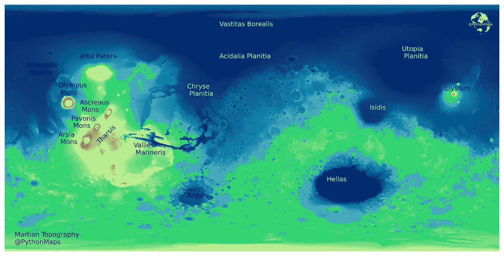

图片作者。

学习新事物的最好方法是解决有趣或不寻常的问题。在这篇文章中，我将向你展示如何生成和操作高度先进的彩色地图，以生成每个人的第二喜欢的星球，火星的地形图。由于某个美国亿万富翁的大肆宣传，火星越来越多地出现在新闻中，现在人类很有可能在本世纪的某个时候在火星表面行走。尽管如此，除了想象天空中有一个红色的大球，很少有人真正知道火星长什么样。火星表面实际上有相当丰富的特征，从峡谷和火山口到火山。由于多年来的许多无人驾驶任务，它的地形已经被绘制得非常详细，可以毫不费力地查看，以获得对这颗行星实际情况的真实感受。如果你问这位作者，地球的地形图已经做得太烂了，所以是时候在另一个星球上尝试一下了。在这篇文章中，我将概述如何生成火星地形图，并通过彩色地图的魔力想象一个经过地形改造的火星会是什么样子，它的海洋会是什么样子，它的河流会流向哪里。

这主要是为了理解色彩映射表实际上是如何工作的，特别是如何正确地使用它们来解决特定的问题。

# **数据探索**

像往常一样，第一件事是把火星地形数据下载到你想做数据可视化实验的任何地方。这些数据可以从美国政府[这里](https://astrogeology.usgs.gov/search/map/Mars/GlobalSurveyor/MOLA/Mars_MGS_MOLA_Shade_global_463m)获得，不受任何用户限制。现在需要注意的是，数据量非常大，达到了 2.3GB，所以要小心。

数据为 tif 格式，通过`rasterio`加载到`np.array`中。该阵列很大，尺寸为 23040 x 46090。值的范围映射到火星上的高度值。火星没有海洋，所以没有“海平面”作为海拔的参考点。不赘述，火星上的“海平面”定义为火星上的平均海拔。因此，负地形值是平均海拔以下的区域，正地形值是平均海拔以上的区域。奥林匹斯山是火星上最大的山，高度为 21241 米(相对于火星平均海拔)，海拉斯盆地是火星上的最低点，深度为-8201 米(相对于火星平均海拔)。有趣的是，这意味着火星上最高点和最低点之间的差异(~30 公里)大于地球上珠穆朗玛峰和玛丽娜海沟之间的差异(~ 20 公里)。

绘制数据让我们知道我们面临的是什么。贯穿本教程的一个警告是，如果在标准的笔记本电脑上运行，运行代码，去泡一杯茶，当你回来时，代码将接近完成。数据源是巨大的，没有任何办法可以避免与大型数据集和`matplotlib`绘图相关的长执行时间。

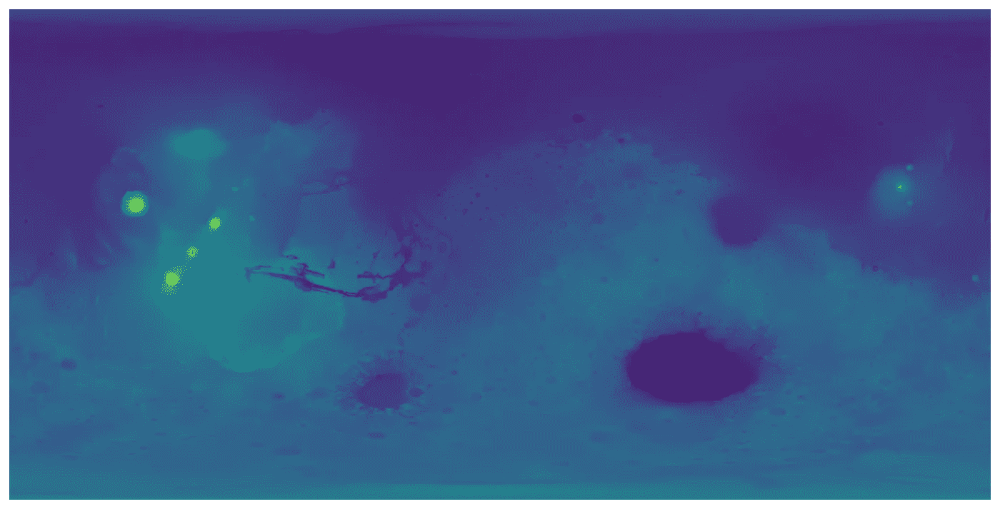

默认绘图。图片作者。

使用默认的色彩映射表揭示了一个问题，将地形值线性映射到色彩映射表会产生一个非常乏味的映射表，并且大部分特征会丢失。原因是大多数火星特征位于-8000-12000 米之间。从平均高度如此偏向海勒斯盆地而远离奥林匹斯山来看，这应该是显而易见的。以黄色显示的四座山占据了地球很小的一部分(就面积而言)，但是因为它们很大(就海拔而言)，彩色地图中四分之一的颜色只为它们而存在。因此，其余的特征被映射到小范围的颜色上，清晰度很差。

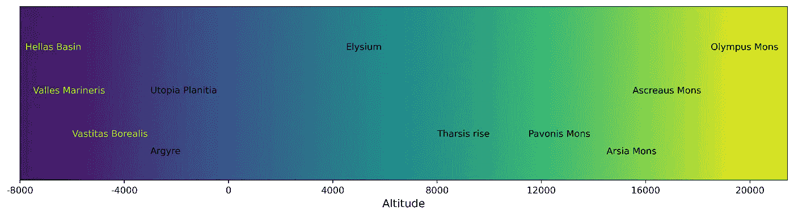

火星的主要特征位于默认的色彩图上。图片作者。

# 定义色彩映射表

为了解决这个问题，我们将创建一个颜色图，并打破一些数据可视化规则。严格地说，我们可能应该有一个在数据的最大值和最小值之间标准化的线性颜色图。然而，因为在这种情况下，只有四个高于 14000 米的要素和许多低于 14000 米的要素，我们将创建一个颜色图来映射-8201 米(我们数据中的最低点)和 14000 米之间的颜色，14000 米以上的所有要素都映射到颜色图中的最后一种颜色。不幸的是`matplotlib`没有特别好的颜色图来显示地形。美国国家航空航天局使用这张作为他们的彩色地图来显示火星的地形，我们也将这样做。

下面是一段代码，它将创建一个色彩图，大致基于美国宇航局使用的色彩图，在-8210 米和 14000 米之间归一化，波段为 10 米。`LinearSegmentedColormap`方法获取一个颜色列表并生成一个颜色图，其中`N`颜色在列表中的颜色之间呈线性间隔。`BoundaryNorm`类允许你将颜色图中的颜色映射到一组自定义值。在这种情况下，我们正在创建一个`BoundaryNorm`对象，它将在-8210 和 14000 米之间绘制 10 米波段的颜色。举例来说，0-10m 之间的值将映射到一种颜色，10-20m 之间的值将映射到下一种颜色，依此类推。任何高于 14000 米的物体都将在色彩映射表中用最终的颜色来着色。

为了对我们新的色彩图有一个感觉，它被绘制在下面，并带有标签，大致描述了每个火星特征的位置。现在有更多的颜色来区分我们试图捕捉的大量价值范围。

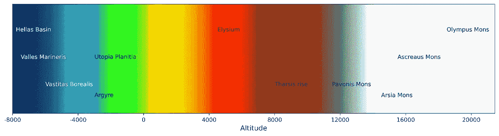

火星的主要特征都在自定义的色彩图上。图片作者。

火星地形图现在可以用新的颜色图重新绘制，并且数值标准化。令人惊讶的是，仅仅通过改变颜色图和调整颜色映射到值的方式，两个图就可以如此不同。

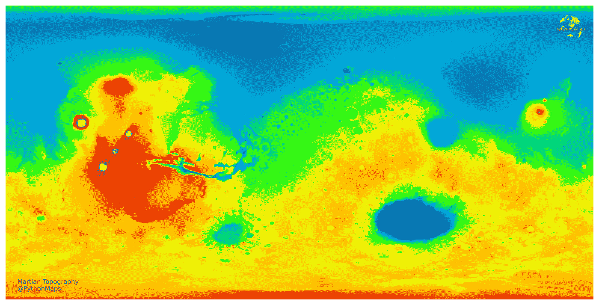

火星地形，用我们定制的彩色地图绘制。图片作者。

我们可以更进一步，向图中添加标签来指出所有不同特征的位置。

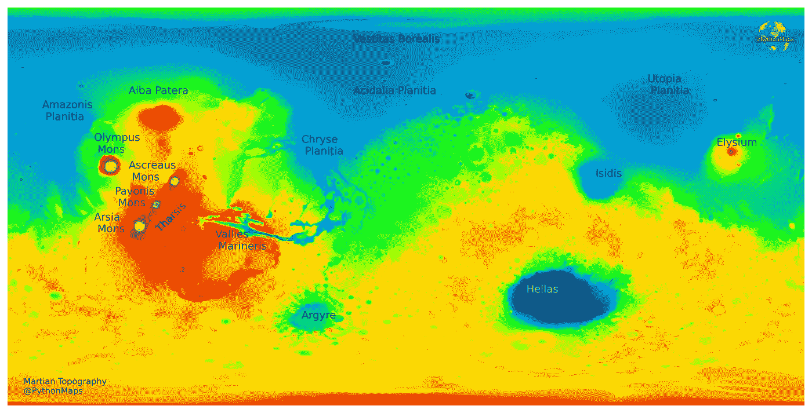

火星地形，有一些值得注意的特征的标签。图片作者。

# 地球化火星

很明显，我们不会真的将火星地球化。然而，在这一节中，我们将通过生成一些类似“地球”的彩色地图来想象一个完全地形化的、潮湿的火星会是什么样子。这位作者将类似“地球”的颜色图定义为一种颜色图，对于海平面以下的值使用深蓝颜色，对于海平面以上的值使用绿棕颜色。

`Matplotlib`有一个名为`terrain`的颜色图，它就是用来完成这个任务的，但是我认为蓝色部分不够暗。幸运的是，还有另一个叫做`ocean`的色彩图，通过组合它们，我们可以生成一个类似“地球”的色彩图。我们的目标是将两个颜色图结合在一起，创建一个`BoundaryNorm`对象，将海平面以下的值映射到`ocean`颜色图，将海平面以上的值映射到`terrain`颜色图。

生成色彩映射表时，其中的颜色会在 0 到 1 的范围内进行线性索引。可以从颜色图中提取颜色列表，并通过提供索引列表来排除部分颜色图。例如，下面我们使用`plt.cm.ocean(np.linspace(0.2, 0.8, 821))`，它从`ocean`颜色图中返回 821 种颜色的列表，不包括颜色图中低于 0.2 和高于 0.8 的颜色。对`terrain`颜色图也做了同样的事情，但是返回了 1400 种颜色。然后使用`LinearSegmentedColourmap`方法将两个颜色列表合并成一个颜色图。

821 种`ocean`颜色和 1400 种`terrain`颜色的原因是因为我们希望我们的颜色图将地形映射到颜色。`BoundaryNorm`类允许你将颜色图中的颜色映射到一组自定义值。在下面的代码中，我们用 2221 种颜色(821 种海洋+ 1400 种地形)和一个`BoundaryNorm`对象创建了一个颜色图，该对象将根据预定义的级别将数据中的值映射到颜色图。这些级别设置为 0 以下有 821 个级别，0 以上有 1400 个级别。因此，我们数据中所有低于 0 的值都将使用色彩图的`ocean`部分着色，所有高于 0 的值都将使用色彩图的`terrain`部分着色。

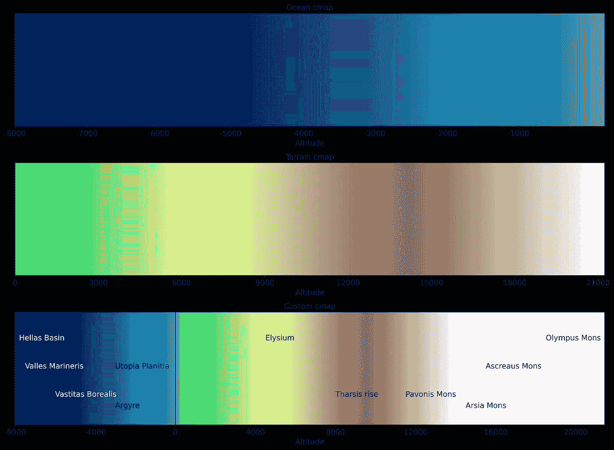

图解说明海洋和地形颜色图是如何组合的。图片作者。

使用这种新的颜色图和颜色边界绘制数据，给出了一个几乎类似地球的行星。

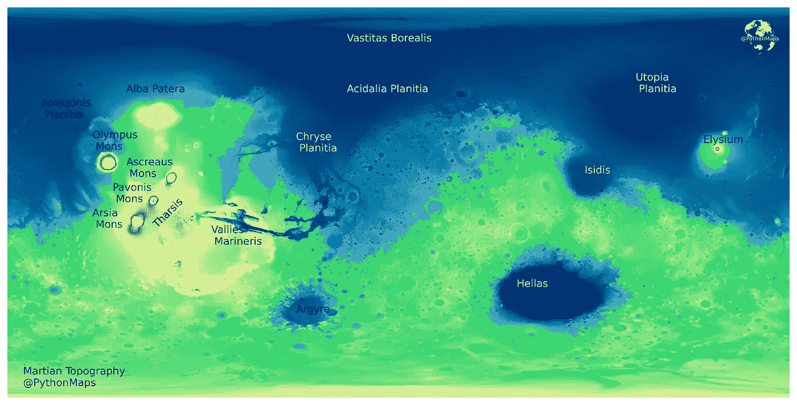

一个地形化的、潮湿的火星会是什么样子？图片作者。

# 改变海平面

我们选择了一个任意的值作为我们假设的海平面，仅仅使用火星的平均高度作为海平面。然而，使用上述生成彩色地图的方法，可以改变海平面的位置。回想一下，我们生成了 2221 种颜色的颜色图，其中 821 种来自`ocean`颜色图，1400 种来自`terrain`颜色图。通过改变每个颜色图中的颜色数量，而不改变整个颜色图中的颜色总数，就有可能改变海平面的位置。或者更简单地说，蓝色停止，绿色开始。

下面是一个函数，用于获取海平面值，并生成一个用于绘图的颜色图和颜色边界对象。以一个假设的 3000 米的海平面为例，每 10 米映射一种颜色，所以我们需要增加 300 种颜色的`ocean`和减少 300 种颜色的`terrain`。

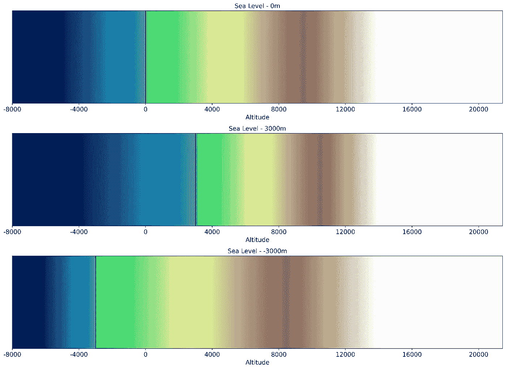

图解说明改变的颜色图看起来像什么。作者图片

这样就可以投入使用了。下面是一个例子，展示了如果海平面设定在平均海拔 1500 米以上，火星会是什么样子。模糊地对应着火星 70%的水覆盖率，这就是我们在地球上的情况。

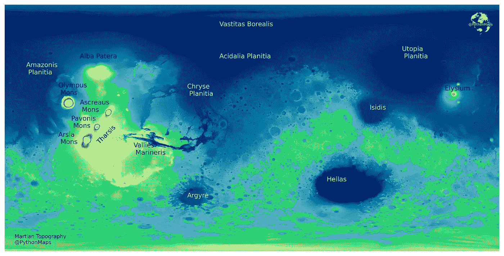

地球改造的火星，海平面设定在平均海拔 1500 米以上。图片作者。

# 山体阴影

最后要做的事情是添加一些山体阴影来模拟光照在地形上，以使情节看起来更三维。山体阴影是表面的 3D 表示，通常以灰度渲染。较暗和较亮的颜色表示您在地形模型中看到的阴影和高光。山体阴影通常用作地图中的参考底图，以使数据看起来更加三维，从而在视觉上更加有趣。我们将使用`earthpy`山体阴影函数来生成山体阴影数据。有两个参数可以调整，根据数据集的不同，它们会给出明显不同的结果。第一个是`azimuth`值，范围为 0-360 度，与光源的发光位置有关。0 度对应于指向正北的光源。第二个是光源所在的`altitude`，这些值的范围是 1-90。

结果基本上是相同的地图，但稍微夸张了一些，特别是在北部海洋。

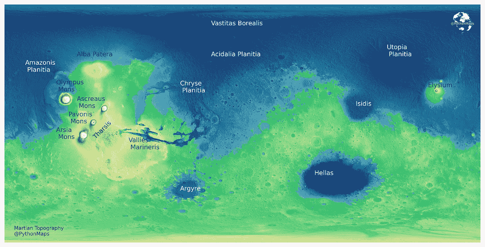

带有山体阴影的地形化火星。图片作者。

# 结论

我们有了它，一个美丽的地图显示了如何在地球之外生成引人注目的数据可视化。这是计划展示如何使用 Python 使地理空间数据看起来令人惊叹的许多文章中的第一篇，请订阅以便您不会错过它们。我也喜欢反馈，所以请让我知道你会如何做不同或建议改变，使它看起来更棒。我每周都会在我的推特账户上发布数据可视化，看看地理空间数据可视化是不是你的菜[https://twitter.com/PythonMaps](https://twitter.com/PythonMaps)

# 参考

引用完整列表—[https://astro geology . USGS . gov/search/map/Mars/global surveyor/MOLA/Mars _ MGS _ MOLA _ Shade _ global _ 463m](https://astrogeology.usgs.gov/search/map/Mars/GlobalSurveyor/MOLA/Mars_MGS_MOLA_Shade_global_463m)