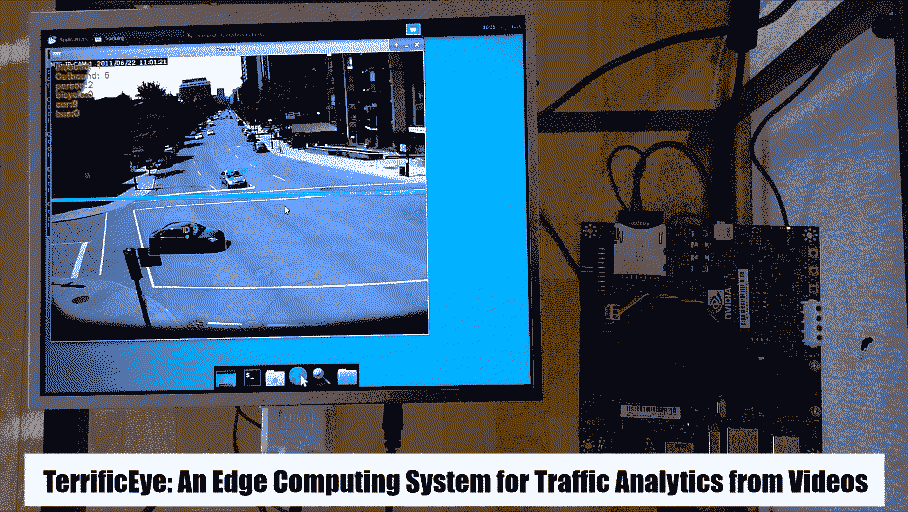
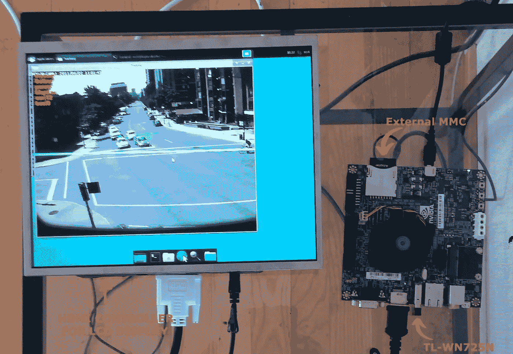
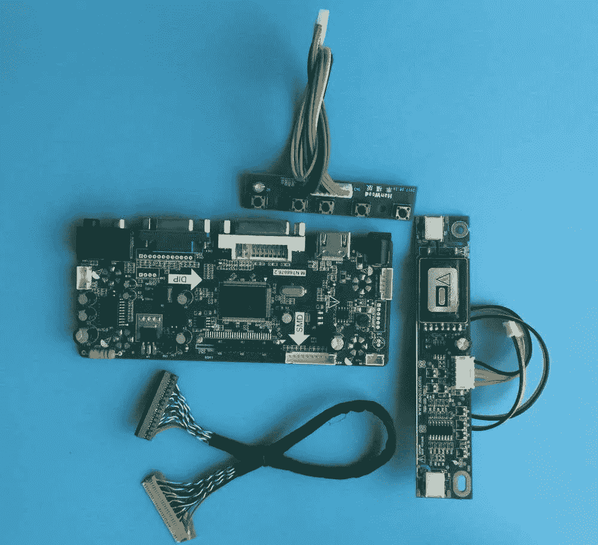
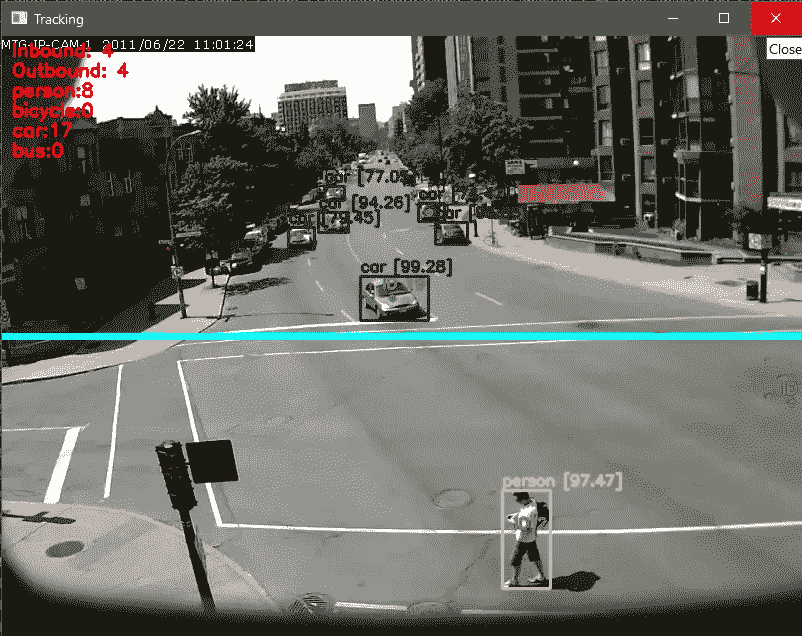

# TerrificEye:一个用于视频流量分析的边缘计算系统

> 原文：<https://towardsdatascience.com/terrificeye-an-edge-computing-system-for-traffic-analytics-from-videos-216cde072b74>

## 我如何构建一个实时、独立的流量监控和分析系统



图 1:地形眼系统(图片由作者提供)

由于深网的规模和复杂性，数据量不断增长，这就要求通信网络具有更高的吞吐量。网络的带宽限制将成为未来数据处理系统的主要瓶颈。此外，数据隐私法(例如 GDPR)不鼓励记录个人数据，因此，在集中的存储库中收集、存储和处理数据变得更加困难。这需要从集中式云计算转变为基于分布式边缘的计算架构。这直接应用于数据分析领域，其主要目的不是收集数据，而是收集有意义的推论和统计数据，从而制定政策和决策。例如，路边交通分析系统收集和保存经过它的每个人或车辆的身份并不重要，但是，了解交通流量的数量、方向和类型有助于做出交通和基础设施政策决策。在本文中，我将构建这样一个系统，它可以处理视频并生成流量分析。

**准备硬件**

基于深度学习的数据处理系统需要高端嵌入式平台。有许多基于 SoC(片上系统)的主板是很好的选择。其中包括基于 arm 的主板(例如 Nvidia Xavier、Jetson series 或 Nano)。Nvidia 主板的好处在于，它们在小尺寸中拥有高端 GPU，这对深度学习应用至关重要。在本文中，我将使用 Nvidia 板——Jetson TK1，因为它在我的实验室的电子元件中被发现处于休眠状态。这是一款较老的主板，处理能力不如 Jetson Nano，但对于手头的任务来说应该足够了(至少对于实验演示来说)。



图 TerrificEye 系统中的硬件组件(图片由作者提供)

除了 Jetson TK1，我还有一个 10 英寸的液晶显示器。这是一个原始的液晶显示器，只有电源板可以点亮液晶显示器。但是，为了将它连接到 Jetson TK1，我必须移除旧板，并用从 ebay 购买的 HDMI 驱动板替换它。带驱动板的 LCD 需要 12V，消耗大约 1A 的功率，因此，除了 Jetson 的 12V 电源外，它还必须提供自己的独立适配器。



图 3: HDMI 驱动板(图片由 aliexpress.com 提供)

虽然 SoC 的整个目的是将整个系统包含在一个芯片/电路板中，但是这个电路板没有 Wifi，所以我们除了它还需要一个 USB 适配器。我使用一个便宜的 USB 适配器 TL-WN725N 来完成这项工作。

**固件、驱动程序&库**

✔ **OS 上传**

刻录 Jetson 系统的典型方法是使用 JetPack(一个独立的可执行应用程序)，它预装了为 Nvidia 硬件定制的 Ubuntu 内核。然而，由于这是一个已经停止支持的旧主板，所以 Jetpack 包含一个旧的 Ubuntu 版本(14.04)和库，因此，我选择手动刻录固件和驱动程序。为此，我从 Nvidia archive 下载了最新支持的 L4T 驱动程序包和 Jetson TK1 的示例根文件系统。

  

然后，我将示例根文件系统放在 L4T 驱动程序包的 rootfs 文件夹中，并在 Ubuntu 主机系统中使用以下命令将图像刻录到 Jetson TK1 板上。(为了刻录固件，主板必须处于恢复模式)

```
sudo ./apply_binaries.shsudo ./flash.sh -S 14580MiB jetson-tk1 mmcblk0p1
```

> 注意:在 64 位主机系统上， *mkfs* 命令默认使用 64 位闪存，因为 TK1 是 armv7，所以我们需要修改 flash.sh 以使其工作。

在 *flash.sh* 文件中找到下面一行:

```
mkfs -t $4 ${loop_dev} > /dev/null 2>&1;
```

并替换为以下内容:

```
mkfs -t $4 -O ^metadata_csum,64bit ${loop_dev} > /dev/null 2>&1;
```

现在，Jetson TK1 应该使用 Ubuntu 14.04 和预建的 Nvidia 驱动程序启动。在它启动后，我通过' *sudo apt-get update* '和' *sudo apt-get upgrade* '以及' *sudo do-release-upgrade* '将 Ubuntu 14.04 升级到了 16.04。Ubuntu 16.04 的安装进展顺利，但是，有一点非常重要，在升级之前，你必须持有原始的 Xorg **，因为新的 Ubuntu 将清除旧的 Nvidia 驱动程序，并且没有对该板的支持，所以 Xenial Ubuntu 中没有新的驱动程序。这可以通过在升级前运行以下命令来实现:**

```
sudo apt-mark hold xserver-xorg-core
```

升级后，进入 ssh 并运行以下命令，重新安装 gnome 会话:

```
sudo apt-get install gnome-session-flashback
```

✔ **图书馆**

现在 Ubuntu 16.04 可以顺利启动了。是时候安装 python 和所需的库了，比如 OpenCV。但是，没有针对 armv7 架构的 python 3.7 预构建二进制文件。所以，我从源代码中构建了 python 3.7 和 *numpy* 。这意味着构建相关的库，比如来自源代码的 *scipy、scikit-image 和 scikit-learn* 。这花了很多时间，需要耐心和仔细消除编译错误。

python 编译安装后，我从源码编译了 OpenCV 库。在 *CMake* 中，我设置了配置参数，-DWITH_CUDA，-DWITH_DNN，-DOPENCV_DNN_CUDA=ON。为了成功编译，我必须安装旧版本的 *gcc* 编译器(4.8)，因为新版本(> 5.0)与 CUDA 6.5 工具包不兼容，由于对该板的支持已终止，该工具包无法针对该板进行升级。

OpenCV 的编译是一项资源密集型工作，它导致 Jetson TK1 上有限的(2GB) RAM 耗尽。因此，为了成功编译，我在 mmc 卡上创建了一个交换文件，如下所示:

```
fallocate -l 4G /mnt/sd-card/swapfilechmod 600 /mnt/sd-card/swapfilemkswap /mnt/sd-card/swapfileswapon /mnt/sd-card/swapfile
```

在成功编译 OpenCV 之后，我编译了 OpenCV-Python(OpenCV 的 Python 集成),并设置了环境变量，以便它能够与 anaconda 环境一起工作。

✔ **Wifi 驱动**

Wifi 适配器没有预建的驱动程序，所以我必须从源代码中构建它。我从下面的链接下载了源代码，然后编译了内核模块和 linux 内核源代码，然后将驱动程序加载到正在运行的内核中。

[](https://www.tp-link.com/us/support/download/tl-wn725n/)  

**检测&跟踪**

驱动和库编译成功后，真正有趣的远景部分来了。一个好的分析系统的支柱是对象检测和跟踪系统。在这篇文章中，我选择了最新版本的 YOLOv4(你只看一次)来检测对象。经典的 YOLO 网络在 Jetson TK1 上不是实时的，所以我用 YOLO·泰尼来做这项工作。它给出了令人满意的 15fps 检测，这意味着我可以实时运行系统来生成分析。我从以下来源编译了 YOLO 实现:

[](https://github.com/AlexeyAB/darknet)  

> 注:由于与 CUDA 6.5 和 *gcc* 版本不兼容，在编译过程中出现了一些问题。为了编译成功，需要对暗网的源代码做一些改动。

对于跟踪，我首先尝试了相关性跟踪器，但是，我很快意识到这是一个矫枉过正的工作。由于不希望物体总是靠得太近，所以简单的基于位置的跟踪器就足够了(例如质心跟踪器)。这意味着我可以实时运行整个探测器-跟踪器组合。



图 4:道路场景中物体的检测和跟踪(图片由作者提供)

为了进一步完善系统，我将感兴趣的对象减少到一组更相关的对象(例如，人、汽车、公共汽车和自行车)。这进一步减少了错误的分类，这种错误的分类由于使用 YOLO Tiny 而有所增加，因为它没有原来更大的网络精确。然后，我还对检测到的对象运行了一遍非最大值抑制，以便过滤低置信度的检测。这进一步增加了探测和跟踪系统的稳定性。

**生成分析**

在成功检测和跟踪道路场景中的有趣/相关对象后，是时候生成分析了。为了简单起见，我计算了所选感兴趣对象的*入站流量计数*、*出站流量计数*和*类别计数*。通过检测图像中指定位置的线交叉来计算流入和流出。这些统计数据对于初始演示应该足够了，更复杂的分析可以在系统更新时进行计算。除了自己收集的交通场景视频，我还使用了*麻省理工学院的交通数据集*进行评估。

[](https://mmlab.ie.cuhk.edu.hk/datasets/mit_traffic/index.html)  

**结论**

在这篇文章中，我分享了流量监控和分析系统的构建。该系统是独立的和自包含的，数据和处理都在同一点执行。该系统功能强大，可以实时检测、跟踪和分析多个对象。有了更好的嵌入式 Soc(如 Nvidia Nano)，系统在精度和效率方面的表现会好得多。