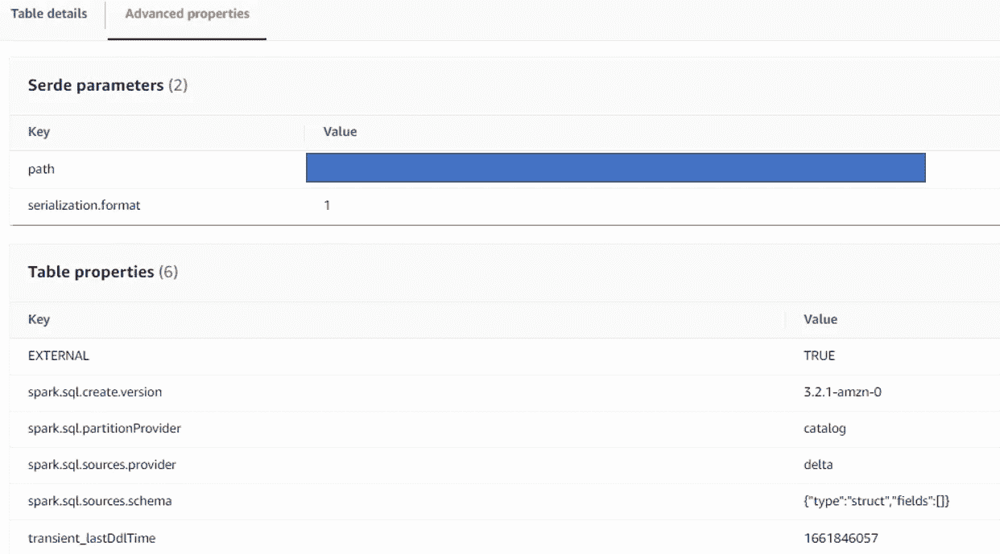
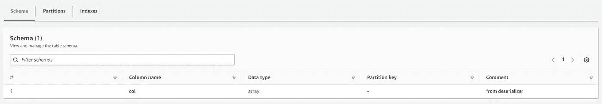

# 在 AWS EMR 上试驾 Delta Lake 2.0 项重要经验

> 原文：<https://towardsdatascience.com/test-driving-delta-lake-2-0-on-aws-emr-7-key-learnings-821aa515d247>

## 在 AWS EMR 上使用 Delta Lake 2.0 后，我学到了什么，以及安装步骤和性能基准


路易斯·索萨在 [Unsplash](https://unsplash.com?utm_source=medium&utm_medium=referral) 上拍摄的照片

如果你读过我以前的一篇关于[在 AWS](/getting-started-with-delta-lake-spark-in-aws-the-easy-way-9215f2970c58) 中开始使用 Delta Lake 的文章，你就会了解 Delta Lake 等产品为什么越来越受欢迎以及它们解决了什么类型的用例的基本背景和基本原理。本文介绍了在 AWS EC2 上开始使用 Delta Lake 的简单步骤，尽管您可以使用该方法来处理一些简单的用例，但在可伸缩性和编目方面仍然有一些限制。因此，如果您想要在相对复杂的用例上工作，保证以下几点:

*   使用可扩展的基础设施，即由多个虚拟机组成，在 Spark 上对大数据集进行分布式计算，增加了灵活性，即能够根据需要轻松扩展或缩减
*   使用 AWS Glue 作为目录(即，将其配置为 Apache Spark 的 Hive metastore)

如果您不想自己进行上述配置，那么有几个选择:

*   考虑提供三角洲湖解决方案的商业供应商，例如 Databricks
*   在 AWS 中使用 Amazon Elastic MapReduce (EMR ),它提供托管 Hadoop 框架并在其上配置 Delta Lake

如果出于某种原因，第一个选项不太适合您，而您希望使用 AWS 原生服务，那么在这种情况下，EMR 可以是一种方法。然而，一个主要的问题是 EMR 本身并不支持 Delta Lake(像 Databricks 那样)。因此，在 EMR 上配置 Delta Lake 需要一些配置。

我最近处理了一个用例，在这个用例中，我在 EMR 上原型化了 Delta Lake，并希望利用这篇文章作为一个机会来分享从经验中获得的关键知识，以及性能基准和如何设置它的说明。

# EMR 上的三角洲湖—配置步骤概述

首先，让我们谈谈如何在 EMR 上配置 Delta Lake。我特别想使用 Delta Lake 2.0，因为它提供了一些我想使用的命题，例如 z 排序。你可以阅读更多关于三角洲湖 2.0 和如果提供什么[在这里](https://delta.io/blog/2022-08-02-delta-2-0-the-foundation-of-your-data-lake-is-open/)。

在 EMR 上配置 Delta Lake 2.0 的核心步骤如下(或者至少我是这么做的):

*   使用以下服务启动 EMR:Spark、Hadoop
*   在 **AWS 胶数据目录设置**下，选择**用于星火表元数据**。
*   确保 EMR 使用的是最新版本的 Python，例如我使用的是 Python 3.9(稍后会详细介绍)
*   确保您的 EMR 主节点可以连接到互联网，例如通过 NAT 网关或 HTTP/HTTPS 代理，因为设置需要从 Maven 仓库下载 Delta Lake 2.0 依赖项。
*   **PySpark shell —** 通过 SSH 访问 EMR 主节点，并运行此命令，以便在正确配置 Delta Lake 2.0 依赖项的情况下运行 PySpark shell:

```
pyspark --packages io.delta:delta-core_2.12:2.0.0 --conf "spark.sql.extensions=io.delta.sql.DeltaSparkSessionExtension" --conf "spark.sql.catalog.spark_catalog=org.apache.spark.sql.delta.catalog.DeltaCatalog" --conf "spark.driver.extraJavaOptions=-Duser.timezone=UTC
```

*   **Spark 提交作业—** 用于运行 Spark 提交作业。在 EMR 集群中运行以下 py 脚本:

```
spark-submit --packages io.delta:delta-core_2.12:2.0.0 --conf "spark.sql.extensions=io.delta.sql.DeltaSparkSessionExtension" --conf "spark.sql.catalog.spark_catalog=org.apache.spark.sql.delta.catalog.DeltaCatalog" --conf "spark.driver.extraJavaOptions=-Duser.timezone=UTC helloworld.py
```

而 helloworld.py 看起来像这样:

在脚本中:

*   我们从 pyspark.sql 模块导入 sparkSession，因为它将在下一步中用于构建 Spark 对象。
*   我们创建 Spark 对象并指定其配置。具体来说，我们在这一步配置 Spark 使用 Delta Lake(第 5 行，第 6 行)
*   我们确保 AWS Glue 在 Spark 提交作业期间被用作 Hive Metastore(第 10 行，第 11 行)。您可能已经注意到，在运行 PySpark shell 时，我们不需要设置这个配置，但是在运行 spark-submit 时，这是必需的。否则，Spark 将不能与 Glue Catalog 集成，也不能使用那里定义的数据库和表。
*   我们读取 Spark 数据帧中的 Delta Lake 表(第 15 行)，在其上创建一个临时视图(第 16 行)，然后使用 Spark SQL 打印它的行数(第 17 行)；只是为了证实这个系统以它的基本形式运行。

您可以使用它作为编写 Spark 应用程序的基本模板，并在 EMR 中通过 spark-submit 运行。

*   提示:如果您在需要 HTTP/HTTPS 代理进行 internet 访问的子网中部署了 EMR，则还应包括以下属性:

```
-Dhttp.proxyHost=<proxy_hostname> -Dhttp.proxyPort=<proxy_port> -Dhttps.proxyHost=<proxy_hostname> -Dhttps.proxyPort=<proxy_port>"
```

现在，我们来谈谈一些重要的经验:

# EMR 上的三角洲湖—主要经验

## #1 —有效！

有了上面突出显示的设置，很高兴看到 EMR 上的 Delta Lake 2.0 起作用了！我能够毫无问题地使用核心的 Delta Lake 特性，比如在 S3 的 Delta 表上进行更新/删除。此外，在增加或减少 EMR 中核心节点的数量时，我可以看到用于 Spark 作业的资源发生了相应的变化，从而提高了整体性能。

## # 2——AWS 胶水三角洲湖表

当您在 EMR 中使用 Spark SQL 创建一个增量表(使用 Glue 作为 metastore)时，它可以工作，并且在 AWS Glue Catalog 中创建表。如果你在 AWS Glue 中找到表的定义并访问它的高级属性，它会显示*spark . SQL . sources . provider*是 *delta*



但是，与其他表类型(例如 Parquet、CSV)不同，它显示的表模式如下:



其中它只是将列显示为数组类型，即使您在表 DDL 中使用 int 和 varchar 等类型正确定义了它们。从管理控制台的可读性角度来看，这不是最好的表示。但是，如果您在 Spark SQL 中查询该表，它会很好地工作，并以正确的类型显示各个列。

## #3 — Python 版本难题

在撰写本文时，我使用的是 emr-6.7.0 发布标签，其中包含 Spark 3.2.1 版本。有趣的是，在这个版本中，EMR 预装了 Python 3.7。当我试图在 Python 3.7 上正确配置 Delta Lake 2.0 时，遇到了许多挑战。因此，我必须遵循以下步骤:

*   创建一个安装了最新版本 Python(在我的例子中是 Python 3.9)的 AMI。
*   使用自定义 AMI 启动 EMR

有趣的是，当我使用自定义 AMI 启动 EMR 时，它仍然将 Python 3.7 作为 PySpark 的默认版本。为了解决这个问题，我必须提交一个配置请求，将默认版本更改为 Python 3.9。你可以跟着[这篇文章](https://aws.amazon.com/premiumsupport/knowledge-center/emr-pyspark-python-3x/)了解一下是怎么做的。

## #4 — Z 排序失败

我想利用 Delta Lake 2.0 的 z 排序功能，这是一种多维聚类技术，因为它似乎可以提高性能，因为它大大减少了 Spark 处理查询所需读取的数据量。下面是如何用 Python 实现的:

您基本上指定了一个执行 z 排序的列，例如在查询谓词中使用的时间戳列。

然而，当尝试在 EMR 设置上的 Delta Lake 中使用它时，它继续失败。它启动了 z 排序过程，并经历了几个阶段，但在完成之前继续失败(出现容器丢失和任务终止等错误)。

对整个表进行 z 排序是一个非常耗时的过程，尤其是当表很大的时候。如上面代码中的第 9 行所示，这可以在特定的分区上完成(假设您的增量表是分区的)。我的假设是 Z 排序至少可以在数据量较少的特定分区上工作，但事实并非如此。我尝试通过添加更多的任务节点来扩展集群，但也无济于事。

## #5 —删除或更新语句中不支持子查询

如果您打算在增量表上的 DELETE 或 UPDATE 语句中使用子查询，例如

```
DELETE FROM table_name_1 WHERE EXISTS (Select 1 from table_name_2 where table_name_2.key = table_name_1.key)
```

显然不支持。这是一个公开的问题，可以[在这里跟踪](https://github.com/delta-io/delta/issues/826)

有趣的是，Databricks 上的 Delta Lake 确实支持这种上下文中的子查询。这里可以找到[的一个例子](https://docs.databricks.com/spark/latest/spark-sql/language-manual/delta-delete-from.html)。

## #6 —通过分区修剪优化增量表中的上插/合并

Delta Lake 通过 Merge SQL 命令支持 Upsert。但是，我发现如果您的表是分区的，并且如果您可以在合并期间进行分区修剪，那么它可以显著提高性能。更多信息，请参考本文。

## #7 —三角洲湖 2.0 安装注意事项

您可能已经注意到，我管理 Delta Lake 2.0 依赖项的方式是允许从 Maven repo 下载它。下载后，它们将被本地缓存并重用。这不是管理依赖关系的理想方式，有或者应该有更好的方式来做到这一点，例如让 EMR 集群可以使用 Delta Lake 2.0 相关的 jar。您可能会在网上找到许多关于不同方法的教程，例如将 Delta Lake jar 复制到特定文件夹(例如/usr/lib/spark/jars)，在启动 EMR 集群时使用 JSON conf 等。对我来说，这些方法都不起作用。对于 Delta Lake 1.0，有效的方法是将 Delta Lake jars 放在一个文件夹中，例如/home/hadoop/extrajars/并更新 spark-defaults.conf(位于/etc/spark/conf/spark-defaults . conf)以引用 spark driver 和 executor 类路径中的 jar 路径。

但是……对于 Delta Lake 2.0 来说，这种方法也不起作用，因为我不断地得到类没有找到相关的错误。因此，我求助于我在上面的文章中强调的方法，即让依赖项从 Maven 下载一次，并在以后重用。

## 性能基准

性能一直是这类原型的主要关注点，所以我也想分享一下我的发现。具体设置如下:

*   EMR 集群大小:1 个主节点(m4.large)，2 个任务节点(m5.xlarge)
*   原始批次大小:20 MB(gzip，CSV)
*   PK 上重复数据删除时的行数:5000 左右
*   增量表大小:600 GB(按年/月派生列分区)
*   相关分区大小(基于原始批处理中的数据):5GB(这很重要，因为我在合并时使用了分区修剪逻辑，如上所述)
*   运行合并所用的时间:大约 5 分钟

是好是坏？答案与上下文高度相关，取决于许多因素，如成本效益比、潜在的替代方案等，所以我会让您来判断。

# 关键要点

现在，可以理解的是，这篇文章似乎带有一些负面的含义，例如 EMR 上的 Delta Lake 2.0，但这不是它的初衷。关键的一点是，这个设置是可行的，但是有一些我已经强调过的怪癖。如果我投入更多的时间和精力，我也有可能解决这些问题，或者这些问题将在即将到来的 EMR 或 Delta Lake 2.0 版本中得到解决。如果你有兴趣接受这个设置并解决突出的挑战，那就去做吧。或者潜在地考虑提供具有良好支持的这种解决方案的商业供应商。