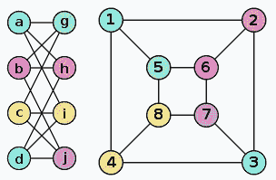
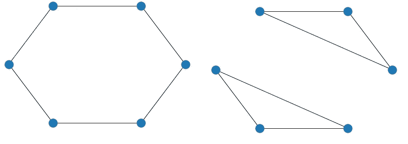
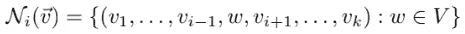

# 测试两个图是否同构

> 原文：<https://towardsdatascience.com/testing-if-two-graphs-are-isomorphic-cf6c44ab551e>

## Python 中图同构及其变体的 Weisfeiler-Lehman 检验


奥马尔·弗洛雷斯在 [Unsplash](https://unsplash.com?utm_source=medium&utm_medium=referral) 上拍摄的照片

使用图作为数据结构并不新鲜，近年来，在图的深度学习领域取得了一些进展，这创造了一个新的研究领域，并产生了非常积极的结果。

这些深度学习方法通常采用图形神经网络(GNNs)的形式。然而，对这些 gnn 的理论理解仍然是初期的，并且对于不了解最新研究的从业者来说基本上是未知的。

关于 GNNs 的一个有趣的理论发现表明，消息传递网络(本质上大多数架构都是这样实现的)的表达能力受到 Weisfeiler-Lehman 同构测试(WL 测试)[1]的限制。这有一些非常有趣的含义。

为了更好地理解 GNNs 的这种局限性，这篇文章将探讨 WL 测试，它与 GNNs 的关系，如何扩展测试使其更具表现力，以及如何在 Python 中实现这些测试。

有这篇文章代码的笔记本可以在 [Kaggle](https://www.kaggle.com/tiagotoledojr/the-weisfeiler-lehman-isomorphism-test) 和我的 [Github](https://github.com/TNanukem/paper_implementations/blob/main/Weisfeiler%20Lehman%20Isomorphism%20Test.ipynb) 上找到。

# 图同构

第一步是了解什么是图同构，因为 WL 测试，顾名思义，是一个测试，以确定两个图是否同构。

看待同构问题的一种方式是如下分析:两个图是同构的，如果在它们的节点之间有一个映射，在这个映射中我们可以得出结论，这两个图实际上是相同的。

或者，在更数学的意义上，我们可以说两个图 H 和 G 是同构的当且仅当，对于 H 中相邻的任意一对节点 *u* 和 *v* ，存在一个变换 *f* 其中 *f(u)* 与 G 中的 *f(v)* 相邻。

以下是同构图形的示例:



两个同构的图。来源:维基百科

众所周知，这个问题很难解决。直到今天还没有多项式时间的解决方案，这个问题也可以被认为是 NP 完全的。

# 魏斯费勒-雷曼测试

WL 测试是一种快速测试两个图是否同构的测试。因为这个问题是 NP 完全的，这个测试在几种情况下会失败。测试的解释如下:

*   如果测试返回假，那么这两个图**肯定**不是同构的
*   如果测试返回真，那么两个图**可能是**同构的

该测试在节点着色方案中工作，工作方式如下:

*   我们首先为图上的每个节点设置一个初始值。就说‘1’吧。
*   对于每个节点，我们获取每个邻居的值，并将其与节点值连接在一起
*   我们用这个值的散列来设置节点的新值
*   我们重复这个过程，直到值的分布不再有变化(不是值本身)

如果两个图形的值的分布相同，我们将为测试返回 true。请注意，我们可以并行运行两种着色算法，因为两个图形的计算是独立的。

如果两个图的值的分布是相同的，我们说对于 H 中的每一个节点，就其连接而言，G 中有一个等价的节点，所以这两个图可能是同构的。

## 与 GNNs 的关系

但是它和 GNNs 有什么关系呢？嗯，对于了解消息传递框架的人来说，WL 测试背后的策略显然遵循类似的模式:邻居信息聚合。

通过这种方式,[1]证明了 gnn 至多(这意味着它们可能更糟)在判断两个图是否同构的能力上与 WL 测试一样强大。

这意味着，对于 GNN 来说，将两个不同的图放入空间中两个不同的嵌入点的能力，受到区分这两个图的 WL 测试能力的限制。

## WL 测试失败的一些例子

下图向我们展示了两个非同构图形的示例，这两个图形无法通过 WL 测试进行区分，因此在应用于 GNN 时会收到相同的嵌入。



两个不同构的图。由作者开发。

还要注意，这种考虑只考虑了图的拓扑结构。当我们在 GNN 上使用特征矩阵 *X* 时，如果它们的特征不同，它可能能够区分这些图。这将等同于用节点特征的散列来初始化 WL 测试，而不是对每个节点使用相同的值。

## Python 实现

对于这个实现，我们将创建一个基础方法，它将接收不同的方法来构造 WL 测试，然后是 k-WL 测试。

你会发现这两种方法的基本区别是:

*   我们如何定义将要处理的节点“集合”
*   我们如何开始给它们上色
*   我们如何定义集合中每个元素的邻域

对于这些代码，我们需要一些库:

```
import copy
import pprint
import itertools
import hashlib
import networkx as nxfrom collections import Counter
```

现在，让我们创建一个 base_WL 方法，它将为我们完成大部分繁重的工作:

```
def base_WL(G_, k, verbose, n_set, initial_colors_func, find_neighbors_func):    
    G, n = n_set(G_)
    colors = initial_colors_func(n)old_colors = copy.deepcopy(colors)for i in range(len(n)):
        for node in n:
            neigh_colors = "".join([colors[i][0] for i in find_neighbors_func(G, n, node)])

            colors[node].extend([neigh_colors])
            colors[node].sort()# Update with the hash
        colors = {i: [hashlib.sha224("".join(colors[i]).encode('utf-8')).hexdigest()] for i in colors}

        if list(Counter([item for sublist in colors.values() for item in sublist]).values()) == list(Counter([item for sublist in old_colors.values() for item in sublist]).values()) and i != 0:
            if verbose:
                print(f'Converged at iteration {i}!')
            break

        old_colors = copy.deepcopy(colors)canonical_form = sorted(Counter([item for sublist in colors.values() for item in sublist]).items())
    if verbose:
        print(f'Canonical Form Found: \n {canonical_form} \n')return canonical_form
```

这个函数接收一个计算元素集合的函数、一个开始颜色的函数和一个返回给定集合元素的邻居的函数。

然后，它将基于其相邻元素迭代地更新每个元素的颜色，直到值的直方图(或分布)停止变化，此时我们说找到了规范形式。

现在，让我们实现将生成 WL 测试的方法:

```
def WL(G, k=2, verbose=False):
    def n_set(G):
        G = nx.convert_node_labels_to_integers(G)
        return G, list(G.nodes())

    def set_initial_colors(n):
        return {i: [hashlib.sha224("1".encode('utf-8')).hexdigest()] for i in n}

    def find_neighbors(G, n, node):
        return G.neighbors(node)

    return base_WL(G, k, verbose, n_set, set_initial_colors, find_neighbors)
```

正如我们所见，对于 WL 测试，元素集是图的节点。每个人的初始颜色都是一样的，只有“1”字符串，最后，它的邻域只有与感兴趣的节点相连的节点。

注意 k 参数。它只是为了与我们接下来要实现的 k-WL 方法保持一致。

# k-魏斯费勒-雷曼检验

k-WL 测试是 WL 测试的高阶版本，旨在提高其表达能力，换句话说，旨在使其比原始版本更强大。它的代价是任务过程中计算复杂性的增长。这意味着算法更慢。

k-WL 测试背后的思想是避免使用网络的拓扑结构，而是在着色算法期间使用 k-元组节点的思想。

其工作原理如下。给定网络 K，设[K]是来自 K 的节点。现在设 K 是由来自[K]的节点的每个排列组成的大小为 2 的元组的集合。

这个想法是，我们将重复传统 WL 测试的算法，但是用这些 2 元组代替节点。

但是在这种情况下，我们如何定义邻域呢？我们认为它是仅在一个位置上不同于原始元组的每个元组的集合。在数学术语中，我们有等式 1:



k-WL 检验的邻域定义。出自[2]。

请注意，此描述来自双 WL 测试。对于任何 k 值，都有它的变体，想法是一样的，只是元组的大小改变了。

这种实现比 WL 测试更有效。然而，它仍然不能完全解决图的同构问题。

## Python 实现

```
def kWL(G, k, verbose=False):
    def n_set(G):
        G = nx.convert_node_labels_to_integers(G)
        V = list(G.nodes())
        V_k = [comb for comb in itertools.combinations(V, k)]
        return G, V_kdef set_initial_colors(n):
        return {i: [hashlib.sha224(str(i).encode('utf-8')).hexdigest()] for i in n}def find_neighbors(G, V_k, node):
        return [n for n in V_k if len(set(n) - set(V_k[V_k.index(node)])) == 1]return base_WL(G, k, verbose, n_set, set_initial_colors, find_neighbors)
```

在这里，正如我们所看到的，我们与 WL 测试有以下不同之处:

*   这组元素是基于 V^k 的，而不是 v。
*   每个节点的初始颜色并不相同，现在它取决于组成元素的节点
*   每个元素的邻域根据等式 1 来定义。

# 结论

了解当前流行的 GNNs 架构的局限性可能有助于从业者在开发过程中避免常见的陷阱，也有助于研究人员寻找改进这一令人兴奋的新知识领域的新机会。

在这篇文章中，我们探讨了 WL 测试和 k-WL 测试的变体，以及测试和通常应用于 GNNs 的消息传递框架之间的关系。

[1]K. Xu 等[图神经网络到底有多强大？](https://arxiv.org/abs/1810.00826) (2019)。继续。ICLR。

[2] N. T. Huang 和 S. Villar，“关于 Weisfeiler-Lehman 测试及其变体的简短教程”，ICASSP 2021–2021 IEEE 声学、语音和信号处理国际会议(ICA ssp)，2021，第 8533–8537 页，doi:10.1109/ICA ssp 39728 . 23636736