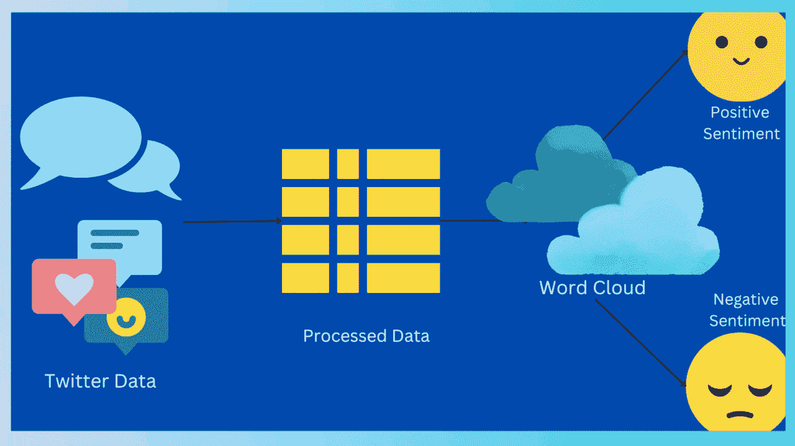
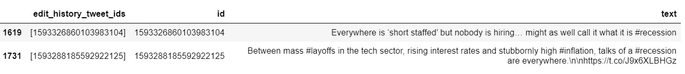
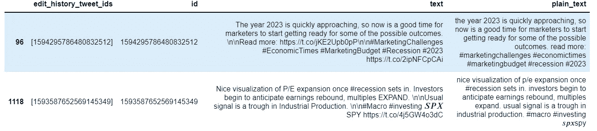
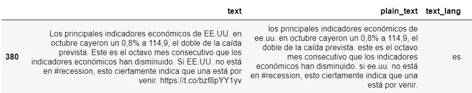
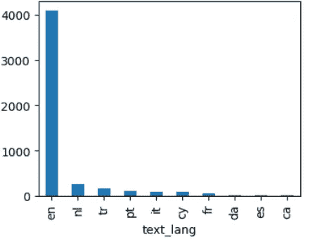
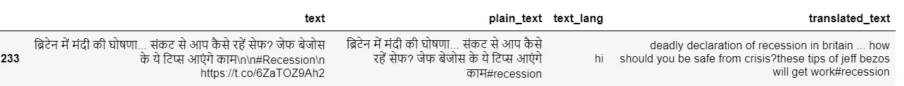
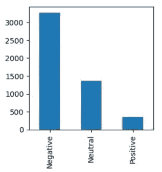
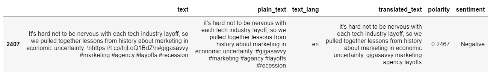
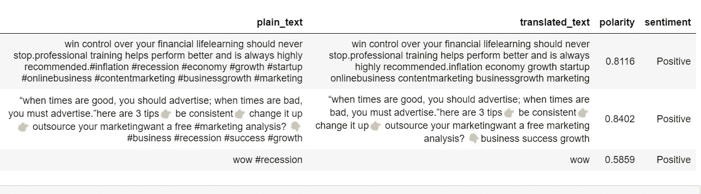

# 文本分析 101 —词云和情感分析

> 原文：<https://towardsdatascience.com/text-analytics-101-word-cloud-and-sentiment-analysis-2c3ade81c7e8>

## 一篇描述文本处理基础知识以及如何从 Twitter API 的数据中获得洞察力的文章

我们从 API 获得的 tweets 数据是非结构化的，并且使用不同的语言。这不方便机器学习或者统计分析。我们将执行挖掘和自然语言处理(NLP)来评估文本数据的情感。我们将在这次旅程中使用我们友好的 Jupyter 笔记本和 python:)



文本挖掘—按作者分类的图像

我们可以把它分成四个步骤:

1.  使用 tweepy 从 Twitter 中提取数据
2.  数据清理和处理
3.  使用 wordcloud 进行可视化
4.  情感分析

# 数据析取

第一件事是在 Twitter 上注册一个开发者账户，并访问 Twitter API。API 使用 OAuth 客户端进行认证，这意味着您必须生成一个[承载令牌](https://developer.twitter.com/en/docs/authentication/oauth-2-0/bearer-tokens)或者使用客户端 id/secret。我已经使用“tweepy”来访问 API 并从 twitter 获取数据。

那么我们要分析什么呢？？嗯…让我们来看看推特是怎么看待“衰退”的吧！！—这将是我们的搜索查询。我们将制定一个词云，并检查周围的情绪。

```
**#Data Extraction**
import tweepy
query = '#recession -is:retweet'
tw_clnt=tweepy.Client(bearer_token='AAAABCJJGJG')
tweets=tweepy.Paginator(tw_clnt.search_recent_tweets,query,max_results=100).flatten(limit=5000)
df=pd.DataFrame(tweets)
df.head(2)
```



在数据帧中捕获的推文——图片由作者提供

啊！我们喜欢数据框🤩更有道理。找出 df 中是否有空值的时间。

```
**#Check for nulls/blank fields**
df.id.count(), df.isnull().sum()
```

5000 条记录，谢天谢地没有空记录😀

# 文本处理

现在，我们将清理和格式化 tweet 文本——删除提及(例如:@abc423)、媒体链接、转换为小写并删除换行符。我建议我们不要删除标签，因为很多时候重要的情感/信息隐藏在标签#dontignorehashtags 中😜

```
**#Remove special characters/links**
import re
def tweet_cleaner(x):
    text=re.sub("[@&][A-Za-z0-9_]+","", x)     # Remove mentions
    text=re.sub(r"http\S+","", text)           # Remove media links
return  pd.Series([text])df[['plain_text']] = df.text.apply(tweet_cleaner)**#Convert all text to lowercase**
df.plain_text = df.plain_text.str.lower()**#Remove newline character**
df.plain_text = df.plain_text.str.replace('\n', '')**#Replacing any empty strings with null**
df = df.replace(r'^\s*$', np.nan, regex=True)
if df.isnull().sum().plain_text == 0:
   print ('no empty strings')
else:
   df.dropna(inplace=True)
```

我们将把格式良好的数据存储在一个新的列中——“plain _ text”



格式良好的文本-作者提供的图像

我们的下一步是使用“检测”来检测语言，找出是否有英语以外语言的推文。如果 tweet 中的文本只有数字或标点符号，这个库就会失败。这样的推文(只有数字)对我们的分析毫无用处，因此这些“例外”记录可以删除。

```
**#detect language of tweets**from langdetect import detect
def detect_textlang(text):
    try:
        src_lang = detect(text)
        if src_lang =='en':
            return 'en'
        else:
        #return "NA"    
            return src_lang
    except:
        return "NA"
df['text_lang']=df.plain_text.apply(detect_textlang)
```



西班牙语推文—作者图片

哦！有西班牙语的推文，可能还有很多其他的…我们将按语言对所有推文进行分组，并查看前 10 名。

```
**# Group tweets by language and list the top 10**
import matplotlib.pyplot as plt
plt.figure(figsize=(4,3))
df.groupby(df.text_lang).plain_text.count().sort_values(ascending=False).head(10).plot.bar()
plt.show()
```



按语言对推文分组——按作者对图片分组

有荷兰语、土耳其语等记录..所以我们会用谷歌翻译将这些推文翻译成英语。如果有超过 100–200 条记录，翻译需要时间；如果没有及时收到响应，它可能会超时[错误—读取操作超时]。因此，在“翻译”函数调用之前应用语言过滤器是明智的。

```
**#Translate to English**
from googletrans import Translator
def translate_text(lang,text):
    translator= Translator()
    trans_text = translator.translate(text, src=lang).text
    return trans_text df['translated_text']=df.apply(lambda x: x.plain_text if x.text_lang == 'en' else translate_text(x.text_lang, x.plain_text), axis=1)df.translated_text = df.translated_text.str.lower()
```



带有翻译文本的数据框—按作者分类的图片

# 数据可视化

酷:)现在我们的源数据几乎准备好了，只是我们需要去掉' #recession '，因为这是我们的查询。这个想法是建立一个词云，它可以给出关于衰退的信息，而不仅仅是重复那个词！此外，我们不希望通用词，如“将”，“去”，“已经”，“将”等。出现在我们的词云中。Nltk 的“停用字词”提供了所有此类字词的列表，我们可以将它们从我们的“translated_text”中排除。

```
**#Remove un-important words from text**
from nltk.corpus import stopwords
stop_words = set(stopwords.words('english'))
query_words={'recession', '#' }
stop_words.update(query_words)
for word in query_words:
    df.translated_text = df.translated_text.str.replace(word, '')**#Creating word cloud**
from wordcloud import WordCloud, ImageColorGenerator
wc=WordCloud(stopwords=stop_words, collocations=False, max_font_size=55, max_words=25, background_color="black")
wc.generate(' '.join(df.translated_text))
plt.figure(figsize=(10,12))
plt.imshow(wc, interpolation="bilinear")
plt.axis("off")
```


“衰退”一词云——作者图片

给你👍

根据推特数据，在经济衰退的背景下，人们都在谈论通货膨胀、T2、裁员和工作——这是真的！特别关注股票市场、住房市场和密码市场。此外，英国的状况和美联储的决定也经常被提起。我保持了 25 个单词的最大计数，你可以增加它以获得更多的见解。

# 情感分析

让我们使用 Vader perspective analyzer 来探索这些推文的总体情绪。这个库返回一个称为极性的数字，范围在-1 和 1 之间；-1 表示最消极的情绪，1 表示最积极的情绪。然后，我们可以将这些情绪分为“消极”、“积极”和“中性”三类。

```
**#Sentiment Check**
from vaderSentiment.vaderSentiment import SentimentIntensityAnalyzer
analyzer=SentimentIntensityAnalyzer()        
df['polarity']=[analyzer.polarity_scores(text)['compound'] for text in df.translated_text]
def get_sentiment(polarity):
    if polarity < 0.0:
        return 'Negative'
    elif polarity > 0.2:
        return 'Positive'
    else:
        return 'Neutral'
df['sentiment']=df2.polarity.apply(get_sentiment)
plt.figure(figsize=(3,3))
df.sentiment.value_counts().plot.bar()
```



正面情绪、负面情绪和中性情绪的数量——作者图片

哦！正如所料，负面情绪的数量最多，让我们看看一个负面推文样本和一些正面推文。



消极情绪——作者的形象



积极的情绪——作者的形象

在过滤积极情绪方面，我们看到了一些关于如何在衰退时期装备自己的建议！是的，这些确实是积极的观点..

# 结论

干得好！这种技术在营销分析中有重要的应用，其中对品牌/产品的客户评论进行评估。但有时(正如你在一条积极的推文中看到的——“哇”——用户文本可能会有点误导，因为在这种情况下，“哇”并不意味着积极。这样的细微差别不易察觉。因此，为了获得更准确的情感结果，建议使用 2-3 个软件包进行分析，如 TextBlob/Transformers 以及 VADER，并获得极性的加权分数。

还有其他方法进行情感分析，例如通过矢量化，但这也取决于您的数据及其属性。

嗯（表示踌躇等）..所以我们已经到了 101 课的结尾；)我希望这篇文章信息丰富，巩固了您对文本分析的理解。你可以在这里访问我的笔记本[。用你选择的搜索词(品牌/个性/主题)来尝试这个练习，并与我分享你的结果！](https://github.com/sacharya225/data-expts/blob/master/Tweets_Analysis_Recession-AV.ipynb)