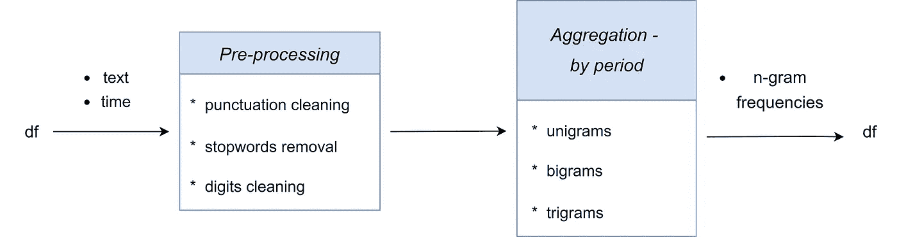
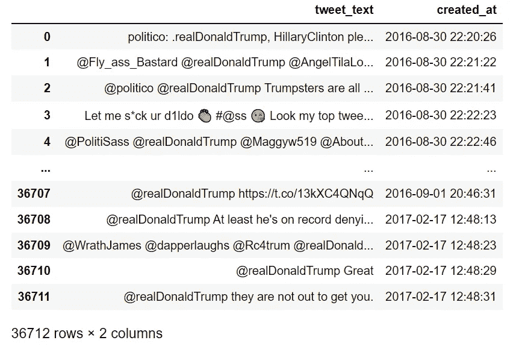
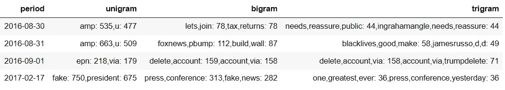
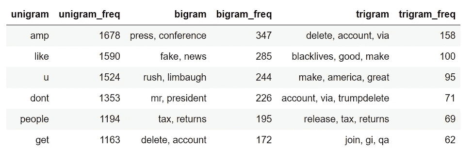

# 作为时间序列的文本:Arabica 1.0 为探索性文本数据分析带来了新的特性

> 原文：<https://towardsdatascience.com/text-as-time-series-arabica-1-0-brings-new-features-for-exploratory-text-data-analysis-88eaabb84deb>

## Arabica 1.0 通过一系列扩展功能改进了时间序列文本数据分析


[真诚媒体](https://unsplash.com/@sincerelymedia?utm_source=medium&utm_medium=referral)在 [Unsplash](https://unsplash.com?utm_source=medium&utm_medium=referral) 上拍摄的照片

# 介绍

在现实世界中，文本数据经常作为时间序列收集。一些例子包括公司收集产品质量可能改变的产品评论。在 T4 的政治周期中，政客们的公开声明会有所不同。如今，央行行长的声明是央行影响金融市场的方式之一。由于这些原因，文本数据通常具有时间维度，并且用日期/时间列记录。

这些数据集的探索性数据分析(EDA)并不是一项简单的编码工作。阿拉比卡咖啡来了——让事情变得更简单。本文涵盖以下内容:

*   阿拉比卡 1.0 中的新聚合和清洗功能
*   时间序列文本数据分析的实际应用

我们将使用来自 *data.world* 的[Twitter 2016 年美国总统大选数据](https://data.world/alexfilatov/2016-usa-presidential-election-tweets) tweets，展示阿拉比卡 1.0 的新功能。数据集在通用[公共领域许可](https://creativecommons.org/share-your-work/public-domain/)下获得许可。

***编辑 2023 年 1 月*** *:阿拉比卡已更新。查看* [***当前版本***](https://pypi.org/project/arabica/) *获取完整的参数列表。*

# 什么是阿拉比卡？

[*Arabica*](https://pypi.org/project/arabica/) 是专门为时序文本数据设计的探索性数据分析的 Python 库。我之前的[关于数据科学的文章](/arabica-a-python-package-for-exploratory-analysis-of-text-data-3bb8d7379bd7)提供了初步的介绍。我建议在继续阅读本文之前先阅读它，作为复习。

它可以与 pip 一起安装:

```
pip install arabica
```

Arabica 将文本和时间作为输入，支持标准清理操作(数字、标点符号和停用词删除)，并提供在选定时间段内的单字双字和三字频率。



图 arabica _ freq 方法示意图

作为输入**文本**，它处理基于拉丁字母的语言文本，并启用 *ntlk* 停用词语料库中语言的停用词移除。

对于**时间**规范，Arabica 目前以标准日期和日期时间格式读取日期，并以**年、月或日频率**提供聚合 n 元文法。例如，标准格式为 2013 年 12 月 31 日、2013 年 12 月 31 日、2013 年 12 月 31 日、2013 年 12 月 31 日 11:46:17。

> 小心欧洲和美国的日期格式差异。建议使用美式日期(MM/DD/YYYY ),而不是欧式日期(DD/MM/YYYY ),因为在小型数据集中，月份和日期可能不匹配。

**Arabica 现在有一个可视化模块，提供单词云、热图和单字母词、双字母词和三字母词频率的线图。更多例子见** [**本教程**](/visualization-module-in-arabica-speeds-up-text-data-exploration-47114ad646ce) **。**

# Twitter 数据用例

让我们看看它在代码中是如何工作的。我们将首先导入*阿拉比卡*和*熊猫*并读取数据。

```
import pandas as pd
from arabica import arabica_freq
```

我们将使用的数据子集包含姜懿翔·川普总统在总统竞选的最后几周和他上任后的头几周的推文。数据如下所示:



图 2:用作示例数据集的 Twitter 数据

# 扩展聚合选项

## 时间序列 n 元图分析

我们可以看到数据相当原始。它包含了大量我们不需要的数字、特殊字符、标点符号和字符串。我们还将跳过特定于该数据集的政客姓名和其他字符串的变体。文本也是小写的，这样大写字母就不会影响 n-gram 的计算(例如，“tree”和“Tree”不会被区别对待)。

在阿拉比卡，一切都很简单:

```
arabica_freq(text = data['tweet_text'],         # Text
             time = data['created_at'],         # Time
             time_freq = 'D',                   # Aggregation period
             max_words = 2,           # Max number for n-grams to be displayed
             stopwords = ['english'],           # Language for stop words
             skip = ['realdonaldtrump','trump', # Remove additional strings
                     'makehillarybrokeagain',
                     'hillaryclinton',
                     'barackobama',
                     'hillary', 'clintons',
                     'wwmorgan','jordanla',
                     'whoisNeil','cattmaxx',
                     'vnkbgygv', 'httpstco',
                     'httpstcob', 'httpstcod',
                     'nrclwvhx','httpstcoj',
                     'httpstcossh'],
             lower_case = True,     # Lowercase text before cleaning and frequency analysis
             numbers = True,                    # Remove all digits
             punct = True)                      # Remove punctuation
```

n-gram 频率，尤其是二元模型和三元模型，告诉我们更多关于特朗普总统接任总统后的公共交流。最好增加参数`max_words`的值(比如 4 或 5)来更深入地研究它。



图 3: Arabica_freq 输出—每日汇总

## 描述性 n 元语法分析

在某些情况下，我们需要在开发更复杂的分析之前，首先对文本数据集进行简单的 EDA。在代码中，设置参数`time_freq = 'ungroup'`意味着 Arabica 计算整个数据的 unigram、bigram 和 trigram 频率，并且**不进行时间聚合**。

运行这段代码，我们创建了一个`result`数据帧，以后可以保存为 CSV 文件:

```
result = arabica_freq(text = data['tweet_text'],         # Text
                      time = data['created_at'],         # Time
                      time_freq = 'ungroup',             # No time aggregation made
                      max_words = 6,                # Shows 6 most frequent n-grams
                      stopwords = ['english'],           # Language for stop words
                      skip = ['realdonaldtrump','trump', # Strings to remove
                             'makehillarybrokeagain',
                             'hillaryclinton',
                             'barackobama',
                             'hillary', 'clintons',
                             'wwmorgan','jordanla',
                             'whoisNeil','cattmaxx',
                             'vnkbgygv', 'httpstco',
                             'httpstcob', 'httpstcod',
                             'nrclwvhx','httpstcoj',
                             'httpstcossh'],
                     lower_case = True,                 # Lowercase text 
                     numbers = True,                    # Remove all digits
                     punct = True)                      # Remove all punctuation
```

以下是输出表:



图 4: Arabica_freq 输出—无时间聚合

# 扩展清洗选项

在阿拉比卡 1.0 中。我们可以一次删除多组停用词。这对于从使用多种官方语言的国家(加拿大、瑞士、比利时、卢森堡等)中挖掘文本数据非常有用。)或有大量外国人社区的国家。

要从文本中删除英语、法语和德语停用词，请按以下方式修改代码:

```
arabica_freq(text = data['tweet_text'],
             time = data['created_at'],
             time_freq = 'D', 
             max_words = 2, 
             stopwords = ['english','french','german'],
             skip = None,
             lower_case = True,
             numbers = True,
             punct = True) 
```


杰洛特在 [Pixabay](https://pixabay.com/illustrations/questions-wooden-fence-ask-writing-2245264/) 拍摄的照片

# 现实生活的应用

让我们举几个阿拉比卡咖啡可能有用的例子。在**营销**中，企业使用[市场定位](https://corporatefinanceinstitute.com/resources/knowledge/strategy/market-positioning/)方法来影响消费者相对于竞争对手对品牌或产品的认知。这里的目标是建立一个公司或产品的形象或身份，使消费者以某种方式感知它。

产品和网站评论为评估定位策略提供了极好的数据。我们是否高频率地收到了“**快速交付”、“卓越服务”、“优质服务”、“快速交付”、“T8”或“好价格”**这样的二元词？它是否符合我们希望客户如何看待我们的产品？它会随着时间而改变吗？

在**政治学**和**政治经济学中，**用内容分析方法分析公共话语被广泛传播(如 [Saraisky，2015](https://www.tc.columbia.edu/cice/pdf/03_Green-Saraisky-CICE-18.pdf) )。我们在这里可能关注的基本主题是，例如，假新闻和民粹主义的后果，公众对具体问题的态度(移民、武器拥有等)。)，以及个别政客或政党的个案研究。推特推文为这些调查提供了很好的数据来源。

这些问题不仅可以在时间序列文本数据集上进行研究。您可能会发现许多其他使用案例，其中的文本具有时序特征。其中一些是我在[阿拉比卡](https://petrkorab.medium.com/arabica-is-now-fully-documented-a2c650513cc9)readthedocs 上开发的。

***编辑:*** *阿拉比卡现在有一个* ***可视化*** *模块将文本显示为一个* ***热图*** *，* ***字云*** *，***和一个* ***情绪和更多阅读这些教程:****

*   *[***Arabica 中的可视化模块加速了文本数据的探索***](https://medium.com/towards-data-science/visualization-module-in-arabica-speeds-up-text-data-exploration-47114ad646ce)*
*   *[***时序文本数据中的情感分析和结构突变***](/sentiment-analysis-and-structural-breaks-in-time-series-text-data-8109c712ca2)*

**PS:你可以订阅我的* [*邮件列表*](https://medium.com/subscribe/@petrkorab) *在我每次写新文章的时候得到通知。而如果你还不是中等成员，可以在这里加入*<https://medium.com/@petrkorab/membership>**。***

# **参考资料:**

**[1]萨莱斯基，新墨西哥，2015 年。分析公共话语:利用媒体内容分析理解政策过程。 [*当前比较教育中的问题*](https://www.tc.columbia.edu/cice/pdf/03_Green-Saraisky-CICE-18.pdf) 18(1)，26–41。**